# EPCI — Complete Workflow

## Overview

Structured workflow in 3 phases with validation at each step.
Generates a Feature Document as traceability thread.

```mermaid
flowchart LR
    subgraph P1["Phase 1"]
        FD["Read §1"] --> Plan["Plan"] --> PV["@plan-validator"]
    end
    subgraph P2["Phase 2"]
        TDD["TDD"] --> CR["@code-reviewer"]
    end
    subgraph P3["Phase 3"]
        Doc["@doc-generator"] --> Commit["Commit"]
    end

    PV --> BP1["BP1"]
    BP1 -->|Continue| TDD
    CR --> BP2["BP2"]
    BP2 -->|Continue| Doc

    style BP1 fill:#ffd700
    style BP2 fill:#ffd700
```



## Arguments

### Workflow Control

| Argument | Description |
|----------|-------------|
| `--large` | Alias for `--think-hard --wave` (backward compatible) |
| `--turbo` | Speed-optimized mode: @planner/@implementer (Sonnet), parallel reviews, 1 breakpoint |
| `--from-native-plan <file>` | Import native Claude Code plan as base for §2. Automatically creates §1 if missing via @Explore. |
| `--continue` | Continue from last phase (resume after interruption) |
| `--no-hooks` | Disable all hook execution |

### --turbo Mode (MANDATORY Instructions)

**⚠️ MANDATORY: When `--turbo` flag is active, you MUST follow these rules:**

**Summary:**
- **Phase 1:** Use @planner (Sonnet), skip detailed risk analysis, single breakpoint
- **Phase 2:** Use @implementer (Sonnet), parallel reviews (single message), auto-fix minor issues
- **Breakpoints:** 1 only (pre-commit), skip BP1/BP2
- **Time savings:** 30-50%

**Full specification:** See `references/turbo-mode.md` for:
- Phase-specific behavior (Phase 1/2/3)
- Agent invocation patterns (@planner, @implementer)
- Parallel review execution
- DAG structure
- Turbo vs Standard comparison

### Key Flags for /epci

| Flag | Effect | Auto-Trigger |
|------|--------|--------------|
| `--turbo` | Speed mode (@planner, @implementer, parallel reviews, 1 BP) | Suggested if `.project-memory/` exists |
| `--large` | Alias for `--think-hard --wave` | Never |
| `--safe` | Max validations, all conditional agents mandatory | Sensitive files |
| `--wave` | DAG-based parallel agent execution | complexity > 0.7 |
| `--no-hooks` | Disable all hook execution | Never |

**Full flag documentation:** `src/settings/flags.md`
- Thinking flags (`--think`, `--think-hard`, `--ultrathink`)
- Output flags (`--uc`, `--verbose`)
- MCP flags (`--c7`, `--seq`, `--magic`, `--play`, `--no-mcp`) → see `src/skills/mcp/SKILL.md`

## Feature Document

**Location:** `docs/features/<feature-slug>.md` (created by `/brief`)

**Structure:** §1 (Brief), §2 (Plan), §3 (Implementation)

**Templates:** See `references/feature-document-templates.md` for complete §1/§2/§3 templates and examples.

**Prerequisite:** §1 must be complete before running `/epci`.

### ⚠️ CRITICAL: Feature Document Updates

**TOUJOURS utiliser Edit tool** pour mettre à jour le Feature Document.

| Phase | Action | Tool |
|-------|--------|------|
| Phase 1 | Écrire §2 (Plan) | Edit tool |
| Phase 2 | Écrire §3 Part 1 (Implementation) | Edit tool |
| Phase 3 | Compléter §3 Part 2 (Finalization) | Edit tool |

**NE PAS:**
- Utiliser EnterPlanMode ou le mode plan natif Claude Code
- Écrire dans `~/.claude/plans/`
- Afficher le contenu sans l'écrire dans le fichier

**Path obligatoire:** `docs/features/<slug>.md` (dans le projet, pas dans ~/.claude/)

---

## Hooks Integration

Execute hooks at workflow points: `python3 src/hooks/runner.py <hook-type> --context '{...}'`

**Available:** `pre-phase-1`, `post-phase-1`, `pre-phase-2`, `post-phase-2`, `post-phase-3`, `on-breakpoint`, `pre-agent`, `post-agent`

**Full documentation:** See `references/hooks.md` and `hooks/README.md` for hook points, configuration, context schema, and examples.

---

## Multi-Agent Orchestration (F07)

When `--wave` flag is enabled, agents are executed using the DAG-based orchestrator
for parallel execution of independent agents.

**Orchestration Modes:**

| Mode | Description | Flag |
|------|-------------|------|
| Sequential | One agent at a time | `--sequential` |
| DAG | Respect dependencies, parallelize when possible | default with `--wave` |
| Parallel | All agents simultaneously (use with caution) | `--parallel` |

**DAG Structure:**
```
@plan-validator
       │
       ├──────────────┬──────────────┐
       ▼              ▼              ▼
@code-reviewer  @security-auditor  @qa-reviewer
       │              │              │
       └──────────────┼──────────────┘
                      ▼
               @doc-generator
```

**Performance:** Parallel execution of independent agents (code-reviewer, security-auditor,
qa-reviewer) reduces validation time by 30-50% for LARGE features.

**Configuration:** Default DAG is defined in `config/dag-default.yaml`. Project-specific
overrides can be placed in `.project-memory/orchestration.yaml`.

---

## Pre-Workflow: Memory Context

**Memory is loaded once by `/brief`** and passed via Feature Document §1 (Memory Summary section).

**Reading memory context:**
1. Check Feature Document §1 for "Memory Summary" section
2. If present: Use conventions, patterns, and velocity from §1
3. If absent (direct /epci call): Fall back to loading `.project-memory/` directly

**Fallback behavior:** If `/epci` is called without prior `/brief`, the `project-memory` skill will load context. This is not recommended — always start with `/brief`.

---

## Step 0.5: Import Native Plan (CONDITIONAL)

**Condition:** `--from-native-plan <file>` flag provided

Import a native Claude Code plan as base for Phase 1. Native plan is copied to Feature Document §2 for full traceability.

**Summary:**
1. Read native plan from `<file>` (can be anywhere, e.g., ~/.claude/)
2. Check §1 status → Run @Explore if §1 missing/incomplete
3. Copy plan to §2 "Plan Original (Natif)" section
4. Proceed to prerequisite check

**Full workflow (5 steps):** See `references/native-plan-import.md`

**Key behaviors:**
- §1 generated via @Explore if missing (exploration conditional)
- Native plan archived in git for team collaboration
- Phase 1 refines plan into atomic tasks (2-15 min each)

---

## Feature Document Prerequisite Check (MANDATORY)

**⚠️ CRITICAL: This check MUST pass before Phase 1 can begin.**

### Step 1: Verify Feature Document Exists

```
IF NOT exists(docs/features/<slug>.md):
  ╔══════════════════════════════════════════════════════════════╗
  ║ ❌ ERROR: Feature Document Not Found                         ║
  ╠══════════════════════════════════════════════════════════════╣
  ║ Expected: docs/features/<slug>.md                            ║
  ║                                                              ║
  ║ → Run `/brief "<feature description>"` first                 ║
  ╚══════════════════════════════════════════════════════════════╝
  ABORT workflow
```

### Step 2: Verify §1 Brief Fonctionnel Exists

```
IF NOT contains_section("## §1 — Brief Fonctionnel"):
  ╔══════════════════════════════════════════════════════════════╗
  ║ ❌ ERROR: §1 Brief Fonctionnel Missing                       ║
  ╠══════════════════════════════════════════════════════════════╣
  ║ Feature Document exists but §1 is incomplete.                ║
  ║                                                              ║
  ║ → Run `/brief` to complete functional brief                  ║
  ╚══════════════════════════════════════════════════════════════╝
  ABORT workflow
```

### Step 3: Verify Required Fields in §1

Required fields:
- Context technique (stack, dependencies)
- Objectif (what to achieve)
- At least 1 acceptance criterion

```
IF missing_required_fields:
  ╔══════════════════════════════════════════════════════════════╗
  ║ ⚠️ WARNING: Incomplete §1 Brief                              ║
  ╠══════════════════════════════════════════════════════════════╣
  ║ Missing fields:                                              ║
  ║ • [list of missing fields]                                   ║
  ╠══════════════════════════════════════════════════════════════╣
  ║ OPTIONS:                                                     ║
  ║ 1. "continue" → Proceed anyway (not recommended)             ║
  ║ 2. "brief" → Run /brief to complete §1                       ║
  ╚══════════════════════════════════════════════════════════════╝
  WAIT for user choice
```

### Validation Passed

```
IF all_checks_pass:
  ✅ Feature Document validated: docs/features/<slug>.md
  ✅ §1 Brief Fonctionnel: Complete
  → Proceeding to Phase 1: Planification
```

---

## Phase 1: Planification (MANDATORY)

**⚠️ ALL steps in this phase are MANDATORY. Do NOT skip any step.**

### Configuration

| Element | Value |
|---------|-------|
| **Thinking** | Based on flags: `think` (default), `think hard` (--think-hard), `ultrathink` (--ultrathink) |
| **Skills** | project-memory, epci-core, architecture-patterns, flags-system, [stack] |
| **Subagents** | @plan-validator |

**Flag effects on Phase 1:**
- `--think-hard` or `--large`: Use `think hard` mode
- `--ultrathink`: Use `ultrathink` mode (extended analysis)
- `--safe`: Additional validation checks in plan
- `--no-hooks`: Skip pre-phase-1 and post-phase-1 hooks

**Note**: @Plan is no longer invoked — exploration has been done by `/brief`.

### Process

**🪝 Execute `pre-phase-1` hooks** (if configured)

1. **Read Feature Document**
   - Read `docs/features/<slug>.md` (created by `/brief` or Step 0.5)
   - Verify §1 is complete (if incomplete → error, suggest `/brief` first)
   - Extract from §1: identified files, stack, constraints, acceptance criteria
   - **Check if native plan exists** in §2 under "📝 Plan Original (Natif)" section

2. **Planning (conditional approach)**

   **IF native plan exists in §2:**
   - Read the native plan from "📝 Plan Original (Natif)" section
   - Use it as the high-level base structure
   - **Refine** the native plan by:
     - Breaking down high-level tasks into atomic tasks (2-15 min each)
     - Adding specific file references from §1
     - Adding test planning for each atomic task
     - Ordering by dependencies     
     - Adding risk assessments
   - Update "✅ Plan Raffiné & Validé" section with refined plan

   **ELSE (standard workflow):**
   - Use the files already identified in §1
   - Break down into atomic tasks (2-15 min each)
   - Order by dependencies
   - Plan a test for each task
   - Create new §2 from scratch

3. **Validation** (via @plan-validator)
   - Submit plan to validator
   - If NEEDS_REVISION → correct and resubmit
   - If APPROVED → proceed to breakpoint

### Output §2 (USE EDIT TOOL — MANDATORY)

**⚠️ MANDATORY:** Use **Edit tool** (NOT EnterPlanMode) to update Feature Document with §2 content.

**Path:** `docs/features/<slug>.md` — **NOT** `~/.claude/plans/`

**Two scenarios:**
- **Scenario A** (Native plan): Update "✅ Plan Raffiné & Validé" section with atomic tasks
- **Scenario B** (Standard): Create complete §2 from scratch

**Templates:** See `references/feature-document-templates.md` (Scenario A/B templates)

**Required elements:** Impacted files, atomic tasks (2-15 min), dependencies, tests, risks, @plan-validator verdict

**🪝 Execute `post-phase-1` hooks:**
```bash
python3 src/hooks/runner.py post-phase-1 --context '{"phase": "phase-1", "feature_slug": "<slug>", "complexity": "<complexity>"}'
```

### ⏸️ BREAKPOINT BP1 (MANDATORY — WAIT FOR USER)

**⚠️ MANDATORY:** Display breakpoint and WAIT for user confirmation.

**Template:** Use `breakpoint-metrics/templates/bp1-template.md` with variables from §2 (plan, tasks, risks, @plan-validator verdict).

**User options:** "Continuer" / "Modifier le plan" / "Voir détails" / "Annuler"

**🪝 Execute `on-breakpoint` hooks** (if configured)

---

## Phase 2: Implementation (MANDATORY)

**⚠️ ALL steps in this phase are MANDATORY. Do NOT skip any step.**

### Configuration

| Element | Value |
|---------|-------|
| **Thinking** | Based on flags: `think` (default), `think hard` (--think-hard) |
| **Skills** | testing-strategy, code-conventions, flags-system, [stack] |
| **Subagents** | @code-reviewer (mandatory), @security-auditor*, @qa-reviewer* |

**Flag effects on Phase 2:**
- `--safe`: All conditional subagents become mandatory
- `--uc`: Compressed output in progress reports
- `--no-hooks`: Skip pre-phase-2 and post-phase-2 hooks

### Conditional Subagents

**@security-auditor** if detection of:
- Files: `**/auth/**`, `**/security/**`, `**/api/**`, `**/password/**`
- Keywords: `password`, `secret`, `api_key`, `jwt`, `oauth`

**@qa-reviewer** if:
- More than 5 test files created/modified
- Integration or E2E tests involved
- Complex mocking detected

### Process

**🪝 Execute `pre-phase-2` hooks** (if configured)

For each task in the plan:

```
1. RED — Write the failing test
2. Execute → confirm failure
3. GREEN — Implement minimal code
4. Execute → confirm passing
5. REFACTOR — Improve if necessary
6. Check off the task ✓
```

After all tasks:
1. Run complete test suite
2. Invoke @code-reviewer
3. Invoke @security-auditor (if applicable)
4. Invoke @qa-reviewer (if applicable)
5. Fix Critical/Important issues
6. **Generate proactive suggestions (F06)**

### Proactive Suggestions (F06)

After code review, the `proactive-suggestions` skill generates suggestions:

**Sources:**
- Subagent findings (@code-reviewer, @security-auditor, @qa-reviewer)
- PatternDetector analysis on changed files

**Priority Order:** P1 (Security) > P2 (Performance/Quality) > P3 (Style)

**Display:** Up to 5 suggestions shown in BP2 breakpoint with actions:
- `[Accepter tout]` - Apply auto-fixable suggestions
- `[Voir détails]` - Show full details
- `[Ignorer]` - Skip for this session

User feedback is recorded for learning (F08) to improve future suggestions.

### Output §3 Part 1 (USE EDIT TOOL — MANDATORY)

**⚠️ MANDATORY:** Use the **Edit tool** (NOT EnterPlanMode) to update the Feature Document with §3 implementation content.

**Path:** `docs/features/<slug>.md` — **NOT** `~/.claude/plans/`

> **Note (v3.2):** §3 now contains both Implementation and Finalization. Phase 2 writes the implementation part, Phase 3 appends the finalization part.

```markdown
## §3 — Implementation & Finalization

### Progress
- [x] Task 1 — Create entity Y
- [x] Task 2 — Modify service X
- [x] Task 3 — Add validation

### Tests
```bash
$ php bin/phpunit
OK (47 tests, 156 assertions)
```

### Reviews
- **@code-reviewer**: APPROVED (0 Critical, 2 Minor)
- **@security-auditor**: APPROVED
- **@qa-reviewer**: N/A

### Deviations
| Task | Deviation | Justification |
|------|-----------|---------------|
| #3 | +1 file | Helper extraction |
```

**🪝 Execute `post-phase-2` hooks:**
```bash
python3 src/hooks/runner.py post-phase-2 --context '{"phase": "phase-2", "feature_slug": "<slug>", "files_modified": [...], "test_results": {...}}'
```

### ⏸️ BREAKPOINT BP2 (MANDATORY — WAIT FOR USER)

**⚠️ MANDATORY:** Display breakpoint and WAIT for user confirmation.

**Template:** Use `breakpoint-metrics/templates/bp2-template.md` with variables from §3 (tasks, tests, review verdicts, proactive suggestions).

**Conditional agents:** @security-auditor (if auth/security files), @qa-reviewer (if 5+ test files). In `--safe` mode: all mandatory.

**🪝 Execute `on-breakpoint` hooks** (if configured)

**User options:** "Continuer" / "Corriger issues" / "Voir rapports" / "Annuler"

**Awaiting confirmation:** User must type "Continuer" to proceed

---

## Phase 3: Finalization (MANDATORY)

**⚠️ ALL steps in this phase are MANDATORY. Do NOT skip any step.**

### Configuration

| Element | Value |
|---------|-------|
| **Thinking** | `think` |
| **Skills** | git-workflow |
| **Subagents** | @doc-generator |

### Process

1. **Structured commit**
   ```
   feat(scope): short description

   - Detail 1
   - Detail 2

   Refs: docs/features/<slug>.md
   ```

2. **Documentation** (via @doc-generator)
   - Generate/update README if new component
   - Document API changes if applicable
   - Update CHANGELOG

3. **PR preparation**
   - Create branch if not done
   - Prepare PR template
   - List reviewers

4. **Learning update** (F08 - automatic)
   - Save feature history to `.project-memory/history/features/{slug}.json`
   - Trigger calibration with estimated vs actual times
   - Update velocity metrics
   - Record any corrections for pattern detection

### Output §3 Part 2 (USE EDIT TOOL — MANDATORY)

**⚠️ MANDATORY:** Use the **Edit tool** (NOT EnterPlanMode) to **append** finalization content to §3.

**Path:** `docs/features/<slug>.md` — **NOT** `~/.claude/plans/`

> **Note (v3.2):** Append this content after the Reviews/Deviations section in §3.

```markdown
### Documentation
- **@doc-generator**: 2 files updated
  - README.md (Configuration section)
  - CHANGELOG.md (v1.2.0)

### PR Ready
- Branch: `feature/user-email-validation`
- Tests: ✅ All passing
- Lint: ✅ Clean
- Docs: ✅ Up to date
```

### Generate Commit Context (MANDATORY)

**⚠️ MANDATORY:** Generate the commit context file for `/commit` command.

**Write `.epci-commit-context.json`** to project root:

```json
{
  "source": "epci",
  "type": "<type from commit message>",
  "scope": "<scope from feature>",
  "description": "<description from plan>",
  "files": ["<list of modified files>"],
  "featureDoc": "docs/features/<slug>.md",
  "breaking": false,
  "ticket": null
}
```

**Display commit suggestion:**

```
┌─────────────────────────────────────────────────────────────────────┐
│ 📝 CONTEXTE COMMIT PRÉPARÉ                                          │
├─────────────────────────────────────────────────────────────────────┤
│                                                                     │
│ Message proposé:                                                   │
│ {TYPE}({SCOPE}): {DESCRIPTION}                                     │
│                                                                     │
│ Fichiers: {FILE_COUNT}                                             │
│ Feature Document: docs/features/{slug}.md                          │
│                                                                     │
│ → Lancez /commit pour finaliser                                    │
│ → Ou /commit --auto-commit pour commit direct                      │
└─────────────────────────────────────────────────────────────────────┘
```

**Note:** The `/commit` command handles:
- Pre-commit breakpoint with user confirmation
- Git commit execution
- Pre/post-commit hooks
- Context file cleanup after success

### 🪝 Memory Update (MANDATORY)

**⚠️ CRITICAL: You MUST execute this hook before displaying completion message.**

```bash
python3 src/hooks/runner.py post-phase-3 --context '{
  "phase": "phase-3",
  "feature_slug": "<slug>",
  "complexity": "<complexity>",
  "files_modified": ["<list of files>"],
  "estimated_time": "<estimated>",
  "actual_time": "<actual>",
  "commit_hash": "<hash or null>",
  "commit_status": "<committed|pending|cancelled>",
  "test_results": {"status": "passed", "count": <n>}
}'
```

**Why this is mandatory:**
- Saves feature to `.project-memory/history/features/`
- Updates velocity metrics for calibration
- Increments `features_completed` counter
- Required for `/memory` command accuracy

**Note:** Skip only if `--no-hooks` flag is active.

### ✅ COMPLETION

```
---
✅ **FEATURE COMPLETE**

Feature Document finalized: docs/features/<slug>.md
- Phase 1: Plan validated
- Phase 2: Code implemented and reviewed
- Phase 3: Documentation and commit validation

Commit status: {COMMITTED | PENDING}
**Next step:** {Create PR | Manual commit then PR}

💡 Si .claude/ n'existe pas: Lancez /rules pour générer les conventions
---
```

**Rules Suggestion:** If `.claude/` directory doesn't exist, suggest `/rules` command
to generate project conventions automatically.

---

## --large Mode

The `--large` flag is an alias for `--think-hard --wave`. When used:

| Aspect | Standard | Large (`--think-hard --wave`) |
|--------|----------|-------------------------------|
| Thinking P1 | `think` | `think hard` |
| Thinking P2 | `think` | `think hard` |
| @security-auditor | Conditional | Conditional (use `--safe` for mandatory) |
| @qa-reviewer | Conditional | Conditional (use `--safe` for mandatory) |
| Wave orchestration | Off | Enabled |

**Note:** To get the previous v2.7 `--large` behavior with all subagents mandatory, use:
```
/epci --large --safe
```

This expands to `--think-hard --wave --safe`.

---

## Quick Reference

### Workflow Summary

```
/brief → Feature Document §1
  ↓
/epci (Phase 1) → §2 Implementation Plan → BP1
  ↓
/epci (Phase 2) → TDD + Reviews → §3 Part 1 → BP2
  ↓
/epci (Phase 3) → Commit + Docs → §3 Part 2 → Complete
```

### Key Agents

| Agent | Phase | Model | Role |
|-------|-------|-------|------|
| @plan-validator | P1 | opus | Gate-keeper validation |
| @code-reviewer | P2 | opus | Quality review (mandatory) |
| @security-auditor | P2 | opus | Security audit (conditional) |
| @qa-reviewer | P2 | sonnet | Test review (conditional) |
| @doc-generator | P3 | sonnet | Documentation generation |

### Breakpoints

| BP | Phase | Required Action |
|----|-------|-----------------|
| BP1 | After Phase 1 | Approve implementation plan |
| BP2 | After Phase 2 | Approve code before finalization |

### Common Flag Combinations

| Use Case | Flags |
|----------|-------|
| Fast standard feature | `--turbo` |
| Fast with quality gate | `--turbo --safe` |
| Large refactoring | `--large` or `--think-hard --wave` |
| Security-sensitive | `--safe --think-hard` |
| CI/CD pipeline | `--no-hooks --uc` |

### See Also

- Full flags: `src/settings/flags.md`
- Breakpoint metrics: `src/skills/core/breakpoint-metrics/SKILL.md`
- MCP servers: `src/skills/mcp/SKILL.md`

---

## Flag Compatibility Matrix

| Combination | Result |
|-------------|--------|
| `--think` + `--think-hard` | `--think-hard` wins |
| `--uc` + `--verbose` | Explicit wins |
| `--large` + `--ultrathink` | `--ultrathink` wins |
| `--wave` + `--safe` | Both active |
| `--no-hooks` + any | Both active |
