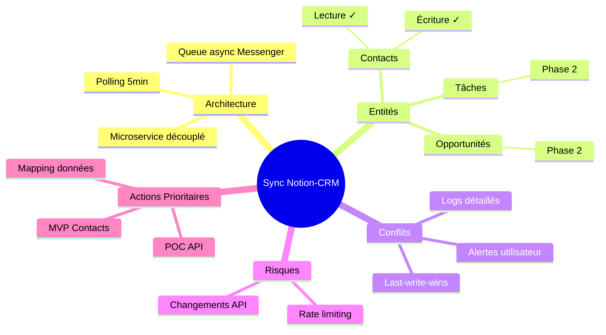

# Synchronisation Notion pour Application CRM

> Généré le 2025-01-12 — 4 itérations — Template: feature

---

## 1. Contexte et Objectif Initial

Ce brainstorming a exploré l'ajout d'une fonctionnalité de synchronisation bidirectionnelle entre une application CRM existante (stack Symfony/React) et Notion, pour permettre aux utilisateurs de gérer leurs contacts et opportunités depuis les deux plateformes.

**Question initiale** :
Comment intégrer Notion comme interface alternative pour la gestion des données CRM tout en maintenant la cohérence des données ?

**Périmètre** :
- Inclus : Contacts, Opportunités, Tâches liées
- Exclus : Reporting, Factures, Historique des communications

**Critères de succès définis** :
1. Architecture technique claire et implémentable
2. Gestion des conflits de synchronisation documentée
3. Plan de priorisation des fonctionnalités (MoSCoW)

---

## 2. Synthèse Exécutive

La synchronisation Notion-CRM est techniquement faisable via l'API Notion avec une architecture webhook + polling hybride. Le principal défi réside dans la gestion des conflits de synchronisation, pour laquelle une stratégie "last-write-wins avec alerte utilisateur" a été retenue. L'implémentation doit être phasée : d'abord la synchronisation lecture seule des contacts, puis l'écriture, et enfin les opportunités. Le MVP est estimé à 3-4 semaines de développement.

**Insight clé** : L'API Notion ne supporte pas les webhooks natifs — il faudra implémenter un polling intelligent avec détection de changements côté Notion.

---

## 3. Analyse et Conclusions Clés

### 3.1 Architecture Technique

L'architecture retenue est un service de synchronisation découplé (microservice ou module Symfony dédié) qui agit comme pont entre les deux systèmes.

**Points clés** :
- API Notion : REST, rate-limited à 3 req/sec
- Pas de webhooks Notion → polling requis (intervalle 5min recommandé)
- Côté CRM : événements Doctrine pour trigger sync sortante
- Queue async (RabbitMQ/Redis) pour découpler les opérations

**Implications** :
Le polling Notion implique un délai de synchronisation de 5-10 minutes, acceptable pour un CRM mais à communiquer clairement aux utilisateurs.

### 3.2 Gestion des Conflits

Trois stratégies ont été évaluées :

| Stratégie | Avantages | Inconvénients |
|-----------|-----------|---------------|
| Last-write-wins | Simple, prévisible | Perte de données possible |
| Merge automatique | Préserve les données | Complexe, résultats parfois incohérents |
| Résolution manuelle | Contrôle total | Friction utilisateur |

**Décision** : Last-write-wins avec notification utilisateur en cas de conflit détecté. Les champs critiques (email, téléphone) déclenchent une alerte même si résolus automatiquement.

### 3.3 Mapping des Données

| Entité CRM | Structure Notion | Particularités |
|------------|------------------|----------------|
| Contact | Database "Contacts" | Relation → Opportunités |
| Opportunité | Database "Pipeline" | Status = Select Notion |
| Tâche | Database "Tâches" | Date = Date Notion |

Les champs personnalisés CRM seront mappés vers des propriétés Notion dynamiquement créées lors du premier sync.

---

## 4. Décisions et Orientations

| Décision | Justification | Impact | Confiance |
|----------|---------------|--------|-----------|
| Architecture microservice découplé | Isolation, testabilité, évolutivité | Complexité initiale accrue mais maintenabilité long terme | Haute |
| Polling 5min pour Notion | Compromis performance/rate-limit | Délai acceptable, coût API maîtrisé | Haute |
| Last-write-wins + alertes | Équilibre simplicité/sécurité | UX claire, cas limites gérés | Moyenne |
| Symfony Messenger pour queue | Cohérent avec stack existante | Pas de nouvelle techno à maintenir | Haute |

### Décisions Différées
- **Support multi-workspace Notion** — Différé car : complexité significative. À revisiter : si demande client avérée.

---

## 5. Plan d'Action

| # | Action | Priorité | Effort | Délai | Responsable | Dépendances |
|---|--------|----------|--------|-------|-------------|-------------|
| 1 | POC API Notion (CRUD basique) | 🔴 Haute | 2j | S+1 | Dev backend | Aucune |
| 2 | Design schéma mapping données | 🔴 Haute | 1j | S+1 | Dev backend | POC validé |
| 3 | Implémenter sync contacts (lecture) | 🔴 Haute | 3j | S+2 | Dev backend | Mapping validé |
| 4 | UI configuration côté React | 🟡 Moyenne | 2j | S+2 | Dev frontend | API sync dispo |
| 5 | Sync contacts (écriture) | 🟡 Moyenne | 2j | S+3 | Dev backend | #3 complété |
| 6 | Gestion conflits + alertes | 🟡 Moyenne | 2j | S+3 | Dev fullstack | #5 complété |
| 7 | Sync opportunités | 🟢 Basse | 3j | S+4 | Dev backend | #6 validé |

### Quick Wins
1. POC API Notion — valide la faisabilité technique rapidement
2. Documentation mapping — clarifie le scope pour toute l'équipe

### Investissements Stratégiques
1. Architecture queue async — investissement qui servira pour d'autres intégrations futures

---

## 6. Risques et Points d'Attention

| Risque | Probabilité | Impact | Mitigation |
|--------|-------------|--------|------------|
| Rate limiting API Notion | Moyenne | Moyen | Polling adaptatif, cache local |
| Conflits fréquents si usage intensif | Faible | Moyen | Alertes proactives, logs détaillés |
| Changements API Notion | Faible | Élevé | Abstraction couche API, veille changelog |
| Performance polling à grande échelle | Moyenne | Moyen | Pagination, sync incrémentale |

### Hypothèses Formulées
- Volume < 10,000 contacts par client — Si faux : revoir stratégie pagination
- Utilisateurs n'éditent pas simultanément — Si faux : renforcer gestion conflits

---

## 7. Pistes Non Explorées

| Sujet | Raison | Intérêt Potentiel | Prochaine Étape |
|-------|--------|-------------------|-----------------|
| Sync temps réel via WebSocket | Hors scope MVP | Élevé si usage intensif | Évaluer après retours utilisateurs |
| Import/export bulk | Temps limité | Moyen | Ajouter au backlog v2 |
| Templates Notion pré-configurés | Nice-to-have | Moyen | Proposer templates dans doc |

---

## 8. Mindmap de Synthèse

---

## 9. Vérification des Critères de Succès

| Critère | Statut | Évidence |
|---------|--------|----------|
| Architecture technique claire | ✅ Atteint | Section 3.1 détaille l'architecture complète |
| Gestion conflits documentée | ✅ Atteint | Section 3.2 avec décision argumentée |
| Plan MoSCoW | ✅ Atteint | Section 5 avec priorisation claire |

**Évaluation globale** : Le brainstorming a atteint ses trois objectifs. Le projet peut passer en phase d'implémentation.

---

## 10. Sources et Références

### Recherches Web
- Documentation API Notion : Limites rate (3 req/sec), pas de webhooks natifs
- Best practices sync bidirectionnelle : Patterns conflict resolution

### Conversations Passées
- Discussion architecture microservices (nov 2024) : patterns réutilisables identifiés

---

*Document généré par le skill Brainstormer — Autoportant et exploitable indépendamment*
