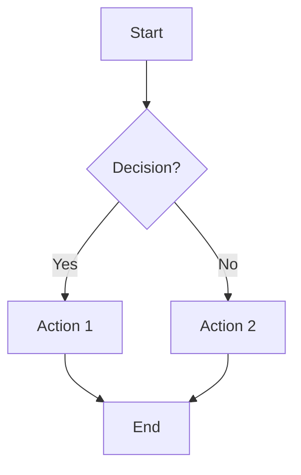
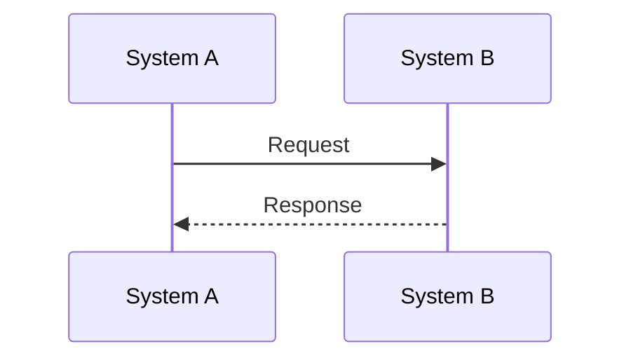
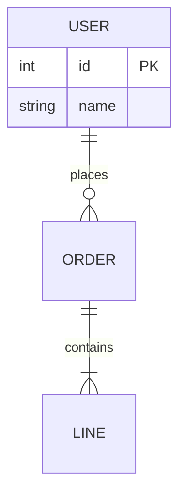
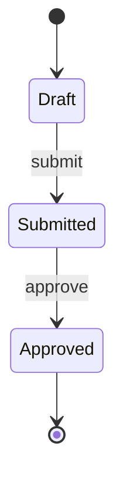
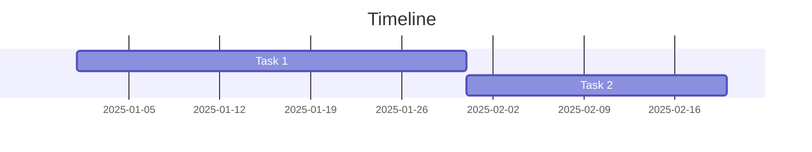
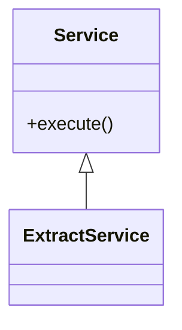
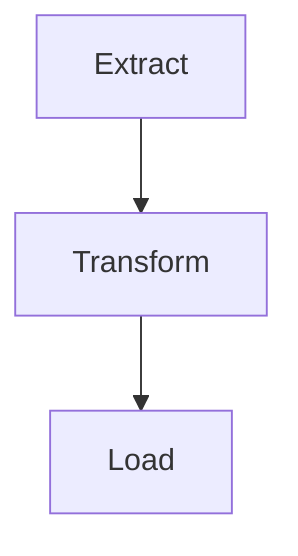
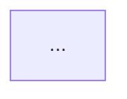

# Mermaid Diagram Detection Reference

> Rules for automatic flow detection and diagram generation

---

## Philosophy

Diagrams should:
- **Add value**: Visualize complex relationships
- **Be accurate**: Reflect what was discussed
- **Be complete**: No "[TBD]" placeholders
- **Be marked**: Indicate source and completions

**Maximum**: 5-6 diagrams per report.

---

## Detection Matrix

| Pattern | Mermaid Type | Indicators | Priority |
|---------|--------------|------------|----------|
| Sequential process | `flowchart TD/LR` | "workflow", "steps", "first...then", "pipeline" | High |
| System exchanges | `sequenceDiagram` | "API", "sends to", "request", "calls" | High |
| Data structure | `erDiagram` | "MCD", "table", "relation", "entity" | Medium |
| States/transitions | `stateDiagram-v2` | "status", "goes from X to Y", "lifecycle" | Medium |
| Planning/phases | `gantt` | "planning", "milestones", "phases" | Low |
| Object architecture | `classDiagram` | "class", "service", "inherits", "method" | Medium |
| Hierarchy | `flowchart TD` | "contains", "composed of", "sub-elements" | Medium |
| Decision logic | `flowchart` + diamonds | "if...then", "condition", "rule" | Medium |

---

## Indicator Keywords

### French
- **Process**: "processus", "workflow", "étapes", "flux", "d'abord", "ensuite", "puis", "enfin"
- **Exchange**: "envoie à", "reçoit de", "appel API", "requête", "intégration"
- **Data**: "MCD", "table", "entité", "relation", "base de données"
- **State**: "statut", "état", "passe de", "cycle de vie", "quand validé"
- **Planning**: "planning", "jalons", "phases", "livraison"
- **Architecture**: "classe", "service", "hérite de", "couche", "package"
- **Hierarchy**: "contient", "composé de", "sous-éléments", "arborescence"
- **Decision**: "si...alors", "selon le cas", "condition", "règle métier"

### English
- **Process**: "process", "workflow", "steps", "flow", "first", "then", "finally"
- **Exchange**: "sends to", "receives from", "API call", "request", "integration"
- **Data**: "ERD", "table", "entity", "relation", "database", "schema"
- **State**: "status", "state", "transitions to", "lifecycle", "when approved"
- **Planning**: "planning", "milestones", "phases", "delivery"
- **Architecture**: "class", "service", "inherits from", "layer", "package"
- **Hierarchy**: "contains", "composed of", "sub-elements", "tree"
- **Decision**: "if...then", "depending on", "condition", "business rule"

---

## Prioritization (if >6 detected)

1. Diagrams linked to **decisions made**
2. Diagrams linked to **action items**
3. **System architecture** diagrams
4. **Business process** diagrams
5. **Data model** diagrams
6. Other diagrams

If tied: prefer more complex flows, more steps, longer discussion.

---

## Templates by Type

### Flowchart



**Use**: Workflows, processes, hierarchies, decisions

**Orientation**:
- `TD`: Hierarchies, org structures
- `LR`: Sequential processes, timelines

### Sequence Diagram



**Use**: API calls, integrations, actor interactions

**Arrows**: `->>` sync, `-->>` response, `--)` async

### ER Diagram



**Use**: Database schemas, data models

### State Diagram



**Use**: Status lifecycles, state machines

### Gantt Chart



**Use**: Project planning, timelines

### Class Diagram



**Use**: Software architecture, service design

---

## Completion Rules

### When to Complete

**DO complete**:
- Standard missing elements (start/end nodes)
- Clear domain conventions (ETL = Extract→Transform→Load)
- Low-risk, obvious completions

**DON'T complete**:
- Unclear business logic
- Multiple valid interpretations
- Unfamiliar domain specifics

### How to Mark

```markdown

> 💡 *Detected from: "on extrait, on transforme, on charge"*
> ⚠️ *Completed by skill: Added validation step per ETL best practices*
```

### Web Research

If enriched via web:

```markdown
> 🌐 *Enriched with: Django Celery pattern* — Source: [URL]
```

---

## Placement Rules

### Contextual (in Topics Discussed)

```markdown
### Architecture ETL

[Discussion text...]


> 💡 *Detected from: discussion above*
```

### Recap Section

All diagrams also appear in "📊 Diagrams — Recap":

```markdown
## 📊 Diagrams — Recap

### ETL Architecture
[Diagram]
> See: Topics > Architecture ETL
```

---

## Quality Checklist

Before including:
- [ ] Adds value beyond text?
- [ ] Reflects what was discussed?
- [ ] Self-contained and understandable?
- [ ] Readable, not overcomplicated?
- [ ] Source indicated?
- [ ] Within 5-6 limit?

---

## Edge Cases

### Multiple Related Flows
Consider combining into one larger diagram.

### Very Complex Flows (>15 nodes)
Either split into focused diagrams or simplify to high-level view.

### Low Confidence Detection
Mention in Insights instead:

```markdown
## 💡 Insights & Leads

### 💭 Potential Diagrams
- A workflow around [topic] was mentioned but details insufficient
```
