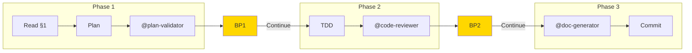

# EPCI — Complete Workflow

## Overview

Structured workflow in 3 phases with validation at each step.
Generates a Feature Document as traceability thread.



---

## Workflow Overview

Three-phase workflow with mandatory breakpoints:

| Phase | Focus | Gate | Output |
|-------|-------|------|--------|
| Phase 1 | Planning | @plan-validator → BP1 | §2 Implementation Plan |
| Phase 2 | TDD Implementation | @code-reviewer → BP2 | §3 Part 1 |
| Phase 3 | Finalization | @doc-generator → Complete | §3 Part 2 + Commit |

**Full phase details:** See @references/epci/phase-1-planning.md, @references/epci/phase-2-implementation.md, @references/epci/phase-3-finalization.md

---

## Output

| Phase | Output | Location |
|-------|--------|----------|
| Phase 1 | §2 Implementation Plan | `docs/features/<slug>.md` |
| Phase 2 | §3 Part 1 (Implementation) | `docs/features/<slug>.md` |
| Phase 3 | §3 Part 2 (Finalization) + Commit Context | `docs/features/<slug>.md` + `.epci-commit-context.json` |

---

## Arguments

### Workflow Control

| Argument | Description |
|----------|-------------|
| `--large` | Alias for `--think-hard --wave` (backward compatible) |
| `--turbo` | Speed-optimized mode: @planner/@implementer (Sonnet), parallel reviews, 1 breakpoint |
| `--from-native-plan <file>` | Import native Claude Code plan as base for §2. Automatically creates §1 if missing via @Explore. |
| `--continue` | Continue from last phase (resume after interruption) |
| `--no-hooks` | Disable all hook execution |

### --turbo Mode

When `--turbo` flag is active:
- **Phase 1:** Use @planner (Sonnet), skip detailed risk analysis, single breakpoint
- **Phase 2:** Use @implementer (Sonnet), parallel reviews (single message), auto-fix minor issues
- **Breakpoints:** 1 only (pre-commit), skip BP1/BP2
- **Time savings:** 30-50%

**Full specification:** See @references/shared/turbo-mode.md

### Key Flags

| Flag | Effect | Auto-Trigger |
|------|--------|--------------|
| `--turbo` | Speed mode (@planner, @implementer, parallel reviews, 1 BP) | Suggested if `.project-memory/` exists |
| `--large` | Alias for `--think-hard --wave` | Never |
| `--safe` | Max validations, all conditional agents mandatory | Sensitive files |
| `--wave` | DAG-based parallel agent execution | complexity > 0.7 |
| `--no-hooks` | Disable all hook execution | Never |

**Full flag documentation:** `src/settings/flags.md`

---

## Feature Document

**Location:** `docs/features/<feature-slug>.md` (created by `/brief`)

**Structure:** §1 (Brief), §2 (Plan), §3 (Implementation)

**Templates:** See @references/epci/feature-document-templates.md

**Prerequisite:** §1 must be complete before running `/epci`.

### Feature Document Updates

**ALWAYS use Edit tool** to update the Feature Document.

| Phase | Action | Tool |
|-------|--------|------|
| Phase 1 | Write §2 (Plan) | Edit tool |
| Phase 2 | Write §3 Part 1 (Implementation) | Edit tool |
| Phase 3 | Append §3 Part 2 (Finalization) | Edit tool |

**DO NOT:**
- Use EnterPlanMode or native Claude Code plan mode
- Write to `~/.claude/plans/`
- Display content without writing to file

**Required path:** `docs/features/<slug>.md` (in project, not in ~/.claude/)

---

## Hooks Integration

Execute hooks at workflow points: `python3 src/hooks/runner.py <hook-type> --context '{...}'`

**Available:** `pre-phase-1`, `post-phase-1`, `pre-phase-2`, `post-phase-2`, `post-phase-3`, `on-breakpoint`, `pre-agent`, `post-agent`

**Full documentation:** See @references/shared/hooks.md

---

## Multi-Agent Orchestration

When `--wave` flag is enabled, agents execute in parallel using DAG-based orchestrator.

| Mode | Description | Flag |
|------|-------------|------|
| Sequential | One agent at a time | `--sequential` |
| DAG | Respect dependencies, parallelize when possible | default with `--wave` |
| Parallel | All agents simultaneously (use with caution) | `--parallel` |

**Full documentation:** See @references/shared/wave-orchestration.md

---

## Pre-Workflow: Memory Context

**Memory is loaded once by `/brief`** and passed via Feature Document §1 (Memory Summary section).

**Reading memory context:**
1. Check Feature Document §1 for "Memory Summary" section
2. IF present: Use conventions, patterns, and velocity from §1
3. IF absent (direct /epci call): Fall back to loading `.project-memory/` directly

**Fallback behavior:** IF `/epci` is called without prior `/brief`, the `project-memory` skill will load context. This is not recommended — always start with `/brief`.

---

## Step 0.5: Import Native Plan (CONDITIONAL)

**Condition:** `--from-native-plan <file>` flag provided

Import a native Claude Code plan as base for Phase 1. Native plan is copied to Feature Document §2 for full traceability.

**Summary:**
1. Read native plan from `<file>` (can be anywhere, e.g., ~/.claude/)
2. Check §1 status → Run @Explore IF §1 missing/incomplete
3. Copy plan to §2 "Plan Original (Natif)" section
4. Proceed to prerequisite check

**Full workflow:** See @references/epci/native-plan-import.md

---

## Feature Document Prerequisite Check (MANDATORY)

**This check MUST pass before Phase 1 can begin.**

### Step 1: Verify Feature Document Exists

```
IF NOT exists(docs/features/<slug>.md):
  +--------------------------------------------------------------+
  | ERROR: Feature Document Not Found                            |
  +--------------------------------------------------------------+
  | Expected: docs/features/<slug>.md                            |
  | -> Run `/brief "<feature description>"` first                |
  +--------------------------------------------------------------+
  ABORT workflow
```

### Step 2: Verify §1 Brief Fonctionnel Exists

```
IF NOT contains_section("## §1 — Brief Fonctionnel"):
  +--------------------------------------------------------------+
  | ERROR: §1 Brief Fonctionnel Missing                          |
  +--------------------------------------------------------------+
  | Feature Document exists but §1 is incomplete.                |
  | -> Run `/brief` to complete functional brief                 |
  +--------------------------------------------------------------+
  ABORT workflow
```

### Step 3: Verify Required Fields in §1

Required fields:
- Context technique (stack, dependencies)
- Objectif (what to achieve)
- At least 1 acceptance criterion

```
IF missing_required_fields:
  +--------------------------------------------------------------+
  | WARNING: Incomplete §1 Brief                                 |
  +--------------------------------------------------------------+
  | Missing fields: [list of missing fields]                     |
  | OPTIONS:                                                     |
  | 1. "continue" -> Proceed anyway (not recommended)            |
  | 2. "brief" -> Run /brief to complete §1                      |
  +--------------------------------------------------------------+
  WAIT for user choice
```

### Validation Passed

```
IF all_checks_pass:
  Feature Document validated: docs/features/<slug>.md
  §1 Brief Fonctionnel: Complete
  -> Proceeding to Phase 1: Planification
```

---

## Phase 1: Planification (MANDATORY)

**ALL steps in this phase are MANDATORY. Do NOT skip any step.**

### Configuration

| Element | Value |
|---------|-------|
| **Thinking** | Based on flags: `think` (default), `think hard` (--think-hard), `ultrathink` (--ultrathink) |
| **Skills** | project-memory, epci-core, architecture-patterns, flags-system, [stack] |
| **Subagents** | @plan-validator |

### Process Summary

1. **Read Feature Document** — Extract §1 content, check for native plan
2. **Planning** — Break into atomic tasks (2-15 min), order by dependencies, plan tests
3. **Validation** — Submit to @plan-validator, revise IF NEEDS_REVISION

**Full process details:** See @references/epci/phase-1-planning.md

### Output §2 (USE EDIT TOOL)

**MANDATORY:** Use **Edit tool** to update Feature Document with §2 content.

**Path:** `docs/features/<slug>.md` — **NOT** `~/.claude/plans/`

**Templates:** See @references/epci/feature-document-templates.md

### BREAKPOINT BP1 (MANDATORY)

**MANDATORY:** Display breakpoint and WAIT for user confirmation.

**User options:** "Continuer" / "Modifier le plan" / "Voir details" / "Annuler"

---

## Phase 2: Implementation (MANDATORY)

**ALL steps in this phase are MANDATORY. Do NOT skip any step.**

### Configuration

| Element | Value |
|---------|-------|
| **Thinking** | Based on flags: `think` (default), `think hard` (--think-hard) |
| **Skills** | testing-strategy, code-conventions, flags-system, [stack] |
| **Subagents** | @code-reviewer (mandatory), @security-auditor*, @qa-reviewer* |

### Conditional Subagents

**@security-auditor** IF detection of:
- Files: `**/auth/**`, `**/security/**`, `**/api/**`, `**/password/**`
- Keywords: `password`, `secret`, `api_key`, `jwt`, `oauth`

**@qa-reviewer** IF:
- More than 5 test files created/modified
- Integration or E2E tests involved
- Complex mocking detected

### Process Summary

1. **TDD Cycle** — For each task: RED → GREEN → REFACTOR
2. **Reviews** — @code-reviewer, @security-auditor*, @qa-reviewer*
3. **Fix issues** — Address Critical/Important findings

**Full process details:** See @references/epci/phase-2-implementation.md

### Output §3 Part 1 (USE EDIT TOOL)

**MANDATORY:** Use **Edit tool** to update Feature Document with §3 implementation content.

### BREAKPOINT BP2 (MANDATORY)

**MANDATORY:** Display breakpoint and WAIT for user confirmation.

**User options:** "Continuer" / "Corriger issues" / "Voir rapports" / "Annuler"

---

## Phase 3: Finalization (MANDATORY)

**ALL steps in this phase are MANDATORY. Do NOT skip any step.**

### Configuration

| Element | Value |
|---------|-------|
| **Thinking** | `think` |
| **Skills** | git-workflow |
| **Subagents** | @doc-generator |

### Process Summary

1. **Structured commit** — Prepare commit message
2. **Documentation** — @doc-generator updates README, CHANGELOG
3. **PR preparation** — Branch, template, reviewers
4. **Learning update** — Save to `.project-memory/history/features/`

**Full process details:** See @references/epci/phase-3-finalization.md

### Generate Commit Context (MANDATORY)

Write `.epci-commit-context.json` to project root, then display suggestion to run `/commit`.

### Memory Update (MANDATORY)

**CRITICAL:** Execute `post-phase-3` hook before displaying completion message.

```bash
python3 src/hooks/runner.py post-phase-3 --context '{...}'
```

**Skip only IF** `--no-hooks` flag is active.

### COMPLETION

```
---
FEATURE COMPLETE

Feature Document finalized: docs/features/<slug>.md
- Phase 1: Plan validated
- Phase 2: Code implemented and reviewed
- Phase 3: Documentation and commit validation

Commit status: {COMMITTED | PENDING}
Next step: {Create PR | Manual commit then PR}

Tip: IF .claude/ doesn't exist, run /rules to generate conventions
---
```

---

## Quick Reference

See @references/epci/quick-reference.md for:
- Workflow summary
- Key agents table
- Breakpoints table
- Common flag combinations
- --large mode details
- Flag compatibility matrix

---

## Related Commands

| Command | Relationship |
|---------|--------------|
| `/brief` | Creates §1 — **prerequisite** for `/epci` |
| `/quick` | Alternative workflow for TINY/SMALL features |
| `/commit` | Called after Phase 3 for git finalization |
| `/memory` | View project memory used by `/epci` |
| `/rules` | Generate .claude/ conventions IF not present |

---

## Constraints

- Feature Document §1 MUST exist before running `/epci`
- ALL breakpoints are MANDATORY (except in `--turbo` mode)
- Edit tool MUST be used for Feature Document updates
- Memory hook MUST execute at end (unless `--no-hooks`)
- Maximum 3 @plan-validator revision cycles before escalation

---
