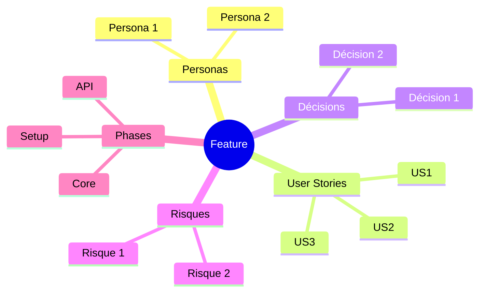

# [Titre du Brainstorming]

> Généré le [date] - [N] itérations - Template: [name] - EMS final: [score]/100

**Filename**: `brief-{slug}-{date}.md`
**Location**: `docs/briefs/{slug}/`
**Audience**: Toute personne devant comprendre les conclusions sans avoir assisté à la session.
**Principe**: Entièrement auto-suffisant - un lecteur sans contexte doit tout comprendre.
**Longueur estimée**: 1000-2500 mots selon complexité.

---

## 1. Contexte et Objectif

[Reformulation claire du point de départ - 2-4 phrases]

**Question/problème initial**:
> [Ce qu'on cherchait à explorer - 1-2 phrases, citation directe possible]

**Périmètre**:
- ✅ IN: [ce qui est couvert]
- ❌ OUT: [ce qui est explicitement exclu]

**Critères de succès définis**:
1. [Critère 1 - mesurable si possible]
2. [Critère 2]
3. [Critère 3]

---

## 2. Synthèse Exécutive

[5-10 lignes capturant les conclusions essentielles. Un décideur doit pouvoir lire uniquement cette section.]

**Insight clé**: [Principale conclusion en 1 phrase, en gras]

**Décisions principales**:
1. [Décision 1]
2. [Décision 2]
3. [Décision 3]

**Routing recommandé**: [TINY/SMALL → `/quick` | STANDARD/LARGE → `/implement`]

---

## 3. Personas et Scénarios d'Usage

### 3.1 Persona Principal: [Nom]

| Attribut | Description |
|----------|-------------|
| Rôle | [Ex: Administrateur système, Client final] |
| Objectif | [Ce qu'il cherche à accomplir] |
| Frustration actuelle | [Pain point principal] |
| Niveau technique | [Novice / Intermédiaire / Expert] |
| Contexte d'usage | [Mobile/Desktop, fréquence, environnement] |

**Scénario d'usage typique**:
> [Narrative de 3-5 phrases décrivant comment ce persona utilise la feature dans un cas concret]

### 3.2 Persona Secondaire: [Nom] (si applicable)

[Même structure, version condensée]

---

## 4. Analyse et Conclusions Clés

### 4.1 [Thème Majeur 1]

[Développement structuré - 1-3 paragraphes]

**Points clés**:
- [Point 1]
- [Point 2]

**Implications pour l'implémentation**:
[Ce que cela signifie concrètement pour le développement - 1-2 phrases]

### 4.2 [Thème Majeur 2]

[Même structure...]

### 4.3 [Thème Majeur N]

[Même structure...]

---

## 5. User Stories et Critères d'Acceptation

> Cette section est l'input principal pour `/spec`. Format strict.

### US1: [Titre court]

**Story**: As a [persona], I want [fonctionnalité] so that [bénéfice].

**Priorité**: Must have | Should have | Could have

**Critères d'acceptation**:
```gherkin
AC1: [Titre du critère]
Given [précondition/contexte]
When [action utilisateur]
Then [résultat attendu]
And [résultat additionnel si applicable]

AC2: [Titre du critère]
Given [précondition]
When [action]
Then [résultat]
```

**Edge cases identifiés**:
- [Cas limite 1] → [Comportement attendu]
- [Cas limite 2] → [Comportement attendu]

---

### US2: [Titre court]

[Même structure...]

---

### US3: [Titre court]

[Même structure...]

---

## 6. Décisions et Orientations Techniques

| Décision | Rationale | Impact | Confiance |
|----------|-----------|--------|-----------|
| [Décision 1] | [Pourquoi ce choix] | [Conséquences] | High/Medium/Low |
| [Décision 2] | [Pourquoi ce choix] | [Conséquences] | High/Medium/Low |

### Décisions différées
- [Décision X] - Différée car: [raison]. À revisiter: [quand/condition]

### Choix architecturaux
- **Pattern retenu**: [Ex: Repository pattern, Event sourcing, etc.]
- **Justification**: [Pourquoi ce pattern pour ce contexte]

---

## 7. Priorisation MoSCoW

### Must Have (MVP) — ~60% effort
| # | Feature/Story | Effort estimé | Dépendance |
|---|---------------|---------------|------------|
| 1 | [Feature] | S/M/L | - |
| 2 | [Feature] | S/M/L | #1 |

### Should Have — ~20% effort
| # | Feature/Story | Effort estimé | Dépendance |
|---|---------------|---------------|------------|
| 3 | [Feature] | S/M/L | #2 |

### Could Have — ~20% effort
| # | Feature/Story | Effort estimé | Dépendance |
|---|---------------|---------------|------------|
| 4 | [Feature] | S/M/L | #3 |

### Won't Have (this release)
- [Feature explicitement exclue] — Raison: [pourquoi]
- [Feature explicitement exclue] — Raison: [pourquoi]

---

## 8. Contraintes et Dépendances

### Contraintes techniques
| Type | Contrainte | Impact |
|------|------------|--------|
| Stack | [Ex: Symfony 7 obligatoire] | [Conséquence] |
| Infra | [Ex: Hébergement OVH] | [Conséquence] |
| Legacy | [Ex: API v1 à maintenir] | [Conséquence] |
| Performance | [Ex: <2s response time] | [Conséquence] |
| Sécurité | [Ex: RGPD, données sensibles] | [Conséquence] |

### Dépendances externes
| Dépendance | Type | SLA/Disponibilité | Fallback |
|------------|------|-------------------|----------|
| [API tierce] | Externe | [99.9%] | [Plan B] |
| [Équipe X] | Interne | [Livraison Q2] | [Plan B] |

### Intégrations requises
- **Systèmes existants**: [Liste des systèmes à intégrer]
- **APIs à consommer**: [Liste avec endpoints clés]
- **APIs à exposer**: [Liste si applicable]

---

## 9. Risques et Hypothèses

### Risques identifiés

| Risque | Probabilité | Impact | Mitigation |
|--------|-------------|--------|------------|
| [Risque 1] | High/Med/Low | High/Med/Low | [Stratégie] |
| [Risque 2] | High/Med/Low | High/Med/Low | [Stratégie] |

### Hypothèses (Assumptions)
- **[Hypothèse 1]** — Si faux: [conséquence]
- **[Hypothèse 2]** — Si faux: [conséquence]

---

## 10. Plan d'Action Haut Niveau

> Cette section donne une vision séquentielle pour `/spec`.

| Phase | Livrables | Effort estimé | Owner | Prérequis |
|-------|-----------|---------------|-------|-----------|
| 1. Setup | [Fondations, modèles] | ~[X]h | [Qui] | - |
| 2. Core | [Logique métier] | ~[X]h | [Qui] | Phase 1 |
| 3. API | [Endpoints] | ~[X]h | [Qui] | Phase 2 |
| 4. UI | [Interface] | ~[X]h | [Qui] | Phase 3 |
| 5. Tests | [E2E, intégration] | ~[X]h | [Qui] | Phase 4 |

**Effort total estimé**: ~[X]h ([X] jours)
**Chemin critique**: Phase 1 → Phase 2 → Phase 3

### Quick Wins (impact élevé, effort faible)
1. [Action] — Pourquoi c'est un quick win
2. [Action] — Pourquoi c'est un quick win

### Investissements Stratégiques (impact élevé, effort élevé)
1. [Action] — Pourquoi c'est un investissement pertinent
2. [Action] — Pourquoi c'est un investissement pertinent

---

## 11. Mindmap de Synthèse


---

## 12. Score EMS Final

```
EMS Final: [SCORE]/100 [STATUT]

Progression EMS
100 |
 90 | . . . . . . . . . . . . . . . . . . . .
 80 |
 70 |          ●───────●
 60 | . . . . . . . . . . . . . . . . . . . .
 50 |    ●────●
 40 |
 30 | ●. . . . . . . . . . . . . . . . . . .
 20 |
  0 +----+-----+-----+-----+-----+-----+
    Init  It.1  It.2  It.3  ...  Fin

Axes finaux:
   Clarté       [████████░░] 80/100
   Profondeur   [███████░░░] 70/100
   Couverture   [████████░░] 85/100
   Décisions    [█████████░] 90/100
   Actionab.    [████████░░] 80/100
```

**Évaluation globale**: [Résumé en 1-2 phrases]

### Vérification des Critères de Succès

| Critère | Statut | Évidence |
|---------|--------|----------|
| [Critère 1] | ✅ Atteint / 🔶 Partiel / ❌ Non atteint | [Explication] |
| [Critère 2] | ✅ Atteint / 🔶 Partiel / ❌ Non atteint | [Explication] |

---

## 13. Pistes Non Explorées

| Sujet | Pourquoi non exploré | Valeur potentielle | Prochaine étape |
|-------|----------------------|-------------------|-----------------|
| [Sujet 1] | [Raison] | High/Med/Low | [Action suggérée] |
| [Sujet 2] | [Raison] | High/Med/Low | [Action suggérée] |

---

## 14. Références

### Documents analysés
- [Document 1]: [Ce qui en a été extrait - 1 ligne]

### Recherches web
- [URL ou source]: [Information clé obtenue - 1 ligne]

### Conversations passées référencées
- [Sujet/Date]: [Connexion pertinente]

---

## 15. Prochaines Étapes

**Workflow recommandé**:

| Étape | Skill | Action |
|-------|-------|--------|
| 1 | `/spec` | Transformer ce brief en spécifications techniques |
| 2 | `/implement` ou `/quick` | Implémenter selon routing de complexité |

**Routing de complexité**: [TINY/SMALL/STANDARD/LARGE]
**Skill suggéré**: [/quick ou /implement]

**Commande suggérée**:
```
/spec brief-{slug}-{date}.md
```

---

## Guidelines par Section

### Section 1: Contexte
- Rester bref (2-4 phrases)
- Inclure la formulation originale de l'utilisateur
- Définir clairement les limites du périmètre

### Section 2: Synthèse Exécutive
- Écrire en dernier (après toutes les autres sections)
- Doit être autonome comme résumé complet
- L'insight clé en une phrase est obligatoire

### Section 3: Personas
- 1 persona principal obligatoire
- Persona secondaire si pertinent
- Scénario d'usage narratif (pas de bullet points)

### Section 4: Analyse
- Grouper les findings par thème
- Chaque thème: findings + implications pour l'implémentation
- 3-7 thèmes typiquement

### Section 5: User Stories
- Format Gherkin strict pour les critères d'acceptation
- Edge cases obligatoires pour chaque US
- Priorité MoSCoW sur chaque US

### Section 6: Décisions
- Inclure le rationale pour chaque décision
- Marquer le niveau de confiance honnêtement
- Lister les décisions différées séparément

### Section 7: MoSCoW
- Must Have = MVP (~60% effort)
- Should Have (~20% effort)
- Could Have (~20% effort)
- Won't Have avec justification

### Section 8: Contraintes
- Distinguer technique/infra/legacy/perf/sécurité
- Inclure SLA pour dépendances externes
- Fallback pour chaque dépendance critique

### Section 9: Risques
- Être honnête sur les hypothèses
- Inclure stratégies de mitigation
- Ne pas sur-alarmer mais ne pas ignorer

### Section 10: Plan d'Action
- Phases séquentielles avec prérequis
- Identifier le chemin critique
- Assigner un owner par phase (même si "TBD")
- Séparer quick wins des investissements stratégiques

### Section 11: Mindmap
- Utiliser Mermaid pour compatibilité
- Synthèse visuelle des éléments clés
- Garder lisible (pas exhaustif)

### Section 12: EMS
- Inclure progression visuelle
- Radar final avec les 5 axes
- ASCII art pour portabilité

### Section 13: Pistes Non Explorées
- Reconnaître ce qui n'a pas été couvert
- Aide l'exploration future
- Montre l'honnêteté intellectuelle

### Section 14: Références
- Créditer toutes les sources externes
- Inclure ce qui a été appris de chaque source
- Aide la traçabilité

### Section 15: Prochaines Étapes
- Routing clair vers le skill suivant
- Basé sur le complexity-calculator
- Recommandation actionnable

---

## Adaptation Linguistique

Le brief s'adapte à la langue de l'utilisateur. Headers anglais si input anglais :

| Français | English |
|----------|---------|
| Contexte et Objectif | Context and Objective |
| Synthèse Exécutive | Executive Summary |
| Personas et Scénarios | Personas and Scenarios |
| User Stories | User Stories |
| Décisions Techniques | Technical Decisions |
| Priorisation MoSCoW | MoSCoW Prioritization |
| Contraintes et Dépendances | Constraints and Dependencies |
| Risques et Hypothèses | Risks and Assumptions |
| Plan d'Action | Action Plan |
| Score EMS Final | Final EMS Score |
| Prochaines Étapes | Next Steps |