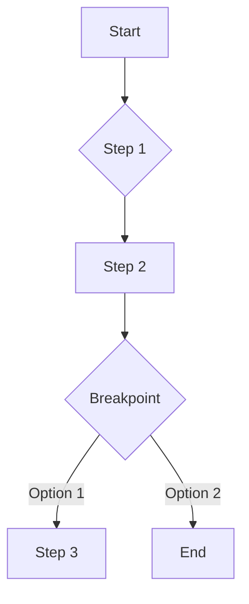

# Command Auditor

## Overview

Audits slash commands against 95 rules derived from official Anthropic documentation
and EPCI best practices. Produces a structured Markdown report with compliance score,
workflow diagram, and actionable remediation guidance.

## Quick Decision

```
Command to audit?
       │
  ┌────┴────┐
  ▼         ▼
Single    Batch
  │         │
  ▼         ▼
--file    --dir
  │         │
  ▼         ▼
Report   Reports
(.md)    (per file)
```

## Audit Process

### Step 1: Load Command

Read target command file and parse:
- YAML frontmatter (between `---` delimiters)
- Markdown body (sections, steps, breakpoints)
- References and integrations

### Step 2: Apply Rules (95 total)

Evaluate against 7 categories:

| Category | Rules | Focus |
|----------|-------|-------|
| FM (Frontmatter) | 15 | YAML syntax, required fields |
| ST (Structure) | 20 | Sections, headers, ordering |
| RD (Rédaction) | 25 | Content quality, references |
| WF (Workflow) | 10 | Step logic, completeness |
| IN (Integration) | 15 | Skills, subagents, hooks |
| DG (Detection) | 10 | Generation suggestions |

→ See [rules-catalog.md](references/rules-catalog.md) for complete list

### Step 3: Calculate Score

```
Score = 100 - (BLOQUANT × 10) - (ERREUR × 3) - (WARNING × 1)

Verdict:
  >= 90  →  PASS (production ready)
  70-89  →  WARN (minor issues)
  < 70   →  FAIL (must fix)
```

### Step 4: Generate Diagram

Extract workflow from detected steps and generate Mermaid flowchart:



### Step 5: Produce Report

Generate structured Markdown report with:
- Executive summary (score, verdict, counts)
- Workflow diagram (Mermaid)
- Results by category (table format)
- Blocking errors (must fix)
- Generation suggestions (optional)
- Action items checklist

→ See [rules-catalog.md](references/rules-catalog.md#report-format) for template

## Modes

| Mode | Flag | Behavior |
|------|------|----------|
| **STRICT** | `--strict` (default) | BLOQUANT rules = FAIL |
| **LENIENT** | `--lenient` | Suggestions only |
| **JSON** | `--json` | Machine-readable output |
| **QUIET** | `--quiet` | Score only, no details |

## Invocation

```bash
# Single command audit
/audit-command commands/brief.md

# With specific mode
/audit-command commands/quick.md --lenient

# Batch audit (all commands)
/audit-command --dir commands/

# CI/CD integration
/audit-command commands/new-cmd.md --json --strict
```

## Severity Levels

| Level | Count | Impact | Action |
|-------|-------|--------|--------|
| BLOQUANT | 12 | Score -10 | Must fix before merge |
| ERREUR | 45 | Score -3 | Should fix |
| WARNING | 28 | Score -1 | Consider fixing |
| SUGGESTION | 10 | Score 0 | Optional improvement |

## Quick Reference

| Task | Rule Category | Key Checks |
|------|---------------|------------|
| Frontmatter valid? | FM | FM-001, FM-002, FM-011 |
| Structure complete? | ST | ST-001, ST-003, ST-005 |
| Content quality? | RD | RD-001, RD-005, RD-018 |
| Workflow coherent? | WF | WF-001, WF-004, WF-009 |
| Integrations OK? | IN | IN-001, IN-002, IN-008 |

## Error Handling

| Error | Recovery |
|-------|----------|
| File not found | Report error, skip |
| Invalid YAML | Mark FM-001 BLOQUANT, continue |
| Missing sections | Mark ST-00X ERREUR, continue |
| Circular workflow | Mark WF-003 BLOQUANT, flag |

## References

- [rules-catalog.md](references/rules-catalog.md) — Complete 95 rules overview
- [frontmatter-rules.md](references/frontmatter-rules.md) — FM-001 to FM-015
- [structure-rules.md](references/structure-rules.md) — ST-001 to ST-020
- [content-rules.md](references/content-rules.md) — RD + WF rules (35 total)
- [integration-rules.md](references/integration-rules.md) — IN-001 to IN-015
- [generation-detection.md](references/generation-detection.md) — DG-001 to DG-010
- [gold-standard-examples.md](references/gold-standard-examples.md) — Annotated examples

---

*Command Auditor v1.0.0 — EPCI Plugin*
