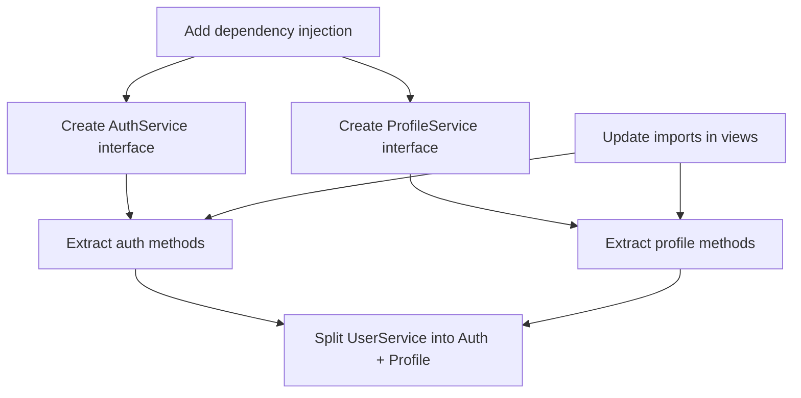

# Step 02: Planning

> Select patterns, create transformation plan, build Mikado graph if needed.

## Trigger

- Previous step: `step-01-analysis.md` completed

## Inputs

| Input | Source |
|-------|--------|
| Code smells | From step-01 |
| Dependency graph | From step-01 |
| Metrics before | From step-01 |
| Pattern hint | From step-00 (optional) |

## Protocol

### 1. Pattern Selection

Map code smells to appropriate patterns:

| Code Smell | Suggested Patterns |
|------------|-------------------|
| Long Method | extract-method |
| Large Class | extract-class, extract-module |
| Duplicated Code | extract-method, extract-module |
| Feature Envy | move, encapsulate |
| God Class | extract-class, extract-module |
| Dead Code | inline (remove) |
| Deep Nesting | extract-method, guard clauses |
| Long Parameter List | encapsulate (parameter object) |

If user provided `--pattern`, prioritize that pattern.

### 2. Define Transformations

Create ordered list of atomic transformations:

```json
{
  "transformations": [
    {
      "id": "T1",
      "pattern": "extract-method",
      "description": "Extract validation logic from authenticate()",
      "source": "auth.py:45-78",
      "target": "auth.py:new method validate_credentials()",
      "dependencies": [],
      "estimated_loc_change": -30,
      "risk": "low"
    },
    {
      "id": "T2",
      "pattern": "extract-class",
      "description": "Create TokenValidator class",
      "source": "auth.py:100-180",
      "target": "validators/token_validator.py",
      "dependencies": ["T1"],
      "estimated_loc_change": +50,
      "risk": "medium"
    }
  ]
}
```

### 3. Mikado Method (Architecture Scope Only)

If scope is `architecture`:

```
1. Define the GOAL (desired end state)
2. Try to achieve goal directly
3. For each failure:
   → Create sub-goal to fix the issue
   → Add edge from sub-goal to parent
4. Recursively resolve sub-goals
5. Execute leaf nodes first, work toward root
```

Generate Mikado graph:



@../references/mikado-method.md

See mikado-method.md (imported above).

### 4. Estimate Impact

```json
{
  "impact_estimate": {
    "files_modified": 3,
    "files_created": 2,
    "files_deleted": 0,
    "loc_delta": -50,
    "test_files_affected": 2,
    "breaking_changes": false
  }
}
```

### 5. Generate Plan Summary

```
## Refactoring Plan

**Goal**: Reduce complexity of auth.py (CC: 25 → ~12)
**Scope**: module
**Transformations**: 4

### Transformation Order

1. **T1: Extract validate_credentials()** [Low Risk]
   - Source: auth.py:45-78
   - Target: New method in auth.py
   - Preserves: authenticate() signature

2. **T2: Extract TokenValidator class** [Medium Risk]
   - Source: auth.py:100-180
   - Target: New file validators/token_validator.py
   - Preserves: validate_token() returns

3. **T3: Move user lookups** [Low Risk]
   - Source: auth.py (Feature Envy)
   - Target: user.py methods
   - Preserves: All public APIs

4. **T4: Inline dead refresh code** [Low Risk]
   - Source: auth.py:200-220
   - Action: Remove unused code
   - Preserves: N/A (dead code)

### Expected Outcomes
- LOC: 450 → ~400 (-11%)
- CC: 25 → ~12 (-52%)
- MI: 45 → ~65 (+44%)

### Risks
- T2 requires updating 2 import statements
- Test coverage should remain above 80%
```

## Outputs

| Output | Destination |
|--------|-------------|
| Transformation plan | State |
| Mikado graph (if arch) | State |
| Plan summary | User display |

## Next Step

→ `step-03-breakpoint.md`

## Error Handling

| Error | Resolution |
|-------|------------|
| No patterns applicable | Suggest manual review or clarify goal |
| Circular dependency in plan | Apply Mikado Method |
| Too many transformations | Split into phases, suggest multiple sessions |
