# Prompt d'Audit EPCI Workflow

> **Version** : 2.0
> **Usage** : Executer regulierement pour evaluer la coherence du systeme EPCI
> **Frequence recommandee** : Apres chaque release majeure ou mensuel
> **Destination rapports** : `docs/audits/audit-{YYYY-MM-DD}.md`

---

## Table des Matieres

1. [Vue d'ensemble des workflows](#vue-densemble-des-workflows)
2. [Prompt d'Audit Complet](#prompt-daudit-complet)
3. [Prompt d'Audit Workflow Complet (EPCI)](#prompt-daudit-workflow-complet-epci)
4. [Prompt d'Audit Workflow Quick (EPCT)](#prompt-daudit-workflow-quick-epct)
5. [Prompt de Comparaison](#prompt-de-comparaison-workflows)
6. [Template Rapport](#template-rapport-daudit)
7. [Historique des Audits](#historique-des-audits)

---

## Vue d'ensemble des Workflows

### Diagramme Global des Workflows EPCI

```mermaid
flowchart TB
    subgraph Entry["📥 ENTREE"]
        IDEA["💡 Idee/Brief brut"]
    end

    subgraph Discovery["🔍 DISCOVERY (optionnel)"]
        BRAINSTORM["/brainstorm"]
        SPIKE["spike (integre)"]
    end

    subgraph Routing["🚦 ROUTING"]
        BRIEF["/brief"]
        EVAL{"Evaluation\nComplexite"}
    end

    subgraph QuickFlow["⚡ WORKFLOW QUICK (EPCT)"]
        direction TB
        QE["[E] Explore"]
        QP["[P] Plan"]
        QC["[C] Code"]
        QT["[T] Test"]
        QCOMMIT["/commit"]
    end

    subgraph FullFlow["🏗️ WORKFLOW COMPLET (EPCI)"]
        direction TB
        P1["Phase 1: Planification"]
        BP1["⏸️ BP1: Plan Valide"]
        P2["Phase 2: Implementation"]
        BP2["⏸️ BP2: Code Implemente"]
        P3["Phase 3: Finalisation"]
        FCOMMIT["/commit"]
    end

    subgraph Output["📤 SORTIE"]
        DONE["✅ Feature Complete"]
        MEMORY["📝 Memory Update"]
    end

    IDEA --> BRAINSTORM
    BRAINSTORM --> SPIKE
    SPIKE --> BRAINSTORM
    BRAINSTORM --> BRIEF
    IDEA --> BRIEF

    BRIEF --> EVAL
    EVAL -->|"TINY/SMALL"| QE
    EVAL -->|"STANDARD/LARGE"| P1

    QE --> QP
    QP --> QC
    QC --> QT
    QT --> QCOMMIT

    P1 --> BP1
    BP1 --> P2
    P2 --> BP2
    BP2 --> P3
    P3 --> FCOMMIT

    QCOMMIT --> MEMORY
    FCOMMIT --> MEMORY
    MEMORY --> DONE

    style Entry fill:#e1f5fe
    style Discovery fill:#fff3e0
    style Routing fill:#f3e5f5
    style QuickFlow fill:#e8f5e9
    style FullFlow fill:#fff8e1
    style Output fill:#fce4ec
```



### Workflow 1: Complet (brainstorm → brief → epci → commit)

```mermaid
sequenceDiagram
    participant U as User
    participant BR as /brainstorm
    participant BF as /brief
    participant EP as /epci
    participant CM as /commit
    participant MEM as Memory

    rect rgb(255, 243, 224)
        Note over U,BR: Phase Discovery (optionnel)
        U->>BR: Idee vague
        BR->>BR: @Explore (analyse codebase)
        BR->>U: Questions clarification
        U->>BR: Reponses
        BR->>BR: Calcul EMS
        loop Iterations jusqu'a EMS > 70
            BR->>U: Questions/Suggestions
            U->>BR: Reponses
        end
        opt Incertitude technique
            BR->>BR: spike [duration] [question]
            BR->>BR: Verdict GO/NO-GO
        end
        BR->>BR: Generation brief + journal
    end

    rect rgb(243, 229, 245)
        Note over U,BF: Phase Routing
        U->>BF: Brief structure
        BF->>BF: @Explore (thorough)
        BF->>BF: Analyse + Detection flags
        BF->>BF: Detection personas + MCP
        BF->>U: ⏸️ BP Analyse (questions, suggestions, eval)
        U->>BF: [4] Lancer
        BF->>BF: Creation Feature Document §1
    end

    rect rgb(255, 248, 225)
        Note over U,EP: Phase Implementation (EPCI)
        BF->>EP: Feature Document
        
        Note over EP: Phase 1 - Planification
        EP->>EP: @plan-validator
        EP->>EP: Mise a jour §2
        EP->>U: ⏸️ BP1 Plan Valide
        U->>EP: Continuer
        
        Note over EP: Phase 2 - Implementation
        EP->>EP: TDD (RED-GREEN-REFACTOR)
        EP->>EP: @code-reviewer
        opt Fichiers sensibles
            EP->>EP: @security-auditor
        end
        opt Tests complexes
            EP->>EP: @qa-reviewer
        end
        EP->>EP: Mise a jour §3 (part 1)
        EP->>U: ⏸️ BP2 Code Implemente
        U->>EP: Continuer
        
        Note over EP: Phase 3 - Finalisation
        EP->>EP: @doc-generator
        EP->>EP: Mise a jour §3 (part 2)
        EP->>EP: Generation .epci-commit-context.json
    end

    rect rgb(252, 228, 236)
        Note over U,MEM: Phase Commit
        EP->>CM: Contexte commit
        CM->>U: ⏸️ BP Pre-commit
        U->>CM: Confirmer
        CM->>CM: git commit
        CM->>MEM: post-phase-3 hook
        MEM->>MEM: Sauvegarde history/features/
        CM->>U: ✅ Feature Complete
    end
```



### Workflow 2: Quick (brief → quick)

```mermaid
sequenceDiagram
    participant U as User
    participant BF as /brief
    participant QK as /quick
    participant CM as /commit
    participant MEM as Memory

    rect rgb(243, 229, 245)
        Note over U,BF: Phase Routing
        U->>BF: Brief simple
        BF->>BF: @Explore (quick scan)
        BF->>BF: Detection TINY/SMALL
        BF->>U: ⏸️ BP Analyse (compact)
        U->>BF: [4] Lancer
        BF->>BF: Generation inline brief
    end

    rect rgb(232, 245, 233)
        Note over U,QK: Phase EPCT (Quick)
        BF->>QK: Inline brief

        Note over QK: [E] EXPLORE (5-10s)
        QK->>QK: Quick scan
        opt SMALL
            QK->>QK: @Explore (Haiku)
        end
        opt Ambiguite
            QK->>QK: @clarifier (Haiku)
        end

        Note over QK: [P] PLAN (10-15s)
        QK->>QK: Generation taches (1-5)
        opt SMALL+
            QK->>QK: @planner (Sonnet)
        end
        QK->>QK: Creation session .project-memory/sessions/
        alt --autonomous
            QK->>QK: Skip BP
        else Standard
            QK->>U: ⏸️ BP Plan (3s auto-continue)
        end

        Note over QK: [C] CODE (variable)
        alt TINY
            QK->>QK: Implementation directe (Haiku)
        else SMALL
            QK->>QK: @implementer (Sonnet)
        end
        QK->>QK: Auto-fix lint/format

        Note over QK: [T] TEST (5-10s)
        QK->>QK: Run tests existants
        QK->>QK: Lint/format check
        QK->>QK: Generation .epci-commit-context.json
    end

    rect rgb(252, 228, 236)
        Note over U,MEM: Phase Commit
        QK->>CM: Contexte commit
        CM->>U: ⏸️ BP Pre-commit
        U->>CM: Confirmer
        CM->>CM: git commit
        CM->>MEM: post-phase-3 hook
        MEM->>MEM: Sauvegarde session
        CM->>U: ✅ Quick Complete
    end
```



---

## Prompt d'Audit Complet

Copiez le prompt ci-dessous et executez-le dans une nouvelle conversation Claude Code.

```
Realise un audit complet et objectif du systeme EPCI de ce repository.

## Objectifs de l'Audit

1. Evaluer la coherence entre tous les composants (commands, agents, skills, hooks)
2. Verifier les deux workflows complets (EPCI et Quick)
3. Identifier les incoherences documentation vs implementation
4. Mesurer la qualite globale avec un score pondere
5. Lister points forts, points faibles, risques
6. Fournir des recommandations priorisees

## Methodologie

### Phase 1 — Inventaire Complet

1. **Lister tous les agents** dans `src/agents/` :
   - Nom, model declare, allowed-tools
   - Quelles commandes les invoquent
   - Conditions d'invocation

2. **Lister tous les skills** (fichiers SKILL.md) :
   - Categorie (core, stack, factory, mcp, personas)
   - Quelles commandes/agents les utilisent
   - Frequence d'utilisation

3. **Lister toutes les commandes** dans `src/commands/` :
   - Agents invoques
   - Skills charges
   - Hooks executes

4. **Verifier les hooks** dans `src/hooks/active/` :
   - Lesquels sont actifs
   - Comment ils sont invoques
   - S'ils sont automatiques ou manuels

### Phase 2 — Audit Workflow Complet (brainstorm → brief → epci → commit)

Verifier chaque etape du workflow complet :

#### Etape 1: /brainstorm (optionnel)
- [ ] @Explore invoque pour analyse codebase
- [ ] Questions de clarification generees
- [ ] EMS calcule a chaque iteration
- [ ] Commande `spike` disponible pour exploration technique
- [ ] Brief et journal generes (docs/briefs/)
- [ ] Skills charges: brainstormer, project-memory, architecture-patterns

#### Etape 2: /brief
- [ ] @Explore invoque (thorough level)
- [ ] Detection stack et patterns
- [ ] Detection personas (score > 0.6)
- [ ] Detection MCP servers
- [ ] Breakpoint avec questions/suggestions
- [ ] Pour STANDARD/LARGE: Feature Document cree (docs/features/)
- [ ] Pour TINY/SMALL: Inline brief genere
- [ ] Routing correct vers /quick ou /epci

#### Etape 3: /epci Phase 1 (Planification)
- [ ] Feature Document §1 lu
- [ ] Plan genere avec taches atomiques
- [ ] @plan-validator invoque
- [ ] Feature Document §2 mis a jour (via Edit tool)
- [ ] Hook post-phase-1 execute
- [ ] Breakpoint BP1 affiche avec metriques

#### Etape 4: /epci Phase 2 (Implementation)
- [ ] Hook pre-phase-2 execute
- [ ] TDD applique (RED-GREEN-REFACTOR)
- [ ] @code-reviewer invoque (mandatory)
- [ ] @security-auditor invoque si fichiers sensibles
- [ ] @qa-reviewer invoque si tests complexes
- [ ] Feature Document §3 (part 1) mis a jour
- [ ] Hook post-phase-2 execute
- [ ] Breakpoint BP2 affiche

#### Etape 5: /epci Phase 3 (Finalisation)
- [ ] @doc-generator invoque
- [ ] Feature Document §3 (part 2) complete
- [ ] .epci-commit-context.json genere
- [ ] Hook post-phase-3 execute
- [ ] Memory update effectue

#### Etape 6: /commit
- [ ] Contexte commit lu depuis .epci-commit-context.json
- [ ] Breakpoint pre-commit affiche
- [ ] Message commit conventionnel genere
- [ ] Git commit execute
- [ ] Fichier contexte nettoye

### Phase 3 — Audit Workflow Quick (brief → quick)

Verifier chaque etape du workflow Quick :

#### Etape 1: /brief (TINY/SMALL)
- [ ] Detection complexite correcte
- [ ] Inline brief genere (pas de Feature Document)
- [ ] Routing vers /quick

#### Etape 2: /quick [E] Explore
- [ ] Brief recu de /brief
- [ ] Mode TINY/SMALL confirme
- [ ] @Explore (Haiku) invoque pour SMALL
- [ ] @clarifier invoque si ambiguite
- [ ] Escalation vers /epci si complexite > SMALL

#### Etape 3: /quick [P] Plan
- [ ] Taches generees (1-2 TINY, 3-5 SMALL)
- [ ] @planner (Sonnet) invoque pour SMALL+
- [ ] Session creee dans .project-memory/sessions/
- [ ] Breakpoint 3s affiche (sauf --autonomous)

#### Etape 4: /quick [C] Code
- [ ] Implementation directe (TINY) ou @implementer (SMALL)
- [ ] Model adaptatif (Haiku/Sonnet selon mode)
- [ ] Auto-fix lint/format applique
- [ ] Retry strategy respectee (max 2 retries)

#### Etape 5: /quick [T] Test
- [ ] Tests existants executes
- [ ] Lint/format verifies
- [ ] .epci-commit-context.json genere
- [ ] Resume final affiche

#### Etape 6: Memory Update
- [ ] Hook post-phase-3 execute
- [ ] Session sauvegardee dans .project-memory/sessions/
- [ ] Feature history mise a jour

### Phase 4 — Verification Coherence

1. **Cross-reference agents ↔ commands** :
   - Chaque agent mentionne est-il invoque ?
   - Chaque agent existe-t-il ?

2. **Cross-reference skills ↔ commands** :
   - Chaque skill mentionne existe-t-il ?
   - Y a-t-il des skills orphelins ?

3. **Verification documentation** :
   - CLAUDE.md correspond-il au code ?
   - README.md est-il a jour ?
   - Les versions sont-elles coherentes ?

4. **Verification flux de donnees** :
   - Le workflow brainstorm → brief → epci → commit est-il complet ?
   - Le workflow brief → quick → commit est-il complet ?
   - Y a-t-il des points de rupture ?
   - La memoire est-elle mise a jour ?

### Phase 5 — Scoring

Utilise ce systeme de notation pondere sur 100 :

| Critere | Poids | Description |
|---------|-------|-------------|
| Efficacite | 20% | Overhead vs valeur pour chaque type de feature |
| Robustesse | 15% | Gestion erreurs, validations, breakpoints |
| Maintenabilite | 15% | Complexite structure, fragmentation |
| Experience Dev | 15% | UX breakpoints, messages, feedback |
| Tracabilite | 10% | Feature Document, historique, logs |
| Flexibilite | 10% | Flags, modes, personnalisation |
| Performance | 10% | Rapidite, tokens, latence |
| Adoption | 5% | Courbe apprentissage, documentation |

Pour chaque critere, donne une note /100 avec justification.

### Phase 6 — Analyse Detaillee

1. **Points Forts** (minimum 5)
2. **Points Faibles** (minimum 5 avec gravite)
3. **Avantages vs Inconvenients** par workflow
4. **Lourdeur et Complexite** (nombre fichiers, profondeur)

### Phase 7 — Recommandations Priorisees

1. **Priorite Critique** : A faire immediatement
2. **Priorite Haute** : A planifier rapidement
3. **Priorite Moyenne** : A integrer dans roadmap
4. **Priorite Basse** : Nice to have

## Format de Sortie

Genere un rapport structure en Markdown avec :

1. **Resume Executif** (5 lignes max)
2. **Score Global** avec tableau pondere
3. **Diagrammes de Verification** (checklists par workflow)
4. **Inventaire Complet** (agents, skills, commands, hooks)
5. **Matrice de Coherence** (qui utilise quoi)
6. **Points Forts / Points Faibles** (tableaux)
7. **Analyse Detaillee** par workflow
8. **Recommandations Priorisees**
9. **Comparaison avec Audit Precedent** (si disponible)

## Fichiers Cles a Analyser

- `CLAUDE.md` — Documentation principale
- `README.md` — Documentation utilisateur
- `src/commands/*.md` — Toutes les commandes
- `src/agents/*.md` — Tous les agents
- `src/skills/**/SKILL.md` — Tous les skills
- `src/hooks/active/` — Hooks actifs
- `.project-memory/` — Etat memoire projet

## Delivrable Final

**OBLIGATOIRE:** Sauvegarde le rapport dans :
`docs/audits/audit-{YYYY-MM-DD}.md`

Utilise le Write tool pour creer le fichier.
```

---

## Prompt d'Audit Workflow Complet (EPCI)

Pour un audit focus sur le workflow complet uniquement :

```
Realise un audit detaille du workflow COMPLET (brainstorm → brief → epci → commit).

## Diagramme de Reference

```mermaid
flowchart LR
    subgraph Discovery
        BR[/brainstorm]
        SP[spike]
    end
    subgraph Routing
        BF[/brief]
    end
    subgraph EPCI
        P1[Phase 1]
        P2[Phase 2]
        P3[Phase 3]
    end
    subgraph Commit
        CM[/commit]
    end

    BR --> SP --> BR
    BR --> BF
    BF --> P1 --> P2 --> P3 --> CM
```

## Checklist par Etape

### /brainstorm
| # | Verification | Status |
|---|-------------|--------|
| 1 | @Explore invoque | [ ] |
| 2 | EMS calcule chaque iteration | [ ] |
| 3 | Spike disponible | [ ] |
| 4 | Brief genere (docs/briefs/) | [ ] |
| 5 | Journal genere | [ ] |

### /brief (STANDARD/LARGE)
| # | Verification | Status |
|---|-------------|--------|
| 1 | @Explore (thorough) invoque | [ ] |
| 2 | Personas detectes | [ ] |
| 3 | MCP servers detectes | [ ] |
| 4 | Feature Document §1 cree | [ ] |
| 5 | Routing vers /epci | [ ] |

### /epci Phase 1
| # | Verification | Status |
|---|-------------|--------|
| 1 | Feature Document lu | [ ] |
| 2 | Plan atomique genere | [ ] |
| 3 | @plan-validator invoque | [ ] |
| 4 | §2 mis a jour (Edit tool) | [ ] |
| 5 | Hook post-phase-1 | [ ] |
| 6 | BP1 affiche | [ ] |

### /epci Phase 2
| # | Verification | Status |
|---|-------------|--------|
| 1 | Hook pre-phase-2 | [ ] |
| 2 | TDD applique | [ ] |
| 3 | @code-reviewer invoque | [ ] |
| 4 | @security-auditor (conditionnel) | [ ] |
| 5 | @qa-reviewer (conditionnel) | [ ] |
| 6 | §3 part 1 mis a jour | [ ] |
| 7 | Hook post-phase-2 | [ ] |
| 8 | BP2 affiche | [ ] |

### /epci Phase 3
| # | Verification | Status |
|---|-------------|--------|
| 1 | @doc-generator invoque | [ ] |
| 2 | §3 part 2 complete | [ ] |
| 3 | .epci-commit-context.json genere | [ ] |
| 4 | Hook post-phase-3 | [ ] |
| 5 | Memory update | [ ] |

### /commit
| # | Verification | Status |
|---|-------------|--------|
| 1 | Contexte lu | [ ] |
| 2 | BP pre-commit | [ ] |
| 3 | Message conventionnel | [ ] |
| 4 | Git commit execute | [ ] |

## Scoring Workflow Complet

| Critere | Poids | Note |
|---------|-------|------|
| Coherence bout-en-bout | 25% | /100 |
| Tracabilite (Feature Doc) | 20% | /100 |
| Validations (subagents) | 20% | /100 |
| Breakpoints UX | 15% | /100 |
| Hooks execution | 10% | /100 |
| Documentation | 10% | /100 |

## Output

- Checklist complete avec statuts
- Score global /100
- 5 points forts
- 5 points faibles
- 5 recommandations

**OBLIGATOIRE:** Sauvegarde dans : `docs/audits/audit-epci-{YYYY-MM-DD}.md`
```

---

## Prompt d'Audit Workflow Quick (EPCT)

Pour un audit focus sur le workflow Quick uniquement :

```
Realise un audit detaille du workflow QUICK (brief → quick).

## Diagramme de Reference

```mermaid
flowchart LR
    subgraph Routing
        BF[/brief]
    end
    subgraph EPCT
        E["[E] Explore"]
        P["[P] Plan"]
        C["[C] Code"]
        T["[T] Test"]
    end
    subgraph Commit
        CM[/commit]
    end

    BF --> E --> P --> C --> T --> CM
```

## Checklist par Etape

### /brief (TINY/SMALL)
| # | Verification | Status |
|---|-------------|--------|
| 1 | Detection TINY/SMALL correcte | [ ] |
| 2 | Inline brief genere | [ ] |
| 3 | Pas de Feature Document | [ ] |
| 4 | Routing vers /quick | [ ] |

### [E] Explore
| # | Verification | Status |
|---|-------------|--------|
| 1 | Brief recu | [ ] |
| 2 | Mode TINY/SMALL confirme | [ ] |
| 3 | @Explore (Haiku) pour SMALL | [ ] |
| 4 | @clarifier si ambiguite | [ ] |
| 5 | Escalation si > SMALL | [ ] |

### [P] Plan
| # | Verification | Status |
|---|-------------|--------|
| 1 | 1-2 taches (TINY) | [ ] |
| 2 | 3-5 taches (SMALL) | [ ] |
| 3 | @planner pour SMALL+ | [ ] |
| 4 | Session creee (.project-memory/sessions/) | [ ] |
| 5 | BP 3s (sauf --autonomous) | [ ] |

### [C] Code
| # | Verification | Status |
|---|-------------|--------|
| 1 | Haiku pour TINY | [ ] |
| 2 | @implementer (Sonnet) pour SMALL | [ ] |
| 3 | Auto-fix lint/format | [ ] |
| 4 | Retry strategy (max 2) | [ ] |
| 5 | Escalation model si erreur | [ ] |

### [T] Test
| # | Verification | Status |
|---|-------------|--------|
| 1 | Tests executes | [ ] |
| 2 | Lint/format verifies | [ ] |
| 3 | .epci-commit-context.json | [ ] |
| 4 | Resume final affiche | [ ] |

### Memory & Commit
| # | Verification | Status |
|---|-------------|--------|
| 1 | Hook post-phase-3 | [ ] |
| 2 | Session sauvegardee | [ ] |
| 3 | /commit execute | [ ] |

## Scoring Workflow Quick

| Critere | Poids | Note |
|---------|-------|------|
| Rapidite TINY (<30s) | 25% | /100 |
| Efficacite SMALL (<90s) | 25% | /100 |
| Coherence agents | 15% | /100 |
| Model switching adaptatif | 15% | /100 |
| Mise a jour memoire | 10% | /100 |
| Documentation | 10% | /100 |

## Questions Cles

1. Le workflow TINY est-il vraiment leger ? (< 30s, 0 breakpoint avec --autonomous)
2. Le workflow SMALL invoque-t-il les bons agents au bon moment ?
3. La memoire est-elle mise a jour en fin de workflow ?
4. Les escalations vers /epci sont-elles bien gerees ?
5. Le model switching fonctionne-t-il correctement (Haiku ↔ Sonnet) ?

## Output

- Checklist complete avec statuts
- Score global /100
- 3 points forts
- 3 points faibles
- 3 recommandations

**OBLIGATOIRE:** Sauvegarde dans : `docs/audits/audit-quick-{YYYY-MM-DD}.md`
```

---

## Prompt de Comparaison Workflows

Pour comparer /quick vs /epci :

```
Compare les workflows /quick et /epci de ce repository.

## Diagramme Comparatif

```mermaid
flowchart TB
    subgraph Quick["⚡ /quick (EPCT)"]
        direction LR
        QE["[E]"] --> QP["[P]"] --> QC["[C]"] --> QT["[T]"]
    end

    subgraph EPCI["🏗️ /epci (3 Phases)"]
        direction LR
        P1["Phase 1"] --> BP1["⏸️"] --> P2["Phase 2"] --> BP2["⏸️"] --> P3["Phase 3"]
    end

    Brief["/brief"] --> |TINY/SMALL| Quick
    Brief --> |STANDARD/LARGE| EPCI
```



## Tableau Comparatif

Lis les fichiers :
- `src/commands/quick.md`
- `src/commands/epci.md`

Remplis ce tableau :

| Aspect | /quick | /epci | Commentaire |
|--------|--------|-------|-------------|
| Structure | EPCT (4 phases) | 3 phases | |
| Duree cible | <30s TINY, <90s SMALL | Variable | |
| Feature Document | Non | Oui | |
| Breakpoints | 1 (3s auto) | 3 complets | |
| @plan-validator | Non | Oui | |
| @code-reviewer | Non | Oui (mandatory) | |
| @security-auditor | Non | Conditionnel | |
| @qa-reviewer | Non | Conditionnel | |
| @doc-generator | Non | Oui | |
| @Explore | Haiku (SMALL) | Thorough (/brief) | |
| @planner | SMALL+ (Sonnet) | Non | |
| @implementer | SMALL (Sonnet) | Non | |
| Model switching | Adaptatif | Flag-based | |
| Session persistence | Oui | Via hooks | |
| Memory update | post-phase-3 hook | post-phase-3 hook | |

## Questions d'Analyse

1. Le routing brief → quick/epci est-il clair et bien documente ?
2. Les criteres TINY/SMALL/STANDARD/LARGE sont-ils coherents ?
3. Y a-t-il des duplications entre les deux workflows ?
4. Les flags sont-ils compatibles entre les deux workflows ?
5. La transition (escalation) de /quick vers /epci est-elle fluide ?

## Recommandations

- Quoi fusionner ?
- Quoi simplifier ?
- Quoi clarifier ?

**OBLIGATOIRE:** Sauvegarde dans : `docs/audits/audit-comparison-{YYYY-MM-DD}.md`
```

---

## Template Rapport d'Audit

```markdown
# Audit EPCI Workflow — {DATE}

## Resume Executif

Score Global : **XX/100** (evolution : +/-Y depuis dernier audit)

Points cles :
- [Point 1]
- [Point 2]
- [Point 3]

---

## Scores Detailles

| Critere | Poids | Score | Pondere |
|---------|-------|-------|---------|
| Efficacite | 20% | /100 | |
| Robustesse | 15% | /100 | |
| Maintenabilite | 15% | /100 | |
| Experience Dev | 15% | /100 | |
| Tracabilite | 10% | /100 | |
| Flexibilite | 10% | /100 | |
| Performance | 10% | /100 | |
| Adoption | 5% | /100 | |
| **TOTAL** | 100% | | **XX/100** |

---

## Diagramme Global


---

## Verification Workflow Complet (brainstorm → brief → epci → commit)

### /brainstorm
| # | Verification | Status | Notes |
|---|-------------|--------|-------|
| 1 | @Explore invoque | ✅/❌ | |
| 2 | EMS calcule | ✅/❌ | |
| 3 | spike disponible | ✅/❌ | |
| 4 | Brief genere | ✅/❌ | |
| 5 | Journal genere | ✅/❌ | |

### /brief
| # | Verification | Status | Notes |
|---|-------------|--------|-------|
| 1 | @Explore thorough | ✅/❌ | |
| 2 | Personas detectes | ✅/❌ | |
| 3 | Feature Doc cree | ✅/❌ | |

### /epci Phase 1-3
| Phase | Etapes OK | Total | % |
|-------|-----------|-------|---|
| Phase 1 | X | 6 | |
| Phase 2 | X | 8 | |
| Phase 3 | X | 5 | |

### /commit
| # | Verification | Status |
|---|-------------|--------|
| 1 | Contexte lu | ✅/❌ |
| 2 | Commit execute | ✅/❌ |

---

## Verification Workflow Quick (brief → quick)

### EPCT Phases
| Phase | Etapes OK | Total | % |
|-------|-----------|-------|---|
| [E] Explore | X | 5 | |
| [P] Plan | X | 5 | |
| [C] Code | X | 5 | |
| [T] Test | X | 4 | |

---

## Inventaire

### Agents ({N} total)

| Agent | Model | Invoque par | Status |
|-------|-------|-------------|--------|
| @plan-validator | opus | /epci P1 | ✅ |
| @code-reviewer | opus | /epci P2 | ✅ |
| ... | | | |

### Skills ({N} total)

| Skill | Categorie | Utilise par | Status |
|-------|-----------|-------------|--------|
| epci-core | core | /epci, /brief | ✅ |
| ... | | | |

### Commands ({N} total)

| Command | Agents | Skills | Hooks |
|---------|--------|--------|-------|
| /brief | @Explore | project-memory, epci-core | pre-brief, post-brief |
| ... | | | |

---

## Coherence

### Cross-references OK
- [Liste des references valides]

### Cross-references KO
- [Liste des incoherences]

---

## Points Forts

| # | Point Fort | Impact |
|---|-----------|--------|
| 1 | | |
| 2 | | |
| 3 | | |
| 4 | | |
| 5 | | |

## Points Faibles

| # | Point Faible | Gravite | Impact |
|---|-------------|---------|--------|
| 1 | | Critique/Haute/Moyenne/Basse | |
| 2 | | | |
| 3 | | | |
| 4 | | | |
| 5 | | | |

---

## Recommandations

### Priorite Critique
1. [Recommandation]

### Priorite Haute
1. [Recommandation]

### Priorite Moyenne
1. [Recommandation]

### Priorite Basse
1. [Recommandation]

---

## Evolution depuis Dernier Audit

| Metrique | Precedent | Actuel | Delta |
|----------|-----------|--------|-------|
| Score global | XX | XX | +/-Y |
| Agents | N | N | +/-Z |
| Skills | N | N | +/-Z |
| Commands | N | N | +/-Z |

---

## Annexes

### A. Fichiers Analyses
- [Liste des fichiers]

### B. Methodologie
- [Description de la methodologie]
```

---

## Historique des Audits

| Date | Type | Score | Fichier |
|------|------|-------|---------|
| 2024-12-31 | Complet | 70/100 | (conversation initiale) |

---

## Automatisation (Optionnel)

Pour automatiser l'audit periodique :

```bash
# Lancer audit complet
claude-code --prompt "$(cat docs/audits/AUDIT_PROMPT.md | grep -A 500 '## Prompt d'\''Audit Complet' | head -200)"

# Lancer audit Quick uniquement
claude-code --prompt "$(cat docs/audits/AUDIT_PROMPT.md | grep -A 200 '## Prompt d'\''Audit Workflow Quick')"

# Lancer comparaison
claude-code --prompt "$(cat docs/audits/AUDIT_PROMPT.md | grep -A 100 '## Prompt de Comparaison')"
```

Ou creer un hook pre-release :

```python
# src/hooks/examples/pre-release-audit.py
# Declenche un audit avant chaque release
```
