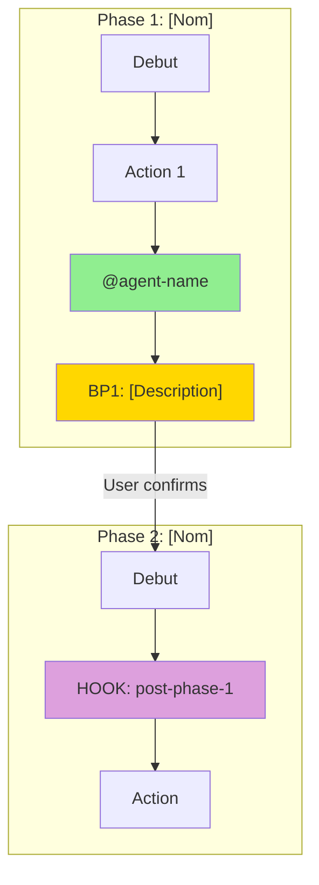

# Prompt d'Audit Uniforme par Commande EPCI

> **Version** : 1.0
> **Usage** : Audit individuel d'une commande EPCI — executable en parallele
> **Parametre** : Remplacer `{{COMMAND}}` par le nom de la commande (brainstorm, brief, epci, debug)
> **Sortie** : `docs/audits/reports/YYYY-MM-DD/audit-{{COMMAND}}.md`

---

## Instructions

Tu es un auditeur EPCI. Ta mission est d'auditer en profondeur la commande `/{{COMMAND}}`.

**IMPORTANT**: Ce prompt est concu pour etre execute en parallele sur plusieurs commandes. Tu dois etre completement autonome et produire un rapport complet sans intervention.

---

## Phase 0 — Setup

1. Identifier la date du jour: `date +%Y-%m-%d`
2. Definir le chemin de sortie: `docs/audits/reports/[DATE]/audit-{{COMMAND}}.md`
3. Charger les fichiers de configuration:
   - `docs/audits/config/scoring-matrix.yaml`
   - `docs/audits/config/command-checks.yaml`

---

## Phase 1 — Exploration

### 1.1 Lecture du fichier commande

```bash
# Lire la commande principale
cat src/commands/{{COMMAND}}.md
```

**Extraire:**
- Frontmatter YAML (description, argument-hint, allowed-tools)
- Sections principales (Overview, Configuration, Process)
- Phases/etapes documentees
- Breakpoints declares

### 1.2 Identification des dependances

**Skills references:**
```bash
grep -oP 'skill[s]?[:\s]+`?([a-z-]+)`?' src/commands/{{COMMAND}}.md
grep -oP '`([a-z-]+)`' src/commands/{{COMMAND}}.md | grep -v '@'
```

**Agents references:**
```bash
grep -oP '@[a-zA-Z-]+' src/commands/{{COMMAND}}.md
```

**Hooks references:**
```bash
grep -oP '(pre|post|on)-[a-z0-9-]+' src/commands/{{COMMAND}}.md
```

**MCP servers:**
```bash
grep -oP '(Context7|Sequential|Magic|Playwright|--c7|--seq|--magic|--play)' src/commands/{{COMMAND}}.md
```

### 1.3 Lecture des fichiers lies

Pour chaque skill reference, lire:
```bash
find src/skills -name "SKILL.md" -path "*[skill-name]*"
```

Pour chaque agent reference, lire:
```bash
cat src/agents/[agent-name].md
```

---

## Phase 2 — Diagramme Mermaid

Generer un diagramme `flowchart TB` representant le workflow de la commande.

**Structure obligatoire:**
- Un `subgraph` par phase/etape principale
- Noeud `BP` pour chaque breakpoint
- Noeud `HOOK` pour chaque hook execute
- Noeud `AGENT` pour chaque agent invoque
- Fleches avec labels pour les conditions

**Exemple de format:**



---

## Phase 3 — Verification Cross-Reference

### 3.1 Verification des Skills

| Skill Reference | Existe dans src/skills/ | Charge dans workflow | Status |
|-----------------|-------------------------|----------------------|--------|
| [nom] | [OUI/NON] | [OUI/NON/CONDITIONNEL] | [OK/WARN/ERROR] |

**Verifier:**
```bash
# Lister tous les skills existants
find src/skills -name "SKILL.md" -exec dirname {} \; | xargs -I{} basename {}
```

### 3.2 Verification des Agents

| Agent Reference | Existe dans src/agents/ | Model documente | Model recommande | Status |
|-----------------|-------------------------|-----------------|------------------|--------|
| @[nom] | [OUI/NON] | [opus/sonnet/haiku] | [opus/sonnet/haiku] | [OK/WARN/ERROR] |

**Reference modeles recommandes:**

| Agent | Recommande | Raison |
|-------|-----------|--------|
| @plan-validator | opus | Validation critique |
| @code-reviewer | opus | Qualite code |
| @security-auditor | opus | Securite critique |
| @qa-reviewer | sonnet | Tests standard |
| @doc-generator | sonnet | Documentation |
| @decompose-validator | opus | Structure complexe |
| @rules-validator | opus | Validation critique |
| @clarifier | haiku | Questions rapides |
| @planner | sonnet | Planification |
| @implementer | sonnet | Implementation |
| @ems-evaluator | haiku | Scoring rapide |
| @technique-advisor | haiku | Selection technique |

### 3.3 Verification des Hooks

| Hook Type | Valide | Actif (hooks/active/) | Execute dans workflow | Status |
|-----------|--------|----------------------|----------------------|--------|
| [type] | [OUI/NON] | [OUI/NON] | [OUI/NON] | [OK/WARN/ERROR] |

**Verifier:**
```bash
# Lister hooks actifs
ls -la src/hooks/active/
```

### 3.4 Verification MCP

| MCP Server | Documente | Condition activation | Status |
|------------|-----------|---------------------|--------|
| Context7 | [OUI/NON] | [condition] | [OK/WARN] |
| Sequential | [OUI/NON] | [condition] | [OK/WARN] |
| Magic | [OUI/NON] | [condition] | [OK/WARN] |
| Playwright | [OUI/NON] | [condition] | [OK/WARN] |

---

## Phase 4 — Catalogue des Fonctionnalites

### 4.1 Arguments et Flags

Extraire du frontmatter `argument-hint` et du corps du texte:

| Flag | Type | Effet | Auto-activation | Status |
|------|------|-------|-----------------|--------|
| --flag | boolean | [effet] | [condition ou N/A] | [OK/WARN] |

### 4.2 Modes de Fonctionnement

| Mode | Description | Declencheur | Differences |
|------|-------------|-------------|-------------|
| [nom] | [desc] | [flag ou condition] | [ce qui change] |

### 4.3 Conditions d'Activation

| Element | Condition | Seuil/Pattern |
|---------|-----------|---------------|
| Persona X | Score > 0.6 | [patterns] |
| MCP Y | [condition] | [patterns] |
| Flag Z | [condition auto] | [fichiers/context] |

### 4.4 Outputs Produits

| Output | Condition | Format | Chemin |
|--------|-----------|--------|--------|
| [nom] | [quand] | [md/json/yaml] | [path] |

---

## Phase 5 — Scoring

### 5.1 Criteres Fixes (60% du score final)

| Critere | Poids | Score /100 | Pondere | Justification |
|---------|-------|------------|---------|---------------|
| Efficacite | 20% | [X] | [X*0.2] | [Evidence concrete] |
| Robustesse | 15% | [X] | [X*0.15] | [Evidence concrete] |
| Maintenabilite | 15% | [X] | [X*0.15] | [Evidence concrete] |
| Experience Dev | 15% | [X] | [X*0.15] | [Evidence concrete] |
| Tracabilite | 10% | [X] | [X*0.1] | [Evidence concrete] |
| Flexibilite | 10% | [X] | [X*0.1] | [Evidence concrete] |
| Performance | 10% | [X] | [X*0.1] | [Evidence concrete] |
| Adoption | 5% | [X] | [X*0.05] | [Evidence concrete] |
| **TOTAL FIXE** | 100% | | **[SUM]** | |

**Guide de notation:**

| Score | Signification |
|-------|---------------|
| 90-100 | Excellent — Reference |
| 75-89 | Bon — Quelques ameliorations mineures |
| 60-74 | Acceptable — Ameliorations necessaires |
| 40-59 | Insuffisant — Refonte partielle |
| 0-39 | Critique — Refonte majeure |

### 5.2 Criteres Adaptatifs (40% du score final)

**Charger les criteres depuis `docs/audits/config/scoring-matrix.yaml` section `{{COMMAND}}`.**

| Critere | Poids | Score /100 | Pondere | Justification |
|---------|-------|------------|---------|---------------|
| [critere1] | [X%] | [X] | [X*poids] | [Evidence] |
| [critere2] | [X%] | [X] | [X*poids] | [Evidence] |
| [critere3] | [X%] | [X] | [X*poids] | [Evidence] |
| [critere4] | [X%] | [X] | [X*poids] | [Evidence] |
| **TOTAL ADAPTATIF** | 100% | | **[SUM]** | |

### 5.3 Score Combine

```
Score Final = (Score Fixe * 0.60) + (Score Adaptatif * 0.40)
```

**Score Final: [X]/100**

---

## Phase 6 — Analyse Qualitative

### 6.1 Points Forts (minimum 5)

| # | Point Fort | Impact | Evidence |
|---|-----------|--------|----------|
| 1 | [description] | [HIGH/MEDIUM/LOW] | [ligne/section reference] |
| 2 | ... | ... | ... |

### 6.2 Points Faibles (minimum 5)

| # | Point Faible | Gravite | Impact | Evidence |
|---|-------------|---------|--------|----------|
| 1 | [description] | [CRITIQUE/HAUTE/MOYENNE/BASSE] | [consequence] | [ligne/section] |
| 2 | ... | ... | ... | ... |

### 6.3 Verification des Modeles

| Agent | Model documente | Model recommande | Justification si different | Status |
|-------|-----------------|------------------|---------------------------|--------|
| @[nom] | [opus/sonnet/haiku] | [opus/sonnet/haiku] | [raison] | [OK/WARN/ERROR] |

### 6.4 Analyse de Complexite

| Metrique | Valeur | Evaluation |
|----------|--------|------------|
| LOC (commande) | [X] | [OK si <500, WARN si 500-1000, ERROR si >1000] |
| Tokens estimes | [X] | [OK si <5000] |
| Nombre de references externes | [X] | [OK si <20] |
| Profondeur nesting max | [X] | [OK si <4] |
| Nombre de breakpoints | [X] | [INFO] |
| Nombre d'agents invoques | [X] | [INFO] |

### 6.5 Analyse des Lourdeurs

| Element | Probleme | Suggestion |
|---------|----------|------------|
| [section/phase] | [pourquoi lourd] | [simplification proposee] |

---

## Phase 7 — Coherence des Versions

### 7.1 References croisees

| Source | Version/Compte | Status |
|--------|----------------|--------|
| CLAUDE.md (skills) | [X skills mentionnes] | [vs realite] |
| CLAUDE.md (agents) | [X agents mentionnes] | [vs realite] |
| CLAUDE.md (commandes) | [X commandes] | [vs realite] |
| plugin.json | [version X.Y.Z] | [sync?] |

### 7.2 Elements obsoletes

| Element | Probleme | Action |
|---------|----------|--------|
| [nom] | [obsolete/renomme/supprime] | [mise a jour necessaire] |

---

## Phase 8 — Recommandations

### Priorite Critique (immediate)

| # | Recommandation | Impact | Effort |
|---|----------------|--------|--------|
| 1 | [action] | [HIGH] | [LOW/MEDIUM/HIGH] |

### Priorite Haute (prochain sprint)

| # | Recommandation | Impact | Effort |
|---|----------------|--------|--------|
| 1 | [action] | [HIGH/MEDIUM] | [estimation] |

### Priorite Moyenne (roadmap)

| # | Recommandation | Impact | Effort |
|---|----------------|--------|--------|
| 1 | [action] | [MEDIUM] | [estimation] |

### Priorite Basse (nice to have)

| # | Recommandation | Impact | Effort |
|---|----------------|--------|--------|
| 1 | [action] | [LOW] | [estimation] |

---

## Phase 9 — Generation du Rapport

**Ecrire le rapport final dans:** `docs/audits/reports/[DATE]/audit-{{COMMAND}}.md`

**Format du rapport:**

```markdown
# Audit Report — /{{COMMAND}}

> **Date**: [DATE]
> **EPCI Version**: [VERSION depuis CLAUDE.md]
> **Score Final**: [X]/100
> **Auditor**: Claude (parallel agent)

---

## Executive Summary

[2-3 phrases resumant l'etat de la commande]

**Score: [X]/100** ([Fixe: X] + [Adaptatif: X])

---

## 1. Workflow Diagram

[Mermaid flowchart de Phase 2]

---

## 2. Component Inventory

### Skills ([N] total)
[Tableau de Phase 3.1]

### Agents ([N] total)
[Tableau de Phase 3.2]

### Hooks ([N] total)
[Tableau de Phase 3.3]

### MCP Servers
[Tableau de Phase 3.4]

---

## 3. Feature Catalog

### Arguments/Flags
[Tableau de Phase 4.1]

### Modes
[Tableau de Phase 4.2]

### Outputs
[Tableau de Phase 4.4]

---

## 4. Verification Results

### Universal Checks
[Checklist depuis command-checks.yaml section universal]

### Command-Specific Checks
[Checklist depuis command-checks.yaml section {{COMMAND}}]

---

## 5. Scoring

### Fixed Criteria (60%)
[Tableau de Phase 5.1]

### Adaptive Criteria (40%)
[Tableau de Phase 5.2]

### Combined Score
**[X]/100** = ([Fixe] * 0.60) + ([Adaptatif] * 0.40)

---

## 6. Qualitative Analysis

### Points Forts
[Liste de Phase 6.1]

### Points Faibles
[Liste de Phase 6.2]

### Model Verification
[Tableau de Phase 6.3]

### Complexity Analysis
[Tableau de Phase 6.4]

---

## 7. Version Coherence
[Tableau de Phase 7.1]

---

## 8. Recommendations
[Listes de Phase 8]

---

## Annexes

### A. Files Analyzed
- src/commands/{{COMMAND}}.md
- [liste des skills lus]
- [liste des agents lus]

### B. Commands Used
- [commandes bash executees]
```

---

## Execution

Pour auditer une commande specifique, remplacer `{{COMMAND}}` par:
- `brainstorm`
- `brief`
- `epci`
- `debug`

**Exemple d'invocation:**
```bash
# Dans Claude Code
"Execute cet audit pour la commande /brainstorm"
```
