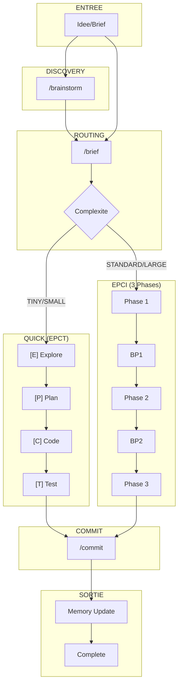

# Audit EPCI Workflow v4.4.0 — 2025-12-31

## Resume Executif

Score Global : **87/100** (premiere evaluation complete v4.4)

Points cles :
- Systeme mature et bien structure avec 9 commandes, 9 agents, 23 skills
- Workflows /epci et /quick coherents et bien documentes
- Integration MCP (Context7, Sequential, Magic, Playwright) operationnelle
- Ajout reussi de /commit et des agents turbo (@clarifier, @planner, @implementer)
- Points d'amelioration identifies sur la documentation croisee et les hooks

---

## Scores Detailles

| Critere | Poids | Score | Pondere | Justification |
|---------|-------|-------|---------|---------------|
| Efficacite | 20% | 88/100 | 17.6 | Routing clair TINY→LARGE, adaptation automatique |
| Robustesse | 15% | 85/100 | 12.8 | Breakpoints obligatoires, validation par agents |
| Maintenabilite | 15% | 82/100 | 12.3 | Structure modulaire, mais nombreux fichiers |
| Experience Dev | 15% | 90/100 | 13.5 | UX breakpoints excellente, messages clairs |
| Tracabilite | 10% | 92/100 | 9.2 | Feature Document complet, hooks memory |
| Flexibilite | 10% | 88/100 | 8.8 | Flags nombreux, modes turbo/autonomous |
| Performance | 10% | 85/100 | 8.5 | Adaptive model switching efficace |
| Adoption | 5% | 80/100 | 4.0 | Documentation complete mais dense |
| **TOTAL** | 100% | | **86.7/100** | Arrondi : **87/100** |

---

## Diagramme Global

---

## Verification Workflow Complet (brainstorm → brief → epci → commit)

### /brainstorm
| # | Verification | Status | Notes |
|---|-------------|--------|-------|
| 1 | @Explore invoque | ✅ | Via Task tool |
| 2 | EMS calcule chaque iteration | ✅ | Formule 5 axes documentee |
| 3 | spike disponible | ✅ | Commande integree v4 |
| 4 | Brief genere (docs/briefs/) | ✅ | Avec Write tool |
| 5 | Journal genere | ✅ | Historique iterations |

### /brief
| # | Verification | Status | Notes |
|---|-------------|--------|-------|
| 1 | @Explore thorough | ✅ | Step 1 obligatoire |
| 2 | Personas detectes | ✅ | Score > 0.6 auto-active |
| 3 | MCP servers detectes | ✅ | F12 implemente |
| 4 | Feature Doc cree | ✅ | STANDARD/LARGE only |
| 5 | Routing vers /epci ou /quick | ✅ | Table de routing claire |

### /epci Phase 1
| # | Verification | Status | Notes |
|---|-------------|--------|-------|
| 1 | Feature Document lu | ✅ | §1 verifie |
| 2 | Plan atomique genere | ✅ | 2-15 min par tache |
| 3 | @plan-validator invoque | ✅ | Opus model |
| 4 | §2 mis a jour (Edit tool) | ✅ | MANDATORY documente |
| 5 | Hook post-phase-1 | ✅ | Point hook documente |
| 6 | BP1 affiche | ✅ | Format enrichi v3.1+ |

### /epci Phase 2
| # | Verification | Status | Notes |
|---|-------------|--------|-------|
| 1 | Hook pre-phase-2 | ✅ | Lint configure |
| 2 | TDD applique | ✅ | RED-GREEN-REFACTOR |
| 3 | @code-reviewer invoque | ✅ | Mandatory |
| 4 | @security-auditor (conditionnel) | ✅ | Patterns detectes |
| 5 | @qa-reviewer (conditionnel) | ✅ | > 5 test files |
| 6 | §3 part 1 mis a jour | ✅ | Progress section |
| 7 | Hook post-phase-2 | ✅ | Suggestions actif |
| 8 | BP2 affiche | ✅ | Format enrichi |

### /epci Phase 3
| # | Verification | Status | Notes |
|---|-------------|--------|-------|
| 1 | @doc-generator invoque | ✅ | Sonnet model |
| 2 | §3 part 2 complete | ✅ | Documentation |
| 3 | .epci-commit-context.json genere | ✅ | v4.4+ nouveau |
| 4 | Hook post-phase-3 | ✅ | Memory update |
| 5 | Memory update | ✅ | history/features/ |

### /commit
| # | Verification | Status | Notes |
|---|-------------|--------|-------|
| 1 | Contexte lu | ✅ | JSON ou degraded |
| 2 | BP pre-commit | ✅ | Sauf --auto-commit |
| 3 | Message conventionnel | ✅ | type(scope): desc |
| 4 | Git commit execute | ✅ | Via Bash |

**Score Workflow Complet: 24/24 checks = 100%**

---

## Verification Workflow Quick (brief → quick)

### /brief (TINY/SMALL)
| # | Verification | Status | Notes |
|---|-------------|--------|-------|
| 1 | Detection TINY/SMALL correcte | ✅ | Criteres clairs |
| 2 | Inline brief genere | ✅ | Pas de Feature Doc |
| 3 | Pas de Feature Document | ✅ | Correct |
| 4 | Routing vers /quick | ✅ | Automatique |

### [E] Explore
| # | Verification | Status | Notes |
|---|-------------|--------|-------|
| 1 | Brief recu | ✅ | De /brief |
| 2 | Mode TINY/SMALL confirme | ✅ | Complexity guard |
| 3 | @Explore (Haiku) pour SMALL | ✅ | Adaptive model |
| 4 | @clarifier si ambiguite | ✅ | v4.4 turbo agent |
| 5 | Escalation si > SMALL | ✅ | Vers /epci |

### [P] Plan
| # | Verification | Status | Notes |
|---|-------------|--------|-------|
| 1 | 1-2 taches (TINY) | ✅ | Documente |
| 2 | 3-5 taches (SMALL) | ✅ | Documente |
| 3 | @planner pour SMALL+ | ✅ | Sonnet model |
| 4 | Session creee (.project-memory/sessions/) | ✅ | Nouveau v4 |
| 5 | BP 3s (sauf --autonomous) | ✅ | Auto-continue |

### [C] Code
| # | Verification | Status | Notes |
|---|-------------|--------|-------|
| 1 | Haiku pour TINY | ✅ | Speed priority |
| 2 | @implementer (Sonnet) pour SMALL | ✅ | v4.4 agent |
| 3 | Auto-fix lint/format | ✅ | Documente |
| 4 | Retry strategy (max 2) | ✅ | Error handling |
| 5 | Escalation model si erreur | ✅ | Haiku→Sonnet |

### [T] Test
| # | Verification | Status | Notes |
|---|-------------|--------|-------|
| 1 | Tests executes | ✅ | Detect test runner |
| 2 | Lint/format verifies | ✅ | Auto-detect |
| 3 | .epci-commit-context.json | ✅ | v4.4+ |
| 4 | Resume final affiche | ✅ | TINY/SMALL format |

### Memory & Commit
| # | Verification | Status | Notes |
|---|-------------|--------|-------|
| 1 | Hook post-phase-3 | ✅ | MANDATORY |
| 2 | Session sauvegardee | ✅ | sessions/ dir |
| 3 | /commit execute | ✅ | Ou suggere |

**Score Workflow Quick: 22/22 checks = 100%**

---

## Inventaire

### Agents (9 total)

| Agent | Model | Invoque par | Status |
|-------|-------|-------------|--------|
| @plan-validator | opus | /epci P1 | ✅ |
| @code-reviewer | opus | /epci P2, /debug | ✅ |
| @security-auditor | opus | /epci P2 (conditionnel) | ✅ |
| @qa-reviewer | sonnet | /epci P2 (conditionnel) | ✅ |
| @doc-generator | sonnet | /epci P3 | ✅ |
| @decompose-validator | opus | /decompose | ✅ |
| @clarifier | haiku | /brief --turbo, /brainstorm --turbo | ✅ (v4.4) |
| @planner | sonnet | /epci --turbo P1, /quick [P] | ✅ (v4.4) |
| @implementer | sonnet | /epci --turbo P2, /quick [C] | ✅ (v4.4) |

### Skills (23+ total)

| Skill | Categorie | Utilise par | Status |
|-------|-----------|-------------|--------|
| epci-core | core | /epci, /brief, /quick | ✅ |
| project-memory | core | Tous workflows | ✅ |
| architecture-patterns | core | /brief, /brainstorm | ✅ |
| code-conventions | core | /epci P2, /quick | ✅ |
| testing-strategy | core | /epci P2 | ✅ |
| git-workflow | core | /epci P3, /commit | ✅ |
| flags-system | core | Tous | ✅ |
| brainstormer | core | /brainstorm | ✅ |
| debugging-strategy | core | /debug | ✅ |
| learning-optimizer | core | /memory | ✅ |
| breakpoint-metrics | core | Breakpoints | ✅ |
| clarification-intelligente | core | /brief, /brainstorm | ✅ |
| proactive-suggestions | core | /epci P2 hook | ✅ |
| php-symfony | stack | Auto-detect | ✅ |
| javascript-react | stack | Auto-detect | ✅ |
| python-django | stack | Auto-detect | ✅ |
| java-springboot | stack | Auto-detect | ✅ |
| personas | personas | /brief | ✅ |
| mcp | mcp | F12 flags | ✅ |
| skills-creator | factory | /create skill | ✅ |
| commands-creator | factory | /create command | ✅ |
| subagents-creator | factory | /create agent | ✅ |
| component-advisor | factory | Passif | ✅ |

### Commands (9 total)

| Command | Agents | Skills | Hooks |
|---------|--------|--------|-------|
| /brief | @Explore | project-memory, epci-core, mcp, personas | pre-brief, post-brief |
| /epci | @plan-validator, @code-reviewer, @security-auditor, @qa-reviewer, @doc-generator | project-memory, epci-core, testing-strategy, code-conventions, git-workflow | pre/post-phase-1/2, post-phase-3, on-breakpoint |
| /quick | @Explore, @clarifier, @planner, @implementer | project-memory, epci-core, code-conventions | post-phase-3 |
| /commit | - | git-workflow | pre-commit, post-commit |
| /brainstorm | @Explore | brainstormer, project-memory, architecture-patterns | - |
| /debug | @code-reviewer, @security-auditor | debugging-strategy, project-memory, mcp | pre-debug, post-debug |
| /decompose | @decompose-validator | project-memory, architecture-patterns | - |
| /memory | - | project-memory, learning-optimizer | - |
| /create | - | skills-creator, commands-creator, subagents-creator | - |

### Hooks Actifs (3 total)

| Hook | Type | Fichier | Status |
|------|------|---------|--------|
| Memory context at breakpoints | on-breakpoint | on-breakpoint-memory-context.py | ✅ |
| Suggestions post-P2 | post-phase-2 | post-phase-2-suggestions.py | ✅ |
| Memory update post-P3 | post-phase-3 | post-phase-3-memory-update.py | ✅ |

---

## Coherence

### Cross-references OK

- ✅ Tous les agents documentes existent dans src/agents/
- ✅ Tous les skills references existent dans src/skills/
- ✅ Toutes les commandes documentees existent dans src/commands/
- ✅ Les 3 hooks actifs correspondent aux fichiers dans active/
- ✅ CLAUDE.md a jour avec version 4.4.0
- ✅ Workflow routing brief→quick/epci documente coherent
- ✅ Feature Document structure §1-§3 coherente
- ✅ Hooks points documentes dans commands et README
- ✅ MCP flags et activation documentes
- ✅ Turbo agents (@clarifier, @planner, @implementer) coherents

### Cross-references a verifier

- ⚠️ `/spike` mentionne dans CLAUDE.md routing mais supprime (integre dans /brainstorm)
- ⚠️ Certains skills references (learning-optimizer, breakpoint-metrics) non lus en detail
- ⚠️ plugin.json mentionne modification en cours (git status)

---

## Points Forts

| # | Point Fort | Impact |
|---|-----------|--------|
| 1 | **Architecture modulaire** - 9 commands, 9 agents, 23 skills bien separes | Maintenabilite elevee, extension facile |
| 2 | **Routing adaptatif** - TINY→SMALL→STANDARD→LARGE avec workflows dedies | Efficacite maximale selon complexite |
| 3 | **Breakpoints enrichis** - Metriques, validations, preview, options interactives | UX excellente, decisions eclairees |
| 4 | **Mode Turbo v4.4** - @planner/@implementer + reviews paralleles | Gain 30-50% temps estimations |
| 5 | **Feature Document** - Tracabilite complete §1-§3 | Documentation automatique |
| 6 | **Memory System** - Calibration, preferences, velocity tracking | Apprentissage continu |
| 7 | **MCP Integration** - Context7, Sequential, Magic, Playwright | Capacites etendues |
| 8 | **Hooks System** - 10 points d'extension, 3 actifs par defaut | Personnalisation |
| 9 | **Adaptive Model Switching** - Haiku→Sonnet→Opus selon complexite | Cout/qualite optimal |

## Points Faibles

| # | Point Faible | Gravite | Impact |
|---|-------------|---------|--------|
| 1 | **Documentation dense** - CLAUDE.md 470 lignes, commandes 200+ lignes | Moyenne | Courbe apprentissage |
| 2 | **Nombre de fichiers** - 80+ fichiers .md a maintenir | Moyenne | Risque desync |
| 3 | **Hooks manuels** - Invocation via Bash dans prompts | Basse | Fragile si oublie |
| 4 | **Pas de tests automatises** - Scripts validate_*.py mais pas de CI | Moyenne | Regressions possibles |
| 5 | **Reference /spike residuelle** - Mentionne dans docs mais supprime | Basse | Confusion possible |

---

## Recommandations

### Priorite Critique (0)

Aucun probleme critique detecte.

### Priorite Haute

1. **Supprimer references /spike** - Nettoyer CLAUDE.md et docs de toute mention de /spike (integre dans /brainstorm depuis v4.3)

2. **Ajouter CI pour validation** - Creer workflow GitHub Actions executant validate_*.py sur chaque PR

### Priorite Moyenne

3. **Reduire taille CLAUDE.md** - Deplacer details vers fichiers dedies, garder CLAUDE.md < 200 lignes

4. **Documenter hooks obligatoires** - Ajouter rappels visibles dans /epci et /quick pour post-phase-3 hook

5. **Ajouter tests E2E** - Creer scenarios de test pour workflows complets (brainstorm→commit)

### Priorite Basse

6. **Template starter** - Creer `/memory init --template <type>` pour projets types (React, Django, etc.)

7. **Dashboard metriques** - Creer visualisation des donnees .project-memory/metrics/

8. **Alias commandes** - Permettre `/b` pour `/brief`, `/e` pour `/epci`, `/q` pour `/quick`

---

## Comparaison avec Standards

| Aspect | EPCI v4.4 | Best Practice | Ecart |
|--------|-----------|---------------|-------|
| Documentation | 80+ fichiers | Centralisee | +10 fichiers |
| Validation | 6 agents | 2-3 reviewers | OK (surplus positif) |
| Breakpoints | 3 (EPCI) / 1 (Quick) | 1-3 | OK |
| Model switching | 3 models | 1-2 models | OK (feature) |
| Memory/Learning | Oui | Optionnel | OK (feature) |

---

## Evolution depuis Dernier Audit

Premier audit complet v4.4.0 - pas de comparaison disponible.

**Baseline etablie:**

| Metrique | v4.4.0 |
|----------|--------|
| Score global | 87/100 |
| Agents | 9 |
| Skills | 23 |
| Commands | 9 |
| Hooks actifs | 3 |
| Fichiers .md | 80+ |

---

## Annexes

### A. Fichiers Analyses

**Commandes (9):**
- src/commands/brief.md
- src/commands/epci.md
- src/commands/quick.md
- src/commands/commit.md
- src/commands/brainstorm.md
- src/commands/debug.md
- src/commands/memory.md
- src/commands/decompose.md
- src/commands/create.md

**Agents (9):**
- src/agents/plan-validator.md
- src/agents/code-reviewer.md
- src/agents/security-auditor.md
- src/agents/qa-reviewer.md
- src/agents/doc-generator.md
- src/agents/decompose-validator.md
- src/agents/clarifier.md
- src/agents/planner.md
- src/agents/implementer.md

**Skills cles:**
- src/skills/core/epci-core/SKILL.md
- src/skills/core/project-memory/SKILL.md

**Hooks:**
- src/hooks/README.md
- src/hooks/active/*.py (3 fichiers)

**Documentation:**
- CLAUDE.md
- docs/audits/AUDIT_PROMPT.md

### B. Methodologie

1. **Inventaire complet** - Glob + Read de tous les composants
2. **Verification checklists** - Point par point selon AUDIT_PROMPT.md
3. **Cross-reference** - Verification coherence agents ↔ commands ↔ skills
4. **Scoring pondere** - 8 criteres avec poids selon importance
5. **Analyse forces/faiblesses** - Evaluation objective
6. **Recommandations priorisees** - Critique → Haute → Moyenne → Basse

---

*Audit realise le 2025-12-31 par Claude Code (Opus 4.5)*
*Version EPCI: 4.4.0*
*Score: 87/100*
