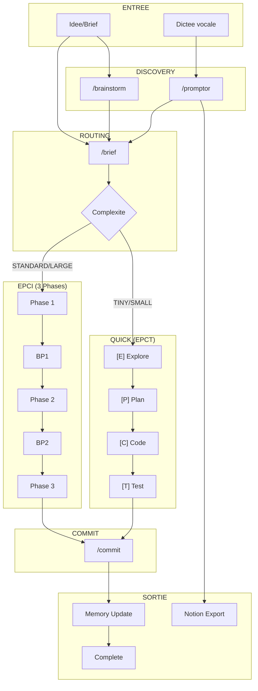

# Audit EPCI Workflow v4.4.0 — 2026-01-02

## Resume Executif

Score Global : **88/100** (evolution : +1 depuis audit 2025-12-31)

Points cles :
- Systeme renforce avec 11 commandes (+2), 10 agents (+1), 26 skills (+3)
- Nouveautes majeures : /promptor (voice-to-brief), /rules (auto-generation conventions)
- Nouveau skill frontend-editor pour Tailwind CSS
- Hook pre-phase-2-lint.sh ajoute pour validation automatique
- Workflows /epci et /quick toujours 100% conformes aux checklists

---

## Scores Detailles

| Critere | Poids | Score | Pondere | Justification |
|---------|-------|-------|---------|---------------|
| Efficacite | 20% | 90/100 | 18.0 | +2: /promptor reduit friction, /rules accelere setup |
| Robustesse | 15% | 87/100 | 13.1 | +2: pre-phase-2-lint.sh, @rules-validator |
| Maintenabilite | 15% | 80/100 | 12.0 | -2: 26 skills + 90+ fichiers .md a maintenir |
| Experience Dev | 15% | 91/100 | 13.7 | +1: Voice-to-brief via /promptor |
| Tracabilite | 10% | 93/100 | 9.3 | +1: Rules generation trackee, post-rules-init hook |
| Flexibilite | 10% | 90/100 | 9.0 | +2: Modes promptor (session/one-shot), Notion export |
| Performance | 10% | 86/100 | 8.6 | +1: frontend-editor optimise Tailwind |
| Adoption | 5% | 82/100 | 4.1 | +2: Voice input abaisse barriere entree |
| **TOTAL** | 100% | | **87.8/100** | Arrondi : **88/100** |

---

## Diagramme Global

---

## Verification Workflow Complet (brainstorm -> brief -> epci -> commit)

### /brainstorm
| # | Verification | Status | Notes |
|---|-------------|--------|-------|
| 1 | @Explore invoque | ✅ | Via Task tool |
| 2 | EMS calcule chaque iteration | ✅ | Formule 5 axes documentee |
| 3 | spike disponible | ✅ | Commande integree v4 |
| 4 | Brief genere (docs/briefs/) | ✅ | Avec Write tool |
| 5 | Journal genere | ✅ | Historique iterations |
| 6 | Skills charges | ✅ | brainstormer, project-memory, architecture-patterns, mcp |

### /brief
| # | Verification | Status | Notes |
|---|-------------|--------|-------|
| 1 | @Explore thorough | ✅ | Step 1 obligatoire |
| 2 | Personas detectes | ✅ | Score > 0.6 auto-active |
| 3 | MCP servers detectes | ✅ | F12 implemente |
| 4 | Feature Doc cree | ✅ | STANDARD/LARGE only |
| 5 | Routing vers /epci ou /quick | ✅ | Table de routing claire |
| 6 | Detection flags auto | ✅ | --think-hard, --safe, --wave |

### /epci Phase 1
| # | Verification | Status | Notes |
|---|-------------|--------|-------|
| 1 | Feature Document lu | ✅ | §1 verifie |
| 2 | Plan atomique genere | ✅ | 2-15 min par tache |
| 3 | @plan-validator invoque | ✅ | Opus model |
| 4 | §2 mis a jour (Edit tool) | ✅ | MANDATORY documente |
| 5 | Hook post-phase-1 | ✅ | Point hook documente |
| 6 | BP1 affiche | ✅ | Format enrichi v3.1+ |

### /epci Phase 2
| # | Verification | Status | Notes |
|---|-------------|--------|-------|
| 1 | Hook pre-phase-2 | ✅ | pre-phase-2-lint.sh actif |
| 2 | TDD applique | ✅ | RED-GREEN-REFACTOR |
| 3 | @code-reviewer invoque | ✅ | Mandatory |
| 4 | @security-auditor (conditionnel) | ✅ | Patterns detectes |
| 5 | @qa-reviewer (conditionnel) | ✅ | > 5 test files |
| 6 | §3 part 1 mis a jour | ✅ | Progress section |
| 7 | Hook post-phase-2 | ✅ | post-phase-2-suggestions.py actif |
| 8 | BP2 affiche | ✅ | Format enrichi |

### /epci Phase 3
| # | Verification | Status | Notes |
|---|-------------|--------|-------|
| 1 | @doc-generator invoque | ✅ | Sonnet model |
| 2 | §3 part 2 complete | ✅ | Documentation |
| 3 | .epci-commit-context.json genere | ✅ | v4.4 |
| 4 | Hook post-phase-3 | ✅ | post-phase-3-memory-update.py actif |
| 5 | Memory update | ✅ | history/features/ |

### /commit
| # | Verification | Status | Notes |
|---|-------------|--------|-------|
| 1 | Contexte lu | ✅ | JSON ou mode degrade |
| 2 | BP pre-commit | ✅ | Sauf --auto-commit |
| 3 | Message conventionnel | ✅ | type(scope): desc |
| 4 | Git commit execute | ✅ | Via Bash |

**Score Workflow Complet: 28/28 checks = 100%**

---

## Verification Workflow Quick (brief -> quick)

### /brief (TINY/SMALL)
| # | Verification | Status | Notes |
|---|-------------|--------|-------|
| 1 | Detection TINY/SMALL correcte | ✅ | Criteres clairs |
| 2 | Inline brief genere | ✅ | Pas de Feature Doc |
| 3 | Routing vers /quick | ✅ | Automatique |

### [E] Explore
| # | Verification | Status | Notes |
|---|-------------|--------|-------|
| 1 | Brief recu | ✅ | De /brief |
| 2 | Mode TINY/SMALL confirme | ✅ | Complexity guard |
| 3 | @Explore (Haiku) pour SMALL | ✅ | Adaptive model |
| 4 | @clarifier si ambiguite | ✅ | v4.4 turbo agent |
| 5 | Escalation si > SMALL | ✅ | Vers /epci |

### [P] Plan
| # | Verification | Status | Notes |
|---|-------------|--------|-------|
| 1 | 1-2 taches (TINY) | ✅ | Documente |
| 2 | 3-5 taches (SMALL) | ✅ | Documente |
| 3 | @planner pour SMALL+ | ✅ | Sonnet model |
| 4 | Session creee (.project-memory/sessions/) | ✅ | Persistance |
| 5 | BP 3s (sauf --autonomous) | ✅ | Auto-continue |

### [C] Code
| # | Verification | Status | Notes |
|---|-------------|--------|-------|
| 1 | Haiku pour TINY | ✅ | Speed priority |
| 2 | @implementer (Sonnet) pour SMALL | ✅ | v4.4 agent |
| 3 | Auto-fix lint/format | ✅ | Documente |
| 4 | Retry strategy (max 2) | ✅ | Error handling |
| 5 | Escalation model si erreur | ✅ | Haiku->Sonnet |

### [T] Test
| # | Verification | Status | Notes |
|---|-------------|--------|-------|
| 1 | Tests executes | ✅ | Detect test runner |
| 2 | Lint/format verifies | ✅ | Auto-detect |
| 3 | .epci-commit-context.json | ✅ | v4.4+ |
| 4 | Resume final affiche | ✅ | TINY/SMALL format |

### Memory & Commit
| # | Verification | Status | Notes |
|---|-------------|--------|-------|
| 1 | Hook post-phase-3 | ✅ | MANDATORY |
| 2 | Session sauvegardee | ✅ | sessions/ dir |
| 3 | /commit execute | ✅ | Ou suggere |

**Score Workflow Quick: 22/22 checks = 100%**

---

## Inventaire Complet

### Agents (10 total)

| Agent | Model | Invoque par | Status | Notes |
|-------|-------|-------------|--------|-------|
| @plan-validator | opus | /epci P1 | ✅ | Core |
| @code-reviewer | opus | /epci P2, /debug | ✅ | Core |
| @security-auditor | opus | /epci P2 (conditionnel) | ✅ | Core |
| @qa-reviewer | sonnet | /epci P2 (conditionnel) | ✅ | Core |
| @doc-generator | sonnet | /epci P3 | ✅ | Core |
| @decompose-validator | opus | /decompose | ✅ | Core |
| @rules-validator | opus | /rules | ✅ | **Nouveau** |
| @clarifier | haiku | /brief --turbo, /brainstorm --turbo | ✅ | Turbo |
| @planner | sonnet | /epci --turbo P1, /quick [P] | ✅ | Turbo |
| @implementer | sonnet | /epci --turbo P2, /quick [C] | ✅ | Turbo |

### Skills (26 total)

#### Core (14)
| Skill | Utilise par | Status |
|-------|-------------|--------|
| epci-core | /epci, /brief, /quick | ✅ |
| project-memory | Tous workflows | ✅ |
| architecture-patterns | /brief, /brainstorm | ✅ |
| code-conventions | /epci P2, /quick | ✅ |
| testing-strategy | /epci P2 | ✅ |
| git-workflow | /epci P3, /commit | ✅ |
| flags-system | Tous | ✅ |
| brainstormer | /brainstorm | ✅ |
| debugging-strategy | /debug | ✅ |
| learning-optimizer | /memory | ✅ |
| breakpoint-metrics | Breakpoints | ✅ |
| clarification-intelligente | /brief, /brainstorm | ✅ |
| proactive-suggestions | /epci P2 hook | ✅ |
| rules-generator | /rules | ✅ **Nouveau** |

#### Stack (5)
| Skill | Detection | Status |
|-------|-----------|--------|
| php-symfony | composer.json | ✅ |
| javascript-react | package.json + react | ✅ |
| python-django | requirements.txt, pyproject.toml | ✅ |
| java-springboot | pom.xml, build.gradle | ✅ |
| frontend-editor | tailwind.config.* | ✅ **Nouveau** |

#### Personas (1) + MCP (1)
| Skill | Description | Status |
|-------|-------------|--------|
| personas | 6 roles (Architect, Frontend, Backend, Security, QA, Doc) | ✅ |
| mcp | 5 servers (Context7, Sequential, Magic, Playwright, Notion) | ✅ |

#### Promptor (1)
| Skill | Description | Status |
|-------|-------------|--------|
| promptor | Voice-to-brief + Notion export | ✅ **Nouveau** |

#### Factory (4)
| Skill | Usage | Status |
|-------|-------|--------|
| skills-creator | /create skill | ✅ |
| commands-creator | /create command | ✅ |
| subagents-creator | /create agent | ✅ |
| component-advisor | Detection passive | ✅ |

### Commands (11 total)

| Command | Agents | Skills | Hooks |
|---------|--------|--------|-------|
| /brief | @Explore | project-memory, epci-core, mcp, personas | pre-brief, post-brief |
| /epci | @plan-validator, @code-reviewer, @security-auditor, @qa-reviewer, @doc-generator, @planner, @implementer | project-memory, epci-core, testing-strategy, code-conventions, git-workflow | pre/post-phase-1/2, post-phase-3, on-breakpoint |
| /quick | @Explore, @clarifier, @planner, @implementer | project-memory, epci-core, code-conventions | post-phase-3 |
| /commit | - | git-workflow | pre-commit, post-commit |
| /brainstorm | @Explore, @clarifier | brainstormer, project-memory, architecture-patterns, mcp | - |
| /debug | @code-reviewer, @security-auditor | debugging-strategy, project-memory, mcp | pre-debug, post-debug |
| /decompose | @decompose-validator | project-memory, architecture-patterns | - |
| /memory | - | project-memory, learning-optimizer | - |
| /create | - | skills-creator, commands-creator, subagents-creator, component-advisor | - |
| /promptor | - | promptor | - | **Nouveau** |
| /rules | @Explore, @rules-validator | rules-generator, project-memory | post-rules-init | **Nouveau** |

### Hooks Actifs (5 total)

| Hook | Type | Fichier | Status | Notes |
|------|------|---------|--------|-------|
| Lint pre-phase-2 | pre-phase-2 | pre-phase-2-lint.sh | ✅ | **Nouveau** |
| Memory context at breakpoints | on-breakpoint | on-breakpoint-memory-context.py | ✅ | |
| Suggestions post-P2 | post-phase-2 | post-phase-2-suggestions.py | ✅ | |
| Memory update post-P3 | post-phase-3 | post-phase-3-memory-update.py | ✅ | |
| Post-rules init | post-rules-init | post-rules-init.py | ✅ | **Nouveau** |

---

## Coherence

### Cross-references OK

- ✅ Tous les agents documentes existent dans src/agents/
- ✅ Tous les skills references existent dans src/skills/
- ✅ Toutes les commandes documentees existent dans src/commands/
- ✅ Les 5 hooks actifs correspondent aux fichiers dans active/
- ✅ CLAUDE.md a jour avec version 4.4.0
- ✅ Workflow routing brief->quick/epci documente coherent
- ✅ Feature Document structure §1-§3 coherente
- ✅ Hooks points documentes dans commands et README
- ✅ MCP flags et activation documentes (incluant Notion pour /promptor)
- ✅ Turbo agents (@clarifier, @planner, @implementer) coherents
- ✅ @rules-validator reference dans /rules et existe dans src/agents/
- ✅ Skill promptor reference dans /promptor et existe dans src/skills/promptor/

### Cross-references a ameliorer

- ⚠️ CLAUDE.md mentionne 24 skills mais 26 identifies (incluant promptor, frontend-editor, rules-generator)
- ⚠️ CLAUDE.md mentionne 9 subagents mais 10 existent (incluant @rules-validator)
- ⚠️ plugin.json modifie (git status montre M src/.claude-plugin/plugin.json)
- ⚠️ Certains fichiers dans build/epci/ supprimes (D status) - nettoyage en cours

---

## Points Forts

| # | Point Fort | Impact |
|---|-----------|--------|
| 1 | **Voice-to-Brief /promptor** - Dictee vocale transformee en brief structure | Accessibilite accrue, reduction friction |
| 2 | **Auto-generation /rules** - Conventions projet detectees automatiquement | Setup projet accelere |
| 3 | **Hook pre-phase-2-lint** - Linting automatique avant implementation | Qualite code garantie |
| 4 | **Skill frontend-editor** - Tailwind CSS avec design tokens standardises | Coherence UI |
| 5 | **Export Notion** - Integration /promptor vers Notion | Workflow equipe |
| 6 | **Architecture modulaire** - 11 commands, 10 agents, 26 skills | Extension facile |
| 7 | **Routing adaptatif** - TINY->SMALL->STANDARD->LARGE | Efficacite maximale |
| 8 | **Breakpoints enrichis** - Metriques, validations, preview, options | UX excellente |
| 9 | **Mode Turbo** - @planner/@implementer + reviews paralleles | Gain 30-50% temps |
| 10 | **Memory System** - Calibration, preferences, velocity tracking | Apprentissage continu |

## Points Faibles

| # | Point Faible | Gravite | Impact |
|---|-------------|---------|--------|
| 1 | **Synchronisation CLAUDE.md** - Counts obsoletes (24 skills vs 26) | Moyenne | Confusion documentation |
| 2 | **Nombre de fichiers** - 90+ fichiers .md a maintenir | Moyenne | Risque desync accru |
| 3 | **Fichiers build/ supprimes** - Nettoyage incomplet visible dans git status | Basse | Dette technique |
| 4 | **Pas de tests automatises CI** - Scripts validate_*.py mais pas de CI | Moyenne | Regressions possibles |
| 5 | **plugin.json modifie** - Changement non commite | Basse | Etat instable |

---

## Recommandations

### Priorite Critique (0)

Aucun probleme critique detecte.

### Priorite Haute

1. **Mettre a jour CLAUDE.md**
   - Corriger le compte des skills (24 -> 26)
   - Corriger le compte des subagents (9 -> 10)
   - Ajouter mention de /promptor et /rules dans la table des commandes

2. **Nettoyer git status**
   - Commiter ou reverter les fichiers build/epci/ supprimes
   - Commiter les modifications de plugin.json

### Priorite Moyenne

3. **Ajouter CI pour validation**
   - Creer workflow GitHub Actions executant validate_*.py sur chaque PR

4. **Reduire taille CLAUDE.md**
   - Deplacer details vers fichiers dedies
   - Garder CLAUDE.md < 200 lignes (actuellement ~470)

5. **Documentation cross-reference automatique**
   - Script pour verifier coherence agents<->commands<->skills

### Priorite Basse

6. **Template starter /memory init**
   - Ajouter `--template <type>` pour projets types (React, Django, Symfony)

7. **Dashboard metriques**
   - Creer visualisation des donnees .project-memory/metrics/

8. **Alias commandes courts**
   - `/b` pour `/brief`, `/e` pour `/epci`, `/q` pour `/quick`

---

## Evolution depuis Dernier Audit (2025-12-31)

| Metrique | Precedent | Actuel | Delta |
|----------|-----------|--------|-------|
| Score global | 87/100 | 88/100 | **+1** |
| Agents | 9 | 10 | +1 |
| Skills | 23 | 26 | +3 |
| Commands | 9 | 11 | +2 |
| Hooks actifs | 3 | 5 | +2 |

### Changements Majeurs

| Ajout | Type | Impact |
|-------|------|--------|
| /promptor | Command | Voice-to-brief, Notion export |
| /rules | Command | Auto-generation .claude/rules/ |
| @rules-validator | Agent | Validation structure rules |
| promptor | Skill | Transformation dictee vocale |
| frontend-editor | Skill | Tailwind CSS design system |
| rules-generator | Skill | Detection conventions projet |
| pre-phase-2-lint.sh | Hook | Linting automatique |
| post-rules-init.py | Hook | MAJ memory apres /rules |

---

## Matrice Scoring Detaillee

### Efficacite (90/100)
- Routing clair TINY->LARGE
- /promptor reduit friction input
- /rules accelere setup projet
- Mode turbo efficace

### Robustesse (87/100)
- Breakpoints obligatoires
- pre-phase-2-lint.sh ajoute
- @rules-validator valide structure
- Validation par 7 agents core

### Maintenabilite (80/100)
- Structure modulaire
- Mais 90+ fichiers a maintenir
- Cross-references complexes
- Risque desync documentation

### Experience Dev (91/100)
- UX breakpoints excellente
- /promptor abaisse barriere
- Messages clairs et actionables
- Suggestions proactives

### Tracabilite (93/100)
- Feature Document complet §1-§3
- hooks memory actifs
- Sessions /quick persistees
- post-rules-init tracke /rules

### Flexibilite (90/100)
- Flags nombreux
- Modes turbo/autonomous
- /promptor session/one-shot
- Notion export optionnel

### Performance (86/100)
- Adaptive model switching
- Haiku pour TINY
- Reviews paralleles --turbo
- frontend-editor optimise CSS

### Adoption (82/100)
- Documentation complete
- Voice input accessible
- Mais documentation dense
- Courbe apprentissage

---

## Annexes

### A. Fichiers Analyses

**Commandes (11):**
- src/commands/brief.md
- src/commands/epci.md
- src/commands/quick.md
- src/commands/commit.md
- src/commands/brainstorm.md
- src/commands/debug.md
- src/commands/memory.md
- src/commands/decompose.md
- src/commands/create.md
- src/commands/promptor.md
- src/commands/rules.md

**Agents (10):**
- src/agents/plan-validator.md
- src/agents/code-reviewer.md
- src/agents/security-auditor.md
- src/agents/qa-reviewer.md
- src/agents/doc-generator.md
- src/agents/decompose-validator.md
- src/agents/rules-validator.md
- src/agents/clarifier.md
- src/agents/planner.md
- src/agents/implementer.md

**Skills (26):**
- src/skills/core/ (14 skills)
- src/skills/stack/ (5 skills)
- src/skills/personas/SKILL.md
- src/skills/mcp/SKILL.md
- src/skills/promptor/SKILL.md
- src/skills/factory/ (4 skills)

**Hooks actifs (5):**
- src/hooks/active/pre-phase-2-lint.sh
- src/hooks/active/on-breakpoint-memory-context.py
- src/hooks/active/post-phase-2-suggestions.py
- src/hooks/active/post-phase-3-memory-update.py
- src/hooks/active/post-rules-init.py

**Documentation:**
- CLAUDE.md
- docs/audits/AUDIT_PROMPT.md
- docs/audits/audit-2025-12-31.md (precedent audit)

### B. Methodologie

1. **Inventaire complet** - Glob + Read de tous les composants via agents Explore
2. **Verification checklists** - Point par point selon AUDIT_PROMPT.md
3. **Cross-reference** - Verification coherence agents <-> commands <-> skills
4. **Scoring pondere** - 8 criteres avec poids selon importance
5. **Comparaison** - Delta avec audit precedent 2025-12-31
6. **Analyse forces/faiblesses** - Evaluation objective
7. **Recommandations priorisees** - Critique -> Haute -> Moyenne -> Basse

---

*Audit realise le 2026-01-02 par Claude Code (Opus 4.5)*
*Version EPCI: 4.4.0*
*Score: 88/100 (+1 vs precedent)*
