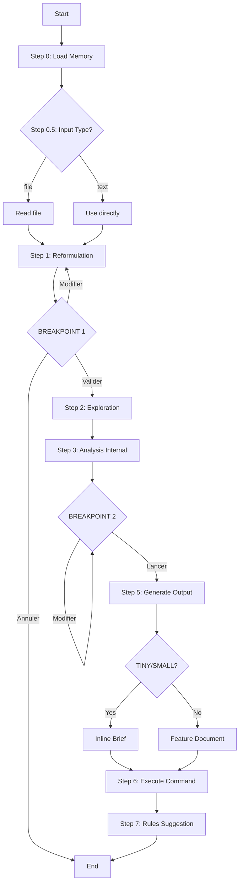

# Audit Report — brief.md

> **Date**: 2026-01-15 14:30
> **Auditor**: command-auditor v1.0.0
> **Mode**: STRICT

---

## Executive Summary

| Metric | Value |
|--------|-------|
| Score | **49**/100 |
| Rules Checked | 95 |
| Blocking Errors | **2** |
| Errors | **6** |
| Warnings | **13** |
| Suggestions | **5** |
| **Verdict** | **❌ BLOCKED** |

---

## Detected Workflow



---

## Results by Category

### CAT-FM: Frontmatter (15 rules)

| Status | ID | Rule | Detail |
|--------|-----|------|--------|
| ✅ | FM-001 | Frontmatter présent | OK — délimiteurs `---` corrects |
| ✅ | FM-002 | Description obligatoire | OK |
| ✅ | FM-003 | Description ≤ 500 chars | OK (~250 chars) |
| ❌ | FM-004 | Description verbe infinitif | "EPCI entry point..." → Devrait commencer par un verbe |
| ✅ | FM-005 | Frontmatter < 15 lignes | OK (7 lignes) |
| ✅ | FM-006 | argument-hint présent | OK |
| ✅ | FM-007 | Format argument-hint | OK — `[optional]` et `--flag` |
| ✅ | FM-008 | allowed-tools déclaré | OK |
| ✅ | FM-009 | Outils valides | OK — Read, Write, Glob, Grep, Bash, Task |
| ❌ | **FM-010** | **Bash restreint** | **BLOQUANT — `Bash` sans restriction de pattern** |
| ✅ | FM-011 | Pas de tabs | OK |
| ✅ | FM-012 | Caractères échappés | OK — utilise `>-` |
| ✅ | FM-013 | Champs reconnus | OK |
| ✅ | FM-014 | Bash si `!` | OK — pas de `!` dans contenu |
| ✅ | FM-015 | Budget description | OK |

### CAT-ST: Structure (20 rules)

| Status | ID | Rule | Detail |
|--------|-----|------|--------|
| ✅ | ST-001 | ## Overview | OK |
| ⚠️ | ST-002 | Overview 2-4 phrases | WARNING — Overview contient plus de contenu (Key principle, Output Paths) |
| ✅ | ST-003 | ## Process | OK |
| ✅ | ST-004 | Étapes numérotées | OK — `### Step N:` |
| ❌ | ST-005 | ## Output | ERREUR — Section manquante |
| ❌ | ST-006 | ## Arguments | ERREUR — Section manquante (argument-hint présent) |
| ⚠️ | ST-007 | Arguments tableau | WARNING — Pas de tableau arguments |
| ✅ | ST-008 | Skills documentés | OK — Configuration table |
| ✅ | ST-009 | Subagents documentés | OK — @Explore, @clarifier |
| ✅ | ST-010 | Exemples concrets | OK — Breakpoints, templates |
| ⚠️ | ST-011 | 50-200 lignes idéal | WARNING — 637 lignes |
| ❌ | ST-012 | < 500 lignes max | ERREUR — 637 lignes |
| ✅ | ST-013 | Headers corrects | OK |
| ✅ | ST-014 | Pas sections vides | OK |
| ✅ | ST-015 | Ordre logique | OK |
| ⚠️ | ST-016 | Error Handling | WARNING — Partiel (seulement @Explore) |
| ⚠️ | ST-017 | Constraints section | WARNING — Absente |
| ✅ | ST-018 | Breakpoints ASCII box | OK — Format correct |
| ⚠️ | ST-019 | See Also | WARNING — Absente |
| ❌ | ST-020 | ## Flags section | ERREUR — Flags utilisés mais pas documentés en section dédiée |

### CAT-RD: Rédaction (25 rules)

| Status | ID | Rule | Detail |
|--------|-----|------|--------|
| ❌ | **RD-001** | **< 5000 tokens** | **BLOQUANT — ~6500 tokens estimés (26KB / 4)** |
| ⚠️ | RD-002 | Pas de duplication | WARNING — Légère répétition format breakpoint |
| ✅ | RD-003 | Code blocks langage | OK |
| ✅ | RD-004 | Tables structurées | OK — Utilisation extensive |
| ✅ | RD-005 | Références `@` | OK |
| ✅ | RD-006 | Pas liens markdown internes | OK |
| ✅ | RD-007 | Format @subagent | OK — @Explore, @clarifier |
| ✅ | RD-008 | Impératifs | OK — "Use", "Read", "Parse" |
| ✅ | RD-009 | Conditions explicites | OK — IF/WHEN/ELSE |
| ✅ | RD-010 | Pas double négation | OK |
| ✅ | RD-011 | Format --flag | OK |
| ✅ | RD-012 | Pas chemins absolus | OK |
| ✅ | RD-013 | Format {variable} | OK |
| ❌ | RD-014 | Cohérence terminologie | ERREUR — Mix FR/EN ("Objectif", "Context", "reformulation", "breakpoint") |
| ✅ | RD-015 | Pas TODO/FIXME | OK |
| ✅ | RD-016 | Pas commentaires personnels | OK |
| ✅ | RD-017 | Emojis limités | OK — Headers et breakpoints |
| ✅ | RD-018 | Références @ valides | OK — Fichiers existent |
| ✅ | RD-019 | Contexte `!` < 30 lignes | OK — Pas de `!` |
| ⚠️ | RD-020 | Instructions < 100 lignes | WARNING — Step 1 et Step 4 dépassent |
| ✅ | RD-021 | Frontmatter < 15 lignes | OK |
| ✅ | RD-022 | Spécificité | OK — Une tâche claire |
| ✅ | RD-023 | Déterminisme | OK |
| ✅ | RD-024 | Testabilité | OK |
| ✅ | RD-025 | Maintenabilité | OK |

### CAT-WF: Workflow (10 rules)

| Status | ID | Rule | Detail |
|--------|-----|------|--------|
| ✅ | WF-001 | Workflow cohérent | OK — Tous steps connectés |
| ✅ | WF-002 | Séquence logique | OK |
| ✅ | WF-003 | Pas boucles infinies | OK — Breakpoints avec options explicites |
| ✅ | WF-004 | Points de sortie | OK — Step 6 + Step 7 |
| ✅ | WF-005 | IF/ELSE complets | OK |
| ✅ | WF-006 | MANDATORY marqués | OK |
| ✅ | WF-007 | Breakpoints décisions | OK — Step 1, Step 4 |
| ⚠️ | WF-008 | Fallbacks documentés | WARNING — Seulement pour @Explore |
| ✅ | WF-009 | DAG valide | OK — Pas de cycles |
| ✅ | WF-010 | Routing documenté | OK — Step 6 table |

### CAT-IN: Integration (15 rules)

| Status | ID | Rule | Detail |
|--------|-----|------|--------|
| ✅ | IN-001 | Skills documentés | OK — Configuration table |
| ✅ | IN-002 | Subagents documentés | OK |
| ✅ | IN-003 | Hooks documentés | OK — pre-brief, post-brief |
| ⚠️ | IN-004 | MCP documentés | WARNING — Flags MCP dans argument-hint mais pas dans Configuration |
| ⚠️ | IN-005 | Personas documentés | WARNING — Step 3.4 existe mais manque de clarté |
| ✅ | IN-006 | Thinking level | OK |
| ✅ | IN-007 | Routing documenté | OK |
| ✅ | IN-008 | MANDATORY marqués | OK |
| ✅ | IN-009 | Output paths | OK — Documentés dans Overview |
| ⚠️ | IN-010 | Error handling | WARNING — Limité |
| ⚠️ | IN-011 | Fallbacks | WARNING — Seulement @Explore |
| N/A | IN-012 | Context schema | N/A |
| ✅ | IN-013 | Session persistence | OK — "store for Step 3" |
| ✅ | IN-014 | Memory hooks | OK — post-brief documenté |
| ℹ️ | IN-015 | validate_command.py | INFO |

### CAT-DG: Detection & Generation (10 rules)

| Status | ID | Rule | Suggestion |
|--------|-----|------|------------|
| 💡 | DG-001 | Skill candidat | > 500 tokens de logique → Extraire reformulation vers skill |
| ✅ | DG-002 | Subagent OK | Déjà utilisé appropriément |
| 💡 | DG-003 | Reference candidat | Step 1 et Step 4 > 100 lignes → Extraire vers references/ |
| ✅ | DG-004 | Pas copier-coller | OK |
| 💡 | DG-005 | Template candidat | Format breakpoint ASCII → Template réutilisable |
| ✅ | DG-006 | Hooks OK | Déjà utilisés |
| ✅ | DG-007 | Script candidat | N/A |
| 💡 | DG-008 | Décomposition | > 300 lignes → Suggérer split |
| 💡 | DG-009 | References denses | Contenu dense → Utiliser references/ |
| ✅ | DG-010 | Pas overlap | OK |

---

## Blocking Errors (MUST FIX)

### 1. FM-010: Bash non restreint

**Severity**: BLOQUANT (-10 points)
**Location**: Frontmatter, ligne 7

```yaml
allowed-tools: [Read, Write, Glob, Grep, Bash, Task]
```

**Problem**: `Bash` est déclaré sans restriction de pattern. Cela permet l'exécution de n'importe quelle commande shell.

**Fix**: Restreindre Bash aux commandes nécessaires:
```yaml
allowed-tools: [Read, Write, Glob, Grep, Bash(mkdir:*), Bash(git:*), Task]
```

Ou si aucune commande Bash n'est vraiment nécessaire, retirer `Bash` de la liste.

---

### 2. RD-001: Dépassement limite tokens

**Severity**: BLOQUANT (-10 points)
**Location**: Fichier entier (637 lignes, ~26KB)

**Problem**: Le fichier contient environ 6500 tokens (estimation: 26000 / 4), dépassant la limite de 5000 tokens.

**Impact**: Consomme trop de context window, réduit l'efficacité.

**Fix**: Extraire du contenu vers des références:

| Section | Lignes | Action suggérée |
|---------|--------|-----------------|
| Step 1 (Reformulation) | ~100 | Extraire vers `references/reformulation-process.md` |
| Step 4 (Breakpoint) | ~80 | Extraire format breakpoint vers `references/breakpoint-format.md` |
| Step 5 (Output templates) | ~70 | Extraire vers `references/output-templates.md` |
| --turbo mode | ~40 | Extraire vers `references/turbo-mode.md` |

---

## Other Errors (SHOULD FIX)

| # | ID | Issue | Fix |
|---|-----|-------|-----|
| 1 | FM-004 | Description ne commence pas par verbe | Changer en: "Valider et reformuler le brief, explorer le codebase..." |
| 2 | ST-005 | Section ## Output absente | Ajouter `## Output` avec description des sorties |
| 3 | ST-006 | Section ## Arguments absente | Ajouter `## Arguments` avec tableau des flags |
| 4 | ST-012 | 637 lignes > 500 max | Extraire vers references/ (voir DG suggestions) |
| 5 | ST-020 | Section ## Flags absente | Documenter --turbo, --rephrase, --no-rephrase, etc. |
| 6 | RD-014 | Terminologie mixte FR/EN | Choisir une langue principale (FR recommandé pour EPCI) |

---

## Generation Suggestions

| Type | Reason | Suggested Action |
|------|--------|------------------|
| **Reference** | Step 1 > 100 lignes | Créer `references/reformulation-process.md` |
| **Reference** | Step 4 breakpoint > 80 lignes | Créer `references/analysis-breakpoint.md` |
| **Reference** | Output templates > 70 lignes | Créer `references/output-templates.md` |
| **Skill** | Reformulation logic ~500 tokens | Considérer extraction vers skill `brief-reformulator` |
| **Template** | ASCII breakpoint format | Centraliser template breakpoint réutilisable |

---

## Action Items

### Bloquants (à faire avant merge)

- [ ] **FM-010**: Restreindre `Bash` dans allowed-tools ou le retirer
- [ ] **RD-001**: Réduire à < 5000 tokens via extraction references/

### Erreurs (recommandé)

- [ ] **FM-004**: Reformuler description avec verbe infinitif
- [ ] **ST-005**: Ajouter section `## Output`
- [ ] **ST-006**: Ajouter section `## Arguments` avec tableau
- [ ] **ST-020**: Ajouter section `## Flags`
- [ ] **RD-014**: Harmoniser terminologie (choisir FR ou EN)

### Warnings (optionnel)

- [ ] Réduire Overview à 2-4 phrases (ST-002)
- [ ] Ajouter section `## Constraints` (ST-017)
- [ ] Ajouter section `## See Also` avec liens vers /quick, /epci (ST-019)
- [ ] Documenter plus de fallbacks (WF-008, IN-011)
- [ ] Ajouter MCP servers dans Configuration table (IN-004)

---

## Score Breakdown

| Category | Violations | Points Lost |
|----------|------------|-------------|
| Frontmatter (FM) | 1 BLOQUANT, 1 ERREUR | -13 |
| Structure (ST) | 4 ERREUR, 6 WARNING | -18 |
| Rédaction (RD) | 1 BLOQUANT, 1 ERREUR, 2 WARNING | -15 |
| Workflow (WF) | 1 WARNING | -1 |
| Integration (IN) | 4 WARNING | -4 |
| Detection (DG) | 5 SUGGESTION | 0 |
| **Total** | | **-51** |

**Final Score**: 100 - 51 = **49/100**

---

## Legend

| Symbol | Meaning |
|--------|---------|
| ❌ | Error (blocking or standard) |
| ⚠️ | Warning |
| 💡 | Suggestion |
| ✅ | Compliant |
| ℹ️ | Information |
| N/A | Not applicable |

---

*Generated by command-auditor v1.0.0 — EPCI Plugin*
