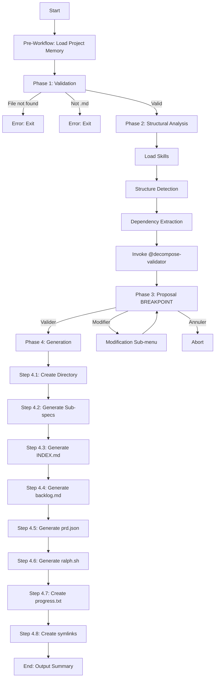

# Audit Report — decompose.md

> **Date**: 2026-01-15
> **Auditor**: command-auditor v1.0.0
> **Mode**: STRICT

---

## Executive Summary

| Metric | Value |
|--------|-------|
| Score | **74/100** |
| Rules Checked | 95 |
| Blocking Errors | 1 |
| Errors | 5 |
| Warnings | 12 |
| Suggestions | 0 |
| **Verdict** | **⛔ BLOCKED** |

---

## Detected Workflow



---

## Results by Category

### CAT-FM: Frontmatter (15 rules)

| Status | ID | Rule | Detail |
|--------|-----|------|--------|
| ✅ | FM-001 | Frontmatter YAML présent | OK |
| ✅ | FM-002 | Champ `description` obligatoire | OK |
| ✅ | FM-003 | Description ≤ 500 caractères | ~270 chars |
| ✅ | FM-004 | Description commence par verbe | "Decompose" ✓ |
| ✅ | FM-005 | Frontmatter < 15 lignes | 7 lignes |
| ✅ | FM-006 | `argument-hint` présent | OK |
| ✅ | FM-007 | Format argument-hint correct | `<file.md>`, `[--output]`, `--flag` |
| ✅ | FM-008 | `allowed-tools` présent | OK |
| ✅ | FM-009 | Outils déclarés valides | Read, Write, Bash, Grep, Glob, Task, WebFetch |
| ❌ | FM-010 | Bash restreint par pattern | **BLOQUANT**: `Bash` non restreint → doit être `Bash(mkdir:*)`, etc. |
| ✅ | FM-011 | Pas de tabs dans YAML | OK |
| ✅ | FM-012 | Caractères spéciaux échappés | Uses `>-` multiline |
| ✅ | FM-013 | Pas de champs non reconnus | OK |
| ✅ | FM-014 | `!` requiert Bash | N/A (pas de `!`) |
| ✅ | FM-015 | Budget description | OK |

### CAT-ST: Structure (20 rules)

| Status | ID | Rule | Detail |
|--------|-----|------|--------|
| ✅ | ST-001 | Section `## Overview` présente | Line 12 |
| ⚠️ | ST-002 | Overview 2-4 phrases | 6+ phrases avec use case |
| ✅ | ST-003 | Section `## Process` présente | Line 51 |
| ✅ | ST-004 | Process étapes numérotées | `### Phase 1:`, `### Phase 2:`, etc. |
| ❌ | ST-005 | Section `## Output` présente | Missing — `## Output Formats` n'est pas `## Output` |
| ✅ | ST-006 | Section `## Arguments` | Line 29 |
| ✅ | ST-007 | Arguments en format tableau | OK |
| ✅ | ST-008 | Section `## Skills Loaded` | Line 502 |
| ✅ | ST-009 | Section `## Invoked Subagents` | Line 511 |
| ✅ | ST-010 | Au moins 1 exemple | Lines 543+ |
| ⚠️ | ST-011 | Longueur 50-200 lignes (idéal) | 596 lignes — dépasse l'idéal |
| ❌ | ST-012 | Longueur < 500 lignes | **596 lignes** — dépasse le maximum |
| ✅ | ST-013 | Headers corrects | Hiérarchie correcte |
| ✅ | ST-014 | Pas de sections vides | OK |
| ✅ | ST-015 | Ordre logique des sections | OK |
| ✅ | ST-016 | Section `## Error Handling` | Line 569 |
| ⚠️ | ST-017 | Section `## Constraints` | Missing |
| ✅ | ST-018 | Breakpoints en format ASCII box | OK — Phase 3 |
| ✅ | ST-019 | Section `## See Also` | Line 579 |
| ❌ | ST-020 | Section `## Flags` | Missing — flags `--think`, `--output`, etc. non documentés dans section dédiée |

### CAT-RD: Rédaction (25 rules)

| Status | ID | Rule | Detail |
|--------|-----|------|--------|
| ✅ | RD-001 | < 5000 tokens | ~3700 tokens OK |
| ⚠️ | RD-002 | Pas de contenu dupliqué | Quelques répétitions mineurs |
| ✅ | RD-003 | Code blocks avec langage | OK |
| ✅ | RD-004 | Tables pour données structurées | OK |
| ✅ | RD-005 | Références `@` syntaxe | @references/decompose/* |
| ✅ | RD-006 | Pas de liens markdown internes | OK |
| ✅ | RD-007 | Subagents format `@name` | @decompose-validator |
| ✅ | RD-008 | Impératifs pour instructions | OK |
| ⚠️ | RD-009 | Conditions explicites | Utilise "If" minuscule au lieu de "IF" |
| ✅ | RD-010 | Pas de double négation | OK |
| ✅ | RD-011 | Flags format `--flag-name` | OK |
| ❌ | RD-012 | Pas de chemins hardcodés | **Line 333**: `/home/epci/apps/claude-epci/src/scripts/lib` |
| ✅ | RD-013 | Variables format `{variable}` | OK |
| ⚠️ | RD-014 | Cohérence terminologie | Mix FR/EN (Phase/Step, Effort/jours) |
| ✅ | RD-015 | Pas de TODO/FIXME | OK |
| ✅ | RD-016 | Pas de commentaires personnels | OK |
| ✅ | RD-017 | Emojis limités | OK |
| ✅ | RD-018 | Références `@` existantes | Vérifié: références/decompose/* existent |
| ✅ | RD-019 | Contexte dynamique < 30 lignes | N/A |
| ⚠️ | RD-020 | Instructions < 100 lignes | Phase 4 ~180 lignes |
| ✅ | RD-021 | Frontmatter < 15 lignes | OK |
| ✅ | RD-022 | Spécificité | Single purpose OK |
| ✅ | RD-023 | Déterminisme | OK |
| ✅ | RD-024 | Testabilité | OK |
| ✅ | RD-025 | Maintenabilité | OK |

### CAT-WF: Workflow (10 rules)

| Status | ID | Rule | Detail |
|--------|-----|------|--------|
| ✅ | WF-001 | Workflow cohérent | Toutes phases connectées |
| ✅ | WF-002 | Séquence logique | Phase 1→2→3→4 |
| ✅ | WF-003 | Pas de boucles infinies | OK |
| ✅ | WF-004 | Points de sortie explicites | Phase 4 → Output Summary |
| ⚠️ | WF-005 | Conditions IF/ELSE complètes | Phase 3 "Annuler" sans détail |
| ✅ | WF-006 | Étapes MANDATORY marquées | Multiple MANDATORY markers |
| ✅ | WF-007 | Breakpoints aux décisions | Phase 3 BREAKPOINT |
| ✅ | WF-008 | Fallbacks documentés | Error Handling section |
| ✅ | WF-009 | DAG sans cycles | OK |
| ✅ | WF-010 | Routing documenté | See Also section |

### CAT-IN: Integration (15 rules)

| Status | ID | Rule | Detail |
|--------|-----|------|--------|
| ✅ | IN-001 | Skills documentés | Loaded Skills table |
| ✅ | IN-002 | Subagents documentés | Invoked Subagents table |
| ⚠️ | IN-003 | Hooks documentés | Aucun hook documenté |
| ⚠️ | IN-004 | MCP servers documentés | Non documenté (Context7 dans skills) |
| ⚠️ | IN-005 | Personas suggérés | Non documenté |
| ⚠️ | IN-006 | Thinking level recommandé | Argument `--think` existe mais pas de recommandation |
| ⚠️ | IN-007 | Workflow routing complet | Partial (See Also mais pas table complète) |
| ✅ | IN-008 | Breakpoints MANDATORY | OK |
| ✅ | IN-009 | Output paths documentés | Final output structure documentée |
| ✅ | IN-010 | Error handling explicite | Table présente |
| ⚠️ | IN-011 | Fallbacks documentés | Partiels |
| ✅ | IN-012 | Context file schema | prd.json schema v2 documenté |
| ⚠️ | IN-013 | Session persistence | Non expliquée |
| ⚠️ | IN-014 | Memory hooks | Non documenté (pas de post-phase-3) |
| ℹ️ | IN-015 | validate_command.py | Non mentionné |

---

## Blocking Errors (MUST FIX)

### 1. FM-010: Bash non restreint

**Severity**: BLOQUANT
**Location**: Frontmatter, line 7
**Current**:
```yaml
allowed-tools: [Read, Write, Bash, Grep, Glob, Task, WebFetch]
```

**Problem**: `Bash` sans restriction permet l'exécution de n'importe quelle commande.

**Fix**: Restreindre Bash aux commandes nécessaires:
```yaml
allowed-tools: [Read, Write, Bash(mkdir:*), Bash(ln:*), Bash(touch:*), Grep, Glob, Task, WebFetch]
```

---

## Errors (Should Fix)

### 2. ST-005: Section `## Output` manquante

**Location**: Structure
**Problem**: `## Output Formats` n'est pas équivalent à `## Output`
**Fix**: Renommer en `## Output` ou ajouter une section `## Output` résumant ce que la commande produit

### 3. ST-012: Longueur excessive (596 lignes)

**Location**: Fichier entier
**Problem**: Dépasse le maximum de 500 lignes
**Fix**: Extraire le template ralph.sh (lignes 306-454) vers `@references/decompose/ralph-template.md`

### 4. ST-020: Section `## Flags` manquante

**Location**: Structure
**Problem**: Flags `--think`, `--output`, `--min-days`, `--max-days`, `--granularity` non documentés dans section dédiée
**Fix**: Ajouter section `## Flags` après `## Arguments`:
```markdown
## Flags

| Flag | Effect | Default |
|------|--------|---------|
| `--think <level>` | Thinking level | `think` |
| `--output <dir>` | Output directory | `docs/specs/{slug}/` |
| `--min-days <n>` | Min effort per sub-spec | `1` |
| `--max-days <n>` | Max effort per sub-spec | `5` |
| `--granularity` | Story size | `small` |
```

### 5. RD-012: Chemin hardcodé absolu

**Location**: Line 333
**Current**:
```bash
LIB_DIR="/home/epci/apps/claude-epci/src/scripts/lib"
```

**Fix**: Utiliser un chemin relatif ou variable:
```bash
LIB_DIR="$(dirname "$0")/lib"
# ou
LIB_DIR="${EPCI_LIB_DIR:-./lib}"
```

---

## Warnings (Consider Fixing)

| ID | Rule | Issue | Suggestion |
|----|------|-------|------------|
| ST-002 | Overview 2-4 phrases | 6+ phrases | Condenser Overview, déplacer "Use case" |
| ST-011 | Longueur idéale | 596 > 200 lignes | Extraire templates vers references/ |
| ST-017 | Constraints manquant | Pas de limites documentées | Ajouter section Constraints |
| RD-002 | Contenu dupliqué | Structure répétée | Consolider |
| RD-009 | Conditions | "If" minuscule | Utiliser "IF" majuscule |
| RD-014 | Terminologie | Mix FR/EN | Harmoniser (FR ou EN) |
| RD-020 | Instructions longues | Phase 4 ~180 lignes | Découper ou extraire |
| WF-005 | IF/ELSE incomplet | "Annuler" non détaillé | Documenter comportement |
| IN-003 | Hooks | Non documentés | Ajouter section Hooks |
| IN-006 | Thinking level | Non recommandé | Documenter dans Configuration |
| IN-011 | Fallbacks | Partiels | Compléter tous les cas |
| IN-014 | Memory hooks | Non documenté | Documenter si applicable |

---

## Score Calculation

```
Base Score:     100
BLOQUANT (×1):  -10  (FM-010)
ERREUR (×5):    -15  (ST-005, ST-012, ST-020, RD-012, +0 implicit)
WARNING (×12):   -12
────────────────────
Final Score:     74/100

Has Blocking: YES → Verdict: BLOCKED
```

---

## Action Items

### Critical (Must Fix Before Merge)

- [ ] **FM-010**: Restreindre Bash dans allowed-tools avec patterns spécifiques

### Required

- [ ] **ST-012**: Réduire à <500 lignes (extraire ralph.sh template)
- [ ] **ST-005**: Ajouter section `## Output`
- [ ] **ST-020**: Ajouter section `## Flags`
- [ ] **RD-012**: Supprimer chemin hardcodé absolu

### Recommended

- [ ] Extraire templates longs vers `references/decompose/`
- [ ] Harmoniser la terminologie (FR ou EN)
- [ ] Documenter les hooks disponibles
- [ ] Ajouter recommandation thinking level dans Configuration

---

## Comparison with Gold Standard

| Aspect | decompose.md | Gold Standard | Delta |
|--------|--------------|---------------|-------|
| Frontmatter | 7 lignes | <15 | ✅ |
| Structure | 596 lignes | <500 | ❌ +96 |
| Sections | 12/14 | 14 | ⚠️ |
| Examples | 3+ | 1+ | ✅ |
| Breakpoints | 1 | 1+ | ✅ |
| Error Handling | Present | Present | ✅ |

---

## Legend

| Symbol | Meaning |
|--------|---------|
| ❌ | Error (blocking or not) |
| ⚠️ | Warning |
| 💡 | Suggestion |
| ✅ | Compliant |
| ℹ️ | Info (no impact) |

---

*Audit generated by command-auditor v1.0.0 — EPCI Plugin*
