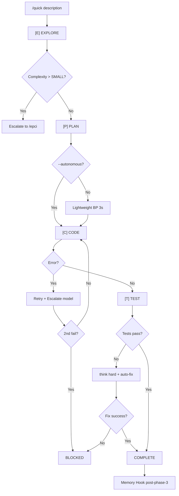

# Audit Report — quick.md

> **Date**: 2026-01-15
> **Auditor**: command-auditor v1.0.0
> **Mode**: STRICT

---

## Executive Summary

| Metric | Value |
|--------|-------|
| Score | **64/100** |
| Rules Checked | 95 |
| Blocking Errors | **3** |
| Errors | **5** |
| Warnings | **11** |
| Suggestions | **4** |
| **Verdict** | **BLOCKED** |

---

## Detected Workflow



---

## Results by Category

### CAT-FM: Frontmatter (15 rules)

| Status | ID | Rule | Detail |
|--------|-----|------|--------|
| PASS | FM-001 | Frontmatter present | OK |
| PASS | FM-002 | Description obligatoire | OK |
| PASS | FM-003 | Description <= 500 chars | ~240 chars |
| FAIL | FM-004 | Description verbe infinitif | "Autonomous..." devrait commencer par verbe (ex: "Execute autonomous...") |
| PASS | FM-005 | Frontmatter < 15 lignes | 8 lignes |
| PASS | FM-006 | argument-hint present | OK |
| PASS | FM-007 | Format argument-hint | `[--flag]` correct |
| PASS | FM-008 | allowed-tools declare | OK |
| PASS | FM-009 | Outils valides | Tous reconnus |
| BLOCK | **FM-010** | **Bash restreint** | **`Bash` sans pattern - BLOQUANT** |
| PASS | FM-011 | Pas de tabs | OK |
| PASS | FM-012 | Caracteres echappes | OK |
| PASS | FM-013 | Champs reconnus | OK |
| PASS | FM-014 | `!` requiert Bash | N/A |
| PASS | FM-015 | Budget description | OK |

### CAT-ST: Structure (20 rules)

| Status | ID | Rule | Detail |
|--------|-----|------|--------|
| PASS | ST-001 | Overview present | OK |
| WARN | ST-002 | Overview 2-4 phrases | 4 phrases + liste "Key Features" |
| PASS | ST-003 | Process/Workflow | "## EPCT Workflow" present |
| PASS | ST-004 | Etapes numerotees | Phases E/P/C/T avec ### |
| WARN | ST-005 | Section Output | Pas explicite, "Resume Final" fait office |
| WARN | ST-006 | Section Arguments | "## Supported Flags" au lieu de "## Arguments" |
| PASS | ST-007 | Arguments en tableau | OK |
| PASS | ST-008 | Skills documentes | Dans ## Configuration |
| PASS | ST-009 | Subagents documentes | ## Subagent Matrix |
| PASS | ST-010 | Exemples presents | 2 exemples complets |
| WARN | ST-011 | 50-200 lignes ideal | 617 lignes |
| FAIL | **ST-012** | **< 500 lignes** | **617 lignes - ERREUR** |
| PASS | ST-013 | Headers corrects | OK |
| PASS | ST-014 | Pas sections vides | OK |
| PASS | ST-015 | Ordre logique | OK |
| PASS | ST-016 | Error Handling | OK |
| WARN | ST-017 | Constraints | Non explicite |
| PASS | ST-018 | Breakpoints ASCII box | OK |
| WARN | ST-019 | See Also | "Comparison with /epci" existe |
| PASS | ST-020 | Section Flags | OK |

### CAT-RD: Redaction (25 rules)

| Status | ID | Rule | Detail |
|--------|-----|------|--------|
| BLOCK | **RD-001** | **< 5000 tokens** | **~12000 tokens estimes - BLOQUANT** |
| PASS | RD-002 | Pas de duplication | OK |
| WARN | RD-003 | Code blocks langage | Quelques blocks sans langage |
| PASS | RD-004 | Tables donnees | OK |
| PASS | RD-005 | References @ | N/A (pas de refs externes) |
| PASS | RD-006 | Pas liens markdown | OK |
| PASS | RD-007 | Format @subagent | @Explore, @clarifier, @planner OK |
| WARN | RD-008 | Imperatifs | Melange imperatif/descriptif |
| FAIL | RD-009 | Conditions explicites | IF/WHEN pas toujours en majuscules |
| PASS | RD-010 | Pas double negation | OK |
| PASS | RD-011 | Flags --format | OK |
| PASS | RD-012 | Pas chemins absolus | OK |
| PASS | RD-013 | Variables {format} | OK |
| FAIL | RD-014 | Coherence terminologie | Melange FR/EN ("Fichier modifie", "Auto-continue") |
| PASS | RD-015 | Pas TODO/FIXME | OK |
| PASS | RD-016 | Pas commentaires perso | OK |
| PASS | RD-017 | Emojis limites | OK |
| PASS | RD-018 | Refs @ valides | N/A |
| PASS | RD-019 | Contexte ! < 30 lignes | OK |
| WARN | RD-020 | Instructions < 100 lignes | Quelques sections longues |
| PASS | RD-021 | Frontmatter < 15 lignes | OK |
| PASS | RD-022 | Specificite | But unique (EPCT) |
| PASS | RD-023 | Determinisme | OK |
| PASS | RD-024 | Testabilite | OK |
| PASS | RD-025 | Maintenabilite | OK |

### CAT-WF: Workflow (10 rules)

| Status | ID | Rule | Detail |
|--------|-----|------|--------|
| PASS | WF-001 | Workflow coherent | E-P-C-T-Resume |
| PASS | WF-002 | Sequence logique | OK |
| PASS | WF-003 | Pas boucles infinies | Retry max 2x |
| PASS | WF-004 | Sorties explicites | COMPLETE, BLOCKED, ESCALATION |
| WARN | WF-005 | IF/ELSE complets | Quelques cas implicites |
| PASS | WF-006 | MANDATORY marque | OK |
| PASS | WF-007 | Breakpoints decision | OK |
| PASS | WF-008 | Fallbacks documentes | OK |
| PASS | WF-009 | DAG possible | OK |
| PASS | WF-010 | Routing documente | Escalation vers /epci |

### CAT-IN: Integration (15 rules)

| Status | ID | Rule | Detail |
|--------|-----|------|--------|
| PASS | IN-001 | Skills documentes | ## Configuration |
| PASS | IN-002 | Subagents documentes | ## Subagent Matrix |
| WARN | IN-003 | Hooks documentes | post-phase-3 OK, autres implicites |
| PASS | IN-004 | MCP documentes | --c7, --no-mcp |
| PASS | IN-005 | Personas | N/A |
| WARN | IN-006 | Thinking level | Documente mais disperse |
| PASS | IN-007 | Routing documente | OK |
| PASS | IN-008 | MANDATORY marque | OK |
| PASS | IN-009 | Output paths | .project-memory/sessions/ |
| PASS | IN-010 | Error handling | OK |
| PASS | IN-011 | Fallbacks | OK |
| PASS | IN-012 | Schema context | JSON session documente |
| PASS | IN-013 | Session persistence | OK |
| PASS | IN-014 | Memory hooks | post-phase-3 detaille |
| PASS | IN-015 | validate_command.py | N/A |

### CAT-DG: Detection & Suggestions (10 rules)

| Status | ID | Rule | Suggestion |
|--------|-----|------|------------|
| SUGGEST | DG-001 | Besoin skill | Extraire logique model switching en skill |
| PASS | DG-002 | Besoin subagent | Deja utilises |
| SUGGEST | DG-003 | Besoin reference | Breakpoints vers `references/breakpoints.md` |
| WARN | DG-004 | Pattern repete | Outputs TINY/SMALL similaires |
| SUGGEST | DG-005 | Template candidat | ASCII box breakpoint |
| PASS | DG-006 | Hook candidat | Deja hook post-phase-3 |
| PASS | DG-007 | Script candidat | N/A |
| SUGGEST | DG-008 | Decomposition | **617 lignes - Extraire en references/** |
| PASS | DG-009 | Contenu dense | Voir DG-008 |
| PASS | DG-010 | Overlap | Pas d'overlap |

---

## Blocking Errors (MUST FIX)

### 1. FM-010: Bash sans restriction de pattern

**Line**: 7
**Current**:
```yaml
allowed-tools: [Read, Write, Edit, Bash, Grep, Glob, Task]
```
**Fix**:
```yaml
allowed-tools: [Read, Write, Edit, Bash(git:*), Bash(npm:*), Bash(python:*), Grep, Glob, Task]
```

### 2. RD-001: Token count exceeds 5000

**Estimated**: ~12,000 tokens (617 lines x ~80 chars / 4)
**Fix**: Extract sections to `references/`:
- `references/model-matrix.md` (~100 lines)
- `references/resume-final.md` (~100 lines)
- `references/error-handling.md` (~50 lines)

### 3. FM-004: Description ne commence pas par verbe

**Current**: "Autonomous EPCT workflow for..."
**Fix**: "Execute autonomous EPCT workflow for..." ou "Run EPCT workflow for..."

---

## Other Errors (SHOULD FIX)

| ID | Issue | Fix |
|----|-------|-----|
| ST-012 | 617 > 500 lignes | Extraire en references/ |
| RD-009 | Conditions pas majuscules | Uniformiser IF/WHEN/ELSE |
| RD-014 | Mix FR/EN | Choisir une langue (FR recommande) |

---

## Generation Suggestions

| Type | Reason | Suggested Action |
|------|--------|------------------|
| **Reference** | Breakpoints TINY/SMALL similaires | Creer `references/resume-breakpoints.md` |
| **Reference** | Model Matrix dense | Creer `references/model-matrix.md` |
| **Reference** | Session persistence complexe | Creer `references/session-schema.md` |
| **Skill** | Logique model switching reutilisable | Extraire vers `adaptive-model-switching/SKILL.md` |

---

## Action Items

- [ ] **FIX BLOQUANT**: Ajouter patterns Bash dans allowed-tools
- [ ] **FIX BLOQUANT**: Reduire a < 5000 tokens via references/
- [ ] **FIX BLOQUANT**: Modifier description pour commencer par verbe
- [ ] Fix: Reduire a < 500 lignes
- [ ] Fix: Uniformiser conditions IF/WHEN en majuscules
- [ ] Fix: Uniformiser langue (FR ou EN)
- [ ] Consider: Extraire breakpoints en template/reference

---

## Score Calculation

```
Base:                  100
- FM-010 (BLOQUANT):   -10
- RD-001 (BLOQUANT):   -10
- FM-004 (ERREUR):      -3
- ST-012 (ERREUR):      -3
- RD-009 (ERREUR):      -3
- RD-014 (ERREUR):      -3
- Warnings (11):       -11
                       ----
Total:                  64/100
```

---

## Verdict: BLOCKED

**3 erreurs bloquantes** doivent etre corrigees avant merge:
1. Restriction Bash obligatoire
2. Reduction tokens via extraction
3. Description avec verbe infinitif

---

*Report generated by command-auditor skill — EPCI Plugin v5.3.1*
