# Audit Report — /brainstorm

> **Date**: 2026-01-08
> **EPCI Version**: 4.7.3
> **Score Final**: 81/100
> **Auditor**: Claude (Opus 4.5)

---

## Executive Summary

La commande `/brainstorm` est une implementation mature et bien structuree du workflow de decouverte de features. Elle presente une excellente integration des subagents specialises (@ems-evaluator, @technique-advisor) et un systeme EMS (Exploration Maturity Score) robuste sur 5 axes. Points d'attention: absence de hooks de persistence automatique et quelques inconsistances mineures dans la documentation des models d'agents.

**Score: 81/100** (Fixe: 79.7 + Adaptatif: 83.0)

---

## 1. Workflow Diagram

```mermaid
flowchart TB
    subgraph Phase0["Phase 0: Session Detection"]
        direction TB
        P0_START["Start /brainstorm"]
        P0_CHECK["Check .project-memory/brainstorm-sessions/"]
        P0_FOUND{"Session found?"}
        P0_PROMPT["Prompt: Resume or New"]
        P0_NEW["Archive + New session"]
    end

    subgraph Phase1["Phase 1: Initialisation"]
        direction TB
        P1_START["Load context"]
        P1_SKILL["Skill: project-memory"]
        P1_EXPLORE["@Explore (background)"]
        P1_REFORMULATE["Reformulate need"]
        P1_INIT["Init session: Divergent, EMS ~25"]
        P1_HMW["Generate HMW (3 questions)"]
        P1_QUESTIONS["Generate 3-5 questions A/B/C"]
        P1_BP["BP1: Cadrage"]
    end

    subgraph Phase2["Phase 2: Iterations"]
        direction TB
        P2_START["Integrate responses"]
        P2_EMS["@ems-evaluator (haiku)"]
        P2_TECHNIQUE["@technique-advisor (haiku)"]
        P2_QUESTIONS["Generate 3-5 questions"]
        P2_BP["BP: Iteration compact"]
        P2_DECISION{"finish?"}
    end

    subgraph Phase3["Phase 3: Generation"]
        direction TB
        P3_START["Create docs/briefs/[slug]/"]
        P3_VALIDATION["Section-by-section validation"]
        P3_PLANNER["@planner (sonnet)"]
        P3_SECURITY["@security-auditor (opus)"]
        P3_BRIEF["Write brief-[slug]-[date].md"]
        P3_JOURNAL["Write journal-[slug]-[date].md"]
        P3_SAVE["Save session YAML"]
        P3_COMPLETE["Display completion"]
    end

    P0_START --> P0_CHECK
    P0_CHECK --> P0_FOUND
    P0_FOUND -->|"Yes"| P0_PROMPT
    P0_FOUND -->|"No"| P1_START
    P0_PROMPT -->|"Resume"| P2_START
    P0_PROMPT -->|"New"| P0_NEW
    P0_NEW --> P1_START

    P1_START --> P1_SKILL
    P1_SKILL --> P1_EXPLORE
    P1_EXPLORE --> P1_REFORMULATE
    P1_REFORMULATE --> P1_INIT
    P1_INIT --> P1_HMW
    P1_HMW --> P1_QUESTIONS
    P1_QUESTIONS --> P1_BP

    P1_BP -->|"User responds"| P2_START
    P2_START --> P2_EMS
    P2_EMS --> P2_TECHNIQUE
    P2_TECHNIQUE --> P2_QUESTIONS
    P2_QUESTIONS --> P2_BP
    P2_BP --> P2_DECISION
    P2_DECISION -->|"No"| P2_START
    P2_DECISION -->|"Yes"| P3_START

    P3_START --> P3_VALIDATION
    P3_VALIDATION --> P3_PLANNER
    P3_PLANNER --> P3_SECURITY
    P3_SECURITY --> P3_BRIEF
    P3_BRIEF --> P3_JOURNAL
    P3_JOURNAL --> P3_SAVE
    P3_SAVE --> P3_COMPLETE

    style P1_BP fill:#ffd700
    style P2_BP fill:#ffd700
    style P1_EXPLORE fill:#90EE90
    style P2_EMS fill:#90EE90
    style P2_TECHNIQUE fill:#90EE90
    style P3_PLANNER fill:#90EE90
    style P3_SECURITY fill:#90EE90
    style P1_SKILL fill:#87CEEB
```



---

## 2. Component Inventory

### Skills (5 total)

| Skill Reference | Existe dans src/skills/ | Charge dans workflow | Status |
|-----------------|-------------------------|----------------------|--------|
| `brainstormer` | OUI | OUI - Core logic | OK |
| `project-memory` | OUI | OUI - Phase 1 | OK |
| `architecture-patterns` | OUI | OUI - Suggestions | OK |
| `clarification-intelligente` | OUI | OUI - Questions | OK |
| `mcp` | OUI | CONDITIONNEL (--c7, --seq) | OK |

### Agents (6 total)

| Agent Reference | Existe dans src/agents/ | Model documente | Model recommande | Status |
|-----------------|-------------------------|-----------------|------------------|--------|
| `@Explore` | NON (agent interne) | N/A | N/A | OK |
| `@clarifier` | OUI | haiku | haiku | OK |
| `@planner` | OUI | sonnet | sonnet | OK |
| `@security-auditor` | OUI | opus | opus | OK |
| `@ems-evaluator` | OUI | haiku | haiku | OK |
| `@technique-advisor` | OUI | haiku | haiku | OK |

### Hooks (0 specific)

| Hook Type | Valide | Actif (hooks/active/) | Execute dans workflow | Status |
|-----------|--------|----------------------|----------------------|--------|
| N/A | - | - | - | INFO |

**Note**: `/brainstorm` ne definit pas de hooks specifiques. La persistence est geree via le skill et les commandes `save`/`finish`.

### MCP Servers

| MCP Server | Documente | Condition activation | Status |
|------------|-----------|---------------------|--------|
| Context7 | OUI | `--c7` flag | OK |
| Sequential | OUI | `--seq` flag | OK |
| Magic | NON | N/A | N/A |
| Playwright | NON | N/A | N/A |

---

## 3. Feature Catalog

### Arguments/Flags

| Flag | Type | Effet | Auto-activation | Status |
|------|------|-------|-----------------|--------|
| `--template [name]` | string | Force template (feature/problem/decision) | N/A | OK |
| `--no-hmw` | boolean | Desactive HMW questions | N/A | OK |
| `--quick` | boolean | 3 iter max, skip validation | N/A | OK |
| `--turbo` | boolean | Mode rapide (@clarifier) | N/A | OK |
| `--random` | boolean | Selection aleatoire techniques | N/A | OK |
| `--progressive` | boolean | Mode 3 phases avec transition | N/A | OK |
| `--no-security` | boolean | Desactive @security-auditor auto | N/A | OK |
| `--no-plan` | boolean | Desactive @planner auto | N/A | OK |
| `--c7` | boolean | Active Context7 MCP | N/A | OK |
| `--seq` | boolean | Active Sequential MCP | N/A | OK |

### Modes

| Mode | Description | Declencheur | Differences |
|------|-------------|-------------|-------------|
| Default | Workflow complet iteratif | Aucun flag | Full process avec validations |
| Quick | 3 iterations max | `--quick` | Skip section validation |
| Turbo | Rapide avec @clarifier | `--turbo` | @clarifier pour questions |
| Random | Techniques aleatoires | `--random` | @technique-advisor selection |
| Progressive | 3 phases explicites | `--progressive` | Divergent->Transition->Convergent |

### Outputs

| Output | Condition | Format | Chemin |
|--------|-----------|--------|--------|
| Brief fonctionnel | `finish` command | Markdown | `./docs/briefs/[slug]/brief-[slug]-[date].md` |
| Journal exploration | `finish` command | Markdown | `./docs/briefs/[slug]/journal-[slug]-[date].md` |
| Session state | `save`/`finish` | YAML | `.project-memory/brainstorm-sessions/[slug].yaml` |

---

## 4. Verification Results

### Universal Checks

| ID | Check | Severity | Status | Notes |
|----|-------|----------|--------|-------|
| U001 | Frontmatter YAML valide | CRITICAL | PASS | Format correct |
| U002 | description <= 1024 chars | HIGH | PASS | ~350 chars |
| U003 | allowed-tools liste presente | HIGH | PASS | 8 tools listes |
| U004 | argument-hint documente | MEDIUM | PASS | Complet avec tous flags |
| U010 | Skills references existent | CRITICAL | PASS | 5/5 existent |
| U011 | Skills charges au bon moment | HIGH | PASS | project-memory en Phase 1 |
| U012 | Pas de skills obsoletes | MEDIUM | PASS | Aucun obsolete |
| U020 | Agents references existent | CRITICAL | PASS | 5/5 existent (hors @Explore interne) |
| U021 | Modeles agents corrects | HIGH | PASS | Tous alignes avec recommandations |
| U022 | Agents invoques au bon point | HIGH | PASS | Timing correct |
| U023 | Agents conditionnels documentes | MEDIUM | PASS | @security-auditor et @planner documentes |
| U030 | Types hooks valides | HIGH | N/A | Pas de hooks specifiques |
| U040 | MCP servers documentes | MEDIUM | PASS | --c7 et --seq documentes |
| U050 | Flags documentes dans argument-hint | HIGH | PASS | Tous presents |

### Command-Specific Checks (/brainstorm)

| ID | Check | Severity | Status | Notes |
|----|-------|----------|--------|-------|
| B001 | @Explore invoque en Phase 1 | CRITICAL | PASS | `run_in_background: true` |
| B002 | Detection session existante | HIGH | PASS | Phase 0 - Session Detection |
| B003 | Option resume/nouvelle proposee | MEDIUM | PASS | Documented in Phase 0 |
| B010 | Skill project-memory charge | HIGH | PASS | Phase 1 step 1 |
| B011 | HMW generes (sauf --no-hmw) | MEDIUM | PASS | Phase 1 step 5 |
| B012 | Questions 3-5 avec A/B/C | HIGH | PASS | Format documente |
| B020 | @ems-evaluator a chaque iteration | CRITICAL | PASS | "NEVER skip EMS calculation" |
| B021 | 5 axes EMS evalues | HIGH | PASS | clarity, feasibility, scope, risks, technical |
| B022 | @technique-advisor disponible | MEDIUM | PASS | Via commande `technique` |
| B023 | Personas adaptatifs fonctionnels | MEDIUM | PASS | 3 personas documentes |
| B030 | @planner invoque en Convergent | HIGH | PASS | Auto + commande `converge` |
| B031 | @security-auditor conditionnel | HIGH | PASS | Auto-detect auth/payment |
| B032 | Brief genere dans docs/briefs/ | CRITICAL | PASS | `brief-[slug]-[date].md` |
| B033 | Journal genere | HIGH | PASS | `journal-[slug]-[date].md` |
| B034 | Session sauvegardee | HIGH | PASS | `.project-memory/brainstorm-sessions/` |
| B040 | Commandes internes documentees | MEDIUM | PASS | Tableau complet (18 commandes) |
| B041 | Commande spike integree | MEDIUM | PASS | `spike [duration] [question]` |

---

## 5. Scoring

### Fixed Criteria (60%)

| Critere | Poids | Score /100 | Pondere | Justification |
|---------|-------|------------|---------|---------------|
| Efficacite | 20% | 82 | 16.4 | Workflow iteratif efficace, EMS guide bien la progression. Quelques commandes peu utilisees (scoring, framework). |
| Robustesse | 15% | 78 | 11.7 | Bonne detection de session, back command limite a 1 step. Pas de gestion d'erreur explicite documentee. |
| Maintenabilite | 15% | 85 | 12.75 | Structure claire: commande 164 LOC, skill bien organise avec references separees. |
| Experience Dev | 15% | 80 | 12.0 | Format breakpoint compact, questions avec suggestions A/B/C. Energy checkpoints pour fatigue. |
| Tracabilite | 10% | 75 | 7.5 | Journal genere, session YAML, mais pas de hook post-session pour memory globale. |
| Flexibilite | 10% | 88 | 8.8 | 10 flags, 18 commandes internes, 3 personas, modes multiples. Excellente customisation. |
| Performance | 10% | 72 | 7.2 | Haiku pour EMS/techniques (rapide), mais iterations peuvent etre nombreuses. |
| Adoption | 5% | 80 | 4.0 | Documentation claire, exemples dans skill. References bien organisees. |
| **TOTAL FIXE** | 100% | | **80.35** | |

### Adaptive Criteria (40%) — /brainstorm

| Critere | Poids | Score /100 | Pondere | Justification |
|---------|-------|------------|---------|---------------|
| Progression EMS | 25% | 90 | 22.5 | Systeme EMS v2 complet: 5 axes, ancres objectives, phase-aware recommendations. @ems-evaluator obligatoire. |
| Qualite Convergence | 25% | 82 | 20.5 | @planner integre, section validation, brief complet. Journal genere. |
| Gestion Sessions | 25% | 78 | 19.5 | Detection, resume, archive OK. Back limite a 1 step. Format YAML bien defini. |
| Variete Techniques | 25% | 80 | 20.0 | @technique-advisor disponible, 20 techniques en 4 categories, spike integre. |
| **TOTAL ADAPTATIF** | 100% | | **82.5** | |

### Combined Score

```
Score Final = (80.35 * 0.60) + (82.5 * 0.40)
            = 48.21 + 33.0
            = 81.21 ≈ 81/100
```

**Score Final: 81/100** — Bon

---

## 6. Qualitative Analysis

### Points Forts

| # | Point Fort | Impact | Evidence |
|---|-----------|--------|----------|
| 1 | Systeme EMS v2 sophistique | HIGH | 5 axes avec ancres objectives, phase-aware recommendations (ems-system.md) |
| 2 | Integration agents specialises | HIGH | @ems-evaluator (haiku) et @technique-advisor (haiku) pour rapidite |
| 3 | Flexibilite modes | HIGH | 5 modes (default, quick, turbo, random, progressive), 10 flags |
| 4 | Persistence session robuste | MEDIUM | Format YAML documente, history pour back, auto-detect resume |
| 5 | Commandes internes riches | MEDIUM | 18 commandes couvrant tous les use cases (dive, pivot, spike, premortem...) |
| 6 | Questions format A/B/C | MEDIUM | Experience utilisateur amelioree avec suggestions |
| 7 | References bien organisees | LOW | 6 fichiers references dans src/commands/references/ |

### Points Faibles

| # | Point Faible | Gravite | Impact | Evidence |
|---|-------------|---------|--------|----------|
| 1 | Pas de hook post-brainstorm | MOYENNE | Memory globale non mise a jour auto | Aucun hook reference dans commande |
| 2 | Back limite a 1 step | BASSE | Rollback limite si erreur de parcours | session-format.md:194 "1 step back only" |
| 3 | EMS axes inconsistants | BASSE | Confusion documentation | brainstorm.md:134 vs skill:64-69 (noms axes differents) |
| 4 | Pas de metriques temps | BASSE | Pas de tracking duree session | Absent du session format |
| 5 | Commande `energy` peu documentee | BASSE | Unclear triggering | Reference externe seulement |
| 6 | MCP Magic/Playwright non integres | BASSE | Potentiel UI non exploite | Non mentionne pour brainstorm |

### Model Verification

| Agent | Model documente | Model recommande | Justification si different | Status |
|-------|-----------------|------------------|---------------------------|--------|
| @Explore | N/A | N/A | Agent interne Claude | OK |
| @clarifier | haiku | haiku | Aligned | OK |
| @planner | sonnet | sonnet | Aligned | OK |
| @security-auditor | opus | opus | Aligned | OK |
| @ems-evaluator | haiku | haiku | Aligned | OK |
| @technique-advisor | haiku | haiku | Aligned | OK |

### Complexity Analysis

| Metrique | Valeur | Evaluation |
|----------|--------|------------|
| LOC (commande) | 164 | OK (< 500) |
| Tokens estimes | ~2500 | OK (< 5000) |
| Nombre de references externes | 6 | OK (< 20) |
| Profondeur nesting max | 2 | OK (< 4) |
| Nombre de breakpoints | 2 | INFO (init + iterations) |
| Nombre d'agents invoques | 6 | INFO |

### Analyse des Lourdeurs

| Element | Probleme | Suggestion |
|---------|----------|------------|
| 18 commandes internes | Peut intimider nouveaux utilisateurs | Grouper par categorie dans doc |
| 5 modes differents | Overlap potentiel turbo/quick | Clarifier differences dans help |
| EMS 5 axes | Overhead calcul a chaque iteration | Caching si reponses inchangees |

---

## 7. Version Coherence

### References croisees

| Source | Version/Compte | Status |
|--------|----------------|--------|
| CLAUDE.md (skills) | 25 skills mentionnes | OK - brainstormer present |
| CLAUDE.md (agents) | 10 agents mentionnes | OK - tous presents |
| CLAUDE.md (commandes) | 11 commandes | OK - brainstorm present |
| CLAUDE.md (version) | 4.5.0 | WARN - repo sur 4.7.3 |

### Elements obsoletes

| Element | Probleme | Action |
|---------|----------|--------|
| CLAUDE.md version | 4.5.0 vs commits recents 4.7.3 | Mettre a jour CLAUDE.md |
| EMS axes naming | brainstorm.md vs skill inconsistent | Aligner noms (clarity vs clarte) |

---

## 8. Recommendations

### Priorite Critique (immediate)

| # | Recommandation | Impact | Effort |
|---|----------------|--------|--------|
| - | Aucune issue critique | - | - |

### Priorite Haute (prochain sprint)

| # | Recommandation | Impact | Effort |
|---|----------------|--------|--------|
| 1 | Ajouter hook post-brainstorm pour memory update | HIGH | LOW |
| 2 | Aligner noms axes EMS entre commande et skill | MEDIUM | LOW |
| 3 | Mettre a jour version CLAUDE.md (4.5.0 -> 4.7.3) | MEDIUM | LOW |

### Priorite Moyenne (roadmap)

| # | Recommandation | Impact | Effort |
|---|----------------|--------|--------|
| 1 | Implementer multi-step back (3-5 steps) | MEDIUM | MEDIUM |
| 2 | Ajouter metriques temps dans session | MEDIUM | LOW |
| 3 | Documenter energy checkpoints inline | LOW | LOW |

### Priorite Basse (nice to have)

| # | Recommandation | Impact | Effort |
|---|----------------|--------|--------|
| 1 | Explorer integration MCP Magic pour UI briefs | LOW | HIGH |
| 2 | Grouper commandes par categorie dans help | LOW | LOW |
| 3 | Ajouter exemples concrets dans commande | LOW | MEDIUM |

---

## Annexes

### A. Files Analyzed

**Commande principale:**
- `src/commands/brainstorm.md` (164 LOC)

**Skills lus:**
- `src/skills/core/brainstormer/SKILL.md`
- `src/skills/core/brainstormer/references/ems-system.md`
- `src/skills/core/brainstormer/references/session-format.md`
- `src/skills/core/project-memory/SKILL.md`

**Agents lus:**
- `src/agents/ems-evaluator.md`
- `src/agents/technique-advisor.md`
- `src/agents/security-auditor.md`
- `src/agents/clarifier.md`
- `src/agents/planner.md`

**References lues:**
- `src/commands/references/brainstorm-*.md` (6 fichiers)

**Configuration:**
- `docs/audits/config/scoring-matrix.yaml`
- `docs/audits/config/command-checks.yaml`

### B. Commands Used

```bash
# Structure exploration
ls -la src/hooks/active/
ls src/agents/
find src/skills -name "SKILL.md" | xargs basename

# LOC count
wc -l src/commands/brainstorm.md

# References
ls -la src/commands/references/
ls -la src/skills/core/brainstormer/references/
```

---

**Rapport genere le 2026-01-08 par Claude Opus 4.5**
