# Audit Report — /brainstorm

> **Date**: 2026-01-08
> **EPCI Version**: 4.7.3
> **Score Final**: 81/100
> **Auditor**: Claude (parallel agent)

---

## Executive Summary

La commande `/brainstorm` est une implementation mature du workflow de decouverte de features avec un systeme EMS (Exploration Maturity Score) bien concu et des personas adaptatifs. La commande presente une bonne modularite avec 6 fichiers de reference externes et une integration coherente des subagents. Des ameliorations sont possibles sur la gestion des hooks (pas de hook post-brainstorm documente dans la commande) et la complexite du workflow qui pourrait beneficier d'une simplification pour les cas simples.

**Score: 81/100** (Fixe: 80.15/100 + Adaptatif: 82.5/100)

---

## 1. Workflow Diagram

```mermaid
flowchart TB
    subgraph Phase0["Phase 0: Session Detection"]
        direction TB
        P0_START["Debut"]
        P0_CHECK["Check .project-memory/brainstorm-sessions/"]
        P0_FOUND{"Session existante?"}
        P0_PROMPT["Prompt: Resume ou New"]
        P0_NEW["Archive existante, start fresh"]
    end

    subgraph Phase1["Phase 1: Initialisation"]
        direction TB
        P1_START["Debut Phase 1"]
        P1_MEMORY["Charger project-memory"]
        P1_EXPLORE["@Explore (run_in_background)"]
        P1_REFORMULATE["Reformuler besoin"]
        P1_INIT["Init session: Phase=Divergent, Persona=Architecte, EMS=~25"]
        P1_HMW["Generer 3 HMW (si pas --no-hmw)"]
        P1_QUESTIONS["3-5 questions cadrage avec A/B/C"]
        P1_BP["BP1: Breakpoint Initial"]
    end

    subgraph Phase2["Phase 2: Iterations"]
        direction TB
        P2_START["Debut Phase 2"]
        P2_INTEGRATE["Integrer reponses utilisateur"]
        P2_EMS["@ems-evaluator (haiku)"]
        P2_TECHNIQUE["@technique-advisor (si pertinent)"]
        P2_QUESTIONS2["Generer 3-5 questions"]
        P2_BP["BP2: Breakpoint Compact"]
        P2_CHECK{"finish?"}
        P2_ENERGY{"Energy check trigger?"}
        P2_ENERGY_PROMPT["Energy Check Display"]
    end

    subgraph Phase3["Phase 3: Generation"]
        direction TB
        P3_START["Debut Phase 3"]
        P3_PLANNER["@planner (si Convergent/EMS>=70)"]
        P3_SECURITY["@security-auditor (si patterns auth/payment)"]
        P3_VALIDATION["Section-by-section validation"]
        P3_MKDIR["mkdir -p ./docs/briefs/[slug]"]
        P3_BRIEF["Write brief-[slug]-[date].md"]
        P3_JOURNAL["Write journal-[slug]-[date].md"]
        P3_COMPLETE["Display completion summary"]
    end

    P0_START --> P0_CHECK
    P0_CHECK --> P0_FOUND
    P0_FOUND -->|"Oui"| P0_PROMPT
    P0_FOUND -->|"Non"| P1_START
    P0_PROMPT -->|"Resume"| P2_START
    P0_PROMPT -->|"New"| P0_NEW
    P0_NEW --> P1_START

    P1_START --> P1_MEMORY
    P1_MEMORY --> P1_EXPLORE
    P1_EXPLORE --> P1_REFORMULATE
    P1_REFORMULATE --> P1_INIT
    P1_INIT --> P1_HMW
    P1_HMW --> P1_QUESTIONS
    P1_QUESTIONS --> P1_BP
    P1_BP -->|"User confirms"| P2_START

    P2_START --> P2_INTEGRATE
    P2_INTEGRATE --> P2_EMS
    P2_EMS --> P2_TECHNIQUE
    P2_TECHNIQUE --> P2_QUESTIONS2
    P2_QUESTIONS2 --> P2_BP
    P2_BP --> P2_CHECK
    P2_CHECK -->|"Non"| P2_ENERGY
    P2_ENERGY -->|"Oui"| P2_ENERGY_PROMPT
    P2_ENERGY_PROMPT --> P2_INTEGRATE
    P2_ENERGY -->|"Non"| P2_INTEGRATE
    P2_CHECK -->|"Oui"| P3_START

    P3_START --> P3_PLANNER
    P3_PLANNER --> P3_SECURITY
    P3_SECURITY --> P3_VALIDATION
    P3_VALIDATION --> P3_MKDIR
    P3_MKDIR --> P3_BRIEF
    P3_BRIEF --> P3_JOURNAL
    P3_JOURNAL --> P3_COMPLETE

    style P1_BP fill:#ffd700
    style P2_BP fill:#ffd700
    style P1_EXPLORE fill:#90EE90
    style P2_EMS fill:#90EE90
    style P2_TECHNIQUE fill:#90EE90
    style P3_PLANNER fill:#90EE90
    style P3_SECURITY fill:#90EE90
```



---

## 2. Component Inventory

### Skills (4 total)

| Skill Reference | Existe dans src/skills/ | Charge dans workflow | Status |
|-----------------|-------------------------|----------------------|--------|
| `brainstormer` | OUI (`core/brainstormer/`) | OUI (principal) | OK |
| `project-memory` | OUI (`core/project-memory/`) | OUI (Phase 1) | OK |
| `architecture-patterns` | OUI (`core/architecture-patterns/`) | OUI (suggestions) | OK |
| `clarification-intelligente` | OUI (`core/clarification-intelligente/`) | IMPLICITE | OK |

### Agents (6 total)

| Agent Reference | Existe dans src/agents/ | Model documente | Model recommande | Status |
|-----------------|-------------------------|-----------------|------------------|--------|
| `@Explore` | OUI (natif Claude Code) | - | - | OK |
| `@clarifier` | OUI (`clarifier.md`) | haiku | haiku | OK |
| `@planner` | OUI (`planner.md`) | sonnet | sonnet | OK |
| `@security-auditor` | OUI (`security-auditor.md`) | opus | opus | OK |
| `@ems-evaluator` | OUI (`ems-evaluator.md`) | haiku | haiku | OK |
| `@technique-advisor` | OUI (`technique-advisor.md`) | haiku | haiku | OK |

### Hooks (2 documentes)

| Hook Type | Valide | Actif (hooks/active/) | Execute dans workflow | Status |
|-----------|--------|----------------------|----------------------|--------|
| `post-brainstorm` | OUI | OUI (`post-brainstorm.py`) | NON documente dans cmd | WARN |
| `on-breakpoint` | OUI | OUI (`on-breakpoint-memory-context.py`) | IMPLICITE | OK |

**Note**: Le hook `post-brainstorm.py` existe dans `hooks/active/` mais n'est pas mentionne dans la commande brainstorm.md.

### MCP Servers

| MCP Server | Documente | Condition activation | Status |
|------------|-----------|---------------------|--------|
| Context7 | OUI (`--c7`) | Flag explicite | OK |
| Sequential | OUI (`--seq`) | Flag explicite | OK |
| Magic | NON | - | N/A |
| Playwright | NON | - | N/A |

---

## 3. Feature Catalog

### Arguments/Flags

| Flag | Type | Effet | Auto-activation | Status |
|------|------|-------|-----------------|--------|
| `--template [name]` | string | Force template (feature/problem/decision) | N/A | OK |
| `--no-hmw` | boolean | Desactive questions HMW | N/A | OK |
| `--quick` | boolean | 3 iter max, skip validation | N/A | OK |
| `--turbo` | boolean | @clarifier (Haiku), 3 iter max | N/A | OK |
| `--random` | boolean | Selection aleatoire techniques | N/A | OK |
| `--progressive` | boolean | Mode 3 phases | N/A | OK |
| `--no-security` | boolean | Desactive @security-auditor auto | N/A | OK |
| `--no-plan` | boolean | Desactive @planner auto | N/A | OK |
| `--c7` | boolean | Active Context7 MCP | N/A | OK |
| `--seq` | boolean | Active Sequential MCP | N/A | OK |

### Modes de Fonctionnement

| Mode | Description | Declencheur | Differences |
|------|-------------|-------------|-------------|
| **Standard** | Workflow complet iteratif | Defaut | Full EMS, all agents |
| **Quick** | Iterations reduites | `--quick` | 3 iter max, skip validation section-by-section |
| **Turbo** | Clarification rapide | `--turbo` | @clarifier (Haiku), EMS > 60 = finish, 3 iter max |
| **Random** | Techniques aleatoires | `--random` | @technique-advisor selection random |
| **Progressive** | 3 phases structurees | `--progressive` | Exploration -> Structuration -> Validation |

### Outputs Produits

| Output | Condition | Format | Chemin |
|--------|-----------|--------|--------|
| Brief | Toujours | Markdown | `./docs/briefs/[slug]/brief-[slug]-[date].md` |
| Journal | Toujours | Markdown | `./docs/briefs/[slug]/journal-[slug]-[date].md` |
| Session | Save/Auto | YAML | `.project-memory/brainstorm-sessions/[slug].yaml` |

---

## 4. Verification Results

### Universal Checks

| ID | Check | Severity | Status |
|----|-------|----------|--------|
| U001 | Frontmatter YAML valide | CRITICAL | PASS |
| U002 | description presente et <= 1024 chars | HIGH | PASS (353 chars) |
| U003 | allowed-tools liste presente | HIGH | PASS |
| U004 | argument-hint documente | MEDIUM | PASS |
| U010 | Skills references existent | CRITICAL | PASS (4/4) |
| U011 | Skills charges au bon moment | HIGH | PASS |
| U020 | Agents references existent | CRITICAL | PASS (6/6) |
| U021 | Modeles des agents corrects | HIGH | PASS |
| U022 | Agents invoques au bon point | HIGH | PASS |
| U030 | Types de hooks valides | HIGH | WARN (post-brainstorm non documente) |
| U040 | MCP servers documentes | MEDIUM | PASS |
| U050 | Flags documentes dans argument-hint | HIGH | PASS |

### Command-Specific Checks (brainstorm)

| ID | Check | Severity | Status |
|----|-------|----------|--------|
| B001 | @Explore invoque en Phase 1 | CRITICAL | PASS |
| B002 | Detection session existante | HIGH | PASS |
| B003 | Resume ou nouvelle session proposee | MEDIUM | PASS |
| B010 | Skill project-memory charge | HIGH | PASS |
| B011 | HMW generes (sauf --no-hmw) | MEDIUM | PASS |
| B012 | Questions 3-5 avec A/B/C | HIGH | PASS |
| B020 | @ems-evaluator a chaque iteration | CRITICAL | PASS |
| B021 | 5 axes EMS evalues | HIGH | PASS |
| B022 | @technique-advisor disponible | MEDIUM | PASS |
| B023 | Personas adaptatifs fonctionnels | MEDIUM | PASS |
| B030 | @planner en phase Convergent | HIGH | PASS |
| B031 | @security-auditor conditionnel | HIGH | PASS |
| B032 | Brief genere dans docs/briefs/ | CRITICAL | PASS |
| B033 | Journal genere | HIGH | PASS |
| B034 | Session sauvegardee | HIGH | PASS |
| B040 | Commandes internes documentees | MEDIUM | PASS |
| B041 | Spike integre | MEDIUM | PASS |

---

## 5. Scoring

### Fixed Criteria (60%)

| Critere | Poids | Score /100 | Pondere | Justification |
|---------|-------|------------|---------|---------------|
| Efficacite | 20% | 78 | 15.6 | Bon workflow iteratif mais overhead EMS a chaque iteration |
| Robustesse | 15% | 82 | 12.3 | Energy checkpoints, session persistence, breakpoints bien places |
| Maintenabilite | 15% | 85 | 12.75 | Structure modulaire avec 6 fichiers references, LOC=179 (excellent) |
| Experience Dev | 15% | 80 | 12.0 | Breakpoints clairs, format compact CLI, suggestions avec questions |
| Tracabilite | 10% | 75 | 7.5 | Journal genere mais hook post-brainstorm non documente |
| Flexibilite | 10% | 88 | 8.8 | 10 flags, 5 modes, personas adaptatifs, nombreuses commandes |
| Performance | 10% | 76 | 7.6 | Haiku pour EMS/technique mais pas de caching entre iterations |
| Adoption | 5% | 73 | 3.65 | Bonne doc mais courbe apprentissage (EMS, phases, commandes) |
| **TOTAL FIXE** | 100% | | **80.2** | |

### Adaptive Criteria (40%)

| Critere | Poids | Score /100 | Pondere | Justification |
|---------|-------|------------|---------|---------------|
| Progression EMS | 25% | 90 | 22.5 | EMS v2 avec 5 axes, ancres objectives, delta affiche |
| Qualite Convergence | 25% | 80 | 20.0 | @planner auto en Convergent, validation section mais manque checkpoints |
| Gestion Sessions | 25% | 78 | 19.5 | Detection/resume OK mais pas de listing sessions existantes |
| Variete Techniques | 25% | 82 | 20.5 | @technique-advisor, spike integre, 20 techniques documentees |
| **TOTAL ADAPTATIF** | 100% | | **82.5** | |

### Combined Score

**81/100** = (80.2 * 0.60) + (82.5 * 0.40) = 48.12 + 33.0 = **81.12**

---

## 6. Qualitative Analysis

### Points Forts

| # | Point Fort | Impact | Evidence |
|---|-----------|--------|----------|
| 1 | Systeme EMS v2 mature avec 5 axes et ancres objectives | HIGH | `references/ems-system.md` - scoring coherent et reproductible |
| 2 | Modularite excellente avec 6 fichiers references | HIGH | LOC commande = 179, references externes bien organisees |
| 3 | Personas adaptatifs (Architecte/Sparring/Pragmatique) | MEDIUM | Bascule automatique selon contexte, commande `mode` |
| 4 | Energy checkpoints innovants | HIGH | 5 triggers automatiques, gestion fatigue cognitive |
| 5 | Integration spike pour incertitudes techniques | MEDIUM | Time-boxed exploration avec verdict GO/NO-GO |
| 6 | Format questions A/B/C avec suggestions | HIGH | UX optimisee, pattern SuperPowers integre |
| 7 | Subagents bien calibres (Haiku/Sonnet/Opus) | MEDIUM | Optimisation cout/performance par role |

### Points Faibles

| # | Point Faible | Gravite | Impact | Evidence |
|---|-------------|---------|--------|----------|
| 1 | Hook post-brainstorm non documente dans la commande | HAUTE | Tracabilite incomplete | Existe dans `hooks/active/` mais absent de la doc |
| 2 | Pas de commande pour lister les sessions existantes | MOYENNE | UX degradee pour reprendre | `save` et `back` documentes mais pas `sessions` ou `list` |
| 3 | Courbe apprentissage elevee (EMS, phases, 18 commandes) | MOYENNE | Adoption freinee | Tableau Commands avec 18 entrees |
| 4 | Pas de mode "lite" vraiment minimaliste | BASSE | Overhead pour petits briefs | `--quick` reste structure |
| 5 | MCP servers limites (c7, seq) | BASSE | Pas de Magic/Playwright pour UI | Frontmatter: `--c7`, `--seq` uniquement |
| 6 | Pas de metriques de temps par iteration | BASSE | Pas de calibration duree session | Manque timer/duree estimee |

### Model Verification

| Agent | Model documente | Model recommande | Justification si different | Status |
|-------|-----------------|------------------|---------------------------|--------|
| @Explore | - | - | Agent natif Claude Code | OK |
| @clarifier | haiku | haiku | Questions rapides | OK |
| @planner | sonnet | sonnet | Planning equilibre | OK |
| @security-auditor | opus | opus | Analyse critique | OK |
| @ems-evaluator | haiku | haiku | Scoring rapide | OK |
| @technique-advisor | haiku | haiku | Selection rapide | OK |

### Complexity Analysis

| Metrique | Valeur | Evaluation |
|----------|--------|------------|
| LOC (commande) | 179 | OK (< 500) |
| Tokens estimes | ~2500 | OK (< 5000) |
| References externes | 6 | OK (< 20) |
| Profondeur nesting max | 2 | OK (< 4) |
| Nombre de breakpoints | 2 (BP1, BP2 compact) | INFO |
| Nombre d'agents invoques | 6 | INFO |

### Analyse des Lourdeurs

| Element | Probleme | Suggestion |
|---------|----------|------------|
| 18 commandes internes | Surcharge cognitive | Grouper par frequence (core/advanced) |
| EMS obligatoire chaque iteration | Overhead pour petits briefs | Mode `--no-ems` pour briefs simples |
| Section-by-section validation | Lent en mode standard | Rendre optionnel (deja skip en --quick) |

---

## 7. Version Coherence

### References croisees

| Source | Version/Compte | Status |
|--------|----------------|--------|
| CLAUDE.md (skills) | 25 skills mentionnes | brainstormer present - OK |
| CLAUDE.md (agents) | 12 agents mentionnes | 6 brainstorm agents presents - OK |
| CLAUDE.md (commandes) | 11 commandes | /brainstorm present - OK |
| CLAUDE.md (hooks) | 7 hooks documentes | post-brainstorm absent - WARN |

### Elements obsoletes

| Element | Probleme | Action |
|---------|----------|--------|
| Aucun | - | - |

**Note**: La section "Nouveautes v4.5" dans CLAUDE.md mentionne bien les features brainstorm v4.1 (One-at-a-time, Section validation, @planner/@security-auditor) qui sont presentes dans la commande.

---

## 8. Recommendations

### Priorite Critique (immediate)

| # | Recommandation | Impact | Effort |
|---|----------------|--------|--------|
| 1 | Documenter le hook `post-brainstorm` dans la commande | HIGH | LOW |

### Priorite Haute (prochain sprint)

| # | Recommandation | Impact | Effort |
|---|----------------|--------|--------|
| 1 | Ajouter commande `sessions` pour lister les sessions existantes | HIGH | LOW |
| 2 | Ajouter metriques de temps (duree session, temps par iteration) | MEDIUM | MEDIUM |
| 3 | Creer mode `--lite` vraiment minimaliste (3 questions, pas d'EMS, direct brief) | MEDIUM | MEDIUM |

### Priorite Moyenne (roadmap)

| # | Recommandation | Impact | Effort |
|---|----------------|--------|--------|
| 1 | Grouper les 18 commandes en categories (core/advanced/session) | MEDIUM | LOW |
| 2 | Integrer Context7 pour validation automatique des technologies mentionnees | MEDIUM | MEDIUM |
| 3 | Ajouter flag `--parallel` pour exploration multi-angles simultanee | LOW | HIGH |

### Priorite Basse (nice to have)

| # | Recommandation | Impact | Effort |
|---|----------------|--------|--------|
| 1 | Ajouter visualisation graphique EMS (sparkline evolution) | LOW | MEDIUM |
| 2 | Support MCP Magic pour briefs avec composants UI | LOW | MEDIUM |

---

## 9. Suggestions d'Evolution

### 9.1 WebSearch Insights

| # | Suggestion | Source | Score | Impact | Quick Win? |
|---|-----------|--------|-------|--------|------------|
| 1 | Integrer pattern "spec.md" (brainstorm → spec document → plan) | [Addy Osmani](https://addyosmani.com/blog/ai-coding-workflow/) | 85/100 | HIGH | NON |
| 2 | Separer Claude (brainstorm buddy) de claude-code (code buddy) | [Harper Reed](https://harper.blog/2025/02/16/my-llm-codegen-workflow-atm/) | 72/100 | MEDIUM | NON |
| 3 | Ajouter Monte Carlo Tree Search pour exploration idees | [ai-brainstorm](https://github.com/mikecreighton/ai-brainstorm) | 65/100 | LOW | NON |
| 4 | Plugin system avec marketplace (243 plugins) | [Claude Code Plugins Hub](https://composio.dev/blog/claude-code-plugin) | 60/100 | LOW | NON |
| 5 | Context packing - brain dump avant brainstorm | [Anthropic Best Practices](https://www.anthropic.com/engineering/claude-code-best-practices) | 78/100 | MEDIUM | OUI |

### 9.2 Reference Projects Comparison

| # | Projet | Feature | Delta vs /brainstorm | Score | Suggestion |
|---|--------|---------|----------------------|-------|------------|
| 1 | SuperClaude | Multi-persona orchestration parallele | EPCI = sequentiel, SC = parallele | 75/100 | Ajouter `--parallel` pour exploration multi-angles |
| 2 | SuperClaude | 6 MCP servers integres (Serena, Morphllm...) | EPCI = 2 (c7, seq) | 68/100 | Evaluer integration Serena pour cross-session |
| 3 | SuperClaude | Strategies (systematic/agile/enterprise) | EPCI = templates generiques | 72/100 | Ajouter `--strategy` avec presets |
| 4 | Superpowers | Cross-session persistence avancee | EPCI = YAML basique | 70/100 | Enrichir format session avec lineage idees |
| 5 | ai-brainstorm | Tree-based idea lineage | EPCI = lineaire | 65/100 | Ajouter arbre de divergence/convergence visuel |

### 9.3 Top 5 Evolution Priorities

| Rang | Suggestion | Source | Score | Effort | Quick Win? |
|------|-----------|--------|-------|--------|------------|
| 1 | Documenter hook post-brainstorm | Audit interne | 95/100 | LOW | OUI |
| 2 | Ajouter commande `sessions` | Audit interne | 88/100 | LOW | OUI |
| 3 | Context packing pre-brainstorm | Anthropic Best Practices | 78/100 | LOW | OUI |
| 4 | Integrer pattern spec.md complet | Addy Osmani workflow | 85/100 | MEDIUM | NON |
| 5 | Mode `--parallel` multi-personas | SuperClaude comparison | 75/100 | MEDIUM | NON |

### 9.4 Prochaines Etapes Recommandees

1. **Quick Wins (implementer immediatement):**
   - Ajouter section hooks dans brainstorm.md avec reference post-brainstorm
   - Creer commande `sessions` dans le tableau Commands
   - Ajouter note "Context packing" dans Phase 1 Init

2. **Ameliorations planifiees:**
   - Enrichir format session YAML pour lineage idees
   - Ajouter flag `--strategy` (systematic/agile/creative)
   - Integrer metriques temps par iteration

3. **A investiguer:**
   - Evaluer Serena MCP pour persistence cross-session enrichie
   - Prototype exploration parallele multi-angles
   - Monte Carlo Tree Search pour idees (complexe, ROI incertain)

---

## Annexes

### A. Files Analyzed

- `src/commands/brainstorm.md` (179 lines)
- `src/skills/core/brainstormer/SKILL.md`
- `src/skills/core/project-memory/SKILL.md`
- `src/skills/core/architecture-patterns/SKILL.md`
- `src/skills/core/clarification-intelligente/SKILL.md`
- `src/agents/ems-evaluator.md`
- `src/agents/technique-advisor.md`
- `src/agents/planner.md`
- `src/agents/security-auditor.md`
- `src/agents/clarifier.md`
- `src/commands/references/brainstorm-turbo-mode.md`
- `src/commands/references/brainstorm-spike-process.md`
- `src/commands/references/brainstorm-session-commands.md`
- `src/commands/references/brainstorm-energy-checkpoints.md`
- `src/skills/core/brainstormer/references/ems-system.md`
- `docs/audits/config/scoring-matrix.yaml`
- `docs/audits/config/command-checks.yaml`
- `CLAUDE.md`
- `docs/librairies/SuperClaude_Framework-master/plugins/superclaude/modes/MODE_Brainstorming.md`
- `docs/librairies/SuperClaude_Framework-master/plugins/superclaude/commands/brainstorm.md`

### B. Commands Used

```bash
# List active hooks
ls -la src/hooks/active/

# Count lines
wc -l src/commands/brainstorm.md

# List reference libraries
ls docs/librairies/

# WebSearch queries
"Claude Code plugin best practices 2025 2026"
"brainstorm workflow optimization AI coding assistant LLM"
"EPCI methodology improvements developer experience AI agents"
```

### C. Sources Web

- [Anthropic - Claude Code Best Practices](https://www.anthropic.com/engineering/claude-code-best-practices)
- [Addy Osmani - My LLM coding workflow going into 2026](https://addyosmani.com/blog/ai-coding-workflow/)
- [Harper Reed - My LLM codegen workflow](https://harper.blog/2025/02/16/my-llm-codegen-workflow-atm/)
- [Composio - Claude Code Plugins](https://composio.dev/blog/claude-code-plugin)
- [ai-brainstorm GitHub](https://github.com/mikecreighton/ai-brainstorm)
- [Skywork - Claude Code Plugin Best Practices for Large Codebases](https://skywork.ai/blog/claude-code-plugin-best-practices-large-codebases-2025/)
