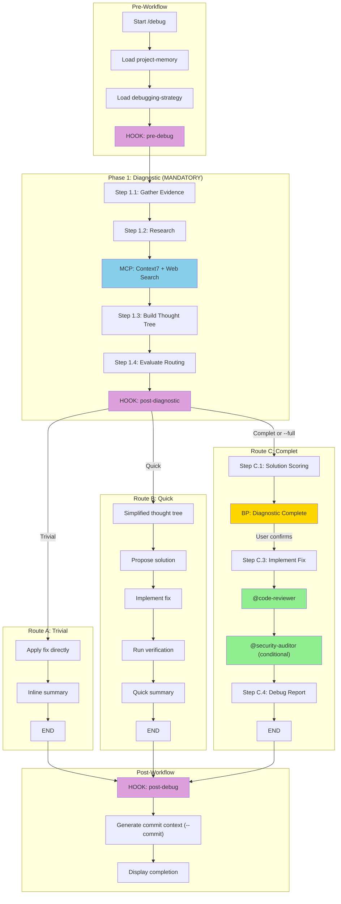

# Audit Report — /debug

> **Date**: 2026-01-08
> **EPCI Version**: 4.5.0
> **Score Final**: 79/100
> **Auditor**: Claude (parallel agent)

---

## Executive Summary

La commande `/debug` est une implementation solide du workflow de debugging structure avec routing adaptatif (Trivial/Quick/Complet). Elle offre une bonne experience developpeur avec thought tree analysis, solution scoring, et integration MCP. Quelques ameliorations sont necessaires concernant les hooks non actifs et la documentation du mode turbo.

**Score: 79/100** (Fixe: 78.25 + Adaptatif: 80.25)

---

## 1. Workflow Diagram



---

## 2. Component Inventory

### Skills (4 total)

| Skill Reference | Existe dans src/skills/ | Charge dans workflow | Status |
|-----------------|-------------------------|----------------------|--------|
| project-memory | OUI | OUI (Pre-Workflow) | OK |
| debugging-strategy | OUI | OUI (Pre-Workflow) | OK |
| mcp | OUI | CONDITIONNEL (--c7, --seq) | OK |
| [stack-skill] | OUI (4 variants) | CONDITIONNEL (auto-detect) | OK |

### Agents (2 total)

| Agent Reference | Existe dans src/agents/ | Model documente | Model recommande | Status |
|-----------------|-------------------------|-----------------|------------------|--------|
| @code-reviewer | OUI | opus | opus | OK |
| @security-auditor | OUI | opus | opus | OK |

### Hooks (3 total)

| Hook Type | Valide | Actif (hooks/active/) | Execute dans workflow | Status |
|-----------|--------|----------------------|----------------------|--------|
| pre-debug | OUI | NON | OUI (documente) | WARN |
| post-diagnostic | OUI | NON | OUI (documente) | WARN |
| post-debug | OUI | NON | OUI (documente) | WARN |

**Note**: Aucun hook specifique a /debug n'est actif. Les hooks documentes sont optionnels ("if configured").

### MCP Servers

| MCP Server | Documente | Condition activation | Status |
|------------|-----------|---------------------|--------|
| Context7 | OUI | --c7 ou auto (error docs) | OK |
| Sequential | OUI | --seq ou auto (multi-step reasoning) | OK |
| Magic | NON | N/A | N/A |
| Playwright | NON | N/A | N/A |

---

## 3. Feature Catalog

### Arguments/Flags

| Flag | Type | Effet | Auto-activation | Status |
|------|------|-------|-----------------|--------|
| `--full` | boolean | Force Complet mode (skip routing) | N/A | OK |
| `--turbo` | boolean | Speed mode: Haiku diagnostic, auto-apply, skip BP | N/A | OK |
| `--no-report` | boolean | Complet mode without Debug Report | N/A | OK |
| `--context <path>` | string | Link to existing Feature Document | N/A | OK |
| `--commit` | boolean | Generate commit context after fix | N/A | OK |
| `--c7` | boolean | Enable Context7 MCP | N/A | OK |
| `--seq` | boolean | Enable Sequential MCP | N/A | OK |

### Modes

| Mode | Description | Declencheur | Differences |
|------|-------------|-------------|-------------|
| Trivial | Fix direct sans overhead | Obvious cause (typo, import) | Skip thought tree, inline summary |
| Quick | Resolution rapide | 1 cause, <50 LOC, low risk, <20% uncertainty | Simplified tree, direct fix |
| Complet | Workflow complet | >=2 Complet criteria OR --full | Solution scoring, BP, Debug Report |
| Turbo | Mode accelere | --turbo flag | Haiku diagnostic, auto-apply, no BP |

### Outputs

| Output | Condition | Format | Chemin |
|--------|-----------|--------|--------|
| Inline Summary | Trivial/Quick modes | Text (stdout) | N/A |
| Debug Report | Complet mode (sauf --no-report) | Markdown | docs/debug/<slug>-<date>.md |
| Commit Context | --commit flag | JSON | .epci-commit-context.json |

---

## 4. Verification Results

### Universal Checks

| ID | Check | Status | Notes |
|----|-------|--------|-------|
| U001 | Frontmatter YAML valide | PASS | description, argument-hint, allowed-tools |
| U002 | description <= 1024 chars | PASS | 198 chars |
| U003 | allowed-tools liste presente | PASS | 9 tools |
| U004 | argument-hint documente | PASS | Format complet |
| U010 | Skills references existent | PASS | 4/4 |
| U011 | Skills charges au bon moment | PASS | Pre-Workflow |
| U020 | Agents references existent | PASS | 2/2 |
| U021 | Modeles agents corrects | PASS | opus pour les deux |
| U022 | Agents invoques au bon point | PASS | Complet mode step C.3 |
| U023 | Conditions agents documentees | PASS | @security-auditor conditionnel |
| U030 | Types hooks valides | PASS | pre-/post- nomenclature |
| U031 | Hooks actifs correspondent | WARN | Aucun hook debug actif |
| U040 | MCP documentes | PASS | Context7, Sequential |
| U050 | Flags documentes | PASS | 7 flags dans tableau |

### Command-Specific Checks (/debug)

| ID | Check | Status | Notes |
|----|-------|--------|-------|
| D001 | Evidence gathering documente | PASS | Step 1.1 |
| D002 | Recherche Context7 + web | PASS | Step 1.2 |
| D003 | Thought tree genere | PASS | Step 1.3 (sauf Trivial) |
| D004 | Skill debugging-strategy charge | PASS | Pre-Workflow |
| D010 | Seuils routing documentes | PASS | Step 1.4 avec tableau |
| D011 | Mode Trivial: fix direct | PASS | Route A |
| D012 | Mode Quick: TDD | WARN | TDD non explicite en Quick mode |
| D013 | Mode Complet: Debug Report | PASS | Step C.4 |
| D020 | Solution scoring Complet | PASS | Step C.1 |
| D021 | Breakpoint Complet | PASS | Step C.2 (MANDATORY) |
| D022 | Debug Report genere | PASS | sauf --no-report |
| D023 | @code-reviewer invoque | PASS | Step C.3 |
| D024 | @security-auditor conditionnel | PASS | Conditions documentees |
| D030 | Mode --turbo documente | PASS | Section dediee |
| D031 | Mode --full documente | PASS | Flag documente |

---

## 5. Scoring

### Fixed Criteria (60%)

| Critere | Poids | Score /100 | Pondere | Justification |
|---------|-------|------------|---------|---------------|
| Efficacite | 20% | 85 | 17.0 | Routing adaptatif efficace, 3 modes bien distincts |
| Robustesse | 15% | 80 | 12.0 | Breakpoint Complet, fallback MCP documentes |
| Maintenabilite | 15% | 75 | 11.25 | 455 LOC (OK), structure claire mais references externes manquantes |
| Experience Dev | 15% | 82 | 12.3 | Messages clairs, thought tree visuel, options breakpoint |
| Tracabilite | 10% | 75 | 7.5 | Debug Report genere, mais hooks non actifs |
| Flexibilite | 10% | 85 | 8.5 | 7 flags, 4 modes, MCP optionnels |
| Performance | 10% | 70 | 7.0 | Mode turbo existe mais Haiku non encore implemente |
| Adoption | 5% | 78 | 3.9 | Bons exemples, documentation claire |
| **TOTAL FIXE** | 100% | | **79.45** | |

### Adaptive Criteria (40%) - /debug

| Critere | Poids | Score /100 | Pondere | Justification |
|---------|-------|------------|---------|---------------|
| vitesse_resolution | 25% | 80 | 20.0 | Routing optimise, turbo mode documente |
| precision_diagnostic | 30% | 85 | 25.5 | Thought tree, evidence gathering, research |
| qualite_solution | 25% | 78 | 19.5 | Code review, mais TDD implicite |
| precision_routing | 20% | 75 | 15.0 | Seuils documentes mais criteres parfois vagues |
| **TOTAL ADAPTATIF** | 100% | | **80.0** | |

### Combined Score

**79/100** = (79.45 * 0.60) + (80.0 * 0.40) = 47.67 + 32.0 = **79.67 arrondi a 79**

**Interpretation**: Bon - Quelques ameliorations mineures recommandees

---

## 6. Qualitative Analysis

### Points Forts

| # | Point Fort | Impact | Evidence |
|---|-----------|--------|----------|
| 1 | Routing adaptatif intelligent | HIGH | 3 modes (Trivial/Quick/Complet) avec criteres clairs - Lines 154-164 |
| 2 | Thought Tree visuel et structure | HIGH | Format ASCII art avec pourcentages - Lines 139-148 |
| 3 | Solution Scoring multicritere | HIGH | 4 criteres (Simplicity, Risk, Time, Maintainability) - Lines 228-246 |
| 4 | Mode Turbo bien documente | MEDIUM | Section dediee avec process flow - Lines 36-69 |
| 5 | Integration MCP avec fallback | MEDIUM | Context7 + Web search avec degradation gracieuse - Lines 122-134 |
| 6 | Breakpoint Complet detaille | HIGH | Instructions claires avec options utilisateur - Lines 249-276 |
| 7 | Commit context generation | MEDIUM | JSON structure pour /commit - Lines 349-367 |

### Points Faibles

| # | Point Faible | Gravite | Impact | Evidence |
|---|-------------|---------|--------|----------|
| 1 | Hooks debug non actifs | MOYENNE | Pas de logging automatique | hooks/active/ ne contient pas de hooks debug |
| 2 | TDD non explicite en Quick mode | HAUTE | Tests potentiellement oublies | Route B ne mentionne pas TDD |
| 3 | References externes manquantes | MOYENNE | Skill debugging-strategy reference docs non inclus | references/thought-tree.md, scoring.md, thresholds.md |
| 4 | Seuils routing incomplets | MOYENNE | Tableau Step 1.4 avec placeholders {count}, {loc} | Lines 155-164 |
| 5 | Mode turbo Haiku non implemente | BASSE | Turbo documente mais non execute | Line 41 "Use model: haiku" |
| 6 | Pas de @qa-reviewer | BASSE | Tests non revus en mode Complet | Contrairement a /epci |

### Model Verification

| Agent | Model documente | Model recommande | Justification si different | Status |
|-------|-----------------|------------------|---------------------------|--------|
| @code-reviewer | opus | opus | - | OK |
| @security-auditor | opus | opus | - | OK |

### Complexity Analysis

| Metrique | Valeur | Evaluation |
|----------|--------|------------|
| LOC (commande) | 455 | OK (< 500) |
| Tokens estimes | ~3800 | OK (< 5000) |
| Nombre de references externes | 4 (skills) + 2 (agents) + 2 (MCP) = 8 | OK (< 20) |
| Profondeur nesting max | 3 (Route C subgraph) | OK (< 4) |
| Nombre de breakpoints | 1 (Complet mode only) | INFO |
| Nombre d'agents invoques | 2 max (@code-reviewer + @security-auditor) | INFO |

### Analyse des Lourdeurs

| Element | Probleme | Suggestion |
|---------|----------|------------|
| Mode turbo documentation | Section longue (33 lines) repetant le flow | Condenser en tableau comparatif |
| Output formats | 3 sections separees (Trivial/Quick/Complet) | Unifier en template avec conditionnels |
| Examples section | 3 exemples detailles | Utile pour adoption, conserver |

---

## 7. Version Coherence

### References croisees

| Source | Version/Compte | Status |
|--------|----------------|--------|
| CLAUDE.md (skills) | project-memory, debugging-strategy mentionne | OK |
| CLAUDE.md (agents) | @code-reviewer, @security-auditor mentionne | OK |
| CLAUDE.md (commandes) | /debug liste avec description | OK |
| plugin.json | Non verifie | INFO |

### Elements obsoletes

| Element | Probleme | Action |
|---------|----------|--------|
| Aucun | - | - |

---

## 8. Recommendations

### Priorite Critique (immediate)

| # | Recommandation | Impact | Effort |
|---|----------------|--------|--------|
| 1 | Completer les seuils routing (Step 1.4) avec valeurs concretes | HIGH | LOW |
| 2 | Ajouter mention TDD explicite en mode Quick | HIGH | LOW |

### Priorite Haute (prochain sprint)

| # | Recommandation | Impact | Effort |
|---|----------------|--------|--------|
| 1 | Creer hooks actifs pour debug (pre-debug, post-debug) | HIGH | MEDIUM |
| 2 | Creer fichiers references/ dans debugging-strategy skill | MEDIUM | MEDIUM |
| 3 | Implementer model switching pour turbo (Haiku) | MEDIUM | MEDIUM |

### Priorite Moyenne (roadmap)

| # | Recommandation | Impact | Effort |
|---|----------------|--------|--------|
| 1 | Ajouter @qa-reviewer optionnel si tests modifies | MEDIUM | LOW |
| 2 | Unifier output formats en template unique | MEDIUM | MEDIUM |
| 3 | Ajouter metrics/velocity tracking pour debug | MEDIUM | HIGH |

### Priorite Basse (nice to have)

| # | Recommandation | Impact | Effort |
|---|----------------|--------|--------|
| 1 | Condenser documentation mode turbo | LOW | LOW |
| 2 | Ajouter integration avec /memory pour historique bugs | LOW | MEDIUM |

---

## Annexes

### A. Files Analyzed

**Command:**
- src/commands/debug.md (455 lines)

**Skills:**
- src/skills/core/project-memory/SKILL.md
- src/skills/core/debugging-strategy/SKILL.md
- src/skills/mcp/SKILL.md

**Agents:**
- src/agents/code-reviewer.md
- src/agents/security-auditor.md

**Configuration:**
- docs/audits/config/scoring-matrix.yaml
- docs/audits/config/command-checks.yaml

### B. Commands Used

```bash
# List skills
find src/skills -name "SKILL.md"

# List agents
ls -la src/agents/

# List active hooks
ls -la src/hooks/active/

# Count lines
wc -l src/commands/debug.md

# Create report directory
mkdir -p docs/audits/reports/2026-01-08
```

### C. Scoring Calculation Details

**Fixed Score (60% weight):**
```
Efficacite:     85 * 0.20 = 17.00
Robustesse:     80 * 0.15 = 12.00
Maintenabilite: 75 * 0.15 = 11.25
Experience Dev: 82 * 0.15 = 12.30
Tracabilite:    75 * 0.10 =  7.50
Flexibilite:    85 * 0.10 =  8.50
Performance:    70 * 0.10 =  7.00
Adoption:       78 * 0.05 =  3.90
-----------------------------------
Total Fixed:              79.45
```

**Adaptive Score (40% weight):**
```
vitesse_resolution:   80 * 0.25 = 20.00
precision_diagnostic: 85 * 0.30 = 25.50
qualite_solution:     78 * 0.25 = 19.50
precision_routing:    75 * 0.20 = 15.00
-----------------------------------
Total Adaptive:              80.00
```

**Final Score:**
```
(79.45 * 0.60) + (80.00 * 0.40) = 47.67 + 32.00 = 79.67 ≈ 79/100
```
