# Audit Report — /epci

> **Date**: 2026-01-08
> **EPCI Version**: 4.5.0
> **Score Final**: 88/100
> **Auditor**: Claude (parallel agent)

---

## Executive Summary

La commande `/epci` est le workflow complet 3 phases (STANDARD/LARGE) du plugin EPCI. Elle offre une excellente structure avec validation à chaque étape, orchestration multi-agents sophistiquée, et traçabilité via Feature Document. Les points forts sont la robustesse des validations, la flexibilité des modes (turbo, large, safe, wave), et l'intégration hooks complète. Les axes d'amélioration concernent principalement la longueur du fichier (725 LOC) et la complexité pour les nouveaux utilisateurs.

**Score: 88/100** (Fixe: 86.6 + Adaptatif: 91.1)

---

## 1. Workflow Diagram

```mermaid
flowchart TB
    subgraph Phase1["Phase 1: Planification"]
        direction TB
        P1_START["Read Feature Document §1"]
        P1_HOOK_PRE["HOOK: pre-phase-1"]
        P1_PLAN["Direct Planning<br/>(Atomic tasks 2-15 min)"]
        P1_TURBO{"--turbo?"}
        P1_PLANNER["@planner (sonnet)"]
        P1_VALIDATOR["@plan-validator (opus)"]
        P1_EDIT["Edit §2 Implementation Plan"]
        P1_HOOK_POST["HOOK: post-phase-1"]
        P1_BP["BP1: Plan Validé"]
    end

    subgraph Phase2["Phase 2: Implementation"]
        direction TB
        P2_START["Start TDD Cycle"]
        P2_HOOK_PRE["HOOK: pre-phase-2"]
        P2_TURBO{"--turbo?"}
        P2_IMPL["@implementer (sonnet)"]
        P2_TDD["RED-GREEN-REFACTOR<br/>Per Task"]
        P2_REVIEWS{"Reviews"}
        P2_CR["@code-reviewer (opus)<br/>MANDATORY"]
        P2_SA["@security-auditor (opus)<br/>if auth/security files"]
        P2_QA["@qa-reviewer (sonnet)<br/>if 5+ test files"]
        P2_PARALLEL["PARALLEL REVIEWS<br/>(--turbo mode)"]
        P2_SUGGEST["Proactive Suggestions<br/>(F06)"]
        P2_EDIT["Edit §3 Part 1"]
        P2_HOOK_POST["HOOK: post-phase-2"]
        P2_BP["BP2: Code Implémenté"]
    end

    subgraph Phase3["Phase 3: Finalization"]
        direction TB
        P3_START["Structured Commit Prep"]
        P3_DOC["@doc-generator (sonnet)"]
        P3_EDIT["Edit §3 Part 2"]
        P3_CONTEXT["Write .epci-commit-context.json"]
        P3_HOOK_POST["HOOK: post-phase-3 (CRITICAL)"]
        P3_COMPLETE["FEATURE COMPLETE"]
    end

    P1_START --> P1_HOOK_PRE
    P1_HOOK_PRE --> P1_TURBO
    P1_TURBO -->|Yes| P1_PLANNER
    P1_TURBO -->|No| P1_PLAN
    P1_PLANNER --> P1_VALIDATOR
    P1_PLAN --> P1_VALIDATOR
    P1_VALIDATOR --> P1_EDIT
    P1_EDIT --> P1_HOOK_POST
    P1_HOOK_POST --> P1_BP

    P1_BP -->|"User: Continuer"| P2_START
    P2_START --> P2_HOOK_PRE
    P2_HOOK_PRE --> P2_TURBO
    P2_TURBO -->|Yes| P2_IMPL
    P2_TURBO -->|No| P2_TDD
    P2_IMPL --> P2_PARALLEL
    P2_TDD --> P2_REVIEWS
    P2_REVIEWS --> P2_CR
    P2_CR --> P2_SA
    P2_SA --> P2_QA
    P2_PARALLEL --> P2_SUGGEST
    P2_QA --> P2_SUGGEST
    P2_SUGGEST --> P2_EDIT
    P2_EDIT --> P2_HOOK_POST
    P2_HOOK_POST --> P2_BP

    P2_BP -->|"User: Continuer"| P3_START
    P3_START --> P3_DOC
    P3_DOC --> P3_EDIT
    P3_EDIT --> P3_CONTEXT
    P3_CONTEXT --> P3_HOOK_POST
    P3_HOOK_POST --> P3_COMPLETE

    style P1_BP fill:#ffd700
    style P2_BP fill:#ffd700
    style P1_VALIDATOR fill:#90EE90
    style P1_PLANNER fill:#90EE90
    style P2_IMPL fill:#90EE90
    style P2_CR fill:#90EE90
    style P2_SA fill:#90EE90
    style P2_QA fill:#90EE90
    style P3_DOC fill:#90EE90
    style P1_HOOK_PRE fill:#DDA0DD
    style P1_HOOK_POST fill:#DDA0DD
    style P2_HOOK_PRE fill:#DDA0DD
    style P2_HOOK_POST fill:#DDA0DD
    style P3_HOOK_POST fill:#DDA0DD
```



---

## 2. Component Inventory

### Skills (10 total)

| Skill Reference | Existe dans src/skills/ | Charge dans workflow | Status |
|-----------------|-------------------------|----------------------|--------|
| project-memory | OUI | Phase 1 (via FD §1) | OK |
| epci-core | OUI | Phase 1 | OK |
| architecture-patterns | OUI | Phase 1 | OK |
| flags-system | OUI | Phases 1-2 | OK |
| testing-strategy | OUI | Phase 2 | OK |
| code-conventions | OUI | Phase 2 | OK |
| git-workflow | OUI | Phase 3 | OK |
| breakpoint-metrics | OUI | BP1, BP2 | OK |
| proactive-suggestions | OUI | Phase 2 (post-review) | OK |
| stack skills | OUI (4 disponibles) | CONDITIONNEL | OK |

### Agents (7 total)

| Agent Reference | Existe dans src/agents/ | Model documente | Model recommande | Status |
|-----------------|-------------------------|-----------------|------------------|--------|
| @plan-validator | OUI | opus | opus | OK |
| @code-reviewer | OUI | opus | opus | OK |
| @security-auditor | OUI | opus | opus | OK |
| @qa-reviewer | OUI | sonnet | sonnet | OK |
| @doc-generator | OUI | sonnet | sonnet | OK |
| @planner | OUI | sonnet | sonnet | OK |
| @implementer | OUI | sonnet | sonnet | OK |

### Hooks (6 types)

| Hook Type | Valide | Actif (hooks/active/) | Execute dans workflow | Status |
|-----------|--------|----------------------|----------------------|--------|
| pre-phase-1 | OUI | NON | OUI (si configure) | OK |
| post-phase-1 | OUI | NON | OUI (si configure) | OK |
| pre-phase-2 | OUI | OUI (pre-phase-2-lint.sh) | OUI | OK |
| post-phase-2 | OUI | OUI (post-phase-2-suggestions.py) | OUI | OK |
| post-phase-3 | OUI | OUI (post-phase-3-memory-update.py) | OUI (MANDATORY) | OK |
| on-breakpoint | OUI | OUI (on-breakpoint-memory-context.py) | OUI | OK |

### MCP Servers

| MCP Server | Documente | Condition activation | Status |
|------------|-----------|---------------------|--------|
| Context7 | OUI | `--c7` / persona architect/backend/doc | OK |
| Sequential | OUI | `--seq` / `--think-hard` / persona architect/security | OK |
| Magic | OUI | `--magic` / persona frontend | OK |
| Playwright | OUI | `--play` / persona frontend/qa | OK |

---

## 3. Feature Catalog

### Arguments/Flags

| Flag | Type | Effet | Auto-activation | Status |
|------|------|-------|-----------------|--------|
| `--large` | alias | Expand to `--think-hard --wave` | N/A | OK |
| `--turbo` | boolean | @planner/@implementer, parallel reviews, 1 BP | N/A | OK |
| `--continue` | boolean | Resume from last phase | N/A | OK |
| `--no-hooks` | boolean | Disable all hooks | N/A | OK |
| `--think` | boolean | Standard analysis (~4K tokens) | 3-10 files | OK |
| `--think-hard` | boolean | Deep analysis (~10K tokens) | >10 files | OK |
| `--ultrathink` | boolean | Critical analysis (~32K tokens) | Never | OK |
| `--safe` | boolean | Max validations, extra confirmations | Sensitive files | OK |
| `--uc` | boolean | Ultra-compressed output (30-50%) | context > 75% | OK |
| `--verbose` | boolean | Full detailed output | Never | OK |
| `--wave` | boolean | Multi-wave DAG orchestration | complexity > 0.7 | OK |
| `--wave-strategy` | string | `progressive` or `systematic` | with --wave | OK |
| `--sequential` | boolean | Force sequential agent execution | Never | OK |
| `--parallel` | boolean | Force all agents in parallel | Never | OK |
| `--c7` | boolean | Enable Context7 | persona match | OK |
| `--seq` | boolean | Enable Sequential | persona match | OK |
| `--magic` | boolean | Enable Magic (21st.dev) | persona frontend | OK |
| `--play` | boolean | Enable Playwright | persona frontend/qa | OK |
| `--no-mcp` | boolean | Disable all MCP servers | Never | OK |

### Modes

| Mode | Description | Declencheur | Differences |
|------|-------------|-------------|-------------|
| Standard | Full 3-phase workflow | Default | 3 breakpoints, manual TDD |
| Turbo | Speed-optimized | `--turbo` | 1 BP, @planner/@implementer, parallel reviews |
| Large | Deep analysis | `--large` | --think-hard + --wave |
| Safe | Maximum validation | `--safe` | All conditional agents mandatory |
| Wave | DAG orchestration | `--wave` | Parallel agent execution |

### Outputs

| Output | Condition | Format | Chemin |
|--------|-----------|--------|--------|
| Feature Document §2 | Always | Markdown | docs/features/<slug>.md |
| Feature Document §3 | Always | Markdown | docs/features/<slug>.md |
| Commit Context | Phase 3 | JSON | .epci-commit-context.json |
| Feature History | post-phase-3 | JSON | .project-memory/history/features/<slug>.json |

---

## 4. Verification Results

### Universal Checks

| ID | Check | Severity | Status |
|----|-------|----------|--------|
| U001 | Frontmatter YAML valide | CRITICAL | PASS |
| U002 | description <= 1024 chars | HIGH | PASS (191 chars) |
| U003 | allowed-tools liste presente | HIGH | PASS |
| U004 | argument-hint documente | MEDIUM | PASS |
| U010 | Skills references existent | CRITICAL | PASS |
| U011 | Skills charges au bon moment | HIGH | PASS |
| U020 | Agents references existent | CRITICAL | PASS |
| U021 | Modeles agents corrects | HIGH | PASS |
| U022 | Agents invoques au bon point | HIGH | PASS |
| U023 | Conditions agents documentees | MEDIUM | PASS |
| U030 | Types hooks valides | HIGH | PASS |
| U031 | Hooks actifs correspondants | MEDIUM | PASS |
| U032 | Hook post-phase-3 present | HIGH | PASS |
| U040 | MCP servers documentes | MEDIUM | PASS |
| U050 | Flags documentes | HIGH | PASS |
| U051 | Auto-activation flags documentee | MEDIUM | PASS |

### Command-Specific Checks (/epci)

| ID | Check | Severity | Status |
|----|-------|----------|--------|
| E001 | Feature Document §1 lu en debut Phase 1 | CRITICAL | PASS |
| E002 | @plan-validator invoque | CRITICAL | PASS |
| E003 | Feature Document §2 via Edit | HIGH | PASS |
| E004 | Breakpoint BP1 apres Phase 1 | HIGH | PASS |
| E005 | Hook post-phase-1 execute | MEDIUM | PASS |
| E010 | TDD applique (RED-GREEN-REFACTOR) | HIGH | PASS |
| E011 | @code-reviewer invoque (mandatory) | CRITICAL | PASS |
| E012 | @security-auditor conditionnel | HIGH | PASS |
| E013 | @qa-reviewer conditionnel | MEDIUM | PASS |
| E014 | Feature Document §3 Part 1 | HIGH | PASS |
| E015 | Breakpoint BP2 apres Phase 2 | HIGH | PASS |
| E016 | Hook post-phase-2 execute | MEDIUM | PASS |
| E020 | @doc-generator invoque | HIGH | PASS |
| E021 | Feature Document §3 Part 2 | HIGH | PASS |
| E022 | .epci-commit-context.json genere | CRITICAL | PASS |
| E023 | Hook post-phase-3 execute | CRITICAL | PASS |
| E030 | Mode --turbo documente | MEDIUM | PASS |
| E031 | Mode --large documente | MEDIUM | PASS |
| E032 | Mode --safe documente | MEDIUM | PASS |
| E033 | Mode --wave documente | MEDIUM | PASS |

**Result: 100% checks passed (36/36)**

---

## 5. Scoring

### Fixed Criteria (60%)

| Critere | Poids | Score /100 | Pondere | Justification |
|---------|-------|------------|---------|---------------|
| Efficacite | 20% | 85 | 17.0 | Workflow bien structure, etapes necessaires, turbo mode reduit overhead |
| Robustesse | 15% | 90 | 13.5 | Excellents breakpoints, @plan-validator gate-keeper, error handling |
| Maintenabilite | 15% | 78 | 11.7 | 725 LOC (WARN: >500), bonne structure, sections claires |
| Experience Dev | 15% | 88 | 13.2 | Messages clairs, breakpoints avec instructions explicites, preview phases |
| Tracabilite | 10% | 95 | 9.5 | Feature Document complet, hooks memory, commit context JSON |
| Flexibilite | 10% | 92 | 9.2 | 19 flags documentes, 5 modes, auto-detection |
| Performance | 10% | 85 | 8.5 | Wave orchestration DAG, parallel reviews turbo, tokens ~4800 |
| Adoption | 5% | 80 | 4.0 | Doc complete mais complexe, courbe apprentissage moyenne |
| **TOTAL FIXE** | 100% | | **86.6** | |

### Adaptive Criteria (40%)

| Critere | Poids | Score /100 | Pondere | Justification |
|---------|-------|------------|---------|---------------|
| conformite_tdd | 25% | 90 | 22.5 | Cycle RED-GREEN-REFACTOR documente, verification apres chaque task |
| transitions_phases | 25% | 88 | 22.0 | BP1/BP2 clairs, --continue resume, instructions explicites |
| orchestration_agents | 30% | 92 | 27.6 | 7 agents, conditions documentees, DAG structure, parallel mode |
| documentation | 20% | 95 | 19.0 | §1/§2/§3 complets, .epci-commit-context.json, memory update |
| **TOTAL ADAPTATIF** | 100% | | **91.1** | |

### Combined Score

**88/100** = (86.6 * 0.60) + (91.1 * 0.40) = 52.0 + 36.4

**Interpretation**: BON — Ameliorations mineures recommandees

---

## 6. Qualitative Analysis

### Points Forts

| # | Point Fort | Impact | Evidence |
|---|-----------|--------|----------|
| 1 | Structure 3 phases claire et progressive | HIGH | Lines 10-14, 252-384, 386-544, 547-695 |
| 2 | Validation multi-niveaux (@plan-validator → @code-reviewer → @security-auditor) | HIGH | Lines 287-290, 431-434 |
| 3 | Mode --turbo avec parallelisation agents | HIGH | Lines 28-99 |
| 4 | Feature Document comme fil rouge tracabilite | HIGH | Lines 144-162 |
| 5 | Hook post-phase-3 mandatory pour memory update | HIGH | Lines 649-673 |
| 6 | Breakpoints enrichis avec metrics (breakpoint-metrics skill) | MEDIUM | Lines 335-381, 498-543 |
| 7 | Proactive suggestions F06 integration | MEDIUM | Lines 436-452 |
| 8 | DAG orchestration avec wave strategy | MEDIUM | Lines 205-237 |

### Points Faibles

| # | Point Faible | Gravite | Impact | Evidence |
|---|-------------|---------|--------|----------|
| 1 | Fichier long (725 LOC) | MOYENNE | Maintenance plus difficile | wc -l: 725 |
| 2 | Complexite pour nouveaux utilisateurs | MOYENNE | Courbe apprentissage | 19 flags, 5 modes |
| 3 | Pas de diagramme dans le fichier lui-meme | BASSE | Comprehension workflow | Absent |
| 4 | Duplication partielle entre sections --turbo et standard | BASSE | Maintenance | Lines 28-99 vs 252-384 |
| 5 | Pas de validation explicite prerequis /brief | MOYENNE | Erreur utilisateur | Line 161 mentionne mais pas enforce |

### Model Verification

| Agent | Model documente | Model recommande | Justification si different | Status |
|-------|-----------------|------------------|---------------------------|--------|
| @plan-validator | opus | opus | Validation critique | OK |
| @code-reviewer | opus | opus | Qualite code critique | OK |
| @security-auditor | opus | opus | Securite critique | OK |
| @qa-reviewer | sonnet | sonnet | Tests standard | OK |
| @doc-generator | sonnet | sonnet | Documentation standard | OK |
| @planner | sonnet | sonnet | Rapidite turbo mode | OK |
| @implementer | sonnet | sonnet | Rapidite turbo mode | OK |

### Complexity Analysis

| Metrique | Valeur | Evaluation |
|----------|--------|------------|
| LOC (commande) | 725 | WARN (>500 <1000) |
| Tokens estimes | ~4800 | OK (<5000) |
| Nombre de references externes | 17 (10 skills + 7 agents) | OK (<20) |
| Profondeur nesting max | 3 | OK (<4) |
| Nombre de breakpoints | 2 (BP1, BP2) | INFO - Adequat pour workflow |
| Nombre d'agents invoques | 7 (5 std + 2 turbo) | INFO - Complet |

### Analyse des Lourdeurs

| Element | Probleme | Suggestion |
|---------|----------|------------|
| Section --turbo (lines 28-99) | 72 lignes detaillees | Extraire en reference externe si >80 LOC |
| Breakpoint templates (lines 335-381, 498-543) | Templates dupliques | Factoriser template commun avec variables |
| Flag documentation (lines 100-143) | Tableaux repetes | Reference vers src/settings/flags.md |

---

## 7. Version Coherence

### References croisees

| Source | Version/Compte | Status |
|--------|----------------|--------|
| CLAUDE.md (skills) | 25 skills mentionnes | OK (10 utilises par /epci) |
| CLAUDE.md (agents) | 10 agents mentionnes | OK (7 utilises par /epci) |
| CLAUDE.md (commandes) | 11 commandes | OK (/epci presente) |
| CLAUDE.md version | 4.5.0 | OK - Sync |

### Elements obsoletes

| Element | Probleme | Action |
|---------|----------|--------|
| @Plan mention (line 270) | Reference a agent supprime | Clarifier que c'est historique |
| pre-phase-3 (line 185) | Mentionne comme "removed" | OK - Document correctement |

---

## 8. Recommendations

### Priorite Critique (immediate)

| # | Recommandation | Impact | Effort |
|---|----------------|--------|--------|
| - | Aucun probleme critique identifie | - | - |

### Priorite Haute (prochain sprint)

| # | Recommandation | Impact | Effort |
|---|----------------|--------|--------|
| 1 | Ajouter validation prerequis /brief en debut Phase 1 | HIGH | LOW |
| 2 | Extraire section --turbo en skill dedié si >100 LOC | HIGH | MEDIUM |

### Priorite Moyenne (roadmap)

| # | Recommandation | Impact | Effort |
|---|----------------|--------|--------|
| 1 | Factoriser templates breakpoints BP1/BP2 | MEDIUM | LOW |
| 2 | Ajouter quick reference card en fin de document | MEDIUM | LOW |
| 3 | Reduire duplication flag docs → pointer vers flags.md | MEDIUM | LOW |

### Priorite Basse (nice to have)

| # | Recommandation | Impact | Effort |
|---|----------------|--------|--------|
| 1 | Ajouter diagramme Mermaid inline dans le fichier | LOW | LOW |
| 2 | Creer mode --guided pour nouveaux utilisateurs | LOW | HIGH |
| 3 | Ajouter exemples concrets par mode | LOW | MEDIUM |

---

## Annexes

### A. Files Analyzed

**Command:**
- src/commands/epci.md (725 lines)

**Skills referenced:**
- src/skills/core/project-memory/SKILL.md
- src/skills/core/epci-core/SKILL.md
- src/skills/core/architecture-patterns/SKILL.md
- src/skills/core/flags-system/SKILL.md
- src/skills/core/testing-strategy/SKILL.md
- src/skills/core/code-conventions/SKILL.md
- src/skills/core/git-workflow/SKILL.md
- src/skills/core/breakpoint-metrics/SKILL.md
- src/skills/core/proactive-suggestions/SKILL.md
- src/skills/stack/* (4 skills conditionnels)

**Agents analyzed:**
- src/agents/plan-validator.md (120 lines)
- src/agents/code-reviewer.md (149 lines)
- src/agents/security-auditor.md (194 lines)
- src/agents/qa-reviewer.md (207 lines)
- src/agents/doc-generator.md (254 lines)
- src/agents/planner.md (100 lines)
- src/agents/implementer.md (110 lines)

**Configuration files:**
- docs/audits/config/scoring-matrix.yaml
- docs/audits/config/command-checks.yaml

### B. Commands Used

```bash
# Date
date +%Y-%m-%d

# Agent listing
ls -la src/agents/

# Hook listing
ls -la src/hooks/active/

# Skill listing
find src/skills -name "SKILL.md" -exec dirname {} \; | xargs -I{} basename {}

# Line count
wc -l src/commands/epci.md

# Pattern search
grep -oP '@[a-zA-Z-]+' src/commands/epci.md
```

---

*Report generated: 2026-01-08*
*Audit methodology: UNIFIED_COMMAND_AUDIT.md v1.0*
