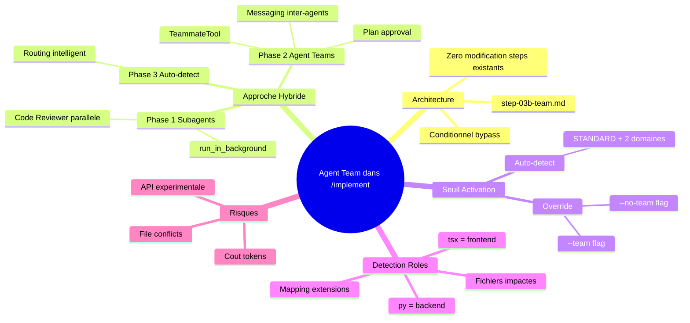

# Agent Team Orchestration dans /implement

> Genere le 2026-02-10 - 3 iterations - Template: feature - EMS final: 73/100

---

## 1. Contexte et Objectif

Avec la sortie d'Opus 4.6, Claude Code supporte nativement le concept d'Agent Teams : plusieurs agents independants coordonnes par un Team Lead via une task list partagee et du messaging inter-agents. Aujourd'hui, le skill `/implement` du plugin EPCI execute les phases Code et Inspect de maniere sequentielle avec un seul agent a la fois. Ce brainstorm explore comment integrer l'orchestration multi-agents pour paralleliser et specialiser l'execution.

**Question/probleme initial**:
> Comment integrer automatiquement le concept Agent Team dans la commande /implement pour spawner des agents specialises coordonnes par un Team Lead?

**Perimetre**:
- IN: Phases Code (C) et Inspect (I) du workflow EPCI
- IN: Detection dynamique des roles d'agents selon les fichiers impactes
- IN: Retrocompatibilite pour features simples (TINY/SMALL = mode classique)
- IN: Approche hybride progressive en 3 phases
- OUT: Phases Explore (E) et Plan (P) — inchangees
- OUT: Creation de nouveaux types d'agents (fichiers .md dans src/agents/)
- OUT: Refonte complete du workflow EPCI

**Criteres de succes definis**:
1. Une feature STANDARD avec >=2 domaines s'execute avec agents paralleles sans intervention manuelle
2. La review (Code Reviewer) tourne en parallele du code ou en fin de phase C
3. Les features simples (TINY/SMALL) continuent de fonctionner sans changement
4. Le step-03b-team.md s'integre sans modifier les step files existants

---

## 2. Synthese Executive

L'exploration a identifie deux mecanismes complementaires dans Claude Code pour le multi-agents : les **subagents** (Task tool + run_in_background, matures et stables) et les **Agent Teams** (TeammateTool, experimentaux mais puissants avec messaging inter-agents). Plutot qu'un choix binaire, l'approche retenue est un **deploiement hybride progressif** en 3 phases.

**Insight cle**: **L'Agent Team n'est pas un remplacement des subagents mais une evolution naturelle — la Phase 1 (subagents paralleles pour review) apporte 80% de la valeur avec 20% de la complexite, tandis que les Agent Teams (Phase 2) debloquent les scenarios multi-domaines complexes.**

**Decisions principales**:
1. Detection dynamique des roles selon les fichiers impactes dans le plan
2. Scope limite aux phases Code + Inspect
3. Approche hybride progressive (Phase 1: Subagents, Phase 2: Agent Teams, Phase 3: Auto-detect)
4. Nouveau step-03b-team.md additif (aucune modification des steps existants)
5. Seuil combine : auto-detect (STANDARD + >=2 domaines) OU flag --team/--no-team
6. Phase 1 MVP : Code Reviewer en parallele uniquement

**Routing recommande**: STANDARD → `/implement`

---

## 3. Personas et Scenarios d'Usage

### 3.1 Persona Principal: Developpeur EPCI

| Attribut | Description |
|----------|-------------|
| Role | Developpeur utilisant /implement pour des features multi-domaines |
| Objectif | Implementer une feature touchant backend + frontend + tests plus rapidement |
| Frustration actuelle | Execution sequentielle lente, review en fin de cycle qui decouvre des problemes tard |
| Niveau technique | Intermediaire a Expert |
| Contexte d'usage | CLI Claude Code, projets Django/React, features STANDARD ou LARGE |

**Scenario d'usage typique**:
> Le developpeur lance `/implement "ajouter OAuth Google"`. Le plan identifie des fichiers Python (backend auth) et des fichiers React (login component). Le seuil est atteint (STANDARD + 2 domaines). Le step-03b-team.md s'active : un implementer backend code l'API auth pendant qu'un implementer frontend code le composant login. En parallele, le Code Reviewer analyse le code produit. Le Team Lead (session principale) synthetise les resultats et passe a la finalisation.

### 3.2 Persona Secondaire: Mainteneur EPCI

| Attribut | Description |
|----------|-------------|
| Role | Mainteneur du plugin EPCI qui ajoute/modifie des skills |
| Objectif | Etendre le systeme d'orchestration sans casser le workflow existant |
| Niveau technique | Expert |

---

## 4. Analyse et Conclusions Cles

### 4.1 Deux mecanismes complementaires dans Claude Code

La recherche a revele que Claude Code offre deux approches distinctes pour le multi-agents, chacune avec des compromis clairs :

**Points cles**:
- **Subagents** (Task + run_in_background) : matures, stables, rapportent au parent seulement, pas de communication inter-agents
- **Agent Teams** (TeammateTool) : experimentaux, sessions independantes, messaging inter-agents, shared task list avec DAG

**Implications pour l'implementation**:
Le plugin EPCI utilise deja des subagents (planner, code-reviewer, etc.). La Phase 1 etend ce pattern existant avec le parallelisme. Les Agent Teams arrivent en Phase 2 quand le pattern est stabilise.

### 4.2 Architecture additive avec step-03b-team.md

L'insertion d'un nouveau step file entre le plan (step-02) et le code (step-03) permet une integration non-destructive.

**Points cles**:
- step-03b-team.md agit comme un "orchestrateur conditionnel"
- Si le seuil n'est pas atteint → skip direct vers step-03-code.md (mode classique)
- Si le seuil est atteint → orchestre les agents et alimente step-03/04 avec les resultats

**Implications pour l'implementation**:
Le SKILL.md du skill /implement doit etre mis a jour pour inclure le nouveau step dans le workflow. Le step-03b detecte les domaines depuis le plan valide en step-02.

### 4.3 Seuil de declenchement intelligent

Le seuil combine auto-detection et flag explicite pour maximiser la flexibilite.

**Points cles**:
- Auto-detect : complexite >= STANDARD ET >= 2 domaines technologiques dans le plan
- Override : `--team` force le mode equipe, `--no-team` force le mode classique
- Les domaines sont detectes depuis les extensions de fichiers dans le plan (*.py = backend, *.tsx = frontend, etc.)

**Implications pour l'implementation**:
La detection de domaines reutilise le mapping existant dans step-03-code.md (File Type → Stack Skill Mapping).

### 4.4 Contraintes de l'approche Agent Teams (Phase 2)

**Points cles**:
- Feature experimentale necessitant `CLAUDE_CODE_EXPERIMENTAL_AGENT_TEAMS=1`
- Pas de nested teams (teammates ne peuvent pas spawner d'equipes)
- Token cost lineaire avec le nombre de teammates
- Risque de file conflicts si meme fichiers edites par plusieurs agents

**Implications pour l'implementation**:
Phase 2 doit inclure un partitionnement explicite des fichiers par agent pour eviter les conflits. Le cout tokens doit etre documente dans le brief utilisateur.

---

## 5. User Stories et Criteres d'Acceptation

### US1: Activation automatique du mode equipe

**Story**: As a developer, I want /implement to automatically activate team mode when my feature spans multiple domains so that I get parallel execution without manual configuration.

**Priorite**: Must have

**Criteres d'acceptation**:
```gherkin
AC1: Auto-detection par domaines
Given un plan valide avec des fichiers dans >=2 domaines (ex: *.py et *.tsx)
When la complexite est >= STANDARD
Then le step-03b-team.md s'active automatiquement
And un message indique "Team mode activated: 2 domains detected"

AC2: Bypass pour features simples
Given un plan avec des fichiers dans 1 seul domaine
When la complexite est TINY ou SMALL
Then le step-03b-team.md est skippe
And l'execution suit le workflow classique step-03-code.md
```

**Edge cases identifies**:
- Plan avec uniquement des fichiers .md (documentation) → Pas de team mode (1 domaine)
- Plan avec *.py + *.html (meme stack Django) → Configurable (considerer comme 1 ou 2 domaines?)
- Plan vide ou invalide → Skip team mode, fallback classique

---

### US2: Override par flag --team/--no-team

**Story**: As a developer, I want to force or prevent team mode via CLI flags so that I have full control over the execution strategy.

**Priorite**: Must have

**Criteres d'acceptation**:
```gherkin
AC1: Flag --team force le mode equipe
Given n'importe quel plan
When l'utilisateur lance /implement avec --team
Then le step-03b-team.md s'active quelles que soient les conditions auto-detect

AC2: Flag --no-team desactive le mode equipe
Given un plan multi-domaines eligible
When l'utilisateur lance /implement avec --no-team
Then le step-03b-team.md est skippe
And l'execution suit le workflow classique
```

**Edge cases identifies**:
- --team sur une feature TINY → Fonctionne mais avertissement "Team mode on TINY feature may be overkill"
- --team et --no-team simultanes → Erreur avec message explicite

---

### US3: Review parallele (Phase 1 MVP)

**Story**: As a developer, I want the Code Reviewer to run in parallel with my implementation so that I get feedback faster and issues are caught earlier.

**Priorite**: Must have

**Criteres d'acceptation**:
```gherkin
AC1: Code Reviewer en background
Given le mode equipe est actif (Phase 1)
When l'implementation d'un composant est terminee
Then le Code Reviewer est lance en background sur le code produit
And les resultats sont agreges dans le Feature Document (section §4)

AC2: Synthese des findings
Given le Code Reviewer a termine son analyse
When le Team Lead (session principale) recoit les resultats
Then les findings sont categorises (Critical/Important/Minor)
And un breakpoint presente le verdict au developpeur
```

**Edge cases identifies**:
- Code Reviewer echoue (timeout, erreur) → Warning + continue sans review automatique
- Code Reviewer trouve des Critical → Breakpoint obligatoire avant de continuer

---

## 6. Decisions et Orientations Techniques

| Decision | Rationale | Impact | Confiance |
|----------|-----------|--------|-----------|
| D001: Detection dynamique des roles | Plus flexible que roles fixes, s'adapte a la diversite des features | Necessite mapping fichiers→domaines | High |
| D002: Scope phases C+I uniquement | Minimise l'impact sur le workflow existant | E et P inchanges | High |
| D003: Approche hybride progressive | 80% valeur avec 20% complexite en Phase 1, evolution naturelle | 3 phases de livraison | High |
| D004: Nouveau step-03b-team.md | Zero modification des steps existants, retrocompatibilite native | 1 fichier a creer | High |
| D005: Seuil combine auto + flag | Maximum de flexibilite, auto-detect intelligent + controle utilisateur | Logique conditionnelle dans step-03b | High |
| D006: MVP = Code Reviewer seul | Scope minimal, valeur immediate, incrementable | Security/QA en phases suivantes | High |

### Decisions differees
- Choix du modele pour les teammates Agent Teams (Phase 2) — Differe car: depend de l'evolution des couts. A revisiter: Phase 2
- Strategy de partitionnement fichiers en mode Agent Teams — Differe car: necessite experimentation. A revisiter: Phase 2

### Choix architecturaux
- **Pattern retenu**: Orchestrateur conditionnel (step-03b-team.md) avec bypass pour le mode classique
- **Justification**: Preserve le workflow existant, ajoute une couche d'orchestration uniquement quand necessaire

---

## 7. Priorisation MoSCoW

### Must Have (MVP) — ~60% effort
| # | Feature/Story | Effort estime | Dependance |
|---|---------------|---------------|------------|
| 1 | step-03b-team.md avec detection domaines | M | - |
| 2 | Flags --team / --no-team dans SKILL.md | S | #1 |
| 3 | Code Reviewer parallele (subagent background) | M | #1 |
| 4 | Synthese resultats et breakpoint verdict | S | #3 |

### Should Have — ~20% effort
| # | Feature/Story | Effort estime | Dependance |
|---|---------------|---------------|------------|
| 5 | Security Auditor parallele (conditionnel auth patterns) | S | #3 |
| 6 | QA Reviewer parallele | S | #3 |
| 7 | Integration Feature Document (§3 team, §4 review team) | S | #4 |

### Could Have — ~20% effort
| # | Feature/Story | Effort estime | Dependance |
|---|---------------|---------------|------------|
| 8 | Agent Teams (TeammateTool) pour features LARGE | L | #1-4 |
| 9 | Plan approval workflow pour teammates | M | #8 |
| 10 | Auto-detect optimal mode (subagents vs Agent Teams) | M | #8 |

### Won't Have (this release)
- Refonte complete du workflow EPCI — Raison: hors scope, trop risque
- Nested teams (teammates qui spawnent des equipes) — Raison: limitation technique Claude Code
- Mode equipe pour les phases Explore/Plan — Raison: decision D002

---

## 8. Contraintes et Dependances

### Contraintes techniques
| Type | Contrainte | Impact |
|------|------------|--------|
| Stack | Plugin EPCI en Markdown/Python | Step files en Markdown, scripts en Python |
| API | Agent Teams experimental (env var required) | Phase 2 depend de la stabilisation par Anthropic |
| Runtime | Context window par agent | Chaque teammate a son propre contexte, pas d'historique partage |
| Performance | Token cost lineaire avec nombre d'agents | Phase 1 (1 reviewer) = cout minimal, Phase 2 = cout significatif |
| Concurrence | File locking pour task claiming | Risque de race conditions sur les fichiers |

### Dependances externes
| Dependance | Type | SLA/Disponibilite | Fallback |
|------------|------|-------------------|----------|
| Claude Code Task tool | Interne (Anthropic) | Stable | Execution sequentielle classique |
| Agent Teams (TeammateTool) | Interne (Anthropic) | Experimental | Rester sur subagents (Phase 1) |
| Opus 4.6 model | Interne (Anthropic) | Production | Utiliser Sonnet pour teammates |

### Integrations requises
- **Systemes existants**: state-manager (tracking team), breakpoint-system (verdict team), complexity-calculator (seuil)
- **Mapping existant reutilise**: step-03-code.md File Type → Stack Skill Mapping pour detection domaines

---

## 9. Risques et Hypotheses

### Risques identifies

| Risque | Probabilite | Impact | Mitigation |
|--------|-------------|--------|------------|
| Agent Teams API change (experimental) | Medium | High | Phase 1 utilise subagents stables, Phase 2 est incrementale |
| File conflicts entre agents paralleles | Medium | Medium | Partitionnement fichiers par domaine, un agent = un ensemble de fichiers |
| Cout tokens excessif en mode equipe | Low | Medium | MVP = 1 reviewer seulement, monitoring du cout |
| Complexite maintenance step-03b-team.md | Low | Low | Step isole, zero impact sur steps existants |
| Team mode active sur features non adaptees | Low | Low | Seuil intelligent + flag --no-team de secours |

### Hypotheses (Assumptions)
- **Agent Teams resteront disponibles** — Si faux: Phase 2 reportee, Phase 1 (subagents) reste viable
- **Le Task tool supporte run_in_background de maniere fiable** — Si faux: review sequentielle (mode actuel)
- **Le plan (step-02) contient assez d'information pour detecter les domaines** — Si faux: enrichir le plan avec metadata domaines

---

## 10. Plan d'Action Haut Niveau

| Phase | Livrables | Effort estime | Owner | Prerequis |
|-------|-----------|---------------|-------|-----------|
| 1. MVP Subagents | step-03b-team.md, flags --team/--no-team, Code Reviewer parallele | ~4h | /implement | - |
| 2. Agent Teams | Integration TeammateTool pour LARGE features, plan approval | ~6h | /implement | Phase 1 + stabilisation API |
| 3. Auto-detect | Routing intelligent subagents vs Agent Teams | ~2h | /implement | Phase 2 |

**Effort total estime**: ~12h (2 jours)
**Chemin critique**: Phase 1 (MVP) → Phase 2 (Agent Teams) → Phase 3 (Auto-detect)

### Quick Wins (impact eleve, effort faible)
1. Code Reviewer en run_in_background dans step-03b — Feedback plus rapide sur le code sans changer l'architecture
2. Flag --team/--no-team — Controle utilisateur immediat, 0 risque

### Investissements Strategiques (impact eleve, effort eleve)
1. Integration Agent Teams (Phase 2) — Debloquerait l'execution parallele multi-domaines complete
2. Auto-detect intelligent (Phase 3) — Experience zero-config pour l'utilisateur

---

## 11. Mindmap de Synthese



---

## 12. Score EMS Final

```
EMS Final: 73/100 GOOD

Progression EMS
100 |
 90 | . . . . . . . . . . . . . . . . . . . .
 80 |
 73 |                  *  Fin
 70 | . . . . . . . . . . . . . . . . . . . .
 68 |            *----*
 61 |      *----*
 60 | . . . . . . . . . . . . . . . . . . . .
 40 |
 20 | *. . . . . . . . . . . . . . . . . . .
  0 +----+-----+-----+-----+
    Init  It.1  It.2  It.3

Axes finaux:
   Clarte       [████████░░] 76/100
   Profondeur   [███████░░░] 72/100
   Couverture   [███████░░░] 70/100
   Decisions    [█████████░] 88/100
   Actionab.    [████░░░░░░] 42/100
```

**Evaluation globale**: Exploration mature avec des decisions exceptionnellement solides (88/100). L'actionnabilite (42) reste le point faible — les actions sont nommees mais les owners/timelines seront definis lors du `/spec`.

### Verification des Criteres de Succes

| Critere | Statut | Evidence |
|---------|--------|----------|
| Feature STANDARD avec agents paralleles | ✅ Atteint | Architecture step-03b-team.md definie avec seuil auto-detect |
| Review integree en parallele | ✅ Atteint | Code Reviewer en run_in_background dans Phase 1 MVP |
| Retrocompatibilite features simples | ✅ Atteint | Bypass conditionnel quand seuil non atteint |
| Integration sans modifier steps existants | ✅ Atteint | Nouveau step-03b-team.md additif (Decision D004) |

---

## 13. Pistes Non Explorees

| Sujet | Pourquoi non explore | Valeur potentielle | Prochaine etape |
|-------|----------------------|-------------------|-----------------|
| Agents specialises par stack (Django agent, React agent) | Hors scope Phase 1, necessite experimentation | High | Explorer en Phase 2 avec Agent Teams |
| Monitoring des couts tokens par team | Pas assez de donnees reelles | Medium | Implementer metriques apres Phase 1 |
| Worktree Git pour isolation agents | Existe deja dans step-00c-worktree.md | Medium | Verifier compatibilite avec team mode |
| Communication inter-agents pour resolution de conflits | Depend d'Agent Teams (Phase 2) | High | Explorer avec TeammateTool messaging |
| Pipeline pattern (DAG de taches) | Complexite elevee pour le MVP | Medium | Potentiel Phase 3 |

---

## 14. References

### Documents analyses
- `/implement` SKILL.md et 12 step files: Architecture actuelle du workflow EPCI
- Feature Document template: Pattern d'update incremental par section
- src/agents/*.md (16 agents): Types et modeles des agents existants

### Recherches web
- [Claude Code Agent Teams — Official Docs](https://code.claude.com/docs/en/agent-teams): Documentation complete TeammateTool, shared task list, plan approval
- [Claude Code Swarm Orchestration Skill (GitHub Gist)](https://gist.github.com/kieranklaassen/4f2aba89594a4aea4ad64d753984b2ea): Patterns Leader, Swarm, Pipeline, Council avec exemples
- [Claude Code Swarms — Addy Osmani](https://addyosmani.com/blog/claude-code-agent-teams/): Best practices, sizing tasks, file conflict avoidance

### Conversations passees referencees
- Features index.json: 7 features precedentes implementees, pattern /quick et /implement

---

## 15. Prochaines Etapes

**Workflow recommande**:

| Etape | Skill | Action |
|-------|-------|--------|
| 1 | `/spec` | Transformer ce brief en specifications techniques avec tasks atomiques |
| 2 | `/implement` | Implementer Phase 1 (MVP) : step-03b-team.md + flags + Code Reviewer parallele |
| 3 | Test | Valider sur une feature STANDARD multi-domaines |
| 4 | `/implement` | Phase 2 : Integration Agent Teams pour features LARGE |

**Routing de complexite**: STANDARD
**Skill suggere**: /implement (multi-phase, architectural)

**Commande suggeree**:
```
/spec docs/briefs/agent-team-implement/brief-agent-team-implement-20260210.md
```
