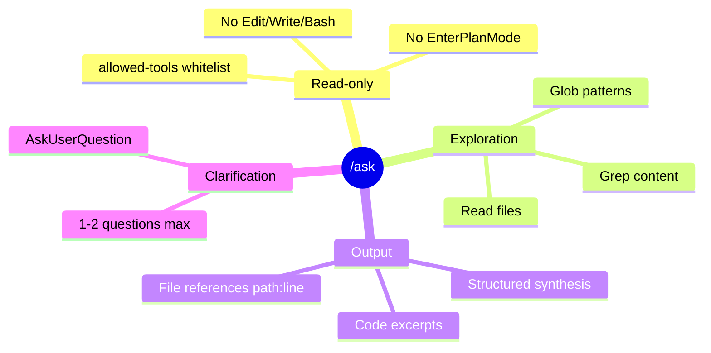

# Brief — `/ask` : Skill d'interrogation read-only

**Date** : 2026-03-20
**EMS Final** : 81/100
**Complexite** : TINY
**Routing** : /quick

---

## 1. Cadrage

**Question initiale** : Comment interroger la codebase sans risquer d'edition ou de plan accidentel ?

**Perimetre IN** :
- Skill `/ask` user-invocable
- Mode read-only strict via `allowed-tools`
- Reponses formatees avec liens fichiers et extraits

**Perimetre OUT** :
- Pas de steps/ (minimal)
- Pas de subagents dedies
- Pas de state/session
- Pas d'edition, plan ou commit

**Criteres de succes** :
- `/ask "comment fonctionne X ?"` retourne une reponse structuree
- Aucune edition de fichier possible
- Aucun passage en plan mode

---

## 2. Analyse

**Insight cle** : Le champ `allowed-tools` du frontmatter SKILL.md suffit a garantir le mode read-only. Pas besoin d'architecture complexe.

**Routing recommande** : /quick (TINY — un seul fichier a creer)

---

## 3. Personas

Non applicable (skill simple, pas de persona utilisateur).

---

## 4. Architecture

```
src/skills/ask/
  SKILL.md    # ~60-80 lignes, skill complet sans steps/
```

**Frontmatter** :
```yaml
---
name: epci:ask
description: >-
  Read-only codebase interrogation. Explores files, patterns and architecture
  without editing. Returns formatted answers with file references and code excerpts.
user-invocable: true
argument-hint: "<question about the codebase>"
allowed-tools: Read, Glob, Grep, AskUserQuestion
---
```

**Comportement attendu** :
1. Recevoir la question utilisateur
2. Explorer la codebase (Read, Glob, Grep) pour trouver les elements pertinents
3. Synthetiser une reponse structuree avec :
   - Fichiers concernes (`path:line`)
   - Extraits de code pertinents
   - Explication claire et concise
4. Si la question est ambigue, poser 1-2 questions de clarification via AskUserQuestion

**Regles APEX** :
- NEVER : editer, ecrire, creer des fichiers, lancer Bash, entrer en plan mode
- ALWAYS : citer les fichiers sources, montrer les extraits de code
- POSTURE : repondre de facon directe et synthetique

---

## 5. User Stories

**US-1 : Question d'architecture**

```gherkin
Given l'utilisateur invoque /ask "comment fonctionne le systeme de hooks ?"
When Claude recoit la question
Then Claude explore src/hooks/ via Glob et Read
And retourne une explication avec les fichiers cles et le flow
And aucun fichier n'est modifie
```

**US-2 : Question de localisation**

```gherkin
Given l'utilisateur invoque /ask "ou est defini le breakpoint-system ?"
When Claude recoit la question
Then Claude cherche via Grep/Glob les fichiers correspondants
And retourne le chemin exact avec numero de ligne
And aucun fichier n'est modifie
```

**US-3 : Question d'impact**

```gherkin
Given l'utilisateur invoque /ask "qui utilise la fonction validate_skill ?"
When Claude recoit la question
Then Claude grep les references a cette fonction
And retourne la liste des fichiers et lignes qui l'appellent
And aucun fichier n'est modifie
```

**Edge cases** :
- Question hors scope codebase → repondre qu'on ne peut explorer que le projet courant
- Question trop vague → AskUserQuestion pour clarifier
- Aucun resultat trouve → indiquer clairement qu'aucun element ne correspond

---

## 6. Contraintes techniques

- Aucune dependance externe
- Pas de fichiers de state
- Token budget du SKILL.md : < 2000 tokens (skill simple)

---

## 7. Priorites MoSCoW

| Priorite | Element |
|----------|---------|
| **Must** | allowed-tools read-only, reponse formatee avec fichiers:lignes |
| **Should** | Clarification si question ambigue |
| **Could** | Suggestions de questions connexes |
| **Won't** | Steps/, subagents, state, sessions |

---

## 8. Estimation

| Metrique | Valeur |
|----------|--------|
| Fichiers a creer | 1 (SKILL.md) |
| Fichiers a modifier | 1 (plugin.json) |
| Complexite | TINY |
| Effort estime | ~15 min |

---

## 9. Risques

| Risque | Probabilite | Impact | Mitigation |
|--------|-------------|--------|------------|
| Claude ignore les restrictions allowed-tools | Faible | Moyen | Le framework EPCI enforce le whitelist |
| Reponses trop longues | Moyen | Faible | Instruction de concision dans le SKILL.md |
| Confusion avec question libre | Moyen | Faible | Documentation claire de la valeur ajoutee |

---

## 10. Dependencies

Aucune. Skill autonome.

---

## 11. Mindmap



---

## 12. EMS Final

```
Iteration  | EMS
-----------|-----
Init       |  40
Iteration 1|  81  ← Final

Clarity      [██████████] 95%
Depth        [████████░░] 75%
Coverage     [███████░░░] 65%
Decisions    [████████░░] 80%
Actionability[█████████░] 90%
─────────────────────────────
Global:  81/100 — Mature
```

---

## 13. Decisions log

| # | Decision | Justification |
|---|----------|---------------|
| 1 | SKILL.md seul, sans steps/ | Complexite minimale pour un skill de consultation |
| 2 | Pas de subagents | Read+Glob+Grep suffisent pour l'exploration directe |
| 3 | allowed-tools comme garde-fou | Mecanisme natif du framework, zero code custom |

---

## 14. Next steps

1. `/quick` pour creer `src/skills/ask/SKILL.md`
2. Enregistrer dans `plugin.json`
3. Tester avec quelques questions types

---

## 15. Chaining

```
/brainstorm → /quick (TINY)
```
