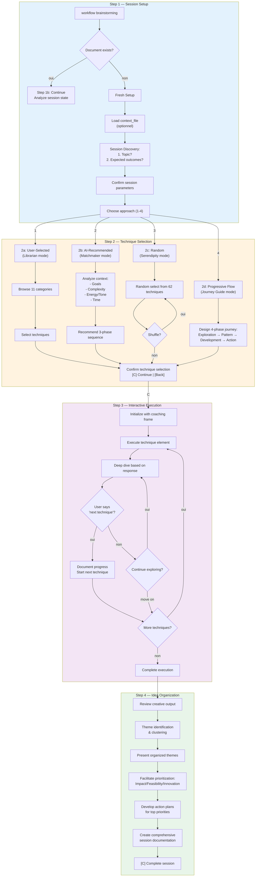
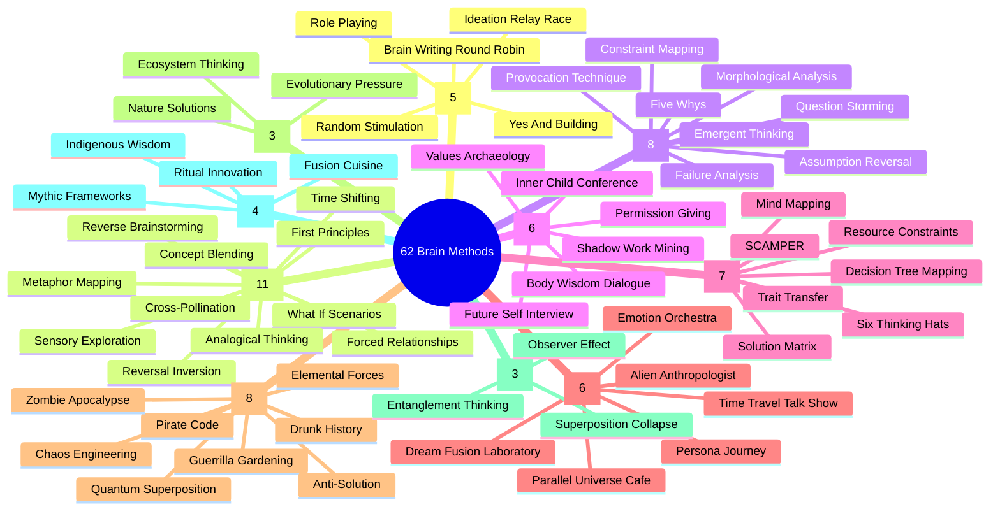

# Analyse du Système de Brainstorming BMAD

> **Date** : 2026-01-06
> **Objectif** : Analyse complète du système de brainstorming BMAD pour confrontation avec EPCI

---

## 1. Vue d'ensemble

**BMAD** (Build More, Architect Dreams) est un framework AI-driven pour le développement agile avec **21 agents spécialisés** et **50+ workflows guidés**. Le système de brainstorming fait partie du module **CIS** (Creative Intelligence Suite).

### Architecture Globale

| Aspect | Détail |
|--------|--------|
| **Framework** | BMad Core (Collaboration Optimized Reflection Engine) |
| **Modules** | BMM (Method), BMB (Builder), CIS (Creative Intelligence Suite), BMGD (Game Design) |
| **Brainstorming** | Workflow core + Module CIS |
| **Techniques** | 62 techniques en 11 catégories |
| **Agents créatifs** | 6 agents spécialisés (CIS) |

### Philosophie

- **Micro-file architecture** : Chaque step est un fichier autonome avec règles intégrées
- **Interactive facilitation** : L'IA guide par questions, ne génère pas à la place de l'utilisateur
- **Technique libraries** : Bases CSV de méthodes éprouvées
- **Energy monitoring** : Pacing adaptatif basé sur l'engagement

---

## 2. Architecture du Workflow Brainstorming

### 2.1 Structure des Fichiers

```
src/core/workflows/brainstorming/
├── workflow.md              # Configuration principale
├── brain-methods.csv        # 62 techniques de brainstorming
├── template.md              # Template de sortie
└── steps/
    ├── step-01-session-setup.md       # Setup + continuation detection
    ├── step-01b-continue.md           # Reprise de session
    ├── step-02a-user-selected.md      # Sélection utilisateur
    ├── step-02b-ai-recommended.md     # Recommandation IA
    ├── step-02c-random-selection.md   # Sélection aléatoire
    ├── step-02d-progressive-flow.md   # Flux progressif
    ├── step-03-technique-execution.md # Exécution interactive
    └── step-04-idea-organization.md   # Organisation + action plans
```

### 2.2 Flux Principal

```
Step 1 (Setup)
    │
    ├── Session existante? → Step 1b (Continue)
    │
    └── Nouvelle session
        │
        ├── Charger context_file (optionnel)
        ├── Questions de découverte:
        │   1. Sujet du brainstorming?
        │   2. Résultats attendus?
        │
        └── Choisir approche (1-4)
            │
            ├── [1] User-Selected    → Step 2a
            ├── [2] AI-Recommended   → Step 2b
            ├── [3] Random Selection → Step 2c
            └── [4] Progressive Flow → Step 2d
                    │
                    └── Step 3 (Execution)
                            │
                            └── Step 4 (Organization)
```

---

## 3. Les 4 Modes de Sélection de Techniques

### 3.1 Mode User-Selected (Step 2a)

**Rôle de l'IA** : Bibliothécaire de techniques (pas recommandeur)

**Process** :
1. Présenter les 11 catégories avec descriptions
2. L'utilisateur browse et sélectionne par catégorie
3. Confirmation des choix avec fit session
4. Back option toujours disponible

**Format présentation** :
```
**[1] Structured Thinking** (7 techniques)
- Systematic frameworks for thorough exploration
- Includes: SCAMPER, Six Thinking Hats, Mind Mapping...

**[2] Creative Innovation** (11 techniques)
- Innovative approaches for breakthrough thinking
- Includes: What If Scenarios, Analogical Thinking...
```

### 3.2 Mode AI-Recommended (Step 2b)

**Rôle de l'IA** : Matchmaker de techniques

**Analyse multi-dimensionnelle** :
1. **Goal Analysis** : Innovation → creative/wild, Problem Solving → deep/structured
2. **Complexity Match** : Complex → deep/structured, Familiar → creative/wild
3. **Energy/Tone** : Formel → structured, Playful → creative/theatrical
4. **Time Available** : <30min → 1-2 techniques, >60min → multi-phase

**Output** : Recommandation en 3 phases avec rationale détaillé

### 3.3 Mode Random Selection (Step 2c)

**Rôle de l'IA** : Facilitateur de sérendipité

**Philosophie** : "Random selection often leads to the most surprising breakthroughs"

**Features** :
- Option [Shuffle] pour re-randomiser
- "Random discovery bonus" pour chaque technique
- Building excitement around unexpected combinations

### 3.4 Mode Progressive Flow (Step 2d)

**Rôle de l'IA** : Guide de voyage créatif

**4 Phases** :

| Phase | Focus | Type de pensée | Techniques |
|-------|-------|----------------|------------|
| 1 | Expansive Exploration | Divergent | Creative, Wild |
| 2 | Pattern Recognition | Analytical | Deep, Structured |
| 3 | Idea Development | Convergent | Structured, Collaborative |
| 4 | Action Planning | Implementation | Structured, Analytical |

**Journey Map** avec transitions et timing total

---

## 4. Les 62 Techniques de Brainstorming

### 4.1 Catégorisation

| Catégorie | Nombre | Description |
|-----------|--------|-------------|
| **collaborative** | 5 | Group dynamics, inclusive participation |
| **creative** | 11 | Breakthrough thinking, paradigm shifts |
| **deep** | 8 | Root cause, strategic insight discovery |
| **introspective_delight** | 6 | Inner wisdom, authentic exploration |
| **structured** | 7 | Systematic frameworks, organized analysis |
| **theatrical** | 6 | Playful exploration, radical perspectives |
| **wild** | 8 | Extreme thinking, boundary pushing |
| **biomimetic** | 3 | Nature-inspired solutions |
| **quantum** | 3 | Quantum principles for innovation |
| **cultural** | 4 | Traditional/indigenous knowledge |

### 4.2 Liste Complète des Techniques

#### Collaborative (5)
1. **Yes And Building** — Build momentum through positive additions
2. **Brain Writing Round Robin** — Silent idea generation followed by building
3. **Random Stimulation** — Use random words/images as creative catalysts
4. **Role Playing** — Generate solutions from multiple stakeholder perspectives
5. **Ideation Relay Race** — Rapid-fire idea building under time pressure

#### Creative (11)
1. **What If Scenarios** — Explore radical possibilities
2. **Analogical Thinking** — Draw parallels to other domains
3. **Reversal Inversion** — Flip problems upside down
4. **First Principles Thinking** — Strip away assumptions, rebuild from fundamental truths
5. **Forced Relationships** — Connect unrelated concepts
6. **Time Shifting** — Explore solutions across different time periods
7. **Metaphor Mapping** — Use extended metaphors as thinking tools
8. **Cross-Pollination** — Transfer solutions from different industries
9. **Concept Blending** — Merge concepts to create new categories
10. **Reverse Brainstorming** — Generate problems instead of solutions
11. **Sensory Exploration** — Engage all five senses

#### Deep (8)
1. **Five Whys** — Drill down to root causes
2. **Morphological Analysis** — Systematically explore all parameter combinations
3. **Provocation Technique** — Use deliberately provocative statements
4. **Assumption Reversal** — Challenge and flip core assumptions
5. **Question Storming** — Generate questions before seeking answers
6. **Constraint Mapping** — Identify and visualize all constraints
7. **Failure Analysis** — Study successful failures for insights
8. **Emergent Thinking** — Allow solutions to emerge organically

#### Introspective Delight (6)
1. **Inner Child Conference** — Channel pure childhood curiosity
2. **Shadow Work Mining** — Explore what you're actively avoiding
3. **Values Archaeology** — Excavate deep personal values
4. **Future Self Interview** — Seek wisdom from wiser future self
5. **Body Wisdom Dialogue** — Let physical sensations guide ideation
6. **Permission Giving** — Grant explicit permission to think impossible thoughts

#### Structured (7)
1. **SCAMPER Method** — 7 lenses (Substitute/Combine/Adapt/Modify/Put/Eliminate/Reverse)
2. **Six Thinking Hats** — 6 distinct perspectives (White/Red/Yellow/Black/Green/Blue)
3. **Mind Mapping** — Visually branch ideas from central concept
4. **Resource Constraints** — Innovate by imposing extreme limitations
5. **Decision Tree Mapping** — Map all possible decision paths
6. **Solution Matrix** — Systematic grid of problem variables and solutions
7. **Trait Transfer** — Borrow attributes from successful solutions

#### Theatrical (6)
1. **Time Travel Talk Show** — Interview past/present/future selves
2. **Alien Anthropologist** — Examine problems through completely foreign eyes
3. **Dream Fusion Laboratory** — Start with impossible fantasy, reverse-engineer
4. **Emotion Orchestra** — Let different emotions lead separate sessions
5. **Parallel Universe Cafe** — Explore solutions under alternative reality rules
6. **Persona Journey** — Embody different archetypes

#### Wild (8)
1. **Chaos Engineering** — Deliberately break things to discover robust solutions
2. **Guerrilla Gardening Ideas** — Plant unexpected solutions in unlikely places
3. **Pirate Code Brainstorm** — Take what works from anywhere and remix
4. **Zombie Apocalypse Planning** — Design for extreme survival scenarios
5. **Drunk History Retelling** — Explain with uninhibited simplicity
6. **Anti-Solution** — Generate ways to make the problem worse
7. **Quantum Superposition** — Hold multiple contradictory solutions simultaneously
8. **Elemental Forces** — Solutions sculpted by natural elements

#### Biomimetic (3)
1. **Nature's Solutions** — Study how nature solves similar problems
2. **Ecosystem Thinking** — Analyze problem as ecosystem
3. **Evolutionary Pressure** — Apply evolutionary principles

#### Quantum (3)
1. **Observer Effect** — How observing changes solutions
2. **Entanglement Thinking** — Explore hidden connections
3. **Superposition Collapse** — Hold multiple solutions until constraints force collapse

#### Cultural (4)
1. **Indigenous Wisdom** — Draw upon traditional knowledge systems
2. **Fusion Cuisine** — Mix cultural approaches
3. **Ritual Innovation** — Apply ritual design principles
4. **Mythic Frameworks** — Use myths and archetypes as frameworks

---

## 5. Exécution Interactive (Step 3)

### 5.1 Principes de Facilitation

| Principe | Description |
|----------|-------------|
| **Creative Facilitator** | Vrai coaching back-and-forth, pas question-réponse |
| **One Element at a Time** | Une composante technique à la fois pour profondeur |
| **Dynamic Adaptation** | S'adapter à l'engagement et énergie de l'utilisateur |
| **User Control** | "next technique" ou "move on" à tout moment |
| **Organic Documentation** | Capturer insights au fur et à mesure |

### 5.2 Patterns de Réponse

**Quand l'utilisateur partage une idée excitante** :
```
"That's brilliant! I can feel the creative energy there. Let's explore this more deeply:
- What makes this idea so exciting to you?
- How would this actually work in practice?
- Could this be applied in unexpected ways?

Let me build on your idea: [Extend concept with own creative contribution]"
```

**Quand l'utilisateur semble incertain** :
```
"Great starting point! Sometimes the most powerful ideas need space to develop. Let's try:
- What if we removed all practical constraints?
- How would [stakeholder] respond to this idea?
- What's the most unexpected version of this concept?"
```

### 5.3 Check de Continuation

Avant de passer à l'élément suivant :
```
"Before we move to the next technique element:
- Are there aspects you'd like to explore further?
- Are there ideas you want to develop more deeply?
- Do you feel ready to move on?

Options:
- Continue exploring current element
- Move to next technique element
- Take a different angle
- Jump to most exciting idea

Remember: Say "next technique" anytime and I'll document progress and move on!"
```

---

## 6. Organisation des Idées (Step 4)

### 6.1 Process

1. **Review Creative Output** — Résumé des achievements
2. **Theme Identification** — Clustering par thèmes émergents
3. **Present Organized Themes** — Affichage structuré
4. **Facilitate Prioritization** — Framework Impact/Feasibility/Innovation/Alignment
5. **Develop Action Plans** — Next steps concrets pour top priorities
6. **Comprehensive Documentation** — Output final complet

### 6.2 Prioritization Framework

```
Prioritization Criteria:
- Impact: Potential effect on session topic success
- Feasibility: Implementation difficulty and resource requirements
- Innovation: Originality and competitive advantage
- Alignment: Match with stated constraints and goals

Quick Prioritization Exercise:
1. Top 3 High-Impact Ideas: Which concepts deliver greatest results?
2. Easiest Quick Wins: Which ideas implemented fastest?
3. Most Innovative Approaches: Which represent true breakthroughs?
```

### 6.3 Action Plan Template

```
Idea [Priority Number]: [Idea Name]
Why This Matters: [Connection to goals]

Next Steps:
1. [Specific action step 1]
2. [Specific action step 2]
3. [Specific action step 3]

Resources Needed: [List]
Timeline: [Implementation estimate]
Success Indicators: [How to measure]
```

---

## 7. Agents Créatifs (CIS Module)

### 7.1 Liste des Agents

| Agent | Icône | Titre | Style de Communication |
|-------|-------|-------|------------------------|
| Carson | 🧠 | Elite Brainstorming Specialist | Improv coach — "YES AND", high energy, celebrates wild thinking |
| Dr. Quinn | 🔬 | Master Problem Solver | Sherlock Holmes + playful scientist — deductive, curious, "AHA moments" |
| - | 🎨 | Design Thinking Coach | Human-centered design facilitation |
| - | 💡 | Innovation Strategist | Strategic disruption and business model innovation |
| - | 📖 | Storyteller | Whimsical master storyteller |
| - | 🎤 | Presentation Master | Compelling presentation crafting |

### 7.2 Agent Brainstorming Coach (Carson)

```yaml
persona:
  role: Master Brainstorming Facilitator + Innovation Catalyst
  identity: Elite facilitator with 20+ years leading breakthrough sessions.
            Expert in creative techniques, group dynamics, systematic innovation.
  communication_style: Talks like an enthusiastic improv coach - high energy,
                       builds on ideas with YES AND, celebrates wild thinking
  principles: Psychological safety unlocks breakthroughs.
              Wild ideas today become innovations tomorrow.
              Humor and play are serious innovation tools.
```

---

## 8. Workflows Créatifs Complémentaires (CIS)

| Workflow | Purpose | Méthodes |
|----------|---------|----------|
| **Design Thinking** | Human-centered design (5 phases) | Empathize → Define → Ideate → Prototype → Test |
| **Innovation Strategy** | Disruption opportunities | Jobs-to-be-Done, Blue Ocean, Value Chain |
| **Problem Solving** | Systematic challenge resolution | TRIZ, Theory of Constraints, Systems Thinking |
| **Storytelling** | Compelling narratives | Hero's Journey, Three-Act Structure, Story Brand |

---

## 9. Diagramme Mermaid — Flux Complet BMAD



---

## 10. Diagramme Mermaid — Catégories de Techniques



---

## 11. Points Clés du Système BMAD

### 11.1 Forces

1. **Richesse des techniques** — 62 techniques vs 5 frameworks (EPCI)
2. **4 modes de sélection** — User/AI/Random/Progressive vs mono-mode
3. **Facilitation interactive** — Vrai coaching, pas question-réponse
4. **Energy checkpoints** — Monitoring de l'engagement utilisateur
5. **Session continuation** — Reprise de sessions interrompues
6. **Documentation automatique** — Frontmatter state tracking
7. **Agents spécialisés** — Personas avec styles de communication distincts
8. **Action planning intégré** — Transformation idées → actions concrètes
9. **Catégorisation innovante** — Introspective, Quantum, Biomimetic, Cultural

### 11.2 Patterns Notables

| Pattern | Description |
|---------|-------------|
| **Micro-file architecture** | Steps autonomes avec règles intégrées |
| **"YES AND" philosophy** | Construire sur les idées, jamais rejeter |
| **Back navigation** | Toujours possible de revenir |
| **User control** | "next technique" à tout moment |
| **Serendipity mode** | Valeur du random dans la créativité |
| **Progressive flow** | Divergent → Convergent structuré |
| **Energy monitoring** | Adapter le pacing à l'engagement |

### 11.3 Différences avec EPCI

| Aspect | BMAD | EPCI |
|--------|------|------|
| **Techniques** | 62 techniques, 11 catégories | 5 frameworks (MoSCoW, 5 Whys, SWOT, Scoring, Pre-mortem) |
| **Modes sélection** | 4 modes (User/AI/Random/Progressive) | 1 mode (question itératif) |
| **Scoring** | Pas de score numérique | EMS sur 5 axes pondérés |
| **Phases** | 4 steps linéaires | 2 phases (Divergent/Convergent) |
| **Personas** | 6 agents CIS avec personnalités | 3 personas facilitation (Architecte/Sparring/Pragmatique) |
| **Output** | Session document avec action plans | Brief + Journal |
| **Continuation** | Detection automatique session | Pas de continuation |
| **Energy** | Checkpoints explicites | Pas de monitoring |

---

## 12. Prochaine Étape

Confrontation détaillée EPCI vs BMAD pour identifier les améliorations à intégrer dans EPCI v4.2.

---

*Document généré le 2026-01-06 — Analyse du système brainstorming BMAD v6*
