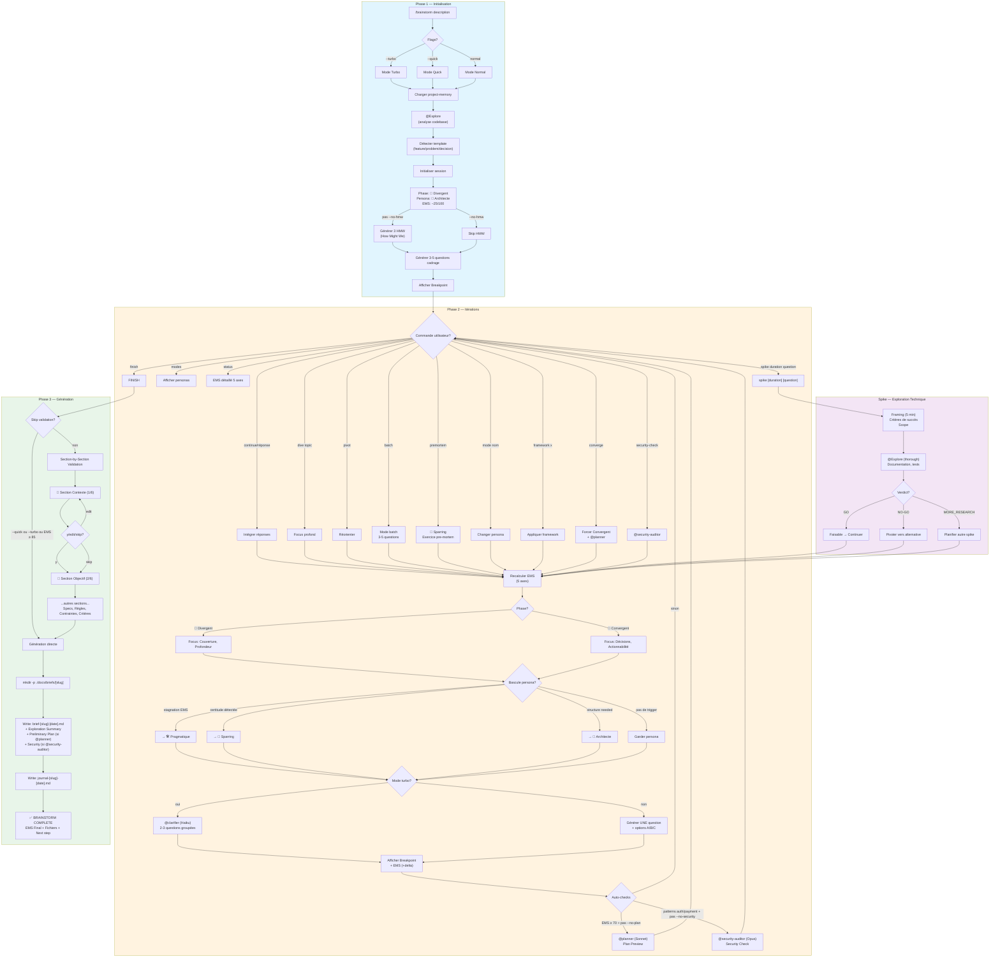
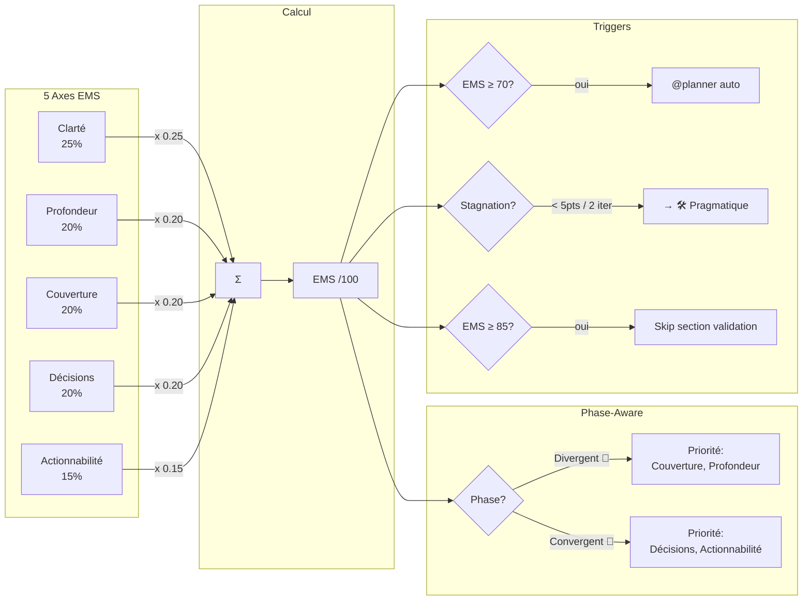
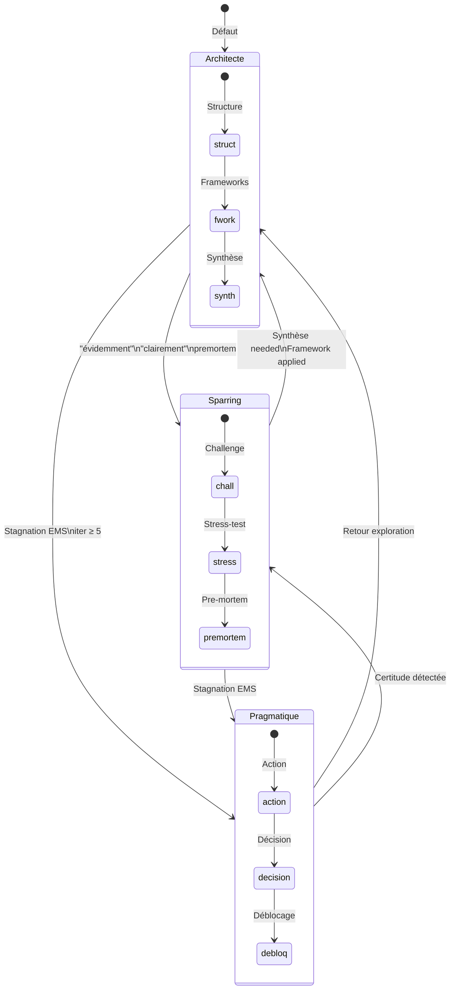

# État des Lieux — Système de Brainstorming EPCI v4.1

> **Date** : 2026-01-06
> **Objectif** : Analyse complète du système de brainstorming actuel avant amélioration

---

## 1. Vue d'ensemble

Le système `/brainstorm` est une commande EPCI qui transforme une idée vague en brief fonctionnel structuré via un processus itératif guidé. La version actuelle (v4.1) intègre le pattern "SuperPowers" avec des questions une-à-une et une validation section par section.

### Fichiers Analysés

| Fichier | Rôle |
|---------|------|
| `src/commands/brainstorm.md` | Commande principale |
| `src/skills/core/brainstormer/SKILL.md` | Skill core |
| `src/skills/core/brainstormer/references/*.md` | Références (EMS, personas, frameworks, brief-format) |
| `src/skills/personas/SKILL.md` | Personas EPCI globaux |
| `src/agents/planner.md` | Agent planification |
| `src/agents/clarifier.md` | Agent clarification rapide |
| `src/agents/security-auditor.md` | Agent audit sécurité |

---

## 2. Architecture des Composants

### 2.1 Commande Principale (`brainstorm.md`)

| Aspect | Détail |
|--------|--------|
| **Version** | 4.1 |
| **Entrée** | Description feature + flags optionnels |
| **Sortie** | Brief + Journal dans `./docs/briefs/[slug]/` |
| **Phases** | 3 (Init → Itérations → Génération) |
| **Thinking** | `think hard` (adaptatif selon complexité) |

**Flags supportés :**

| Flag | Effet |
|------|-------|
| `--template [name]` | Forcer template (feature/problem/decision) |
| `--no-hmw` | Désactiver génération des questions HMW |
| `--quick` | Mode rapide (3 iter max, skip section validation) |
| `--turbo` | Mode turbo: @clarifier (Haiku), max 3 iter, 2-3 questions groupées |
| `--no-security` | Désactiver @security-auditor auto-detection |
| `--no-plan` | Désactiver @planner auto-invocation en phase Convergent |

### 2.2 Skill Core (`brainstormer/SKILL.md`)

Fournit la logique métier avec 4 références spécialisées :

| Référence | Rôle |
|-----------|------|
| `ems-system.md` | Scoring EMS sur 5 axes pondérés |
| `personas.md` | 3 modes de facilitation |
| `frameworks.md` | 5 outils d'analyse (MoSCoW, 5 Whys, SWOT, Scoring, Pre-mortem) |
| `brief-format.md` | Templates de sortie brief + journal |

### 2.3 Agents Invoqués

| Agent | Model | Rôle | Invocation |
|-------|-------|------|------------|
| `@Explore` | sonnet | Analyse codebase initiale | Phase 1 (toujours) |
| `@clarifier` | haiku | Questions rapides | Mode `--turbo` |
| `@planner` | sonnet | Plan préliminaire | Phase Convergent ou EMS ≥ 70 |
| `@security-auditor` | opus | Audit OWASP | Auto si patterns auth/payment détectés |

### 2.4 Personas Brainstormer (3 modes de facilitation)

| Persona | Icône | Déclencheur | Style |
|---------|-------|-------------|-------|
| **Architecte** | 📐 | Défaut, sujets complexes | Structure, frameworks, synthèse |
| **Sparring** | 🥊 | "évidemment", "clairement", pre-mortem | Challenge, stress-test |
| **Pragmatique** | 🛠️ | Stagnation EMS, iter ≥ 5 | Action, déblocage |

**Règles de bascule automatique :**

| Contexte Détecté | Persona Activé |
|------------------|----------------|
| Début session, sujet complexe | 📐 Architecte |
| Application de framework, synthèse | 📐 Architecte |
| Mots-clés : "évidemment", "forcément", "clairement" | 🥊 Sparring |
| Exercice pre-mortem | 🥊 Sparring |
| Stagnation EMS (< 5 pts sur 2 itérations) | 🛠️ Pragmatique |
| Itération >= 5 sans décisions majeures | 🛠️ Pragmatique |
| Point de décision atteint | 🛠️ Pragmatique |

### 2.5 Personas EPCI Globaux (6 modes) — système séparé

Système distinct de scoring auto-activation (score > 0.6) basé sur keywords + files + stack. Ne s'applique pas directement au brainstorming mais peut coexister.

| Persona | Icône | Focus |
|---------|-------|-------|
| Architect | 🏗️ | System thinking, patterns, scalability |
| Frontend | 🎨 | UI/UX, accessibility, Core Web Vitals |
| Backend | ⚙️ | APIs, data integrity, reliability |
| Security | 🔒 | Threat modeling, OWASP, compliance |
| QA | 🧪 | Tests, edge cases, coverage |
| Doc | 📝 | Documentation, clarity, examples |

---

## 3. Algorithme EMS (Exploration Maturity Score)

### 3.1 Formule

```
EMS = (Clarté × 0.25) + (Profondeur × 0.20) + (Couverture × 0.20)
    + (Décisions × 0.20) + (Actionnabilité × 0.15)
```

### 3.2 Les 5 Axes

| Axe | Poids | Description | Indicateurs |
|-----|-------|-------------|-------------|
| **Clarté** | 25% | Précision du besoin | Ambiguïtés résolues, reformulation validée |
| **Profondeur** | 20% | Niveau de détail | Specs détaillées, edge cases identifiés |
| **Couverture** | 20% | Exhaustivité | Tous aspects couverts, rien oublié |
| **Décisions** | 20% | Choix actés | Décisions prises vs en suspens |
| **Actionnabilité** | 15% | Prêt pour action | Assez de détails pour implémenter |

### 3.3 Ancres Objectives

| Score | Clarté | Profondeur | Décisions |
|-------|--------|------------|-----------|
| **20** | Sujet énoncé, non reformulé | Questions surface uniquement | Tout reste ouvert |
| **40** | Brief validé + scope défini | 1 chaîne "pourquoi" (2+ niveaux) | 1-2 orientations prises |
| **60** | + Contraintes (>=2) identifiées | Framework appliqué OU deep dive | Choix clés verrouillés |
| **80** | + Critères d'acceptation | Insights non-évidents | Priorisation établie |
| **100** | Zéro ambiguïté sur le "quoi" | Cause racine identifiée + validée | Tous threads fermés |

### 3.4 Échelle de Maturité

| Score | Niveau | Emoji | Action |
|-------|--------|-------|--------|
| 0-30 | Germination | 🌱 | Exploration initiale |
| 31-50 | Développement | 🌿 | Contours se précisent |
| 51-70 | Mature | 🌳 | Vision claire |
| 71-85 | Très Complete | 🎯 | Suggérer `finish` |
| 86-100 | Exceptionnelle | 🏆 | Documentation de référence |

### 3.5 Recommandations Phase-Aware

| Phase | Focus Principal | Comportement |
|-------|-----------------|--------------|
| 🔀 Divergent | Couverture, Profondeur | Ne pas pousser les Décisions (normal qu'elles soient basses) |
| 🎯 Convergent | Décisions, Actionnabilité | Pousser vers les décisions, suggérer frameworks de décision |

---

## 4. Frameworks d'Analyse

| Framework | Déclencheur | Usage |
|-----------|-------------|-------|
| **MoSCoW** | Priorisation demandée | Catégoriser Must/Should/Could/Won't |
| **5 Whys** | "Pourquoi" répété | Creuser la cause racine |
| **SWOT** | Plusieurs options | Analyser forces/faiblesses |
| **Scoring** | Critères multiples | Matrice de décision |
| **Pre-mortem** | Risques, projet important | Anticiper les échecs |

---

## 5. Commandes Utilisateur en Session

| Commande | Action |
|----------|--------|
| `continue` | Question suivante |
| `batch` | Poser 3-5 questions groupées (mode classique) |
| `dive [topic]` | Approfondir un aspect spécifique |
| `pivot` | Réorienter si le vrai besoin émerge |
| `status` | Afficher EMS détaillé (5 axes) |
| `modes` | Afficher/changer persona |
| `mode [nom]` | Forcer un persona (architecte/sparring/pragmatique) |
| `premortem` | Lancer exercice d'anticipation des risques |
| `diverge` | Forcer phase Divergent |
| `converge` | Forcer phase Convergent + invoquer @planner |
| `scoring` | Évaluer et prioriser les idées |
| `framework [x]` | Appliquer un framework (moscow/5whys/swot) |
| `spike [duration] [question]` | Lancer exploration technique time-boxed |
| `security-check` | Invoquer @security-auditor |
| `plan-preview` | Invoquer @planner manuellement |
| `finish` | Générer brief + journal avec validation section par section |

---

## 6. Diagrammes Mermaid

### 6.1 Flux Complet du Système



### 6.2 Système EMS



### 6.3 Machine d'État des Personas



---

## 7. Flux de Données

```
Input (description)
    → @Explore (contexte codebase)
    → Iterations (questions + EMS)
    → [optionnel] @planner / @security-auditor / spike
    → Output (brief.md + journal.md)
```

---

## 8. Patterns v4.1 (SuperPowers Integration)

### 8.1 One-at-a-Time Questions

**Règles :**
1. Une question par itération (sauf mode turbo)
2. Choix multiples préférés — Options claires A/B/C
3. Suggestion incluse — "Recommandé: option B parce que..."
4. Focus sur les blocages — Ignorer les nice-to-have

**Format :**
```
-------------------------------------------------------
🔀 DIVERGENT | 📐 Architecte | Iter X | EMS: XX/100 (+Y)
-------------------------------------------------------
Done: [éléments validés]

Question: [Question claire avec contexte]

Options:
  A) [Option 1] — [conséquence]
  B) [Option 2] — [conséquence] (Recommandé)
  C) [Option 3] — [conséquence]
  D) Autre (préciser)

-> A, B, C, D, ou réponse libre | skip | finish
-------------------------------------------------------
```

### 8.2 Section-by-Section Validation

**Process :**
```
1. Afficher section Contexte (200-300 mots max)
   -> "Does this look right? [y/edit/skip]"

2. SI "y" -> Afficher section Objectif
   SI "edit" -> Permettre modification puis réafficher
   SI "skip" -> Passer à la section suivante

3. Continuer pour chaque section majeure:
   - Contexte ✓
   - Objectif
   - Spécifications Fonctionnelles
   - Règles Métier
   - Contraintes Techniques
   - Critères d'Acceptation

4. Une fois toutes sections validées -> Écrire le fichier complet
```

**Skip conditions :** `--quick`, `--turbo`, ou EMS ≥ 85

---

## 9. Points Clés du Système Actuel

### 9.1 Forces ✅

1. **EMS structuré** — Scoring objectif sur 5 axes avec ancres
2. **Phases Divergent/Convergent** — Séparation claire exploration vs décision
3. **Personas adaptatifs** — Bascule automatique selon contexte
4. **Spike intégré** — Validation technique time-boxée
5. **Agents spécialisés** — @planner et @security-auditor auto-invoqués
6. **One-at-a-Time** (v4.1) — Réduit charge cognitive
7. **Section validation** (v4.1) — Validation incrémentale du brief
8. **Frameworks multiples** — MoSCoW, 5 Whys, SWOT, Pre-mortem
9. **Format CLI compact** — Optimisé pour terminal
10. **Modes turbo/quick** — Flexibilité selon urgence

### 9.2 Points d'Attention / Améliorations Potentielles

*(À compléter après analyse des alternatives)*

---

## 10. Prochaines Étapes

1. Analyser les alternatives proposées
2. Identifier les patterns intéressants à intégrer
3. Proposer une évolution v4.2 ou v5.0

---

*Document généré le 2026-01-06 — Analyse du système brainstorming EPCI v4.1*
