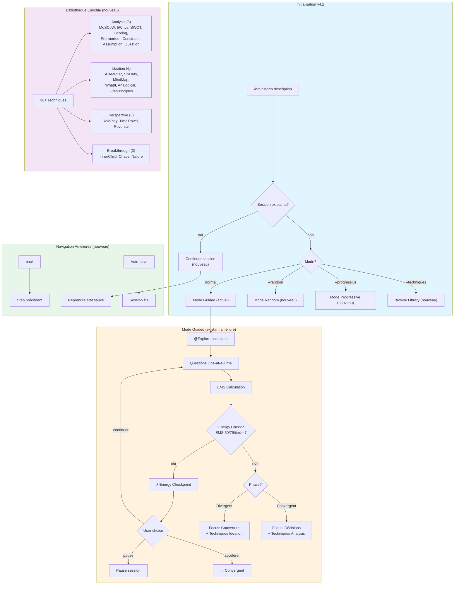

# Confrontation EPCI v4.1 vs BMAD v6 — Systèmes de Brainstorming

> **Date** : 2026-01-06
> **Objectif** : Identifier les patterns BMAD à intégrer dans EPCI v4.2+

---

## 1. Tableau Comparatif Global

| Critère | EPCI v4.1 | BMAD v6 | Avantage |
|---------|-----------|---------|----------|
| **Techniques** | 5 frameworks | 62 techniques (11 catégories) | **BMAD** |
| **Scoring** | EMS 5 axes pondérés | Aucun score numérique | **EPCI** |
| **Phases workflow** | 2 (Divergent/Convergent) | 4 steps linéaires | **=** |
| **Modes sélection** | 1 (itératif guidé) | 4 (User/AI/Random/Progressive) | **BMAD** |
| **Personas** | 3 facilitation + 6 EPCI | 6 agents CIS avec personnalités | **=** |
| **Questions** | One-at-a-Time + A/B/C | One element at a time | **=** |
| **Continuation session** | Non | Oui (auto-detection) | **BMAD** |
| **Energy monitoring** | Non | Checkpoints explicites | **BMAD** |
| **Back navigation** | Limitée | Toujours disponible | **BMAD** |
| **Output** | Brief + Journal | Session doc + Action plans | **=** |
| **Spike technique** | Oui (intégré) | Non | **EPCI** |
| **Security audit** | @security-auditor auto | Non | **EPCI** |
| **Plan preview** | @planner auto | Non | **EPCI** |
| **Code exploration** | @Explore intégré | Non | **EPCI** |

---

## 2. Analyse Détaillée par Dimension

### 2.1 Richesse des Techniques

#### EPCI (5 frameworks)
```
1. MoSCoW (priorisation)
2. 5 Whys (cause racine)
3. SWOT (analyse options)
4. Scoring (matrice décision)
5. Pre-mortem (anticipation risques)
```

#### BMAD (62 techniques, 11 catégories)
```
Collaborative (5)     : Yes And, Brain Writing, Role Playing...
Creative (11)         : What If, Analogical, Reversal, First Principles...
Deep (8)              : Five Whys, Morphological, Question Storming...
Introspective (6)     : Inner Child, Shadow Work, Values Archaeology...
Structured (7)        : SCAMPER, Six Thinking Hats, Mind Mapping...
Theatrical (6)        : Time Travel, Alien Anthropologist, Dream Fusion...
Wild (8)              : Chaos Engineering, Pirate Code, Zombie Apocalypse...
Biomimetic (3)        : Nature Solutions, Ecosystem Thinking...
Quantum (3)           : Observer Effect, Entanglement Thinking...
Cultural (4)          : Indigenous Wisdom, Mythic Frameworks...
```

**Analyse** : BMAD offre une richesse de techniques considérablement supérieure avec des catégories innovantes (Introspective, Theatrical, Wild, Quantum) qui pourraient débloquer des angles créatifs non exploités par EPCI.

### 2.2 Modes de Sélection

#### EPCI
```
Mode unique : Questions itératives guidées
- Une question à la fois
- Options A/B/C suggérées
- EMS guide la progression
```

#### BMAD
```
4 modes distincts :
1. User-Selected : Browse & select (Librarian)
2. AI-Recommended : Analyse context → suggestions (Matchmaker)
3. Random Selection : Sérendipité guidée (Serendipity)
4. Progressive Flow : Journey Divergent → Convergent (Guide)
```

**Analyse** : BMAD offre plus de flexibilité. Le mode Random est particulièrement intéressant pour briser les patterns habituels. Le mode Progressive Flow structure bien la transition divergent→convergent.

### 2.3 Scoring et Mesure

#### EPCI — EMS (Exploration Maturity Score)
```
EMS = (Clarté × 0.25) + (Profondeur × 0.20) + (Couverture × 0.20)
    + (Décisions × 0.20) + (Actionnabilité × 0.15)

Échelle : 0-100 avec niveaux (Germination → Exceptionnelle)
Phase-aware : Divergent focus différent de Convergent
Triggers : EMS ≥ 70 → @planner, stagnation → persona switch
```

#### BMAD
```
Pas de score numérique
Feedback qualitatif via facilitation
Energy checkpoints informels
```

**Analyse** : L'EMS d'EPCI est un avantage majeur — il fournit une mesure objective de progression et permet des triggers automatiques. BMAD n'a pas d'équivalent.

### 2.4 Gestion de Session

#### EPCI
```
- Pas de continuation de session
- Session commence toujours fresh
- State non persisté entre sessions
```

#### BMAD
```
- Auto-detection de session existante
- Frontmatter tracking du state
- Option de continuer/modifier/restart
- Progress analysis avec session status
```

**Analyse** : La continuation de session BMAD est très utile pour les brainstormings longs ou interrompus. C'est une feature manquante dans EPCI.

### 2.5 Energy Monitoring

#### EPCI
```
Pas de monitoring explicite
Changement de persona basé sur stagnation EMS
```

#### BMAD
```
Energy checkpoints explicites :
"We've done solid diagnostic work. How's your energy?
Ready to shift into solution generation, or want a quick break?"

"Almost there! How's your energy for the final planning piece?"
```

**Analyse** : Les energy checkpoints BMAD reconnaissent que le brainstorming est cognitivement intensif. EPCI pourrait bénéficier de ce pattern.

### 2.6 Facilitation Style

#### EPCI
```
Format breakpoint structuré :
-------------------------------------------------------
🔀 DIVERGENT | 📐 Architecte | Iter X | EMS: XX/100 (+Y)
-------------------------------------------------------
Question: [Question claire avec contexte]
Options: A) / B) / C) / D) Autre
-------------------------------------------------------
```

#### BMAD
```
Coaching interactif :
"That's brilliant! I can feel the creative energy there.
Let me build on your idea: [Extension]

What makes this idea so exciting to you?
How would this actually work in practice?"
```

**Analyse** : BMAD a un style plus conversationnel et "coach-like". EPCI est plus structuré/CLI-optimisé. Les deux ont leurs mérites selon le contexte.

### 2.7 Navigation et Contrôle

#### EPCI
```
Commandes disponibles :
continue, dive, pivot, status, modes, mode [x],
premortem, diverge, converge, framework [x],
spike, security-check, plan-preview, finish
```

#### BMAD
```
Contrôle utilisateur constant :
- "next technique" ou "move on" à tout moment
- [Back] à chaque step
- [Shuffle] en mode random
- [Customize] pour modifier les phases
```

**Analyse** : BMAD offre un contrôle plus granulaire avec back navigation systématique. EPCI a des commandes puissantes mais pas de back explicite.

---

## 3. Patterns BMAD à Intégrer dans EPCI

### 3.1 Haute Priorité

| Pattern | Description | Effort | Impact |
|---------|-------------|--------|--------|
| **Bibliothèque de techniques étendue** | Ajouter 20-30 techniques des catégories BMAD | Moyen | Élevé |
| **Mode Random Selection** | Option pour sélection aléatoire de frameworks | Faible | Moyen |
| **Session Continuation** | Sauvegarder/reprendre sessions brainstorming | Moyen | Élevé |
| **Energy Checkpoints** | Points de check-in énergie à EMS 50 et 75 | Faible | Moyen |
| **Back Navigation** | Option `back` pour revenir au step précédent | Faible | Moyen |

### 3.2 Priorité Moyenne

| Pattern | Description | Effort | Impact |
|---------|-------------|--------|--------|
| **Progressive Flow Mode** | Option pour workflow 4 phases structurées | Moyen | Moyen |
| **Catégories Introspective/Theatrical** | Techniques pour déblocage créatif | Faible | Moyen |
| **Action Plans détaillés** | Enrichir le brief avec next steps concrets | Faible | Moyen |
| **"YES AND" principle** | Intégrer dans le persona Sparring | Faible | Faible |

### 3.3 À Évaluer

| Pattern | Description | Considération |
|---------|-------------|---------------|
| **Suppression EMS** | BMAD n'a pas de scoring | NON — EMS est un avantage EPCI |
| **Agents multiples** | 6 agents CIS vs 3 personas | À évaluer — complexité vs valeur |
| **CSV techniques** | Stocker techniques en CSV | Possible mais MD plus intégré |

---

## 4. Techniques BMAD Candidates pour EPCI

### 4.1 À Intégrer (Top 15)

| Technique | Catégorie | Pourquoi |
|-----------|-----------|----------|
| **SCAMPER** | Structured | Framework systématique très complet |
| **Six Thinking Hats** | Structured | Multi-perspectives structurées |
| **First Principles** | Creative | Rebuilding from fundamentals |
| **What If Scenarios** | Creative | Exploration radicale |
| **Reversal Inversion** | Creative | Flip problems, révèle assumptions |
| **Question Storming** | Deep | Questions avant réponses |
| **Assumption Reversal** | Deep | Challenge core assumptions |
| **Mind Mapping** | Structured | Visual branching |
| **Analogical Thinking** | Creative | Cross-domain patterns |
| **Constraint Mapping** | Deep | Visualize all limitations |
| **Time Travel** | Theatrical | Perspective temporelle |
| **Role Playing** | Collaborative | Multi-stakeholder view |
| **Inner Child Conference** | Introspective | Déblocage créatif |
| **Chaos Engineering** | Wild | Stress-test ideas |
| **Nature's Solutions** | Biomimetic | Bio-inspired innovation |

### 4.2 Mapping vers Phases EPCI

| Phase EPCI | Techniques à Ajouter |
|------------|---------------------|
| **🔀 Divergent** | What If, SCAMPER, Analogical, Mind Mapping, Inner Child, Time Travel |
| **🎯 Convergent** | Six Thinking Hats, Constraint Mapping, First Principles, Role Playing |
| **Déblocage** | Reversal, Chaos Engineering, Question Storming, Nature's Solutions |

---

## 5. Proposition d'Évolution EPCI v4.2

### 5.1 Nouvelles Commandes/Options

```markdown
## Nouveaux Flags

--random          # Sélection aléatoire de techniques
--progressive     # Mode 4 phases structurées (Progressive Flow)
--techniques      # Afficher la bibliothèque complète (36+ techniques)

## Nouvelles Commandes Session

continue-session  # Reprendre une session précédente
back              # Revenir au step/question précédent
energy-check      # Forcer un energy checkpoint

## Nouveaux Frameworks (ajoutés aux 5 existants)

scamper           # Systematic creativity (7 lenses)
sixhats           # Multi-perspective analysis
firstprinciples   # Rebuild from fundamentals
mindmap           # Visual idea branching
roleplay          # Stakeholder perspectives
```

### 5.2 Structure Technique Enrichie

```markdown
# brain-techniques.md (nouveau fichier référence)

## Catégories

### 1. Analysis (existants étendus)
- MoSCoW, 5 Whys, SWOT, Scoring, Pre-mortem
- + Constraint Mapping, Assumption Reversal, Question Storming

### 2. Ideation (nouveau)
- SCAMPER, Six Thinking Hats, Mind Mapping
- What If Scenarios, Analogical Thinking, First Principles

### 3. Perspective (nouveau)
- Role Playing, Time Travel, Reversal Inversion

### 4. Breakthrough (nouveau)
- Inner Child, Chaos Engineering, Nature's Solutions
```

### 5.3 Session Continuation

```yaml
# .project-memory/brainstorm-sessions/[slug].yaml
session:
  id: "feature-auth-2026-01-06"
  status: "in_progress"
  phase: "divergent"
  ems: 45
  persona: "architecte"
  iteration: 3
  techniques_used: ["moscow", "5whys"]
  ideas:
    - id: 1
      content: "OAuth2 avec refresh tokens"
      score: 8
    - id: 2
      content: "Session JWT stateless"
      score: 7
  last_question: "Quel mécanisme de révocation privilégier?"
  created: "2026-01-06T10:30:00"
  updated: "2026-01-06T11:15:00"
```

### 5.4 Energy Checkpoints

```markdown
## Triggers Energy Check

1. EMS atteint 50 (mi-parcours)
2. EMS atteint 75 (près de la fin)
3. Itération >= 7 sans commande utilisateur
4. Changement de phase Divergent → Convergent

## Format Energy Check

-------------------------------------------------------
⚡ ENERGY CHECK | EMS: 52/100 | Phase: 🔀 Divergent
-------------------------------------------------------
On a bien avancé sur l'exploration. Comment tu te sens?

[1] Continuer — Je suis dans le flow
[2] Pause — J'ai besoin de réfléchir
[3] Accélérer — Passons à la convergence
[4] Pivoter — Je veux changer d'angle
-------------------------------------------------------
```

---

## 6. Diagramme Mermaid — EPCI v4.2 Proposé



---

## 7. Résumé Exécutif

### Forces à Conserver (EPCI)

1. **EMS Scoring** — Mesure objective unique, triggers automatiques
2. **Spike intégré** — Validation technique time-boxée
3. **@security-auditor/@planner** — Agents auto-invoqués selon contexte
4. **One-at-a-Time + A/B/C** — Réduction charge cognitive
5. **CLI-optimized format** — Adapté au terminal

### Améliorations à Intégrer (depuis BMAD)

1. **Bibliothèque 36+ techniques** — Étendre les 5 frameworks actuels
2. **Session continuation** — Sauvegarder/reprendre les sessions
3. **Energy checkpoints** — Check-in explicites à EMS 50/75
4. **Back navigation** — Option `back` systématique
5. **Mode Random** — Sélection aléatoire pour sérendipité
6. **Catégories Ideation/Breakthrough** — Techniques de déblocage créatif

### Prochaines Étapes

1. Valider les priorités avec l'utilisateur
2. Créer le skill `brain-techniques` avec les 36 techniques
3. Implémenter session continuation dans project-memory
4. Ajouter energy checkpoints dans le workflow
5. Documenter les nouveaux frameworks

---

*Document généré le 2026-01-06 — Confrontation EPCI v4.1 vs BMAD v6*
