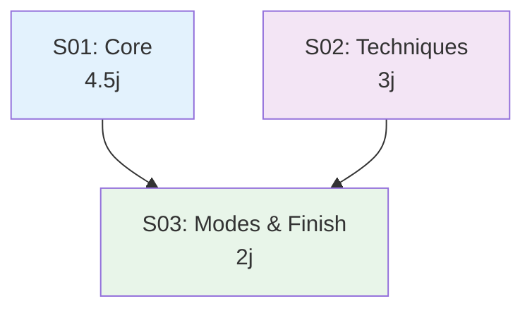
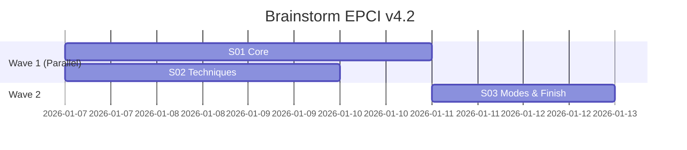

# Brainstorm EPCI v4.2 — Index des Specs

> **Generated**: 2026-01-06
> **Source**: `brief-brainstorm-v4.2-2026-01-06.md`
> **Sub-specs**: 3
> **Total effort**: 9.5 jours (6.5j optimisé)

---

## Overview

| ID  | Sub-Spec      | Effort | Dépendances | Parallélisable |
|-----|---------------|--------|-------------|----------------|
| S01 | Core          | 4.5j   | —           | Oui (avec S02) |
| S02 | Techniques    | 3j     | —           | Oui (avec S01) |
| S03 | Modes & Finish| 2j     | S01, S02    | Non            |

---

## Dependency Graph



---

## Wave Execution Plan



**Durée totale optimisée:** 6.5 jours (Wave 1: 4.5j + Wave 2: 2j)

---

## Contenu par Spec

### S01 — Core (4.5j)

| Fonctionnalité | Description |
|----------------|-------------|
| Session continuation | save, continue-session, auto-detect |
| Navigation back | Retour itération précédente |
| Energy checkpoints | Triggers EMS 50/75, format hybride |
| Format questions | 3-5 questions par itération avec A/B/C |
| Confirmation agents | Prompt [Y/n] avant @planner/@security |

**Fichiers:**
- `src/commands/brainstorm.md` (modification)
- `src/skills/core/brainstormer/SKILL.md` (modification)
- `src/skills/core/brainstormer/references/session-format.md` (création)

### S02 — Techniques (3j)

| Fonctionnalité | Description |
|----------------|-------------|
| Bibliothèque 20 techniques | 4 fichiers par catégorie |
| Commande technique | `technique [x]` pour appliquer |
| Mapping phases | Association techniques → Divergent/Convergent |

**Fichiers:**
- `src/skills/core/brainstormer/references/techniques/analysis.md` (création)
- `src/skills/core/brainstormer/references/techniques/ideation.md` (création)
- `src/skills/core/brainstormer/references/techniques/perspective.md` (création)
- `src/skills/core/brainstormer/references/techniques/breakthrough.md` (création)
- `src/skills/core/brainstormer/SKILL.md` (modification)
- `src/commands/brainstorm.md` (modification)

### S03 — Modes & Finish (2j)

| Fonctionnalité | Description |
|----------------|-------------|
| Flag --random | Sélection aléatoire pondérée par phase |
| Flag --progressive | 3 phases (Divergent → Transition → Convergent) |
| Parallélisation | @Explore en background |
| Tests | Validation session + techniques |

**Fichiers:**
- `src/commands/brainstorm.md` (modification)
- `src/scripts/test_brainstorm_session.py` (création)
- `docs/briefs/brainstorm-v4/examples/` (création)

---

## Progress

| Spec | Status  | PR       | Comment |
|------|---------|----------|---------|
| S01  | To do   | —        |         |
| S02  | To do   | —        |         |
| S03  | To do   | —        |         |

---

## Usage

Lancer une sub-spec:

```bash
/epci docs/briefs/brainstorm-v4/specs/S01-core.md
```

Ou avec le brief original pour contexte:

```bash
/brief "Implémenter S01 Core selon specs/S01-core.md"
```

---

## Documents de Référence

- [Brief v4.2](../brief-brainstorm-v4.2-2026-01-06.md)
- [Journal brainstorm](../journal-brainstorm-v4.2-2026-01-06.md)
- [Analyse EPCI v4.1](../analyse-brainstorm-v4.1-etat-des-lieux.md)
- [Analyse BMAD](../analyse-bmad-brainstorming-system.md)
- [Confrontation](../confrontation-epci-vs-bmad.md)

---

*Generated by /decompose — Project: brainstorm-v4.2*
