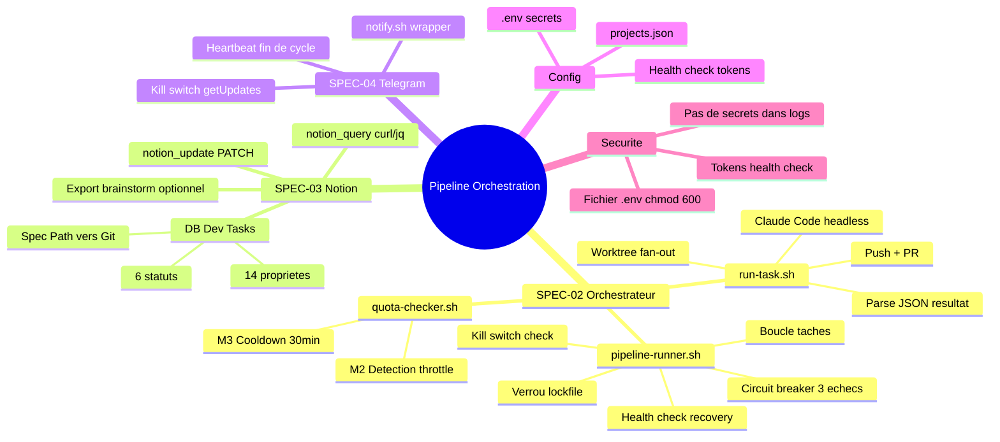

# Pipeline Orchestration — SPEC-02 + SPEC-03 + SPEC-04

> Genere le 2026-02-11 - 4 iterations - Template: feature - EMS final: 76/100

---

## 1. Contexte et Objectif

Le pipeline de developpement semi-automatise ClawdBot transforme un backlog Notion en Pull Requests GitHub, sans intervention humaine pendant l'execution. Le skill `implement-auto` (SPEC-01) est implemente et operationnel. Il manque la couche d'orchestration : les scripts qui lancent les taches (SPEC-02), la base Notion qui les alimente (SPEC-03), et les notifications qui informent (SPEC-04).

**Question/probleme initial**:
> Mettre en place les specs pour la partie orchestration du pipeline ClawdBot (Notion + Claude Code + GitHub), sachant que implement-auto est deja fait.

**Perimetre**:
- IN: `pipeline-runner.sh`, `run-task.sh`, `quota-checker.sh`, schema Notion "Dev Tasks", Notion API (query/update), bot Telegram (notifications + kill switch), config multi-projet, securite secrets
- OUT: Skill implement-auto (fait), dashboard web, auto-merge, parallelisme (V2), commandes Telegram avancees (/status, /pause, /resume)

**Criteres de succes definis**:
1. Les 3 specs sont suffisamment detaillees pour etre implementees via `/implement`
2. Les interfaces entre SPEC-02/03/04 sont clairement definies (contrats JSON, mapping API)
3. Les 10 gaps identifies dans le premortem (G1-G10) sont tous adresses
4. Chaque composant est testable isolement (dry-run mode)

---

## 2. Synthese Executive

Le pipeline se decompose en 3 specs complementaires : l'orchestrateur Bash (SPEC-02) qui coordonne l'ensemble, le schema Notion (SPEC-03) qui sert de source de verite, et les notifications Telegram (SPEC-04) qui assurent l'observabilite. L'architecture est intentionnellement simple : Bash + jq + curl, pas de Python, pas de framework, pas de base de donnees locale.

**Insight cle**: **Le choix de stocker les specs dans Git (pas dans Notion rich_text) simplifie radicalement l'architecture et elimine la contrainte de 2000 chars/block Notion. Notion devient un tableau de bord leger, pas un depot de contenu.**

**Decisions principales**:
1. Specs dans fichiers Git, chemin reference dans Notion (propriete `Spec Path` type text)
2. API Notion en curl/jq pur (pas de MCP, pas de dependance Claude Code pour les queries)
3. Quota checker V1 = reactif seulement (detection throttle + cooldown, pas de tracking speculatif)

**Routing recommande**: STANDARD → `/spec` puis `/implement` (3 composants a implementer sequentiellement)

---

## 3. Personas et Scenarios d'Usage

### 3.1 Persona Principal: Edouard (Operateur Pipeline)

| Attribut | Description |
|----------|-------------|
| Role | Auto-entrepreneur fullstack, seul operateur du pipeline |
| Objectif | Multiplier le throughput dev par 3-5x via execution automatisee |
| Frustration actuelle | 30+ taches pre-qualifiees qui prennent 2-3 jours manuellement |
| Niveau technique | Expert (gere le VPS, Claude Code, Notion, GitHub) |
| Contexte d'usage | VPS Linux, pipeline tourne le weekend/nuit, review lundi matin |

**Scenario d'usage typique**:
> Edouard qualifie 20 taches dans Notion le vendredi soir, chacune avec un lien vers un fichier spec dans le repo. Il lance le pipeline (ou il est deja programme en cron). Le samedi matin, il recoit des notifications Telegram au fil des taches traitees. Le lundi matin, il ouvre Notion, voit 15 taches "En review" avec des liens vers les PRs GitHub, et 5 "Echouees" avec les messages d'erreur. Il review les PRs une par une, merge celles qui sont OK, et requalifie les taches echouees pour un prochain run.

### 3.2 Persona Secondaire: Pipeline (Systeme Automatise)

| Attribut | Description |
|----------|-------------|
| Role | Orchestrateur cron qui execute les taches sans intervention |
| Objectif | Traiter le maximum de taches dans la fenetre de quota disponible |
| Contrainte | Quota Claude Max 5x, pas d'interaction possible |
| Comportement | Sequentiel, defensif (circuit breaker, health check, cleanup) |

---

## 4. Analyse et Conclusions Cles

### 4.1 Notion comme tableau de bord, pas depot de contenu

La decision de stocker les specs dans Git plutot que dans Notion (D1) est structurante. Elle signifie que Notion devient un systeme de tracking leger : statuts, metadonnees, liens. Le contenu technique reste dans Git, versionne et diffable.

**Implications pour l'implementation**:
- Le champ `Spec PRD` (rich_text) du BRIEF original est remplace par `Spec Path` (text) contenant un chemin relatif (ex: `docs/specs/pipeline/task-auth-login.md`)
- L'orchestrateur lit le path depuis Notion, puis lit le fichier depuis le repo projet
- L'export brainstorm→Notion = creer le fichier spec + l'entree Notion avec le path

### 4.2 Quota management pragmatique

Le quota Claude Max n'a pas d'API de consultation. La strategie V1 est purement reactive :
- Detecter le throttle dans les logs Claude Code (pattern `rate_limit`, `429`, `too_many_requests`)
- Appliquer un cooldown de 30 minutes apres detection
- Arreter le cycle et attendre le prochain declenchement cron

Le tracking proactif (M1 du BRIEF) est reporte apres calibration avec des donnees reelles. Les seuils speculatifs (27 sessions/fenetre, 3 sessions/tache) seront valides ou ajustes apres les premiers runs.

**Implications pour l'implementation**:
- `quota-checker.sh` est plus simple que prevu (grep logs + cooldown timer)
- Les seuils seront ajoutes dans une V1.1 apres les premiers weekends de production

### 4.3 Notifications minimalistes mais suffisantes

Telegram en mode basique : notifications par tache + kill switch. Pas de commandes /status ni /pause. Le kill switch fonctionne sans daemon : le pipeline verifie les messages Telegram recents (getUpdates) en debut de chaque cycle cron.

**Implications pour l'implementation**:
- `notify.sh` = wrapper autour de `curl` vers Telegram sendMessage
- Le kill switch est integre dans `pipeline-runner.sh` (pas un service separe)
- Delai de reaction du kill switch = intervalle cron (max 30 min)

### 4.4 Securite et gestion des secrets

Tous les tokens (Notion, GitHub, Telegram) sont dans un fichier `.env` avec permissions 600 sur le VPS. Le health check en debut de cycle verifie la validite de chaque token avant de commencer. La session Claude Code est la plus fragile (peut expirer), d'ou le auth check dedié.

**Implications pour l'implementation**:
- Fonction `health_check_tokens()` dans `pipeline-runner.sh`
- Notification immediate si un token est invalide
- Documentation de la procedure de renouvellement des tokens

### 4.5 Configuration multi-projet

Un fichier `projects.json` mappe chaque projet Notion a son repertoire local, son repo GitHub, et ses parametres par defaut (modele, flags, timeout). Ajouter un projet = ajouter une entree JSON + configurer la propriete "Projet" dans Notion.

---

## 5. User Stories et Criteres d'Acceptation

### US1: Execution automatique d'une tache Notion

**Story**: As Edouard, I want the pipeline to automatically execute pre-qualified Notion tasks so that I can process 15-30 tasks per weekend without manual intervention.

**Priorite**: Must have

**Criteres d'acceptation**:
```gherkin
AC1: Tache simple executee avec succes
Given une tache "A faire" dans Notion avec un Spec Path valide
And le quota Claude Code est disponible
When le cron declenche pipeline-runner.sh
Then la tache passe "En cours" dans Notion
And Claude Code execute implement-auto avec la spec
And une PR est creee sur GitHub
And la tache passe "En review" dans Notion avec le lien PR
And une notification Telegram est envoyee

AC2: Tache echouee geree proprement
Given une tache "A faire" dans Notion
When l'execution echoue (timeout, tests KO, hallucination)
Then le worktree est nettoye
And la tache passe "Echoue" dans Notion avec le message d'erreur
And une notification Telegram est envoyee avec la phase d'echec

AC3: Tache partielle
Given une tache dont certains composants reussissent et d'autres echouent
When implement-auto retourne PARTIAL
Then une PR draft est creee
And la tache passe "En review (partiel)" dans Notion
And la notification inclut le nombre de composants en echec
```

**Edge cases identifies**:
- Spec Path pointe vers un fichier inexistant → marquer FAILED + notifier "Spec not found: {path}"
- Le repo projet n'existe pas sur le VPS → marquer FAILED + notifier "Project not found: {project}"
- Claude Code crash sans produire de JSON → fallback JSON genere par run-task.sh

---

### US2: Guards et securite du pipeline

**Story**: As Edouard, I want the pipeline to protect itself from failures so that it doesn't burn my quota or leave the system in an inconsistent state.

**Priorite**: Must have

**Criteres d'acceptation**:
```gherkin
AC1: Kill switch Telegram
Given le pipeline est en cours d'execution
When Edouard envoie /kill au bot Telegram
Then le pipeline s'arrete avant la prochaine tache (delai max = intervalle cron)
And une notification confirme l'arret

AC2: Health check post-crash
Given une tache "En cours" dans Notion dont le processus n'existe plus
When un nouveau cycle cron demarre
Then le health check detecte la tache orpheline
And le worktree est nettoye
And la tache passe "Echoue" avec le message "Interrupted: crash recovery"
And une notification est envoyee

AC3: Circuit breaker echecs consecutifs
Given 3 taches consecutives ont echoue
When le pipeline atteint la 4eme tache
Then le cycle s'arrete
And une notification "Pipeline en pause: 3 echecs consecutifs" est envoyee

AC4: Verrou anti-concurrence
Given un cycle pipeline est en cours
When le cron declenche un nouveau cycle
Then le nouveau cycle detecte le lockfile et quitte sans action
```

**Edge cases identifies**:
- Lockfile stale (processus mort mais lockfile existe) → verifier PID, nettoyer si mort
- Health check trouve 5 taches orphelines → les traiter toutes, pas seulement la premiere
- Notification Telegram echoue → log WARNING, continuer l'execution (notifications = confort)

---

### US3: Configuration et observabilite

**Story**: As Edouard, I want to configure the pipeline for multiple projects and monitor its activity so that I can diagnose issues Monday morning.

**Priorite**: Should have

**Criteres d'acceptation**:
```gherkin
AC1: Configuration multi-projet
Given un fichier projects.json avec 2 projets configures
When des taches de differents projets sont "A faire" dans Notion
Then le pipeline execute chaque tache dans le bon repertoire projet
And utilise les parametres par defaut du projet (modele, flags, timeout)

AC2: Dry-run mode
Given le flag --dry-run est passe a pipeline-runner.sh
When le pipeline s'execute
Then les taches sont listees mais pas executees
And aucune modification Notion n'est faite
And aucune notification n'est envoyee
And le log affiche "[DRY-RUN]" devant chaque action

AC3: Heartbeat notification
Given le pipeline termine un cycle
When au moins une tache a ete traitee
Then un resume est envoye via Telegram: taches traitees/reussies/echouees
```

**Edge cases identifies**:
- Projet inconnu dans Notion → ignorer la tache + notifier "Unknown project: {name}"
- projects.json corrompu → pipeline refuse de demarrer + notifier

---

### US4: Export brainstorm vers Notion

**Story**: As Edouard, I want to export specs from a brainstorm session to Notion tasks so that the pipeline can process them automatically.

**Priorite**: Could have

**Criteres d'acceptation**:
```gherkin
AC1: Export manuel
Given des fichiers task-XXX.md dans docs/specs/pipeline/ du repo projet
When Edouard execute export-specs-to-notion.sh {project}
Then une entree Notion est creee pour chaque fichier spec
And le champ Spec Path contient le chemin relatif du fichier
And le statut est "A faire"
And la priorite et complexite sont extraites du frontmatter du fichier spec
```

**Edge cases identifies**:
- Tache deja existante dans Notion (meme nom) → skip + warning
- Fichier spec sans frontmatter → utiliser des valeurs par defaut (P2, Moyenne)

---

## 6. Decisions et Orientations Techniques

| Decision | Rationale | Impact | Confiance |
|----------|-----------|--------|-----------|
| D1: Specs dans Git, chemin dans Notion | Pas de limite taille, versionne, diffable | SPEC-02 lit le fichier, SPEC-03 simplifie | High |
| D2: API Notion en curl/jq pur | Portable, previsible, pas de dependance MCP | Scripts autonomes | High |
| D3: Telegram basique (notifs + kill) | V1 minimaliste, commandes avancees en V2 | SPEC-04 simple | High |
| D4: Quota V1 = reactif M2+M3 | Seuils proactifs speculatifs, reactif suffit | quota-checker.sh simplifie | High |
| D5: Specs dans docs/specs/pipeline/ | Repertoire dedie, clair, versionne | Convention multi-projet | High |
| D6: Telegram polling (getUpdates) | Pas de daemon, integre au cycle cron | Delai max = intervalle cron | High |
| D7: Export brainstorm→Notion = script manuel | Hors pipeline auto, outil de commodite | Composant optionnel | Medium |
| D8: Kill switch via getUpdates (pas daemon) | Simple, suffisant pour V1 weekend | Integre dans pipeline-runner.sh | High |

### Decisions differees
- **Tracking proactif quota (M1)**: Differe apres calibration avec donnees reelles. A revisiter apres 3-4 weekends de production.
- **Commandes Telegram /status /pause /resume**: V2, si le besoin se confirme.
- **Pagination Notion**: Si le backlog depasse 100 taches "A faire" (improbable en V1).

### Choix architecturaux
- **Pattern retenu**: Scripts Bash orchestrateur (pipeline pattern) avec separation des responsabilites (runner/task/quota/notify)
- **Justification**: Bash + jq est le minimum viable pour de la "plomberie" systeme. Pas besoin de Python ou de framework. Les scripts sont portables et debuggables.

---

## 7. Priorisation MoSCoW

### Must Have (MVP) — ~65% effort

| # | Feature/Story | Effort estime | Dependance |
|---|---------------|---------------|------------|
| 1 | Schema Notion "Dev Tasks" (SPEC-03) | S (2h) | - |
| 2 | notify.sh - wrapper Telegram (SPEC-04) | S (2-3h) | Bot Telegram cree |
| 3 | quota-checker.sh - reactif M2+M3 (SPEC-02) | S (2h) | - |
| 4 | run-task.sh - execution unitaire (SPEC-02) | M (3-4h) | #1, implement-auto |
| 5 | pipeline-runner.sh - boucle principale (SPEC-02) | M (4-5h) | #1, #2, #3, #4 |

### Should Have — ~20% effort

| # | Feature/Story | Effort estime | Dependance |
|---|---------------|---------------|------------|
| 6 | Dry-run mode (--dry-run) | S (2h) | #5 |
| 7 | Config multi-projet (projects.json) | S (2h) | #5 |
| 8 | Health check tokens (Notion, GitHub, Telegram) | S (1h) | #5 |

### Could Have — ~15% effort

| # | Feature/Story | Effort estime | Dependance |
|---|---------------|---------------|------------|
| 9 | export-specs-to-notion.sh | S (2h) | #1 |
| 10 | Log rotation (7 jours) | S (1h) | #5 |

### Won't Have (cette release)
- **Commandes Telegram avancees** (/status, /pause, /resume) — V2, complexite injustifiee pour V1
- **Tracking proactif quota (M1)** — Donnees insuffisantes pour calibrer les seuils
- **Parallelisme** — V2, le quota est une ressource partagee
- **Dashboard web** — Notion + Telegram suffisent pour un operateur unique
- **Auto-merge** — Review humaine obligatoire

---

## 8. Contraintes et Dependances

### Contraintes techniques

| Type | Contrainte | Impact |
|------|------------|--------|
| Stack | Bash + jq (pas de Python cote orchestrateur) | Scripts simples mais verbeux |
| Infra | VPS Ubuntu 24, user non-root `pipeline` | Permissions restrictives, pas de Docker |
| Quota | Claude Max 5x, fenetre glissante ~5h | Max ~15-30 taches/weekend |
| Headless | Claude Code via `claude -p` (pas d'interaction) | implement-auto doit etre 100% autonome |
| Multi-projet | Gardel (Django) + Symfony/React | Config par projet dans projects.json |

### Dependances externes

| Dependance | Type | SLA/Disponibilite | Fallback |
|------------|------|-------------------|----------|
| Notion API | Externe | 99.9% | Pipeline s'arrete + notifie |
| Claude Code CLI | Externe | Depends on Max plan | Auth check + cooldown |
| GitHub API (via gh) | Externe | 99.95% | Retry manuelle post-pipeline |
| Telegram Bot API | Externe | 99.9% | Log WARNING, pipeline continue sans notifs |

### Integrations requises
- **Notion API v2022-06-28**: Query (filter/sort), Update (properties)
- **Claude Code CLI**: `claude -p` avec `--output-format json`, `--allowedTools`, `--permission-mode bypassPermissions`
- **GitHub CLI (gh)**: `gh pr create`, `gh auth status`
- **Telegram Bot API**: `sendMessage`, `getUpdates`
- **Git**: worktree add/remove, fetch, push

---

## 9. Risques et Hypotheses

### Risques identifies

| Risque | Probabilite | Impact | Mitigation |
|--------|-------------|--------|------------|
| Session Claude Code expire pendant le weekend | Low | Bloquant | Auth check en debut de cycle + notification SSH |
| Quota epuise avant de traiter toutes les taches | Medium | Medium | Reactif M2+M3, le pipeline reprend au prochain cycle |
| Notion API change ou indisponible | Low | Bloquant | Version API fixee (2022-06-28), health check tokens |
| PR body trop long (limite GitHub ~65K chars) | Low | Low | Tronquer, renvoyer vers Feature Document |
| Conflit Git entre deux PRs sur meme fichier | Medium | Medium | Fan-out depuis main, humain decide l'ordre de merge |
| VPS reboot pendant execution | Low | Medium | Health check post-crash, cleanup worktree, recovery auto |
| Specs incorrectes (hallucination implement-auto) | Medium | Medium | Review humaine des PRs, Feature Document pour tracabilite |
| GitHub PAT expire | Medium | Bloquant | Health check tokens, notification, procedure de renouvellement |

### Hypotheses (Assumptions)
- **Claude Max 5x permet ~15-30 taches/weekend** — Si faux: ajuster max_tasks_per_run et intervalle cron
- **Les taches pre-qualifiees sont vraiment STANDARD** — Si faux: implement-auto echoue, tache marquee "Echoue" + review manuelle
- **Un seul operateur (Edouard) review les PRs** — Si faux: ajouter des reviewers GitHub dans la config
- **Le VPS est stable pendant le weekend** — Si faux: health check + recovery gere les interruptions

---

## 10. Plan d'Action Haut Niveau

| Phase | Livrables | Effort estime | Owner | Prerequis |
|-------|-----------|---------------|-------|-----------|
| 1. Setup Notion | DB "Dev Tasks" avec 14 proprietes | ~2h | Edouard | - |
| 2. Telegram Bot | Bot cree, notify.sh operationnel | ~2-3h | Edouard | BotFather Telegram |
| 3. Quota Checker | quota-checker.sh (M2+M3) | ~2h | Pipeline | - |
| 4. Run Task | run-task.sh (worktree, claude -p, parse) | ~3-4h | Pipeline | Phase 1 + implement-auto |
| 5. Pipeline Runner | pipeline-runner.sh complet | ~4-5h | Pipeline | Phases 1-4 |
| 6. Config Multi-Projet | projects.json + integration | ~2h | Pipeline | Phase 5 |
| 7. Test E2E | Run complet avec 3-5 taches test | ~2-3h | Edouard | Phases 1-6 |

**Effort total estime**: ~17-21h (~3-4 jours)
**Chemin critique**: Phase 1 → Phase 4 → Phase 5 → Phase 7

### Quick Wins (impact eleve, effort faible)
1. Schema Notion (Phase 1) — Prerequis pour tout, faisable en 2h sur l'interface Notion
2. Bot Telegram (Phase 2) — BotFather + curl = bot fonctionnel en 30 min

### Investissements Strategiques (impact eleve, effort eleve)
1. pipeline-runner.sh (Phase 5) — Le coeur du systeme, concentre toute la logique de guards/recovery
2. Test E2E (Phase 7) — Le moment de verite, calibration des seuils avec donnees reelles

---

## 11. Mindmap de Synthese



---

## 12. Score EMS Final

```
EMS Final: 76/100 [Mature]

Progression EMS
100 |
 90 | . . . . . . . . . . . . . . . . . . . .
 80 |                              *--- 76
 70 | . . . . . . . . . . . .+--+. . . . . .
 67 |                   +----+
 60 | . . . . . . . . . . . . . . . . . . . .
 57 |             +----+
 50 |
 42 |       +----+
 40 | . . . . . . . . . . . . . . . . . . . .
 20 | +----+
  0 +------+-----+-----+-----+-----+------
    Init  It.1  It.2  It.3  It.4  Fin

Axes finaux:
   Clarte       [=================...] 85/100 *
   Profondeur   [===============.....] 75/100
   Couverture   [==============......] 70/100
   Decisions    [================....] 78/100
   Actionab.    [===========.........] 55/100
```

**Evaluation globale**: Exploration mature avec 8 decisions verrouillees et un plan d'action sequencé. L'axe Actionabilite est le plus faible car les details d'implementation (code exact des fonctions utilitaires) sont du ressort de `/spec` et `/implement`, pas du brainstorm.

### Verification des Criteres de Succes

| Critere | Statut | Evidence |
|---------|--------|----------|
| 3 specs detaillees pour /implement | OK | Schema Notion, interfaces, contrats JSON definis |
| Interfaces entre SPEC-02/03/04 definies | OK | Contrats notion_query/update, notify, kill switch documentes |
| Gaps G1-G10 adresses | OK | D4 (G1/G3), D1 (G4), D8 (G7), cleanup (G10), auth check (G9) |
| Chaque composant testable isolement | Partiel | Dry-run mode prevu mais pas encore specifie en detail |

---

## 13. Pistes Non Explorees

| Sujet | Pourquoi non explore | Valeur potentielle | Prochaine etape |
|-------|----------------------|-------------------|-----------------|
| Parallelisme multi-taches | Explicitement V2 (quota partage) | High | Mesurer quota reel, evaluer faisabilite |
| Dashboard web monitoring | Notion + Telegram suffisent pour 1 operateur | Medium | Si equipe grandit |
| Tracking proactif quota (M1) | Seuils speculatifs, besoin donnees reelles | Medium | Calibrer apres 3-4 weekends |
| Auto-merge PRs safe | Review humaine obligatoire en V1 | Medium | Ajouter criteres auto-merge (100% tests, < 50 lignes) |
| Caching Notion (eviter re-queries) | Rate limit Notion largement suffisant | Low | Si latence problematique |
| Metriques de performance cumulees | Pas prioritaire V1 | Medium | Ajouter un dashboard Notion avec formules |

---

## 14. References

### Documents analyses
- **BRIEF-Pipeline-V3.md**: Architecture globale, 7 scenarios d'echec, 10 gaps identifies, budget tokens
- **SPEC-02-orchestrator.md**: Spec detaillee des 3 scripts Bash, contrat JSON implement-auto → orchestrateur

### Codebase verifiee
- **src/skills/implement-auto/**: 8 steps + 5 references, contrat JSON de sortie, circuit breaker 3 niveaux
- **src/skills/implement-auto/references/output-json-schema.md**: Schema JSON de sortie (status, metrics, phases, checks, errors, warnings)

### Recherches web
- Non effectuees (context suffisant avec les documents existants)

### Conversations passees referencees
- Session brainstorm implement-auto (EMS 86, completee le 2026-02-11) — Decisions D1-D7 sur le skill autonome

---

## 15. Prochaines Etapes

**Workflow recommande**:

| Etape | Skill | Action |
|-------|-------|--------|
| 1 | `/spec` | Transformer ce brief en specifications techniques (task files) |
| 2 | `/implement` | Implementer SPEC-03 (Notion schema) en premier |
| 3 | `/implement` | Implementer SPEC-04 (notify.sh) |
| 4 | `/implement` | Implementer SPEC-02 (orchestrateur complet) |
| 5 | Test E2E | Run pilote avec 3-5 taches Gardel |

**Routing de complexite**: STANDARD (3 composants, 17-21h estimees, multi-fichier)
**Skill suggere**: `/spec` puis `/implement` pour chaque composant

**Commande suggeree**:
```
/spec brief-orchestrator-pipeline-20260211.md
```

---
