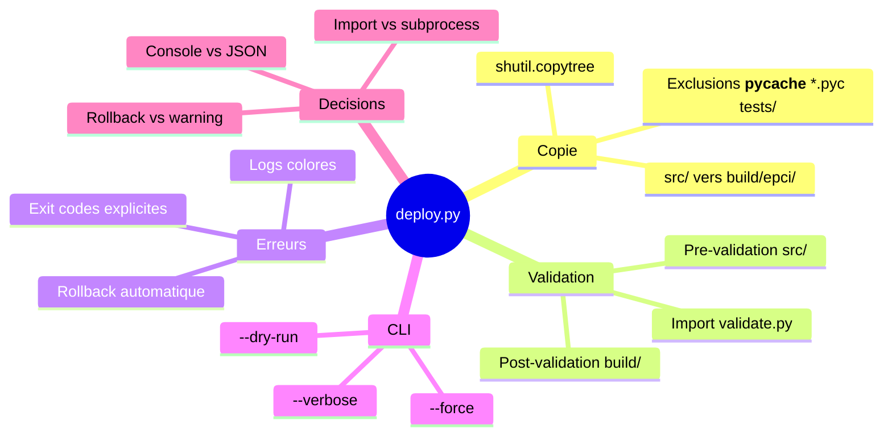

# Script de Deploiement EPCI (deploy.py)

> Genere le 2026-01-27 - 2 iterations - Template: feature - EMS Final: 84/100

---

## 1. Contexte et Objectif Initial

Le plugin EPCI v6.2.1 necessite un processus de build fiable pour copier `src/` vers `build/epci/`, valider la coherence, et preparer les releases. Actuellement, le deploiement est manuel et sujet aux oublis (versions, changelog, validation).

**Question/probleme initial**:
Comment automatiser le processus de build tout en garantissant la coherence des versions et la validite de la structure?

**Scope**:
- In scope: Copie src/ → build/epci/, validation structure, verification versions, CLI avec dry-run
- Out of scope: Publication registres externes (PyPI, npm), synchronisation symlinks (~/.claude/), CI/CD automation

**Criteres de succes**:
1. Le script copie correctement tous les fichiers (hors exclusions)
2. Les validations passent sans erreur
3. Les incoherences de version sont detectees
4. Le mode dry-run fonctionne correctement
5. Rollback automatique si validation echoue

---

## 2. Synthese Executive

Le script `deploy.py` automatise le processus de build du plugin EPCI en copiant `src/` vers `build/epci/` avec validation integree. Il reutilise le validateur existant (`validate.py`) par import direct, exclut les fichiers non necessaires (`__pycache__/`, `*.pyc`, `tests/`), et affiche un rapport console colore. En cas d'echec de validation, le script effectue un rollback automatique pour eviter les builds corrompus.

**Insight cle**: L'import direct de `validate.py` permet de reutiliser la logique existante tout en maintenant un seul point de verite pour les regles de validation.

**Decisions principales**:
- Exclusions: `__pycache__/`, `*.pyc`, `tests/`
- Integration: Import direct des fonctions de `validate.py`
- Rapport: Console simple avec logs colores (pas de fichier JSON)
- Erreurs: Rollback automatique si validation post-copie echoue
- CLI: Options `--dry-run`, `--force`, `--verbose`

---

## 3. Analyse et Conclusions Cles

### 3.1 Architecture du Script

Le script suit les best practices Python 2025-2026 identifiees via recherche Perplexity:
- Utilisation de `pathlib.Path` pour toutes les operations fichiers
- Pattern `ExpectedItem` dataclass pour validation declarative
- Fonction `copy_tree_safe()` avec garde-fous (verification existence, --force)

**Points cles**:
- Structure modulaire: fonctions pures + CLI argparse
- Validation avant et apres copie
- Logs explicites de chaque operation

**Implications**:
Le script peut evoluer vers d'autres cibles (PyPI, GitHub release) en ajoutant des modules sans modifier le core.

### 3.2 Strategie de Validation

Integration avec `validate.py` existant par import direct plutot que subprocess.

**Points cles**:
- Reutilise la logique existante (validation plugin.json, SKILL.md)
- Un seul process = meilleure performance
- Coherence garantie avec les validations manuelles

**Implications**:
Si `validate.py` evolue, `deploy.py` beneficie automatiquement des ameliorations.

### 3.3 Gestion des Erreurs

Strategie defensive avec rollback automatique.

**Points cles**:
- Pre-validation: verifier que src/ existe et est valide
- Post-validation: verifier que build/epci/ est complet et valide
- Rollback: supprimer build/epci/ si post-validation echoue

**Implications**:
Jamais de build corrompu en production - soit le build est valide, soit il n'existe pas.

---

## 4. Decisions et Orientations

| Decision | Rationale | Impact | Confiance |
|----------|-----------|--------|-----------|
| Exclusions: `__pycache__/`, `*.pyc`, `tests/` | Standards Python, tests non deployes | Build plus leger | High |
| Import direct de validate.py | Reutilisation code, un seul process | Coherence validation | High |
| Rapport console simple | Usage CLI manuelle, pas besoin de parsing | Simplicite | High |
| Rollback automatique | Eviter builds corrompus | Securite deploiement | High |
| Exit codes explicites | Integration CI/CD future | Extensibilite | Medium |

### Decisions Differees
- Format JSON pour CI/CD - Differe car pas de CI/CD actuellement. A revisiter si besoin pipeline.

---

## 5. Plan d'Action

| # | Action | Priorite | Effort | Owner | Dependencies |
|---|--------|----------|--------|-------|--------------|
| 1 | Creer `src/scripts/deploy.py` | High | Medium | Dev | validate.py existe |
| 2 | Implementer copie avec exclusions | High | Low | Dev | - |
| 3 | Integrer validation par import | High | Low | Dev | Action 1 |
| 4 | Ajouter verification versions | Medium | Low | Dev | - |
| 5 | Implementer rollback | Medium | Low | Dev | Actions 2-3 |
| 6 | Ajouter CLI (argparse) | Medium | Low | Dev | Actions 1-5 |
| 7 | Tests manuels dry-run | Low | Low | Dev | Action 6 |

### Quick Wins (High Impact, Low Effort)
1. Copie basique avec `shutil.copytree` + exclusions - Fonctionnel en 30 lignes
2. Import de `validate_plugin()` depuis validate.py - Reutilisation immediate

### Investissements Strategiques (High Impact, High Effort)
1. Ajout verification coherence versions (plugin.json vs README vs CHANGELOG) - Valeur preventive

---

## 6. Risques et Points d'Attention

| Risque | Probabilite | Impact | Mitigation |
|--------|-------------|--------|------------|
| validate.py change d'interface | Low | Medium | Tests unitaires, import explicite |
| Permissions insuffisantes sur build/ | Low | High | Pre-check permissions, message clair |
| Fichiers oublies dans exclusions | Medium | Low | Liste d'exclusions configurable |

### Hypotheses Faites
- `validate.py` expose des fonctions importables - Si faux: refactorer validate.py ou utiliser subprocess
- `src/` est toujours la source de verite - Si faux: ajouter parametre source

---

## 7. Pistes Non Explorees

| Sujet | Pourquoi Non Explore | Valeur Potentielle | Prochaine Etape |
|-------|---------------------|---------------------|-----------------|
| Versioning automatique (bump) | Hors scope initial | High | Integrer bump2version |
| Integration CI/CD | Pas de pipeline actuel | Medium | Ajouter GitHub Action |
| Publication PyPI | Complexite distribution | Low | Evaluer besoin reel |

---

## 8. Mindmap Synthese



---

## 9. Verification des Criteres de Succes

| Critere | Statut | Evidence |
|---------|--------|----------|
| Copie correcte des fichiers | A verifier | Implementation a faire |
| Validations passent | A verifier | Integration validate.py |
| Detection incoherences versions | A verifier | Feature a implementer |
| Mode dry-run fonctionne | A verifier | CLI a implementer |
| Rollback automatique | A verifier | Gestion erreurs a implementer |

**Evaluation globale**: Brief complet, pret pour implementation. Tous les criteres seront verifiables apres developpement.

---

## 10. Score EMS Final

```
EMS Final: 84/100 [EXCELLENT]

EMS Score
100 |
 90 | . . . . . . . . . . . . . . . . . . . .*
 80 |                                    *
 70 | . . . . . . . . . . . . . . . . . . . .
 60 |                          *
 50 |
 40 |              *
 30 | . . . . . . . . . . . . . . . . . . . .
 20 |
  0 +----+-----+-----+-----+
    Init  It.1  It.2  End

Final axes:
   Clarte       [████████░░] 85/100
   Profondeur   [███████░░░] 72/100
   Couverture   [████████░░] 80/100
   Decisions    [█████████░] 95/100
   Actionab.    [█████████░] 90/100
```

---

## 11. Sources et References

### Recherche Web (Perplexity)
- Python deployment script best practices 2025-2026: Patterns pathlib + shutil, validation declarative
- Version consistency checking: Regex patterns, bump2version approach

### Documents Analyses
- `/home/epci/apps/claude-epci/src/scripts/validate.py`: Logique de validation existante
- `/home/epci/apps/claude-epci/sync-epci-symlinks.sh`: Pattern de script deployment existant

---

## 12. Prochaines Etapes

**Workflow recommande**:

| Etape | Skill | Action |
|-------|-------|--------|
| 1 | `/implement` | Implementer deploy.py avec TDD |
| 2 | Test manuel | Verifier dry-run et rollback |

**Routing complexite**: SMALL
**Skill suggere**: `/implement` (ou `/quick` si pression temps)

---

*Document genere par /brainstorm | EMS: 84/100 | 2026-01-27*
