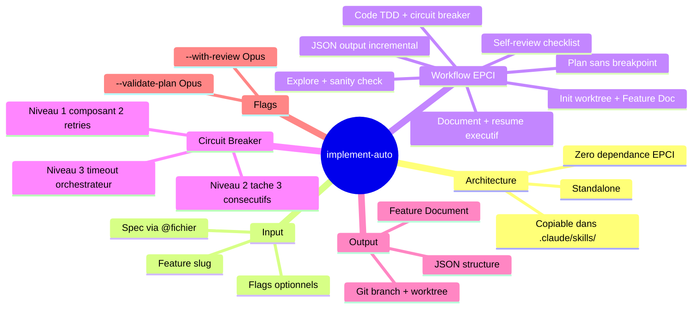

# Skill implement-auto : Execution EPCI Headless Standalone

> Genere le 2026-02-11 - 5 iterations - Template: feature - EMS final: 86/100

| Champ | Valeur |
|-------|--------|
| Projet | Pipeline de dev semi-automatise V3 |
| Composant | SPEC-01 — Skill implement-auto |
| Auteur | Edouard |
| Date | 11 fevrier 2026 |
| Version | 1.0 |
| Statut | Brief finalise (brainstorm complete) |
| Priorite | P0 — Critique (pre-requis pipeline) |

---

## 1. Contexte et Objectif

Le workflow EPCI (Explore, Plan, Code, Inspect) est operationnel en mode interactif via le skill `/implement`. Chaque tache necessite ~20-45 minutes de presence active pour valider les 8 breakpoints. Le backlog contient 30+ taches pre-qualifiees (spec claire, complexite STANDARD) qui ne necessitent pas de decision humaine intermediaire.

Le skill `implement-auto` est une variante 100% autonome de `/implement`, concue pour l'execution headless via `claude -p` dans un pipeline automatise (Notion -> OpenClaw -> Claude Code -> GitHub PR).

**Question/probleme initial**:
> Comment creer un skill EPCI completement standalone, sans breakpoints ni interaction, executable par un pipeline cron, qui produit un JSON structure en sortie ?

**Perimetre**:
- IN: Skill implement-auto complet (SKILL.md + steps/ + references/), contrat JSON sortie, circuit breaker, sanity check, self-review, Feature Document auto
- OUT: Script orchestrateur (SPEC-02), schema Notion (SPEC-03), notifications Telegram (SPEC-04)

**Criteres de succes**:
1. Le skill s'execute via `claude -p` sans aucune interaction (0 AskUserQuestion)
2. Produit un JSON structure parseable par l'orchestrateur (status SUCCESS/PARTIAL/FAILED)
3. Gere les echecs gracieusement via circuit breaker 3 niveaux
4. Fonctionne en copiant le dossier dans `.claude/skills/` de n'importe quel projet
5. TDD enforced sur chaque composant

---

## 2. Synthese Executive

Le skill `implement-auto` est un skill Claude Code **standalone** qui execute le workflow EPCI complet (Explore, Plan, Code, Inspect) sans aucune interaction humaine. Il est concu pour etre **copie directement** dans le `.claude/skills/` de n'importe quel projet cible.

**Insight cle**: **Le skill doit etre 100% autonome — pas de dependance aux skills EPCI (state-manager, breakpoint-system, etc.), pas de stack skills embarques. Le projet cible fournit ses conventions via son CLAUDE.md et ses rules/.**

**Decisions principales**:
1. Skill standalone, zero dependance EPCI core — copiable dans tout projet
2. Invocation par @spec-path (fichier spec dans le prompt) — pas de spec inline
3. Pas de stack skills — s'appuie sur CLAUDE.md/rules/ du projet cible
4. Circuit breaker 3 niveaux : composant (2 retries), tache (3 consecutifs ou >50%), timeout (orchestrateur)
5. JSON output incremental — ecrit a chaque step pour resilience au timeout/crash
6. Self-review par checklist integree — @code-reviewer optionnel via --with-review

**Routing recommande**: LARGE -> `/implement` (ou `/factory` pour le scaffolding)

---

## 3. Personas et Scenarios d'Usage

### 3.1 Persona Principal: Pipeline Runner (OpenClaw)

| Attribut | Description |
|----------|-------------|
| Role | Orchestrateur automatise (script bash) |
| Objectif | Executer une tache de dev pre-qualifiee de bout en bout |
| Frustration actuelle | Pas de skill headless — /implement necessite 8 breakpoints manuels |
| Niveau technique | Machine — parse JSON, gere worktrees, lit exit codes |
| Contexte d'usage | VPS Linux, cron toutes les 30min, weekends/soirees |

**Scenario d'usage typique**:
> Le cron OpenClaw detecte une tache "A faire" dans Notion. Il cree un worktree depuis origin/main, ecrit la spec PRD dans un fichier, construit le prompt incluant `/implement-auto feature-slug @spec.md`, et lance `claude -p`. Le skill s'execute en ~10min, produit un JSON dans le worktree. Le runner parse le JSON : si SUCCESS, il push + cree une PR. Si FAILED, il marque la tache en echec dans Notion avec les logs d'erreur du JSON.

### 3.2 Persona Secondaire: Edouard (Developpeur)

| Attribut | Description |
|----------|-------------|
| Role | Developpeur fullstack, reviewer des PRs |
| Objectif | Retrouver le lundi matin des PRs propres avec Feature Documents clairs |
| Frustration actuelle | Doit executer manuellement 30 taches STANDARD identiques |
| Niveau technique | Expert |
| Contexte d'usage | Review PRs depuis GitHub, desktop |

---

## 4. Analyse et Conclusions Cles

### 4.1 Architecture Standalone vs Derivee

Le skill ne partage AUCUN fichier avec `/implement` EPCI. C'est un package autonome complet. Cette decision evite les dependances fragiles et permet l'installation par simple copie.

**Points cles**:
- Toute la logique est dans SKILL.md + steps/ + references/
- Pas de dependance aux core skills EPCI (state-manager, breakpoint-system, complexity-calculator, tdd-enforcer)
- Pas de dependance aux stack skills (python-django, php-symfony, etc.)

**Implications pour l'implementation**: Chaque reference file est self-contained. Le TDD rules, le review checklist, le circuit breaker sont integres dans les references/ du skill.

### 4.2 Convention de Stack via CLAUDE.md

En mode standalone, le skill s'appuie sur les conventions du projet cible :
- `.claude/CLAUDE.md` fournit l'architecture, le stack, les commandes
- `.claude/rules/*.md` fournit les patterns par type de fichier
- Claude Code charge nativement ces fichiers avant chaque interaction

**Points cles**:
- Pas besoin d'embarquer des patterns Django/Symfony/React
- Le skill se concentre sur le workflow EPCI, pas sur les conventions de code
- Plus portable : fonctionne avec n'importe quel stack

**Implications pour l'implementation**: Le step-03-code-auto.md n'a pas de "dynamic stack loading". Il suit les patterns du CLAUDE.md et rules/ automatiquement.

### 4.3 Circuit Breaker 3 Niveaux

Protection critique contre le token-burning en mode autonome.

**Points cles**:
- Niveau 1 (composant) : max 2 retries, skip si fail, marque PARTIAL
- Niveau 2 (tache) : 3 echecs consecutifs ou >50% fail → ABORT FAILED
- Niveau 3 (timeout) : gere par l'orchestrateur, pas le skill
- Skip des composants dependants si prerequis en echec

**Implications pour l'implementation**: Le circuit breaker est integre dans step-03-code-auto.md. Les seuils sont des constantes dans references/circuit-breaker-rules.md (modifiables par projet).

### 4.4 JSON Output Incremental

Le JSON de sortie est ecrit a chaque transition de step, pas seulement a la fin. Cela permet a l'orchestrateur de recuperer un etat partiel en cas de timeout ou crash.

**Points cles**:
- Fichier : `{worktree_path}/.implement-auto-output.json`
- Mis a jour a chaque step completion
- Schema versionne (v1) pour evolution future
- Logique de status : SUCCESS/PARTIAL/FAILED avec exit_reason detaille

### 4.5 Sanity Check Post-Explore

Verification que les fichiers et symboles identifies par l'Explore agent existent reellement.

**Points cles**:
- Verification via Glob (fichiers) et Grep (symboles/methodes)
- Seuil de tolerance : <30% hallucine → nettoyage + warning, >=30% → ABORT
- Integre dans step-01-explore-auto.md apres retour du Task Explore

### 4.6 Self-Review Integre

Checklist de verification post-implementation executee automatiquement.

**Points cles**:
- Remplace l'invocation couteuse du @code-reviewer (Opus)
- Checklist : tests, code quality, patterns, securite basique
- Flag `--with-review` pour ajouter un vrai @code-reviewer si souhaite
- Resultats dans checks.self_review du JSON output

---

## 5. User Stories et Criteres d'Acceptation

### US1: Execution autonome complete

**Story**: As a pipeline runner, I want to execute a full EPCI workflow without any human interaction so that tasks can run unattended on weekends.

**Priorite**: Must have

**Criteres d'acceptation**:
```gherkin
AC1: Execution sans interaction
Given une spec PRD valide fournie via @spec-path
When le skill implement-auto est invoque via claude -p
Then le workflow EPCI complet s'execute sans AskUserQuestion
And un JSON output est produit dans le worktree

AC2: Worktree automatique
Given un feature-slug valide
When le skill demarre
Then un worktree git est cree automatiquement depuis origin/main
And une branche feature/{slug} est creee

AC3: TDD enforce
Given un plan d'implementation avec N composants
When chaque composant est implemente
Then le cycle RED-GREEN-REFACTOR est suivi pour chacun
And les tests sont executes apres chaque changement
```

**Edge cases**:
- Spec vide ou illisible → FAILED avec exit_reason "invalid_spec"
- Worktree deja existant → reprendre ou recreer selon statut
- Aucun test framework detecte → warning, continuer sans TDD strict

---

### US2: Circuit breaker et gestion d'echec

**Story**: As a pipeline runner, I want the skill to stop gracefully when it encounters repeated failures so that tokens are not wasted.

**Priorite**: Must have

**Criteres d'acceptation**:
```gherkin
AC1: Circuit breaker composant
Given un composant echoue apres GREEN attempt
When le retry count atteint 2 pour ce composant
Then le composant est marque FAILED
And le skill passe au composant suivant
And status = PARTIAL dans le JSON

AC2: Circuit breaker tache
Given 3 composants echouent consecutivement
When le 3eme echec consecutif est detecte
Then le skill ABORT toute la tache
And status = FAILED avec exit_reason "circuit_breaker_consecutive"

AC3: Skip dependances
Given un composant A est FAILED
When un composant B depend de A
Then le composant B est skip (marque SKIPPED)
And un warning est ajoute au JSON
```

**Edge cases**:
- Premier composant echoue → tester si les suivants sont dependants ou independants
- Tous les composants echouent → FAILED, pas PARTIAL
- Composant echoue en RED (test echoue avant implementation) → ne pas compter comme retry

---

### US3: JSON output incremental

**Story**: As a pipeline runner, I want to read a partial JSON output at any time so that I can determine task status even after a timeout or crash.

**Priorite**: Must have

**Criteres d'acceptation**:
```gherkin
AC1: Ecriture incrementale
Given le skill est en cours d'execution
When un step se termine
Then le JSON output est mis a jour avec l'etat courant
And le fichier est parseable (JSON valide)

AC2: Status final coherent
Given tous les steps sont termines
When le JSON final est ecrit
Then status reflecte le resultat reel (SUCCESS/PARTIAL/FAILED)
And metrics sont completes et coherentes
And errors[] contient les details de chaque echec

AC3: Recuperation apres crash
Given le skill est kill par timeout
When l'orchestrateur lit le JSON partiel
Then phases.current indique le dernier step en cours
And phases.completed liste les steps termines
```

**Edge cases**:
- Kill pendant l'ecriture du JSON → fichier potentiellement corrompu → orchestrateur gere
- Aucun step complete (crash au init) → JSON minimal avec status "FAILED"

---

### US4: Self-review automatique

**Story**: As a pipeline runner, I want the skill to self-review its output so that basic quality issues are caught before PR creation.

**Priorite**: Should have

**Criteres d'acceptation**:
```gherkin
AC1: Checklist self-review
Given l'implementation est complete
When le step review s'execute
Then la checklist de self-review est evaluee
And les findings sont enregistres dans checks.self_review

AC2: Review optionnelle approfondie
Given le flag --with-review est actif
When le step review s'execute
Then un subagent @code-reviewer (Opus) est invoque EN PLUS du self-review
And les deux resultats sont fusionnes dans le JSON
```

**Edge cases**:
- Self-review detecte des problemes critiques → continuer quand meme (pas de breakpoint)
- @code-reviewer timeout → fallback sur self-review seul, ajouter warning

---

### US5: Sanity check post-explore

**Story**: As a pipeline runner, I want the explore results to be verified so that hallucinated files don't cause cascading failures.

**Priorite**: Should have

**Criteres d'acceptation**:
```gherkin
AC1: Verification fichiers
Given l'agent Explore retourne une liste de fichiers
When le sanity check s'execute
Then chaque fichier est verifie via Glob
And les fichiers inexistants sont retires de la liste

AC2: Seuil de tolerance
Given plus de 30% des fichiers sont hallucines
When le seuil est depasse
Then le skill ABORT avec exit_reason "explore_sanity_check_failed"
And status = FAILED

AC3: Nettoyage transparent
Given moins de 30% des fichiers sont hallucines
When les fichiers hallucines sont retires
Then un warning est ajoute pour chaque fichier retire
And le plan est construit sur les donnees nettoyees
```

**Edge cases**:
- Explore retourne 0 fichier → FAILED "explore_empty_results"
- Fichier existe mais est vide → warning, garder dans la liste

---

## 6. Decisions et Orientations Techniques

| Decision | Rationale | Impact | Confiance |
|----------|-----------|--------|-----------|
| Skill standalone (0 dependance EPCI) | Portabilite, installation par copie | Architecture simplifiee | High |
| Invocation par @spec-path | Specs longues, fichier reusable | Le runner ecrit la spec dans un fichier | High |
| Pas de stack skills embarques | CLAUDE.md/rules/ du projet suffisent | Plus portable, moins de maintenance | High |
| Circuit breaker 3 niveaux | Protection token-burning essentielle | Complexite moderee dans step-03 | High |
| JSON incremental | Resilience timeout/crash | Ecriture fichier a chaque step | High |
| Self-review par checklist | Economie tokens (pas d'Opus) | Qualite moindre qu'un vrai reviewer | Medium |
| Skip composants dependants | Evite token-burning en cascade | Certains composants independants skip par erreur | Medium |
| Timeout gere par orchestrateur | Pas de notion de temps fiable dans le skill | Dependance sur le pipeline runner | High |

### Decisions differees
- **Format exact de la spec PRD en entree** — Differe car: depend du schema Notion (SPEC-03). A revisiter: lors de SPEC-03.
- **Integration avec worktree-create.sh/finalize.sh** — Differe car: scripts a creer dans SPEC-02. Le skill inclut la logique git directe en attendant.

### Choix architecturaux
- **Pattern retenu**: Step-based sequential workflow avec JSON output incremental
- **Justification**: Coherent avec le pattern EPCI existant, facile a debugger step par step, resilient aux interruptions

---

## 7. Priorisation MoSCoW

### Must Have (MVP) — ~70% effort
| # | Feature/Story | Effort | Dependance |
|---|---------------|--------|------------|
| 1 | SKILL.md principal + frontmatter | S | - |
| 2 | step-00-init-auto (parse, worktree, Feature Doc) | M | #1 |
| 3 | step-01-explore-auto (Explore + sanity check) | M | #2 |
| 4 | step-02-plan-auto (plan sans breakpoint) | M | #3 |
| 5 | step-03-code-auto (TDD + circuit breaker) | L | #4 |
| 6 | step-06-finish-auto + step-07-output-auto (JSON) | M | #5 |
| 7 | references/tdd-rules.md | S | - |
| 8 | references/circuit-breaker-rules.md | S | - |
| 9 | references/output-json-schema.md | S | - |

### Should Have — ~20% effort
| # | Feature/Story | Effort | Dependance |
|---|---------------|--------|------------|
| 10 | step-04-review-auto (self-review) | M | #5 |
| 11 | step-05-document-auto (Feature Doc + resume executif) | M | #10 |
| 12 | references/review-checklist.md | S | - |
| 13 | references/feature-document-template.md | S | - |

### Could Have — ~10% effort
| # | Feature/Story | Effort | Dependance |
|---|---------------|--------|------------|
| 14 | Flag --validate-plan (plan-validator Opus) | S | #4 |
| 15 | Flag --with-review (code-reviewer Opus) | S | #10 |

### Won't Have (this release)
- **Team mode / multi-agent** — Raison: V1 est sequentiel, team mode ajoute complexite inutile pour headless
- **Stack skills embarques** — Raison: CLAUDE.md/rules/ du projet suffisent
- **Breakpoints optionnels** — Raison: contradictoire avec le mode 100% headless
- **Routing complexite** — Raison: taches pre-qualifiees STANDARD, pas de routing

---

## 8. Contraintes et Dependances

### Contraintes techniques
| Type | Contrainte | Impact |
|------|------------|--------|
| Runtime | Claude Code CLI `claude -p` (mode headless) | Pas de stdin, pas d'interaction |
| Permissions | `--permission-mode bypassPermissions` | Acces complet Bash/Read/Write/Edit |
| Tokens | ~60-75K Sonnet par tache | Budget planning par l'orchestrateur |
| Git | Worktree depuis origin/main | Necessite repo git avec remote |
| Output | JSON parseable machine | Pas de boites ASCII, pas de texte decoratif |

### Dependances externes
| Dependance | Type | SLA/Disponibilite | Fallback |
|------------|------|-------------------|----------|
| Claude Code CLI | Runtime | Abonnement Max 5x | Aucun (pre-requis) |
| Git | Outil | Local | Aucun (pre-requis) |
| Projet cible CLAUDE.md | Convention | Present dans le projet | Le skill fonctionne sans mais sans conventions |

### Integrations requises
- **Systemes existants**: Git worktrees (creation/cleanup), test runners du projet cible
- **APIs a consommer**: Aucune (tout est local)
- **APIs a exposer**: JSON output file (contrat d'interface avec l'orchestrateur)

---

## 9. Risques et Hypotheses

### Risques identifies

| Risque | Probabilite | Impact | Mitigation |
|--------|-------------|--------|------------|
| Hallucination Explore (S5) | Medium | High | Sanity check post-explore (seuil 30%) |
| Token burning sur composant complexe | Medium | High | Circuit breaker 3 niveaux |
| JSON corrompu par kill timeout | Low | Medium | Ecriture atomique (write temp + rename) |
| Tests du projet non fonctionnels | Medium | Medium | Fallback: continuer sans TDD strict, warning |
| Spec PRD ambigue | Low | High | Pre-qualification dans Notion (SPEC-03) |
| Conflit worktree (meme fichier modifie) | Medium | Low | Fan-out depuis main, conflit detecte a la PR |

### Hypotheses (Assumptions)
- **Le projet cible a un CLAUDE.md et/ou des rules/** — Si faux: le skill fonctionne mais sans conventions specifiques
- **Les specs sont bien redigees et non ambigues** — Si faux: qualite de l'implementation degradee, plus de PARTIAL
- **Le test runner du projet est fonctionnel** — Si faux: TDD impossible, warning dans le JSON
- **Claude Code CLI supporte --output-format json** — Si faux: parser le stdout directement

---

## 10. Plan d'Action Haut Niveau

| Phase | Livrables | Effort | Owner | Prerequis |
|-------|-----------|--------|-------|-----------|
| 1. Scaffolding | SKILL.md, structure dossiers, references/ | ~2h | Claude | - |
| 2. Core Steps | step-00 a step-03 (init, explore, plan, code) | ~4h | Claude | Phase 1 |
| 3. Review + Doc | step-04 a step-05 (review, document) | ~2h | Claude | Phase 2 |
| 4. Output | step-06 + step-07 (finish, JSON output) | ~2h | Claude | Phase 3 |
| 5. References | tdd-rules, circuit-breaker, json-schema, checklist | ~1h | Claude | Phase 1 |
| 6. Test & Dry-run | Test avec une tache reelle via claude -p | ~2h | Edouard | Phases 1-5 |

**Effort total estime**: ~13h (~2 jours)
**Chemin critique**: Phase 1 -> Phase 2 -> Phase 3 -> Phase 4

### Quick Wins (impact eleve, effort faible)
1. **SKILL.md + frontmatter** — Structure le skill, definit les rules, invocable immediatement
2. **references/output-json-schema.md** — Contrat d'interface clair, utilisable par SPEC-02 en parallele

### Investissements Strategiques (impact eleve, effort eleve)
1. **step-03-code-auto.md** — Le coeur du skill, TDD + circuit breaker, le plus complexe
2. **Dry-run complet** — Valide tout le workflow en conditions reelles

---

## 11. Mindmap de Synthese



---

## 12. Score EMS Final

```
EMS Final: 86/100 [MATURE]

Progression EMS
100 |
 90 | . . . . . . . . . . . . . . . ●
 80 |                        ●───●
 70 |                  ●────●
 60 | . . . . . . ●. . . . . . . . .
 50 |          ●
 40 |    ●
 30 | . . . . . . . . . . . . . . . .
 20 |
  0 +----+----+----+----+----+----+
    Init It.1 It.2 It.3 It.4 It.5

Axes finaux:
   Clarte       [█████████░] 90/100
   Profondeur   [████████░░] 88/100
   Couverture   [████████░░] 85/100
   Decisions    [████████░░] 85/100
   Actionab.    [███████░░░] 78/100
```

**Evaluation globale**: Exploration mature avec tous les axes critiques couverts. Le design est pret pour l'implementation. Seul l'axe actionabilite reste legerement en dessous — il sera complete par le design detaille des step files lors de l'implementation.

### Verification des Criteres de Succes

| Critere | Statut | Evidence |
|---------|--------|----------|
| 0 AskUserQuestion | ✅ Atteint | Architecture sans breakpoint validee, 8 breakpoints supprimes |
| JSON structure parseable | ✅ Atteint | Schema JSON v1 complet avec status/metrics/errors |
| Circuit breaker 3 niveaux | ✅ Atteint | Design detaille avec pseudocode et seuils |
| Portable (copie dans .claude/) | ✅ Atteint | Standalone, zero dependance EPCI |
| TDD enforced | ✅ Atteint | TDD rules integrees dans references/ |

---

## 13. Pistes Non Explorees

| Sujet | Pourquoi non explore | Valeur potentielle | Prochaine etape |
|-------|----------------------|-------------------|-----------------|
| Parallelisme multi-taches | V1 sequentiel, V2 potentiel | High | Explorer si quota Claude Max le permet |
| Auto-merge sans review | Trop risque pour V1 | Medium | Evaluer apres 50+ PRs reussies |
| Metriques avancees (cyclomatic complexity) | Hors scope V1 | Low | Ajouter dans self-review V2 |
| Recovery mid-task (resume apres crash) | Complexe, timeout suffit | Medium | Evaluer si les crash sont frequents |
| Integration directe Notion (MCP) | Depend de SPEC-03 | High | Faire apres SPEC-03 |

---

## 14. References

### Documents analyses
- **BRIEF-Pipeline-V3.md**: Architecture complete du pipeline, contrat JSON, premortem, gaps identifies
- **src/skills/implement/SKILL.md**: Skill interactif existant, 13 steps, 8 breakpoints, team mode
- **src/skills/implement/steps/*.md**: 13 step files analyses individuellement pour cartographier les adaptations
- **src/CLAUDE.md**: Architecture plugin EPCI v6.2.1, skills, agents, schemas

### Recherches web
- Aucune recherche externe necessaire (contexte interne suffisant)

### Conversations passees referencees
- Session brainstorm Pipeline V3 (brief d'origine)

---

## 15. Prochaines Etapes

**Workflow recommande**:

| Etape | Skill | Action |
|-------|-------|--------|
| 1 | `/implement` ou ecriture directe | Creer le skill implement-auto dans src/skills/implement-auto/ |
| 2 | Test dry-run | Tester avec `claude -p` sur une tache simple |
| 3 | `/spec` SPEC-02 | Specifier le script orchestrateur (pipeline-runner.sh) |

**Routing de complexite**: LARGE (8 steps + 5 references + SKILL.md)
**Skill suggere**: `/implement` (avec ce brief comme @spec-path)

**Commande suggeree**:
```
/epci:implement implement-auto @docs/briefs/implement-auto/brief-implement-auto-20260211.md
```

---

## Annexe A — Structure Cible du Skill

```
src/skills/implement-auto/
├── SKILL.md
├── steps/
│   ├── step-00-init-auto.md
│   ├── step-01-explore-auto.md
│   ├── step-02-plan-auto.md
│   ├── step-03-code-auto.md
│   ├── step-04-review-auto.md
│   ├── step-05-document-auto.md
│   ├── step-06-finish-auto.md
│   └── step-07-output-auto.md
└── references/
    ├── tdd-rules.md
    ├── review-checklist.md
    ├── feature-document-template.md
    ├── output-json-schema.md
    └── circuit-breaker-rules.md
```

## Annexe B — Contrat JSON de Sortie (Schema v1)

```json
{
  "$schema": "implement-auto-output-v1",
  "status": "SUCCESS | PARTIAL | FAILED",
  "exit_reason": null,
  "feature": {
    "slug": "string",
    "branch": "string",
    "spec_source": "string"
  },
  "worktree": {
    "path": "string",
    "finalized": "boolean",
    "has_uncommitted": "boolean"
  },
  "phases": {
    "completed": ["string"],
    "failed": ["string"],
    "current": "string",
    "skipped": ["string"]
  },
  "plan": {
    "total_components": "number",
    "components": [
      {
        "name": "string",
        "file": "string",
        "status": "SUCCESS | FAILED | SKIPPED",
        "tests_added": "number",
        "retries": "number",
        "error": "string | null"
      }
    ]
  },
  "metrics": {
    "files_created": "number",
    "files_modified": "number",
    "tests_added": "number",
    "tests_passing": "number",
    "tests_failing": "number",
    "duration_seconds": "number"
  },
  "checks": {
    "tests": { "status": "string", "count": "number", "failures": "number" },
    "lint": { "status": "string", "warnings": "number" },
    "typecheck": { "status": "string", "reason": "string | null" },
    "self_review": {
      "status": "string",
      "items_checked": "number",
      "items_passed": "number",
      "items_warned": "number",
      "findings": []
    }
  },
  "feature_doc": "string",
  "errors": [
    { "phase": "string", "component": "string | null", "message": "string", "severity": "string" }
  ],
  "warnings": [
    { "phase": "string", "message": "string", "severity": "string" }
  ]
}
```

## Annexe C — Differences cles avec /implement

| Aspect | /implement | implement-auto |
|--------|-----------|----------------|
| Breakpoints | 8 (AskUserQuestion) | 0 |
| Routing complexite | TINY→/quick, STANDARD→EPCI | Toujours STANDARD |
| Team mode | Auto-detect + confirmation | Desactive |
| Worktree | Opt-in au breakpoint | Toujours cree |
| Plan validator | Opus, obligatoire | Optionnel (--validate-plan) |
| Code reviewer | Subagent Opus | Self-review checklist |
| Output | Boites ASCII + suggestions | JSON structure uniquement |
| Stack skills | Charge dynamiquement | S'appuie sur CLAUDE.md/rules/ |
| Dependances EPCI | state-manager, breakpoint-system, etc. | Aucune |
| Installation | Plugin EPCI global | Copie dans .claude/skills/ |
