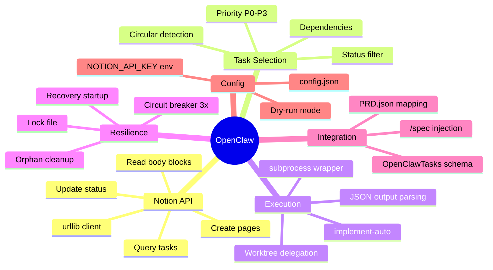

# OpenClaw - Notion Task Runner

> Genere le 2026-02-13 - 3 iterations - Template: feature - EMS final: 82/100

---

## 1. Contexte et Objectif

Le projet EPCI dispose deja d'un systeme d'execution autonome de taches : Ralph (boucle bash) et le skill `implement-auto` (workflow EPCI headless). Il manque une couche d'orchestration Python qui connecte Notion (source de verite pour les taches) au moteur d'execution implement-auto, permettant une boucle completement automatique : recuperer les taches, les executer, et mettre a jour Notion.

**Question/probleme initial**:
> "Mettre en place un ensemble de librairies et composants Python au sein du projet EPCI pour piloter des taches a partir de Notion, comme le propose la methodologie Ralph, mais en Python stdlib uniquement."

**Perimetre**:
- IN: Client Notion API (urllib), fichier JSON de config, boucle principale (fetch/select/execute/update), selection par priorite+dependances, injection PRD->Notion depuis /spec, dry-run mode, circuit breaker, recovery au redemarrage
- OUT: Interface web/UI, modification de implement-auto, gestion multi-projet simultanee, MCP Notion, dashboard de monitoring, modification du schema Notion

**Criteres de succes**:
1. Lancer `python loop.py` et voir les taches Notion s'executer une par une automatiquement
2. Chaque tache passe par les etats Notion : En cours -> Termine (ou Echoue)
3. Le script s'arrete proprement quand plus de taches eligibles ou apres 3 echecs consecutifs
4. Les libs Python sont reutilisables par /spec pour injecter les taches dans Notion

---

## 2. Synthese Executive

OpenClaw est un orchestrateur Python stdlib-only qui pilote l'execution automatique de taches depuis une base Notion. Il lit les taches eligibles (filtrees par statut, priorite, dependances), les execute via `claude --print -p "/implement-auto ..."`, et met a jour Notion avec les resultats. Le systeme reutilise integralement implement-auto pour le cycle EPCI (worktree, explore, plan, code, inspect, merge, push).

**Insight cle**: **Le script Python n'est qu'un orchestrateur leger (~500 lignes) — toute la complexite d'execution est deja geree par implement-auto ; OpenClaw ne fait que connecter Notion au moteur existant.**

**Decisions principales**:
1. Python stdlib uniquement (urllib, json, subprocess) — zero dependance externe
2. Notion API via urllib avec NOTION_API_KEY en variable d'environnement
3. implement-auto comme moteur d'execution (delegation totale, y compris worktrees)
4. Libs reutilisables par /spec pour injection PRD -> Notion

**Routing recommande**: STANDARD -> `/spec` puis `/implement`

---

## 3. Personas et Scenarios d'Usage

### 3.1 Persona Principal: Developpeur Solo

| Attribut | Description |
|----------|-------------|
| Role | Developpeur solo qui gere ses projets via Notion |
| Objectif | Automatiser l'execution des taches de dev definies dans Notion |
| Frustration actuelle | Doit lancer manuellement chaque tache, copier les specs, suivre l'avancement |
| Niveau technique | Expert (Claude Code, Python, Git, Notion API) |
| Contexte d'usage | Terminal local, execution en arriere-plan ou nuit, suivi via Notion |

**Scenario d'usage typique**:
> Le developpeur a decompose une feature en 8 user stories dans Notion via `/spec`. Chaque story a un statut "A faire", une priorite, et des dependances. Il lance `python src/openclaw/loop.py` avant de partir. Le script recupere la premiere tache eligible (P0 sans dependance bloquante), met son statut a "En cours" dans Notion, execute implement-auto qui cree un worktree, code en TDD, fait la review, merge et push. Puis passe a la suivante. Le lendemain, il ouvre Notion et voit que 6 taches sont "Termine", 1 "Echoue" (avec le message d'erreur), et 1 reste "A faire" (dependance de la tache echouee).

---

## 4. Analyse et Conclusions Cles

### 4.1 Architecture : Orchestrateur Leger + Moteur Existant

Le pattern architectural est une separation claire entre l'orchestration (Python/Notion) et l'execution (implement-auto/Claude). Le script Python ne touche jamais au code du projet cible — il ne fait que piloter les transitions d'etat et deleguer l'execution.

**Points cles**:
- implement-auto gere deja le cycle complet : worktree, E-P-C-I, review, merge, push, PR
- Le script Python parse le JSON output de implement-auto (`.implement-auto-output.json`) pour connaitre le resultat
- Aucune logique de build/test/review dans le Python — tout est dans implement-auto

**Implications pour l'implementation**:
Le client Notion et le selecteur de taches sont les seuls composants a developper. L'executeur est un simple wrapper subprocess.

### 4.2 Schema Notion OpenClawTasks : Deja Pret

La base de donnees Notion "OpenClawTasks" est deja concue avec 24 proprietes couvrant tout le workflow :
- **Statut** avec mapping (A faire -> En cours -> En review -> Termine/Echoue)
- **Dependances bidirectionnelles** via relations Notion (Bloque par / Bloque)
- **Tracking d'execution** : Attempts, Iteration, Erreurs, Files Modified, Duree
- **Integration Git** : Branch, PR URL, Auto-merged
- **Flags de config** : validate_plan, with_review, no_auto_merge
- **Spec source duale** : Spec Path (Git) ou body Notion

**Implications pour l'implementation**:
Le mapping est pre-defini dans `src/schemas/notion-bdd-openClawTasks.json`. Le client Notion peut s'appuyer sur ce schema pour construire les payloads.

### 4.3 Double Usage des Libs : Runner + Injection /spec

Les libs Python d'OpenClaw (notamment `notion_client.py`) servent a deux flux :
1. **Runner** : fetch taches, update statuts, ecrire resultats
2. **Injection /spec** : creer les pages Notion depuis un PRD.json genere par /spec

Ce double usage impose une API clean et une separation des responsabilites.

**Implications pour l'implementation**:
`notion_client.py` doit exposer une API generique (query, update, create_page, read_body) reutilisable par les deux flux.

### 4.4 Resilience et Recovery

Le systeme doit gerer les crashes gracieusement :
- **Recovery au demarrage** : detection des taches "En cours" orphelines
- **Circuit breaker** : 3 echecs consecutifs = arret automatique
- **Lock file** : empeche l'execution concurrente
- **Worktrees orphelins** : nettoyage via `git worktree list` + prune

---

## 5. User Stories et Criteres d'Acceptation

### US1: Executer la boucle de taches

**Story**: As a developpeur, I want to run `python loop.py` so that all eligible Notion tasks are executed automatically.

**Priorite**: Must have

**Criteres d'acceptation**:
```gherkin
AC1: Boucle de base
Given une BDD Notion avec 3 taches "A faire" (P0, P1, P2) sans dependances
When je lance `python src/openclaw/loop.py`
Then les taches sont executees dans l'ordre P0 -> P1 -> P2
And chaque tache passe par En cours -> Termine dans Notion

AC2: Arret quand plus de taches
Given toutes les taches sont "Termine" ou "Echoue"
When la boucle cherche la prochaine tache
Then le script s'arrete avec un message "No eligible tasks remaining"
And le code de sortie est 0

AC3: Circuit breaker
Given 3 taches consecutives echouent
When la boucle detecte 3 echecs d'affilee
Then le script s'arrete avec un message "Circuit breaker triggered"
And le code de sortie est 1
```

**Edge cases**:
- Tache unique dans la BDD -> execute et s'arrete
- Toutes les taches sont "Bloque" -> message "All tasks blocked" et arret
- API Notion indisponible -> retry 3x avec backoff, puis arret avec erreur

---

### US2: Selectionner la tache la plus eligible

**Story**: As a developpeur, I want the runner to select tasks by priority and dependencies so that critical work is done first.

**Priorite**: Must have

**Criteres d'acceptation**:
```gherkin
AC1: Selection par priorite
Given 3 taches "A faire" : T1 (P2), T2 (P0), T3 (P1)
When le selecteur choisit la prochaine tache
Then T2 (P0) est selectionnee

AC2: Respect des dependances
Given T1 (P0, "A faire") depend de T2 (P1, "A faire")
When le selecteur choisit la prochaine tache
Then T2 est selectionnee (T1 est bloquee par T2)

AC3: Tache bloquee par tache echouee
Given T1 depend de T2, T2 est "Echoue"
When le selecteur evalue T1
Then T1 est marquee "Bloque" et n'est pas selectionnee
```

**Edge cases**:
- Dependance circulaire (T1 depend de T2, T2 depend de T1) -> les deux sont marquees "Bloque"
- Toutes les taches ont la meme priorite -> selection par Story ID croissant

---

### US3: Mettre a jour Notion avec les resultats

**Story**: As a developpeur, I want Notion to reflect the real-time execution status so that I can track progress from Notion.

**Priorite**: Must have

**Criteres d'acceptation**:
```gherkin
AC1: Mise a jour statut En cours
Given une tache selectionnee pour execution
When l'execution demarre
Then le statut Notion passe a "En cours"
And le champ "Demarre le" est rempli avec le timestamp courant

AC2: Mise a jour statut Termine (succes)
Given implement-auto retourne status=SUCCESS avec PR URL
When le runner traite le resultat
Then le statut Notion passe a "Termine"
And les champs Branch, PR URL, Files Modified, Duree sont remplis
And "Passes" est coche

AC3: Mise a jour statut Echoue
Given implement-auto retourne status=FAILED avec erreur
When le runner traite le resultat
Then le statut Notion passe a "Echoue"
And le champ "Erreurs" contient le message d'erreur
And "Attempts" est incremente
```

**Edge cases**:
- implement-auto retourne PARTIAL -> statut "En review (partiel)"
- Timeout implement-auto (processus tue) -> statut "Echoue", erreur "Execution timeout"

---

### US4: Injecter les taches PRD dans Notion

**Story**: As a developpeur, I want `/spec` to inject the decomposed PRD directly into Notion so that I don't have to create tasks manually.

**Priorite**: Must have

**Criteres d'acceptation**:
```gherkin
AC1: Injection depuis PRD.json
Given un PRD.json avec 5 user stories genere par /spec
When le module prd_injector.py est appele avec le chemin du PRD et le project ID Notion
Then 5 pages sont creees dans la BDD Notion OpenClawTasks
And chaque page a le bon Story ID, Name, Description, Priorite, Complexite
And les dependances sont resolues en relations Notion bidirectionnelles

AC2: Acceptance criteria dans le body
Given une user story avec 3 acceptance criteria
When la page Notion est creee
Then le body contient une section "Criteres d'acceptation" avec les 3 items en checklist
```

**Edge cases**:
- PRD.json invalide (schema non conforme) -> erreur avec message precis
- Story ID duplique dans Notion -> skip avec warning
- Relation de dependance vers une story non encore creee -> creer d'abord les dependances

---

### US5: Dry-run mode

**Story**: As a developpeur, I want to preview which tasks would be executed without actually running them so that I can validate the selection algorithm.

**Priorite**: Should have

**Criteres d'acceptation**:
```gherkin
AC1: Preview des taches
Given 5 taches eligibles dans Notion
When je lance `python loop.py --dry-run`
Then la liste ordonnee des taches est affichee (ID, nom, priorite, dependances)
And aucune execution n'est lancee
And aucun statut Notion n'est modifie
```

**Edge cases**:
- Aucune tache eligible -> message "No eligible tasks"

---

### US6: Recovery au redemarrage

**Story**: As a developpeur, I want the runner to detect orphaned tasks on startup so that crashed executions don't leave the system in an inconsistent state.

**Priorite**: Should have

**Criteres d'acceptation**:
```gherkin
AC1: Detection de taches orphelines
Given une tache "En cours" dans Notion sans processus actif (crash precedent)
When le runner demarre
Then la tache est detectee comme orpheline
And son statut est remis a "A faire"
And un warning est log

AC2: Nettoyage worktrees orphelins
Given un worktree `../worktrees/task-slug` existe sans processus actif
When le runner demarre
Then le worktree est nettoye via git worktree remove
And un warning est log
```

**Edge cases**:
- Tache legitimement "En cours" par un autre processus -> le lock file empeche le conflit

---

## 6. Decisions et Orientations Techniques

| Decision | Rationale | Impact | Confiance |
|----------|-----------|--------|-----------|
| D1: Python stdlib uniquement | Zero dependance, portabilite, pas de requirements.txt | urllib pour HTTP, json pour parsing | High |
| D2: urllib + NOTION_API_KEY env var | Standalone, pas de MCP a runtime | Necessite export de la cle | High |
| D3: implement-auto comme executeur | Deja complet (worktree, EPCI, review, merge, push) | Aucune logique d'execution dans Python | High |
| D4: Recovery au demarrage | Robustesse face aux crashes | Scan Notion + git worktree list au startup | High |
| D5: Code dans src/openclaw/ | Coherent avec le naming du schema existant | Module Python dans l'arborescence EPCI | High |
| D6: Spec Path > body Notion | Specs Git sont plus riches et versionnees | Fallback transparent | High |
| D7: Circuit breaker 3 echecs | Evite de bruler des tokens sur des taches qui echouent en serie | Arret automatique | High |
| D8: Logging fichier + stdout | Debug facile + historique persistant | Un fichier log par run | Medium |
| D9: Dry-run via --dry-run | Valider la selection sans executer | Aucun side effect | High |
| D10: Libs reutilisables par /spec | Evite la duplication, injection directe PRD -> Notion | API notion_client generique | High |
| D11: Worktrees delegues a implement-auto | Evite la duplication de logique, implement-auto gere le cycle | Cleanup des orphelins au startup | High |

### Decisions differees
- **Strategie de rate limiting Notion** — Differee car: peut etre ajustee empiriquement. A revisiter: apres les premiers tests (default: sleep 0.35s entre requetes)
- **Format de logging structure** — Differee car: stdout colore suffit pour le MVP. A revisiter: si besoin de parsing automatique des logs

### Choix architecturaux
- **Pattern retenu**: Orchestrateur leger (Python) + Moteur d'execution delegue (implement-auto)
- **Justification**: Separation des responsabilites maximale. Le Python ne gere que l'orchestration Notion<->Claude, toute la complexite d'execution est dans implement-auto qui est deja teste et stable.

---

## 7. Priorisation MoSCoW

### Must Have (MVP) — ~60% effort
| # | Feature/Story | Effort estime | Dependance |
|---|---------------|---------------|------------|
| 1 | Client Notion API (query, update, read_body) | M | - |
| 2 | Selecteur de taches (priorite + dependances) | M | #1 |
| 3 | Executeur subprocess (implement-auto wrapper) | S | - |
| 4 | Boucle principale (loop.py) | M | #1, #2, #3 |
| 5 | Config JSON (db_id, project_id, api_key) | S | - |
| 6 | Injection PRD -> Notion (prd_injector.py) | M | #1 |

### Should Have — ~20% effort
| # | Feature/Story | Effort estime | Dependance |
|---|---------------|---------------|------------|
| 7 | Recovery au demarrage (orphelines + worktrees) | S | #1, #4 |
| 8 | Circuit breaker (3 echecs consecutifs) | S | #4 |
| 9 | Dry-run mode (--dry-run) | S | #2, #4 |
| 10 | Logging structure (fichier + stdout) | S | #4 |

### Could Have — ~20% effort
| # | Feature/Story | Effort estime | Dependance |
|---|---------------|---------------|------------|
| 11 | Lock file (execution concurrente) | S | #4 |
| 12 | Parsing des flags Notion (validate_plan, with_review) | S | #1, #3 |
| 13 | Notion body -> Markdown conversion | M | #1 |

### Won't Have (this release)
- **Dashboard de monitoring** — Raison: Notion sert de dashboard, pas besoin d'un second
- **Multi-projet simultane** — Raison: un seul projet par execution, lancer plusieurs instances si besoin
- **Gestion des tokens/couts** — Raison: hors scope de l'orchestrateur, releve de Claude Code

---

## 8. Contraintes et Dependances

### Contraintes techniques
| Type | Contrainte | Impact |
|------|------------|--------|
| Stack | Python stdlib uniquement (pas de pip) | Utilisation de urllib au lieu de requests |
| API | Notion API version 2022-06-28 | Version fixee, ne pas upgrader sans test |
| Rate limit | Notion: 3 requetes/seconde | Sleep 0.35s entre requetes batch |
| Exec | Claude Code CLI installe et configure | `claude --print` doit fonctionner |
| Git | Repo Git initialise avec branch master/main | implement-auto cree des worktrees |

### Dependances externes
| Dependance | Type | SLA/Disponibilite | Fallback |
|------------|------|-------------------|----------|
| Notion API | Externe | ~99.9% | Retry 3x avec exponential backoff, puis arret |
| Claude Code CLI | Local | Depend de la licence | Arret avec message explicite |
| implement-auto skill | Interne | Toujours disponible (local) | Aucun (c'est le moteur) |
| GitHub API (via gh) | Externe | ~99.9% | implement-auto gere en interne |

### Integrations requises
- **Systemes existants**: Notion API, Claude Code CLI, Git (worktrees)
- **APIs a consommer**: Notion REST API (query, update, read blocks, create page)
- **APIs a exposer**: Aucune (script CLI)

---

## 9. Risques et Hypotheses

### Risques identifies

| Risque | Probabilite | Impact | Mitigation |
|--------|-------------|--------|------------|
| urllib insuffisant pour Notion API complexe | Low | High | Tester les payloads JSON complexes (rich_text, relations) en premier |
| implement-auto ne produit pas de JSON parsable | Low | High | Valider le format de sortie avec un test d'integration |
| Rate limiting Notion en batch (injection PRD) | Medium | Medium | Sleep 0.35s + retry avec backoff sur 429 |
| Crash en milieu d'execution sans cleanup | Medium | Medium | Recovery au demarrage + lock file |
| Dependances circulaires dans Notion | Low | Medium | Detection et marquage "Bloque" des deux taches |
| Token burning si implement-auto boucle | Low | High | Circuit breaker de implement-auto (3 niveaux) + circuit breaker Python (3 echecs) |

### Hypotheses (Assumptions)
- **Notion API stable sur la version 2022-06-28** — Si faux: adapter les headers et payloads
- **implement-auto produit un JSON exploitable** — Si faux: parser la sortie stdout comme fallback
- **Une seule instance du runner a la fois** — Si faux: le lock file empechera les collisions
- **Le schema OpenClawTasks est deja cree dans Notion** — Si faux: ajouter un script de creation de schema

---

## 10. Plan d'Action Haut Niveau

| Phase | Livrables | Effort estime | Owner | Prerequis |
|-------|-----------|---------------|-------|-----------|
| 1. Config + Client Notion | config.json, notion_client.py (query, update) | ~3h | Dev | Schema Notion existant |
| 2. Selecteur de taches | task_selector.py (priorite, dependances) | ~2h | Dev | Phase 1 |
| 3. Executeur | runner.py (subprocess wrapper implement-auto) | ~1h | Dev | - |
| 4. Boucle principale | loop.py (orchestration complete) | ~3h | Dev | Phase 1, 2, 3 |
| 5. Injection PRD | prd_injector.py (create_page + mapping) | ~3h | Dev | Phase 1 |
| 6. Resilience | Recovery, circuit breaker, lock file, dry-run | ~2h | Dev | Phase 4 |
| 7. Tests + validation | Tests unitaires, integration Notion | ~2h | Dev | Phase 1-6 |

**Effort total estime**: ~16h (2 jours)
**Chemin critique**: Phase 1 -> Phase 2 -> Phase 4

### Quick Wins (impact eleve, effort faible)
1. **config.json** — Structure simple, debloque tout le reste
2. **runner.py** — Simple subprocess wrapper, ~50 lignes

### Investissements Strategiques (impact eleve, effort eleve)
1. **notion_client.py** — Composant central reutilisable par tous les flux
2. **prd_injector.py** — Automatise le flux /spec -> Notion, gain de temps massif

---

## 11. Mindmap de Synthese



---

## 12. Score EMS Final

```
EMS Final: 82/100 MATURE

Progression EMS
100 |
 90 | . . . . . . . . . . . . . . . . . . . .
 80 |                      *
 70 | . . . . . . . . . . . . . . . . . . . .
 60 |
 50 |          *
 40 | . . . . . . . . . . . . . . . . . . . .
 30 |
 20 | *
 10 | . . . . . . . . . . . . . . . . . . . .
  0 +----+-----+-----+-----+
    Init  It.1  It.2  Fin

Axes finaux:
   Clarte       [#########.] 85/100
   Profondeur   [########..] 78/100
   Couverture   [########..] 76/100
   Decisions    [#########.] 88/100
   Actionab.    [########..] 82/100
```

**Evaluation globale**: Exploration mature avec 11 decisions verrouillees, schema Notion pre-existant, et architecture d'orchestration clairement definie. Le projet est pret pour la phase /spec.

### Verification des Criteres de Succes

| Critere | Statut | Evidence |
|---------|--------|----------|
| Execution automatique des taches Notion | Atteint | Architecture loop.py -> implement-auto definie |
| Transitions d'etat Notion | Atteint | Mapping statut complet (A faire -> En cours -> Termine/Echoue) |
| Arret propre | Atteint | Circuit breaker + detection "no eligible tasks" |
| Libs reutilisables par /spec | Atteint | Design de notion_client.py + prd_injector.py |

---

## 13. Pistes Non Explorees

| Sujet | Pourquoi non explore | Valeur potentielle | Prochaine etape |
|-------|----------------------|-------------------|-----------------|
| Monitoring temps reel | Notion sert deja de dashboard | Medium | Ajouter un champ "derniere activite" si besoin |
| Parallelisation de taches | Complexite de gestion des worktrees concurrents | Medium | Etudier si implement-auto supporte le parallelisme |
| Webhooks Notion | Necessite un serveur HTTP, hors scope | Low | Envisager pour notification de nouvelles taches |
| Metriques de performance | Pas prioritaire pour le MVP | Medium | Ajouter tracking duree/tokens dans une v2 |
| Tests Python de notion_client | Necessite un mock de l'API Notion | High | Definir dans /spec avec mock urllib |

---

## 14. References

### Documents analyses
- `src/schemas/notion-bdd-openClawTasks.json`: Schema complet de la BDD Notion OpenClawTasks (24 proprietes, mappings, relations)
- `src/skills/implement-auto/SKILL.md`: Workflow headless EPCI 9 etapes avec circuit breaker 3 niveaux
- `docs/librairies/ralph-claude-code-main/ralph_loop.sh`: Boucle Ralph bash comme modele d'inspiration
- `.ralph/skill-implement/ralph.sh`: Script Ralph existant pour l'execution batch
- `src/schemas/ralph-index-v1.json`: Schema d'index Ralph pour la gestion des features
- `.project-memory/cache/notion-schema.json`: Cache du schema Notion "Taches" (30+ proprietes)
- `scripts/worktree-create.sh` / `worktree-finalize.sh`: Utilitaires de gestion des worktrees Git

### Recherches web
- Aucune recherche web necessaire (documentation interne suffisante)

### Conversations passees referencees
- Projet "openclaw" : specs existantes (task-002-notion-api.md) pour un client Notion en bash/curl — inspire la version Python

---

## 15. Prochaines Etapes

**Workflow recommande**:

| Etape | Skill | Action |
|-------|-------|--------|
| 1 | `/spec` | Decomposer ce brief en taches atomiques avec PRD.json |
| 2 | `/spec` -> injection | Utiliser prd_injector.py pour creer les taches dans Notion |
| 3 | `python loop.py` | Executer le runner sur ses propres taches (meta-bootstrapping) |

**Routing de complexite**: STANDARD
**Skill suggere**: `/spec`

**Commande suggeree**:
```
/spec brief-openclaw-notion-runner-2026-02-13.md
```

---

*Brief genere par /brainstorm v6.0 - EPCI Plugin*
