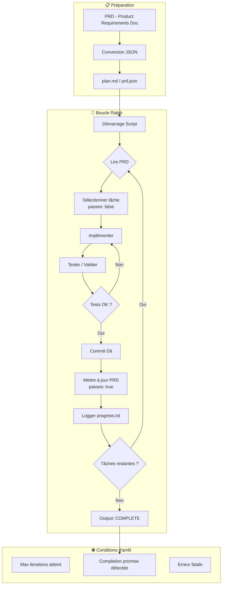
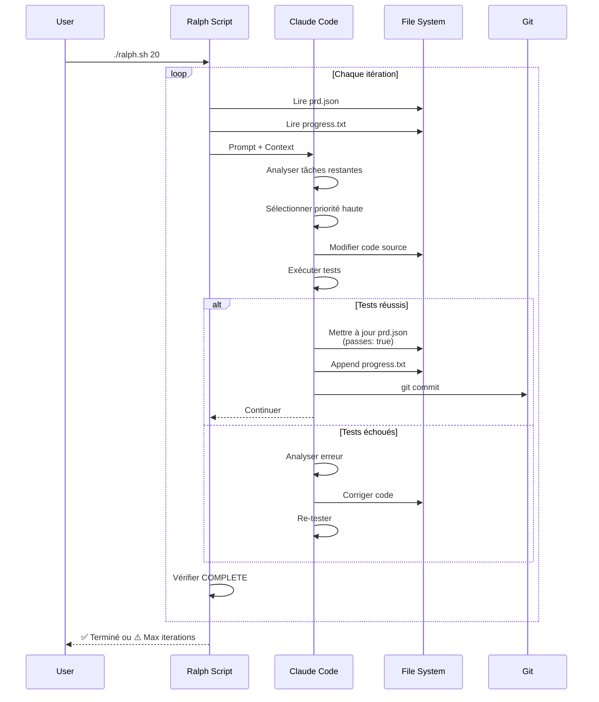
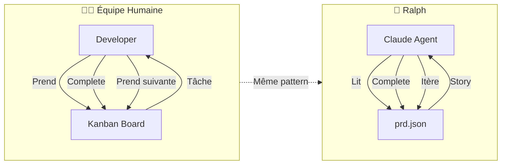
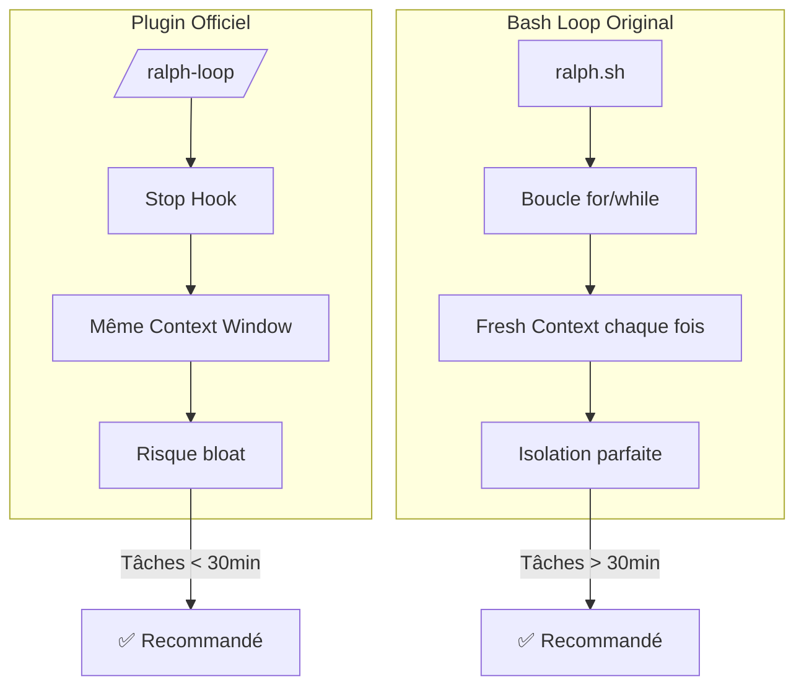

# 🔧 Documentation Technique : Ralph Wiggum pour Claude Code

> **Version** : 1.0.0 | **Dernière màj** : 2025-01-13
> **Statut** : Stable (Plugin officiel Anthropic)
> **Crédit original** : Jeffrey Huntley | **Plugin officiel** : Anthropic

---

## 📋 TL;DR — Synthèse Exécutive

**Ralph Wiggum** est une technique d'orchestration d'agents IA qui force Claude Code à travailler en **boucle continue** jusqu'à complétion d'une tâche. Inspirée du personnage des Simpsons (naïf mais persévérant), elle résout le problème majeur des agents IA : **l'arrêt prématuré** [1][2][3].

**Principe fondamental** : Une simple boucle bash ou un stop hook qui relance automatiquement Claude avec le même prompt jusqu'à ce qu'un critère de complétion soit atteint [1][4].

**Résultats documentés** :
- Un MVP de 50 000$ développé pour moins de 300$ [2][6]
- Un langage de programmation complet créé en 30h AFK [6]
- 259 PRs, 457 commits en 30 jours par le créateur de Claude Code [8]

**Coût typique** : ~3$/itération avec Opus 4.5, soit ~30$ pour un cycle complet de 10 itérations [5].

---

## 🎯 Vue d'Ensemble

### Qu'est-ce que c'est ?

Ralph Wiggum est une **technique d'orchestration** qui transforme Claude Code (ou tout agent CLI) en agent autonome capable de travailler pendant des heures sans intervention humaine [1][3][4].

Contrairement aux approches complexes (agent swarms, orchestrateurs multi-agents), Ralph utilise une approche minimaliste : **une simple boucle for** qui répète le même prompt jusqu'à complétion [1].

> "The way to get this to work is with a for loop" — Matt Pocock [1]

### À quoi ça sert ?

| Use Case | Description | Durée typique |
|----------|-------------|---------------|
| **Features complexes** | Construction de fonctionnalités multi-fichiers | 1-4 heures |
| **Refactoring massif** | Migrations, mises à jour de dépendances | 2-8 heures |
| **Applications complètes** | MVP, prototypes fonctionnels | 4-30 heures |
| **Overnight coding** | "Ship working code while you sleep" [1] | 8-12 heures |

### Pourquoi ça fonctionne maintenant ?

L'approche était trop simple pour les modèles antérieurs. Avec **Opus 4.5** et **GPT 5.2**, les modèles sont suffisamment intelligents pour :
1. Comprendre des critères d'acceptation complexes
2. Auto-évaluer leur travail
3. Itérer de manière cohérente sans perdre le contexte [1][4]

### Prérequis

| Élément | Minimum | Recommandé |
|---------|---------|------------|
| **Claude Code** | v2.0.76+ | Dernière version |
| **Plan Anthropic** | Claude Pro (100$/mois) | Claude Max 5X |
| **Node.js** | v18+ | v20+ |
| **Terminal** | Bash/Zsh | iTerm2 / Ghosty |

---

## 🚀 Quick Start

### Installation du Plugin Officiel

```bash
# Étape 1 : Lancer Claude Code
claude

# Étape 2 : Installer le marketplace (si pas déjà fait)
/plugin install marketplace

# Étape 3 : Installer Ralph Wiggum
/plugin install @anthropic/ralph-wiggum
```

Vérification :
```bash
/plugin installed
# Doit afficher : ralph-wiggum ✓
```

### Premier exemple

```bash
# Syntaxe de base
/ralph-loop "Votre tâche ici" --max-iterations 10 --completion-promise "done"
```

**Exemple concret** — Conversion Python → TypeScript [2] :

```bash
/ralph-loop "Convert the Python script delay_audio.py to TypeScript. 
Write passing tests using bun test module. 
Keep iterating until all tests pass." \
--max-iterations 20 \
--completion-promise "done"
```

### Structure d'un prompt efficace

```markdown
/ralph-loop "
## Task
Build a REST API for todos

## Requirements  
- CRUD operations
- Input validation
- Unit tests with 80% coverage
- Error handling

## Success Criteria
- All tests pass
- No linter errors
- Documentation updated

## Completion Signal
Output 'COMPLETE' when all criteria met
" --max-iterations 20 --completion-promise "COMPLETE"
```

---

## 🏗️ Architecture

### Vue d'ensemble du flux



### Deux implémentations distinctes

| Aspect | Plugin Officiel Anthropic | Bash Loop Original |
|--------|---------------------------|-------------------|
| **Mécanisme** | Stop Hook | Boucle bash while/for |
| **Contexte** | Même context window | Fresh context à chaque itération |
| **Avantage** | Intégration native | Isolation mémoire |
| **Inconvénient** | Risque de bloat context [7] | Configuration manuelle |
| **Recommandation** | Tâches courtes (<30 min) | Tâches longues (heures) |

### Implémentation Bash Loop (recommandée pour long-running)

```bash
#!/bin/bash
# ralph.sh — Implémentation originale Jeffrey Huntley

set -e

MAX_ITERATIONS=${1:-10}
SCRIPT_DIR="$(cd "$(dirname "${BASH_SOURCE[0]}")" && pwd)"
PRD_FILE="$SCRIPT_DIR/prd.json"
PROGRESS_FILE="$SCRIPT_DIR/progress.txt"
PROMPT_FILE="$SCRIPT_DIR/prompt.md"
COMPLETION_PROMISE="COMPLETE"

for ((i=1; i<=MAX_ITERATIONS; i++)); do
    echo "=========================================="
    echo "🔄 Starting iteration $i of $MAX_ITERATIONS"
    echo "=========================================="
    
    # Lancer Claude Code avec le prompt
    OUTPUT=$(claude --print -f "$PROMPT_FILE" -f "$PRD_FILE" -f "$PROGRESS_FILE")
    
    echo "$OUTPUT"
    
    # Vérifier si le signal de complétion est présent
    if echo "$OUTPUT" | grep -q "$COMPLETION_PROMISE"; then
        echo "✅ Task completed after $i iterations"
        # Notification optionnelle
        # notify-send "Ralph Complete" "Task finished in $i iterations"
        exit 0
    fi
done

echo "⚠️ Max iterations ($MAX_ITERATIONS) reached without completion"
exit 1
```

### Flux de données détaillé



---

## 📖 Fichiers de Configuration

### Structure de projet Ralph

```
project/
├── plans/
│   ├── ralph.sh              # Script de boucle
│   ├── ralph-once.sh         # Version interactive (human-in-loop)
│   ├── prd.json              # User stories atomiques
│   ├── progress.txt          # Log court-terme
│   └── prompt.md             # Prompt système
├── .claude/
│   ├── settings.json         # Config sandbox
│   └── agents.md             # Mémoire long-terme
└── src/
    └── ...                   # Code source
```

### Format prd.json

```json
{
  "project": "My Feature",
  "version": "1.0.0",
  "stories": [
    {
      "id": "US-001",
      "title": "Add priority field to database",
      "description": "Users need to set task priorities",
      "acceptance_criteria": [
        "Priority column exists in tasks table",
        "Values: low, medium, high, critical",
        "Default value: medium",
        "API endpoint accepts priority parameter"
      ],
      "passes": false
    },
    {
      "id": "US-002", 
      "title": "Filter dropdown with priority options",
      "acceptance_criteria": [
        "Dropdown has options: all, low, medium, high, critical",
        "Filtering updates task list in real-time",
        "URL reflects current filter state"
      ],
      "passes": false
    }
  ]
}
```

**Règles critiques pour les stories** [1][5] :
1. **Atomicité** : Chaque story doit être completable en une itération
2. **Testabilité** : Critères d'acceptation vérifiables programmatiquement
3. **Ordonnancement** : Dépendances résolues par ordre de priorité

### Format progress.txt

```markdown
## Iteration 1 — 2025-01-13 14:30
**Thread**: amp://thread/abc123
**Story**: US-001 - Add priority field to database

### Implemented
- Created migration for priority column
- Added enum type validation
- Updated Task model

### Files Changed
- src/migrations/001_add_priority.sql
- src/models/task.py
- tests/test_task.py

### Learnings
- PostgreSQL ENUM needs explicit CREATE TYPE
- Alembic migration order matters for foreign keys

### Next
- US-002 ready to implement

---
## Iteration 2 — 2025-01-13 14:45
...
```

### Prompt système optimal

```markdown
# prompt.md — System Instructions for Ralph

You are an autonomous coding agent working on my project.

## Your Task
Read the PRD (prd.json) and complete user stories one at a time.

## Workflow
1. Read progress.txt to understand recent work
2. Read prd.json and find stories with "passes": false
3. Select the HIGHEST PRIORITY uncompleted story
4. Implement ONLY that story
5. Run tests to verify acceptance criteria
6. If tests pass:
   - Update prd.json: set "passes": true
   - Append to progress.txt with learnings
   - Make a git commit with clear message
7. If tests fail:
   - Debug and fix
   - Re-run tests
   - Repeat until passing

## Critical Rules
- Work on ONE story per iteration
- Never skip acceptance criteria
- Commit after each completed story
- Log useful learnings in progress.txt
- Update agents.md if you discover important patterns

## Completion Signal
When ALL stories have "passes": true, output exactly: COMPLETE

## Code Standards
- Type check: pnpm type-check must pass
- Tests: pnpm test must pass  
- Lint: pnpm lint must have 0 errors
```

---

## ⚙️ Configuration Avancée

### Sandbox (Sécurité)

**Problème** : Claude peut exécuter n'importe quelle commande bash [7].

**Solution** : Configurer un sandbox isolé.

```json
// .claude/settings.json
{
  "sandbox": {
    "enabled": true,
    "allowedCommands": [
      "npm",
      "pnpm", 
      "node",
      "git add",
      "git commit",
      "git status",
      "cat",
      "ls",
      "mkdir"
    ],
    "blockedCommands": [
      "rm -rf",
      "git push",
      "sudo",
      "curl",
      "wget"
    ],
    "autoAllow": [
      "read",
      "write:src/**",
      "write:tests/**"
    ]
  }
}
```

Activation :
```bash
claude
/sandbox enable
```

### Hooks personnalisés

```json
// .claude/hooks/stop-hook.json
{
  "event": "stop",
  "script": "./plans/ralph-trigger.sh",
  "conditions": {
    "excludePromise": ["COMPLETE", "DONE", "FINISHED"]
  }
}
```

### Variables d'environnement

| Variable | Description | Défaut |
|----------|-------------|--------|
| `RALPH_MAX_ITERATIONS` | Limite d'itérations | `10` |
| `RALPH_COMPLETION_PROMISE` | Signal de fin | `COMPLETE` |
| `RALPH_PROGRESS_FILE` | Fichier de log | `progress.txt` |
| `RALPH_PRD_FILE` | Fichier de stories | `prd.json` |
| `RALPH_AUTO_COMMIT` | Commit automatique | `true` |
| `RALPH_NOTIFY` | Notifications | `false` |

---

## 🔄 Workflows Avancés

### Human-in-the-loop (Ralph Once)

Pour les tâches nécessitant supervision :

```bash
#!/bin/bash
# ralph-once.sh — Version interactive

claude --interactive -f prompt.md -f prd.json -f progress.txt
```

Avantages [1] :
- Validation manuelle entre itérations
- Steering possible
- Apprentissage du comportement de Ralph

### Multi-personas (Rotation d'experts)

Technique avancée pour améliorer la qualité [4] :

```markdown
## Persona Rotation

After completing implementation, rotate through these review personas:

### Phase 1: Developer Review
- Check code quality
- Verify tests coverage
- Review error handling

### Phase 2: Solution Architect  
- Validate file structure
- Check dependencies
- Identify refactoring needs

### Phase 3: Frontend Designer
- Review UI/UX
- Check accessibility
- Verify responsiveness

### Phase 4: QA Engineer
- Run integration tests
- Test edge cases
- Verify 90%+ coverage

### Phase 5: Project Manager
- Validate against requirements
- Check documentation
- Verify acceptance criteria

### Phase 6: Business Analyst
- Confirm user value delivered
- Check feature completeness

Rotate through ALL personas until no issues found for 2 full cycles.
```

### Feedback Loop avec Browser

Pour validation visuelle automatique [7] :

```bash
# Installer le MCP Playwright
/mcp install playwright

# Ou utiliser Claude for Chrome
/chrome enable
```

Prompt avec validation visuelle :
```markdown
## Validation Steps

After each change:
1. Start dev server: npm run dev
2. Open browser to http://localhost:3000
3. Take screenshot of affected component
4. Check browser console for errors
5. Verify layout matches acceptance criteria
```

---

## 📊 Modèle Mental

### Analogie avec l'équipe Agile



**Insight clé** [1] : Ralph reproduit exactement le workflow des développeurs humains :
1. Regarder le board
2. Prendre une tâche
3. L'implémenter
4. La tester
5. La commit
6. Répéter

---

## ⚠️ Limitations et Quotas

| Limite | Valeur | Impact | Mitigation |
|--------|--------|--------|------------|
| **Context window** | ~168K tokens (Opus) | Stories trop grandes échouent | Découper en stories atomiques [1] |
| **Coût par itération** | ~3$ (Opus 4.5) | Budget à prévoir | Max iterations + monitoring |
| **Plan $20/mois** | Usage limité | 1 Ralph loop max | Upgrade $100+ |
| **Plan $100/mois** | Usage confortable | Multiple loops possibles | Recommandé |
| **Boucle infinie** | Possible si mal configuré | Coûts explosifs | TOUJOURS set max_iterations |
| **Merge conflicts** | Multi-agents parallèles | Code cassé | 1 agent par branche [1] |

### Coûts estimés

| Scénario | Itérations | Coût estimé |
|----------|------------|-------------|
| Feature simple | 5-10 | 15-30$ |
| Feature complexe | 10-20 | 30-60$ |
| MVP complet | 30-50 | 90-150$ |
| Application overnight | 50-100 | 150-300$ |

---

## 🐛 Troubleshooting

### Erreur : Claude s'arrête prématurément

**Cause** : Pas de stop hook configuré ou completion promise détectée par erreur.

**Solution** :
```bash
# Vérifier l'installation du plugin
/plugin installed

# Réinstaller si nécessaire
/plugin uninstall ralph-wiggum
/plugin install @anthropic/ralph-wiggum

# S'assurer que le prompt ne contient pas le mot du completion promise
```

### Erreur : Boucle infinie

**Cause** : Completion promise jamais atteinte.

**Solution** :
```bash
# Toujours définir max_iterations
/ralph-loop "..." --max-iterations 20 --completion-promise "DONE"

# Vérifier que le prompt demande explicitement d'output le signal
```

### Erreur : Context window saturé (Plugin officiel)

**Cause** : Le plugin officiel ne reset pas le context [7].

**Symptômes** : `0% context` affiché, agent ralentit.

**Solution** : Utiliser la bash loop originale qui crée un fresh context à chaque itération.

```bash
# Basculer sur bash loop pour tâches longues
./ralph.sh 20
```

### Erreur : Tests qui ne passent jamais

**Cause** : Critères d'acceptation ambigus ou impossibles.

**Solution** :
```markdown
# ❌ Mauvais
- "Make it good"
- "Improve performance"

# ✅ Bon  
- "Response time < 200ms"
- "Test coverage > 80%"
- "No ESLint errors"
```

### Erreur : Code incohérent entre itérations

**Cause** : Pas de git commit entre itérations.

**Solution** : S'assurer que le prompt exige un commit après chaque story :
```markdown
## Critical: After EACH completed story
1. git add -A
2. git commit -m "feat(US-XXX): description"
```

---

## 💡 Bonnes Pratiques

### À faire ✅

| Pratique | Justification |
|----------|---------------|
| **Passer du temps sur le PRD** | 1h de planning = heures économisées [5] |
| **Stories atomiques** | Une story = un context window [1] |
| **Critères testables** | L'agent doit pouvoir vérifier seul |
| **Commit par story** | Rollback facile si problème |
| **progress.txt à jour** | Mémoire court-terme entre itérations |
| **agents.md enrichi** | Mémoire long-terme, évite répétitions |
| **Max iterations** | Protection contre boucles infinies |
| **Sandbox activé** | Sécurité des commandes [7] |
| **Feedback visuel** | Playwright/Chrome pour front-end [7] |

### À éviter ❌

| Anti-pattern | Risque |
|--------------|--------|
| **Prompts vagues** | Agent ne sait pas quand s'arrêter |
| **Stories géantes** | Dépassement context window |
| **Pas de tests** | Impossible de valider complétion |
| **Paralléliser sur même branche** | Merge conflicts [1] |
| **Ignorer progress.txt** | Réapprentissage constant |
| **Pas de max_iterations** | Coûts incontrôlés |
| **Skip le sandbox** | Commandes dangereuses possibles |

### Checklist pré-Ralph

```markdown
## Avant de lancer Ralph

- [ ] PRD rédigé et revu
- [ ] Stories converties en JSON
- [ ] Chaque story est atomique (<1 itération)
- [ ] Critères d'acceptation vérifiables
- [ ] Tests existants (TDD idéalement)
- [ ] progress.txt initialisé
- [ ] agents.md présent avec context projet
- [ ] Sandbox configuré
- [ ] max_iterations défini
- [ ] Budget estimé et acceptable
- [ ] Notifications configurées (optionnel)
```

---

## 🔗 Intégrations

### MCP Servers compatibles

| Service | Usage | Installation |
|---------|-------|--------------|
| **Playwright** | Tests E2E automatisés | `/mcp install playwright` |
| **Claude for Chrome** | Validation visuelle | `/chrome enable` |
| **GitHub** | PR automatiques | `/mcp install github` |
| **Filesystem** | Accès fichiers étendu | Natif |

### Outils complémentaires

| Outil | Synergie avec Ralph |
|-------|---------------------|
| **Beads** | Découpage incrémental des tâches [2] |
| **Spec-driven dev** | Génération de prd.json depuis specs |
| **Whisper Flow** | Dictée vocale du PRD [5] |

---

## 📚 Ressources

### Documentation officielle
- **Plugin Ralph** : [github.com/anthropics/claude-code-plugins](https://github.com/anthropics/claude-code-plugins) [2][4]
- **Effective Harnesses** : [anthropic.com/engineering/effective-harnesses](https://www.anthropic.com/engineering/effective-harnesses) [7]

### Implémentations
- **Ralph original (Jeffrey Huntley)** : [github.com/ghuntley/ralph](https://github.com/snark-tank/ralph) [5]
- **AMP Skills (Ryan Carson)** : [github.com/snark-tank/amp-skills](https://github.com/snark-tank/amp-skills) [5]

### Articles et talks
- **Jeffrey Huntley Talk** : Présentation originale de Ralph [5]
- **Boris Churney Thread** : Usage par le créateur de Claude Code [8]

### Communauté
- **X/Twitter** : #RalphWiggum #ClaudeCode
- **Discord Anthropic** : Channel Claude Code

---

## 📝 Changelog Technique Ralph

| Version | Date | Changements |
|---------|------|-------------|
| Original | 2024-07-14 | Jeffrey Huntley publie le concept [1][5] |
| Adoption | 2024-Q4 | Communauté teste avec GPT-4 / Claude 3.5 |
| Plugin officiel | 2025-01 | Anthropic release `/ralph-loop` [2][3] |
| Opus 4.5 ready | 2025-01 | Performance optimale avec nouveau modèle [1] |

---

## 🔬 Annexes

### A. Comparaison Plugin vs Bash Loop



### B. Template PRD Complet

```json
{
  "$schema": "https://example.com/ralph-prd-schema.json",
  "project": {
    "name": "My Awesome Feature",
    "version": "1.0.0",
    "description": "Feature description",
    "owner": "Edouard",
    "created": "2025-01-13",
    "tech_stack": ["TypeScript", "React", "Prisma"]
  },
  "config": {
    "max_iterations": 20,
    "completion_promise": "COMPLETE",
    "test_command": "pnpm test",
    "lint_command": "pnpm lint",
    "type_check_command": "pnpm type-check"
  },
  "stories": [
    {
      "id": "US-001",
      "priority": 1,
      "title": "Story title",
      "description": "Detailed description",
      "acceptance_criteria": [
        "Criterion 1",
        "Criterion 2"
      ],
      "test_file": "tests/us-001.test.ts",
      "passes": false,
      "completed_at": null,
      "iteration": null
    }
  ]
}
```

### C. Script de notification

```bash
#!/bin/bash
# notify-complete.sh

ITERATIONS=$1
PROJECT=$2

# macOS
osascript -e "display notification \"Completed in $ITERATIONS iterations\" with title \"Ralph: $PROJECT\""

# Linux
# notify-send "Ralph: $PROJECT" "Completed in $ITERATIONS iterations"

# WhatsApp via CLI (optionnel)
# npx total-typescript-cli notify "Ralph complete: $PROJECT ($ITERATIONS iterations)"
```

### D. Métriques de session

```markdown
## 📊 Métriques Ralph Session

| Métrique | Valeur |
|----------|--------|
| Stories totales | 12 |
| Stories complétées | 12 |
| Itérations utilisées | 14 |
| Temps total | 47 minutes |
| Coût estimé | ~42$ |
| Commits générés | 12 |
| Tests ajoutés | 34 |
| Coverage final | 87% |
```

---

## 📖 Sources

### Fournies (Transcriptions YouTube)
[1] Matt Pocock — "Ship working code while you sleep with the Ralph Wiggum technique" — 16:26
[2] Unknown — "Claude Ralph - The Bizarre Anthropic Plugin That Every Developer Is Missing" — 04:22
[3] Unknown — "The Ralph Wiggum plugin makes Claude Code 100x more powerful" — 09:45
[4] Eric — "Claude Code's Ralph Wiggum Plugin Changes Everything" — 11:55
[5] Ryan Carson + Greg — "Ralph Wiggum AI Agent will 10x Claude Code/Amp" — 28:54
[6] World of AI — "Claude Code Ralph Loop: Run Claude Code For Hours Autonomously" — 10:17
[7] Unknown — "The Ralph Plugin vs Bash Loop (One Is Way Better)" — 12:42
[8] Unknown — "How to Run Claude Code For Hours Autonomously" — 13:30

### Non retenues
- Aucune source n'a été écartée

---

## 📈 Glossaire

| Terme | Définition |
|-------|------------|
| **Ralph Wiggum** | Technique de boucle continue pour agents IA, nommée d'après le personnage des Simpsons |
| **PRD** | Product Requirements Document — Spécifications produit |
| **Stop Hook** | Mécanisme Claude Code qui intercepte l'arrêt de l'agent |
| **User Story** | Unité de travail atomique avec critères d'acceptation |
| **Completion Promise** | Signal textuel indiquant la fin de la tâche |
| **AFK** | Away From Keyboard — Mode autonome sans supervision |
| **Context Window** | Limite de tokens que le modèle peut traiter (~168K pour Opus) |
| **Bash Loop** | Implémentation originale via script shell |
| **MCP** | Model Context Protocol — Protocole d'extension Claude |

---

*Documentation générée par Resumator v3.0 — 2025-01-13*
*Type : 🔧 Technique | Niveau : 🔬 Exhaustif (5)*
*Sources : 8 transcriptions YouTube analysées*
