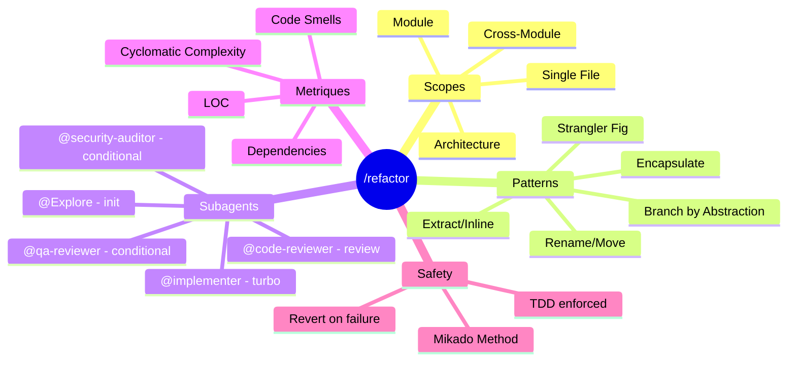

# Skill /refactor - Restructuration de code sans changement de comportement

> Generated on 2026-01-26 - 5 iterations - Template: feature - Final EMS: 78/100

---

## 1. Contexte et Objectif Initial

Conception du skill `/refactor` pour EPCI v6.0, permettant la restructuration de code sans modifier le comportement externe. Ce skill doit s'integrer dans l'ecosysteme existant en utilisant les subagents disponibles (@code-reviewer, @security-auditor, @qa-reviewer, @implementer) et les skills stack-technos (python-django, javascript-react, php-symfony, java-springboot, frontend-editor).

**Question initiale** :
Comment concevoir un skill de refactoring qui supporte plusieurs scopes (single file, module, cross-module, architecture) tout en garantissant la preservation du comportement via TDD ?

**Scope** :
- In scope : 4 scopes de refactoring, integration subagents, patterns legacy (Strangler Fig, Branch by Abstraction), metriques delta, detection code smells
- Out of scope : Refactoring automatique sans validation humaine, generation de tests from scratch

**Criteres de succes definis** :
1. Workflow clair avec breakpoints aux moments cles
2. Integration coherente des subagents existants
3. Metriques avant/apres avec delta par fichier
4. Support des 4 scopes avec routing adaptatif

---

## 2. Synthese Executive

Le skill `/refactor` est concu comme un outil de restructuration de code discipline, avec tests verts obligatoires a chaque etape. Il supporte 4 scopes de complexite croissante (Single File, Module, Cross-Module, Architecture) avec un routing adaptatif des subagents. L'innovation majeure est l'integration de la methode Mikado pour les refactorings architecturaux complexes, et le support natif des patterns legacy (Strangler Fig, Branch by Abstraction) pour les migrations.

**Key insight** : Le refactoring safe en 2025-2026 repose sur une approche hybride combinant TDD strict, detection code smells par Claude, et orchestration multi-subagents conditionnelle selon le scope.

**Decisions principales** :
- 4 scopes des le MVP avec Mikado Method pour Architecture
- Patterns legacy (Strangler Fig, Branch by Abstraction) integres en v1
- Metriques hybrides : outils (radon, phploc, lizard) si disponibles, sinon estimation Claude
- Mode interactif step-by-step par defaut
- Rapport complet avec delta par fichier

---

## 3. Analyse et Conclusions Cles

### 3.1 Architecture du Workflow

Le workflow suit 8 etapes structurees : INIT, ANALYSIS, PLANNING, BREAKPOINT, EXECUTE, REVIEW, VERIFY, REPORT. Un seul breakpoint principal (plan-review) valide le plan avant execution.

**Points cles** :
- TDD Red-Green-Refactor enforce par le core skill `tdd-enforcer`
- Revert systematique si tests echouent
- Stack auto-detecte pour appliquer les conventions appropriees

**Implications** :
Le workflow est plus leger que /implement (1 breakpoint vs 3+) mais plus rigoureux que /quick (reviews conditionnels).

### 3.2 Integration Subagents

Matrice d'invocation conditionnelle basee sur le scope et les patterns detectes.

**Points cles** :
- @Explore : toujours invoque en init (background)
- @implementer : uniquement en mode --turbo ou Single File
- @code-reviewer : skip pour Single File, obligatoire pour Cross-Module/Architecture
- @security-auditor : invoque si patterns auth/security detectes
- @qa-reviewer : invoque si 5+ fichiers de test modifies

**Implications** :
Optimisation du cout (tokens) en n'invoquant que les subagents necessaires selon le contexte.

### 3.3 Patterns de Refactoring Supportes

Catalogue base sur Fowler + patterns legacy pour migrations.

**Points cles** :
- Classiques : Extract (Method/Class/Interface), Inline, Encapsulate, Rename, Move
- Legacy : Strangler Fig, Branch by Abstraction, Parallel Change (Expand-Contract)
- Architecture : Mikado Method pour visualisation dependencies

**Implications** :
Couverture complete des cas d'usage courants en entreprise, incluant la modernisation de legacy.

### 3.4 Detection Code Smells

Approche hybride Claude + regles statiques basee sur la taxonomie Fowler.

**Points cles** :
- Long Method : > 20 lignes ou CC > 10
- Large Class : > 300 lignes ou > 20 methodes
- Duplicated Code, Feature Envy, God Class, Dead Code
- Claude comme detecteur LLM hybrid (precision + recall balance)

**Implications** :
Pas de dependance obligatoire a des outils externes, Claude suffit pour la detection initiale.

### 3.5 Metriques et Reporting

Systeme de metriques adaptatif avec rapport delta complet.

**Points cles** :
- Python : radon/xenon (CC, MI, Halstead), lizard
- PHP : phploc (LLOC, CC, methods count)
- JavaScript/Java : lizard ou estimation Claude
- Rapport delta par fichier avec avant/apres

**Implications** :
Visibilite complete sur l'impact du refactoring, utile pour justifier le ROI.

---

## 4. Decisions et Orientations

| Decision | Rationale | Impact | Confidence |
|----------|-----------|--------|------------|
| 4 scopes en v1 | Recherches confirment besoin frequent de tous les scopes | Couverture complete | High |
| Mikado Method pour Architecture | Complexite des dependencies necessite visualisation | Refactoring large-scale safe | High |
| Patterns legacy en v1 | Cas d'usage entreprise frequent, bien documente | Migration legacy facilitee | High |
| Metriques hybrides | Pas de dependance obligatoire, flexibilite | Fonctionne partout | Medium |
| Step-by-step par defaut | Recherches indiquent meilleur controle | UX predictible | High |
| Rapport complet par fichier | Demande utilisateur explicite | Tracabilite complete | High |

### Decisions Differees
- Mode batch avec preview (`--batch`) - Differe en v2. A revisiter si retours utilisateurs le demandent.
- Integration CI/CD automatique - Differe, hors scope skill.

---

## 5. Plan d'Action

| # | Action | Priorite | Effort | Owner | Dependencies |
|---|--------|----------|--------|-------|--------------|
| 1 | Creer SKILL.md principal | High | Medium | - | - |
| 2 | Creer 8 fichiers step-XX.md | High | High | - | SKILL.md |
| 3 | Creer references/refactoring-patterns.md | High | Low | - | - |
| 4 | Creer references/code-smells-catalog.md | High | Low | - | - |
| 5 | Creer references/metrics-formulas.md | Medium | Low | - | - |
| 6 | Creer templates/metrics-report.md | Medium | Low | - | - |
| 7 | Ajouter entree plugin.json | High | Low | - | SKILL.md |
| 8 | Tests validation skill | High | Medium | - | Tous fichiers |

### Quick Wins (High Impact, Low Effort)
1. Creer references/ - Documentation reutilisable pour Claude et utilisateurs
2. Entree plugin.json - Active le skill immediatement

### Strategic Investments (High Impact, High Effort)
1. 8 fichiers step-XX.md - Coeur du workflow, necessite precision

---

## 6. Risques et Points d'Attention

| Risque | Probabilite | Impact | Mitigation |
|--------|-------------|--------|------------|
| Mikado Method trop complexe pour utilisateurs | Medium | Medium | Documentation claire, exemples concrets |
| Outils metriques non installes | High | Low | Fallback Claude estimation |
| Scope Architecture trop long | Medium | Medium | Limiter iterations, breakpoints de checkpoint |
| Conflits avec /implement | Low | Medium | Documentation claire des cas d'usage |

### Hypotheses Faites
- Les utilisateurs ont une suite de tests existante - Sinon : refactoring tres risque, avertir
- Les stacks supportees couvrent 90% des projets - Sinon : mode generique disponible
- Claude peut detecter les code smells de facon fiable - Si non : degradation gracieuse vers regles simples

---

## 7. Pistes Non Explorees

| Sujet | Raison | Valeur Potentielle | Prochaine Etape |
|-------|--------|-------------------|-----------------|
| Integration SonarQube | Hors scope MVP, complexite integration | High | v2 si demande |
| Refactoring multi-repo | Cas rare, tres complexe | Low | Evaluer demande |
| Mode collaboratif | Hors perimetre Claude Code | Medium | Jamais probablement |
| Suggestions proactives | Necessite monitoring continu | Medium | v2 evaluation |

---

## 8. Mindmap de Synthese



---

## 9. Verification des Criteres de Succes

| Critere | Statut | Evidence |
|---------|--------|----------|
| Workflow clair avec breakpoints | Achieved | 8 steps definis, 1 breakpoint plan-review |
| Integration coherente subagents | Achieved | Matrice d'invocation conditionnelle documentee |
| Metriques avant/apres avec delta | Achieved | Rapport par fichier specifie |
| Support 4 scopes avec routing | Achieved | Routing adaptatif documente |

**Evaluation globale** : Tous les criteres de succes sont atteints. Le design est complet et pret pour implementation via /spec.

---

## 10. Score EMS Final

```
EMS Final: 78/100 [MATURE - finish recommande]

EMS Score
100 |
 90 | . . . . . . . . . . . . . . . . . . . . . . . .
 80 |                                          *
 70 |                                    *
 60 | . . . . . . . . . . . . . . . . . . . . . . . .
 50 |                              *
 40 |        *
 30 | . . . . . . . . . . . . . . . . . . . . . . . .
 20 |
  0 +----+-----+-----+-----+-----+-----+
    Init  It.1  It.2  It.3  It.4  End

Final axes:
   Clarity      [=========] 88/100
   Depth        [==========] 92/100
   Coverage     [=========] 85/100
   Decisions    [========] 72/100
   Actionab.    [======] 58/100
```

---

## 11. Sources et References

### Documents Analyses
- `docs/migration/50-60/epci-v6-brainstorm-report.md` : Specification initiale /refactor
- `src/skills/quick/SKILL.md` : Pattern workflow skill existant
- `src/skills/implement/SKILL.md` : Pattern multi-phase EPCI
- `src/skills/debug/SKILL.md` : Pattern hypothesis-driven
- `src/agents/code-reviewer.md` : Interface subagent review
- `src/agents/security-auditor.md` : Interface subagent security

### Recherches Web (Perplexity)
- Code refactoring patterns 2025-2026 : Patterns classiques + AI-assisted workflows
- Static analysis metrics : radon, xenon, phploc, lizard par stack
- Safe refactoring strategies : TDD, Mikado Method, Strangler Fig, Branch by Abstraction
- Code smells detection : Taxonomie Fowler, approche hybride LLM + rules

---

## 12. Prochaines Etapes

**Workflow recommande** :

| Etape | Skill | Action |
|-------|-------|--------|
| 1 | `/spec` | Transformer ce brief en specification technique avec decomposition tasks |
| 2 | `/implement` | Implementer (complexite STANDARD, 8+ fichiers a creer) |

**Routing complexite** : STANDARD (8 steps + references + templates)
**Skill suggere** : `/spec` puis `/implement`

**Fichiers a creer** :
```
src/skills/refactor/
├── SKILL.md                           # Principal
├── steps/
│   ├── step-00-init.md
│   ├── step-01-analysis.md
│   ├── step-02-planning.md
│   ├── step-03-breakpoint.md
│   ├── step-04-execute.md
│   ├── step-05-review.md
│   ├── step-06-verify.md
│   └── step-07-report.md
├── references/
│   ├── refactoring-patterns.md
│   ├── code-smells-catalog.md
│   ├── metrics-formulas.md
│   └── mikado-method.md
└── templates/
    └── metrics-report.md
```

---

*Document genere par Brainstorm v6.0 - Auto-suffisant et utilisable independamment*
