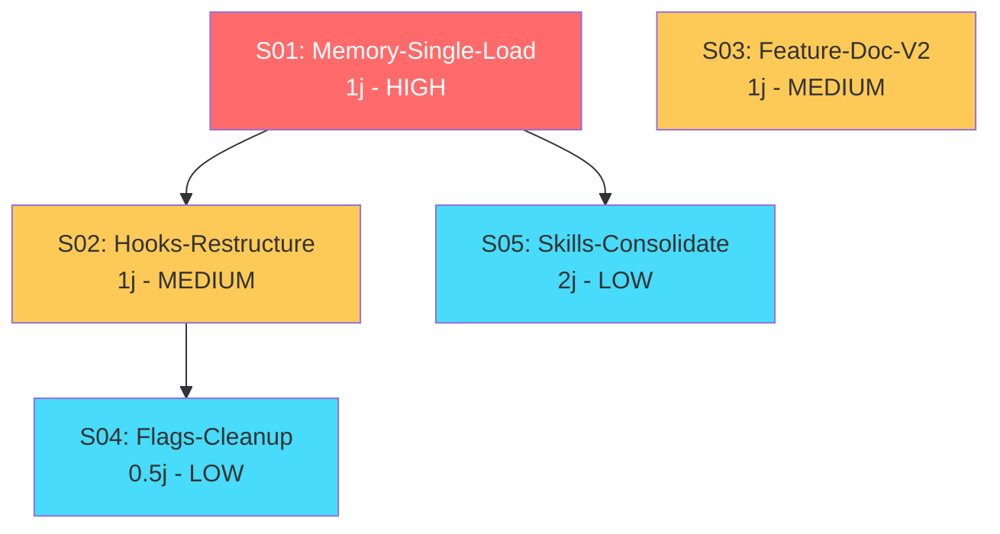
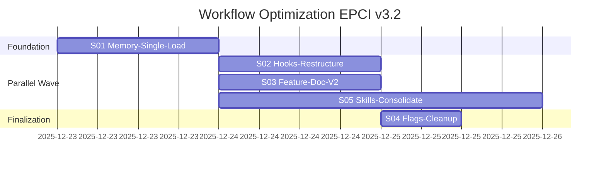

# Workflow Optimization EPCI v3.2 — Index

> **Generated**: 2025-12-23
> **Source**: `brief-workflow-optimization-2025-12-23.md`
> **Sub-specs**: 5
> **Total effort**: 5.5 days
> **Optimized duration**: 3.5 days (with parallelization)

---

## Overview

| ID | Sub-Spec | Effort | Dependencies | Parallelizable | Priority |
|----|----------|--------|--------------|----------------|----------|
| S01 | Memory-Single-Load | 1j | — | No | HIGH |
| S02 | Hooks-Restructure | 1j | S01 | Yes | MEDIUM |
| S03 | Feature-Doc-V2 | 1j | — | Yes | MEDIUM |
| S04 | Flags-Cleanup | 0.5j | S01, S02 | No | LOW |
| S05 | Skills-Consolidate | 2j | S01 | Yes | LOW |

---

## Dependency Graph



---

## Gantt Planning



---

## Critical Path

```
S01 (1j) → S02 (1j) → S04 (0.5j) = 2.5j
         → S05 (2j)              = 3j (longest path)
```

**Durée minimale**: 3.5 jours (S01 → S05 → S04 en séquence)

---

## Progress

| Spec | Status | Started | Completed | Comment |
|------|--------|---------|-----------|---------|
| S01 | ⬚ To do | | | Foundation - must be first |
| S02 | ⬚ To do | | | Can start after S01 |
| S03 | ⬚ To do | | | Independent - can parallel |
| S04 | ⬚ To do | | | Needs S01 + S02 |
| S05 | ⬚ To do | | | Can start after S01 |

---

## Usage

Launch a sub-spec:

```bash
# Start with the foundation (MANDATORY FIRST)
/epci-brief @docs/briefs/workflow-optimization/S01-memory-single-load.md

# Then parallel wave (any order)
/epci-brief @docs/briefs/workflow-optimization/S02-hooks-restructure.md
/epci-brief @docs/briefs/workflow-optimization/S03-feature-doc-v2.md
/epci-brief @docs/briefs/workflow-optimization/S05-skills-consolidate.md

# Finally
/epci-brief @docs/briefs/workflow-optimization/S04-flags-cleanup.md
```

---

## Files

| File | Description |
|------|-------------|
| `INDEX.md` | This file |
| `brief-workflow-optimization-2025-12-23.md` | Original brief |
| `journal-workflow-optimization-2025-12-23.md` | Brainstorming journal |
| `S01-memory-single-load.md` | Sub-spec: Memory loading optimization |
| `S02-hooks-restructure.md` | Sub-spec: Hooks restructuration |
| `S03-feature-doc-v2.md` | Sub-spec: Feature Document v2 |
| `S04-flags-cleanup.md` | Sub-spec: Flags cleanup |
| `S05-skills-consolidate.md` | Sub-spec: Skills consolidation |

---

*Generated by epci-decompose — Project: workflow-optimization-v32*
