Voici le **Guide n°1 – Architecture & structure du projet Django Gardel (2025)**, version complète, exploitable comme référence interne et comme base de règles pour tes IDE/agents IA.

Il est basé sur :

- la doc officielle Django (projets, applications, sécurité, déploiement) ([Django Project](https://docs.djangoproject.com/en/5.2/?utm_source=chatgpt.com))
- des ressources récentes sur la structure de projets Django à grande échelle ([Medium](https://bluetickconsultants.medium.com/building-a-scalable-and-maintainable-architecture-for-large-scale-django-projects-78186b1caf8d?utm_source=chatgpt.com))
- des templates de projets “production-ready” (Cookiecutter Django, starter projects) ([GitHub](https://github.com/cookiecutter/cookiecutter-django?utm_source=chatgpt.com))
- les bonnes pratiques issues de Two Scoops of Django et articles sur la structuration de base templates / settings ([Dokumen.pub](https://dokumen.pub/two-scoops-of-django-best-practices-for-django-18-third-edition-9780981467344-0981467342.html?utm_source=chatgpt.com))

Contexte cible : **monolithe Django** industriel, multi-apps, API DRF, ETL, React/Vite, PostgreSQL (projet Gardel).

---

# 1. Principes d’architecture : projet vs applications

## 1.1. Projet Django = enveloppe, applications = briques métier

Rappel formel :

- Un **projet Django** = un ensemble de **settings**, d’**URL racine** et d’**apps installées** qui forment une application web complète. ([Medium](https://medium.com/django-unleashed/django-project-structure-a-comprehensive-guide-4b2ddbf2b6b8?utm_source=chatgpt.com))
- Une **application (app)** = un module Django réutilisable, centré sur un domaine fonctionnel (labo, production, taxe, référentiels, etc.), enregistré dans `INSTALLED_APPS`. ([Django Project](https://docs.djangoproject.com/en/5.2/ref/applications/?utm_source=chatgpt.com))

Pour Gardel, on choisit clairement :

- **Architecture monolithique** (un seul projet Django WSGI/ASGI) pour :
    - éviter la complexité des microservices prématurés,
        
    - faciliter l’évolution fonctionnelle et la cohérence métier,
        
        tout en gardant le code **fortement modularisé par apps**. ([Django Forum](https://forum.djangoproject.com/t/who-is-using-django-for-really-large-projects/166?utm_source=chatgpt.com))
        

---

# 2. Arborescence globale recommandée pour Gardel

## 2.1. Vue d’ensemble du dépôt

On part sur un dépôt unique contenant backend, frontend et infra :

```
gardel/
  backend/
    manage.py
    pyproject.toml / requirements/
    src/
      config/               # "core project" : settings, urls, asgi/wsgi
      apps/
        labo/
        production/
        taxe_sejour/
        referentiels/
        comptes/
        ...
      shared/
        models/
        utils/
        services/
        ...
  frontend/
    gardel-ui/              # React/Vite, Tailwind, etc.
  infra/
    docker/
      docker-compose.yml
      backend.Dockerfile
      frontend.Dockerfile
      nginx.conf
  docs/
    architecture/
    backend/
    frontend/
  .github/workflows/        # CI/CD

```

Choix structurants :

- utilisation d’un dossier `src/` pour éviter les collisions de noms de modules et clarifier le périmètre Python du projet ([Django Forum](https://forum.djangoproject.com/t/best-practices-for-structuring-django-projects/39835?utm_source=chatgpt.com))
- séparation nette `backend/`, `frontend/`, `infra/`, `docs/` pour clarifier les rôles.

### Diagramme Mermaid – vue macro


---

## 2.2. Détails du backend Django

Dans `backend/src/` :

```
src/
  config/
    __init__.py
    settings/
      __init__.py
      base.py
      dev.py
      test.py
      prod.py
    urls.py
    asgi.py
    wsgi.py
  apps/
    labo/
    production/
    taxe_sejour/
    referentiels/
    comptes/
  shared/
    models/
    services/
    utils/

```

Ce pattern est dans l’esprit de **Cookiecutter Django** et d’autres starter projects production-ready, qui séparent clairement la configuration (config/settings) des apps métier et factorisent les settings par environnement. ([Cookiecutter Django](https://cookiecutter-django.readthedocs.io/?utm_source=chatgpt.com))

---

# 3. Structuration des apps métier

## 3.1. Règles de découpage des apps

Une app doit :

- représenter **un domaine fonctionnel cohérent** (ex. `labo`, `production`, `taxe_sejour`, `referentiels`),
- être **potentiellement réutilisable** dans un autre projet dans l’avenir, même si ce n’est pas l’objectif immédiat, ce qui va dans le sens des “reusable apps” Django ([Django Project](https://docs.djangoproject.com/en/5.2/intro/reusable-apps/?utm_source=chatgpt.com))
- ne pas devenir un “fourre-tout” générique type `core` ou `common` pour de la logique métier hétérogène (on garde `shared/` pour les vrais transverses techniques).

## 3.2. Structure interne standard d’une app Gardel

Pour chaque app métier, on adopte un pattern expansé (au-delà du squelette Django par défaut) : ([Medium](https://bluetickconsultants.medium.com/building-a-scalable-and-maintainable-architecture-for-large-scale-django-projects-78186b1caf8d?utm_source=chatgpt.com))

```
apps/
  taxe_sejour/
    __init__.py
    apps.py
    models/
      __init__.py
      taxe.py
      parametre.py
      mixins.py
    services/
      __init__.py
      calcul_taxe.py
      export_rapport.py
    api/
      serializers/
        taxe.py
      viewsets/
        taxe.py
      routers.py
    views/
      __init__.py
      backoffice.py
      public.py
    urls.py
    templates/
      taxe_sejour/
        liste.html
        detail.html
    static/
      taxe_sejour/
        css/
        js/
    forms/
      taxe.py
    admin.py
    tests/
      __init__.py
      test_models.py
      test_services.py
      test_api.py
      test_views.py

```

Principes :

- **`models/` en package** (un fichier par modèle), avec `__init__.py` qui réexporte les classes (déjà couvert dans le guide Modèles) ;
- **`services/`** pour la logique métier applicative (ETL locaux, calculs, orchestrations), recommandation fréquente dans les discussions sur architectures Django maintenables ([Medium](https://bluetickconsultants.medium.com/building-a-scalable-and-maintainable-architecture-for-large-scale-django-projects-78186b1caf8d?utm_source=chatgpt.com)) ;
- **`api/`** pour DRF (serializers/viewsets/routers) ;
- **`views/`** pour vues HTML (back-office, écrans internes) ;
- `tests/` séparés par types (unitaires/services/API/views).

### Diagramme Mermaid – structure interne d’une app


---

# 4. Config, settings & environnements

## 4.1. Settings modulaires

La doc Django recommande d’adapter les settings pour la prod (sécurité, perf) et de séparer dev/prod. ([Django Project](https://docs.djangoproject.com/en/5.2/howto/deployment/checklist/?utm_source=chatgpt.com))

On adopte :

```
config/settings/
  base.py   # commun à tous
  dev.py    # settings dev
  test.py   # settings CI/tests
  prod.py   # settings prod

```

- `base.py` :
    - apps communes, middleware communs, DRF config, AUTH_USER_MODEL, TIME_ZONE, etc.
- `dev.py` :
    - DEBUG=True, DB locale, emails console, toolbars…
- `prod.py` :
    - DEBUG=False, DB cluster, caches, sécurité renforcée (SECURE__, CSRF__, logging, etc.)
    - chargement des secrets via variables d’environnement (SECRET_KEY, DB_PASSWORD, etc.).

Cette approche (settings multi-fichiers + env vars) est alignée avec Cookiecutter Django et les recommandations d’articles récents sur les settings de déploiement. ([Cookiecutter Django](https://cookiecutter-django.readthedocs.io/?utm_source=chatgpt.com))

## 4.2. Gestion des secrets et configuration

- **Jamais** de `SECRET_KEY`, passwords ou tokens en dur dans le VCS.
- Utilisation de **variables d’environnement** (`DJANGO_SETTINGS_MODULE`, `DATABASE_URL`, etc.).
- Possibilité d’utiliser un outil type `django-environ` pour parser les env vars. ([Coding Nomads](https://codingnomads.com/django-deployment-settings?utm_source=chatgpt.com))

---

# 5. Flux HTTP & API : organisation globale

## 5.1. URL racine et composition des routes

Dans `config/urls.py`, on se contente de **composer** les routes des apps :

```python
from django.urls import path, include

urlpatterns = [
    path("admin/", admin.site.urls),
    path("api/taxe/", include("apps.taxe_sejour.api.routers")),
    path("taxe/", include("apps.taxe_sejour.urls")),
    path("labo/", include("apps.labo.urls")),
    # ...
]

```

C’est aligné avec la doc Django qui recommande de déléguer aux URLconfs d’app. ([Django Project](https://docs.djangoproject.com/en/5.2/?utm_source=chatgpt.com))

## 5.2. Séparation HTML / API

- **HTML** (pages back-office Gardel, écrans internes) : `apps.<domaine>.views` + `apps.<domaine>.urls`.
- **API REST** : `apps.<domaine>.api.*` (DRF) exposée sous `/api/...`.

Cette séparation nette simplifie le raisonnement (et l’intégration React).

---

# 6. Intégration front : Templates, React & Vite

## 6.1. Templates Django

Principe classique recommandé par Django :

- `TEMPLATES[0]['DIRS']` peut inclure un dossier global `templates/` pour des layouts génériques,
- chaque app a ses templates dans `apps/<app>/templates/<app>/...`. ([Django Project](https://docs.djangoproject.com/en/5.2/?utm_source=chatgpt.com))

## 6.2. Front React / Vite

On suit les patterns modernes :

- soit **frontend séparé** (`frontend/gardel-ui`) qui consomme l’API DRF (front SPA ou multi-pages),
- soit **îlots React** injectés dans des pages Django, les bundles étant produits par Vite, ce qui est de plus en plus utilisé dans des stacks Django modernes. ([Medium](https://medium.com/django-unleashed/django-project-structure-a-comprehensive-guide-4b2ddbf2b6b8?utm_source=chatgpt.com))

Architecture proposée pour Gardel :

- DRF dans le backend pour toutes les données nécessaires aux UI riches.
- React/Vite dans `frontend/`, avec :
    - un bundle “back-office” pour les écrans riches,
    - un mapping clair `route Django → point d’entrée React` si on intègre par îlots.

La partie “detail front” sera traitée dans un guide dédié, mais ici on acte le **découplage logique** : backend (Django/DRF) vs frontend (React/Vite), tout en pouvant garder quelques templates Django classiques pour certains écrans simples.

---

# 7. ETL, commandes & data pipeline – place dans l’architecture

Pour Gardel, il y aura des imports fichiers, ETL, calculs, consolidations. L’architecture doit le prévoir :

- **Commandes Django** : dans chaque app concernée, dossier `management/commands/` pour les commandes spécifiques (ex : `import_labo`, `recalc_taxe`). ([Django Documentation](https://django.readthedocs.io/en/5.0.x/contents.html?utm_source=chatgpt.com))
- **Services ETL** : logique dans `apps.<app>.services.etl_xxx`, appelée par les commandes.
- **Tâches planifiées** : orchestration via cron, systemd timers ou outils externes (n8n, Celery, etc.) – guide dédié plus tard.

Organisation typique dans `apps/taxe_sejour/` :

```
management/
  commands/
    import_taxe_sejour.py
services/
  import_taxe_sejour.py
  recalcul_taxe.py

```

---

# 8. Dossier `shared/` : ce qui est transversal

On limite volontairement ce qui va dans `shared/` à des **éléments réellement transverses** :

```
shared/
  models/
    base.py         # mixins communs : TimeStamped, SoftDelete, etc.
  services/
    mailer.py       # service d’envoi mail générique
    reporting.py    # helpers de génération rapports
  utils/
    dates.py
    math.py
    django/
      query_helpers.py

```

Règles :

- pas de logique métier spécifique à un domaine (ça doit rester dans les apps),
- `shared` = **toolbox partagée** et **infrastructure applicative**.

Ce genre de séparation est conseillé dans les discussions récentes sur les gros projets Django pour éviter les apps “fourre-tout”. ([Medium](https://bluetickconsultants.medium.com/building-a-scalable-and-maintainable-architecture-for-large-scale-django-projects-78186b1caf8d?utm_source=chatgpt.com))

---

# 9. Logging, monitoring & observabilité : emplacement dans le projet

Même si le détail ira dans un guide dédié, l’architecture doit prévoir :

- `config/logging.py` : configuration logging centralisée, importée dans `settings/base.py`.
- `shared/utils/logging.py` : wrappers helpers (ex : logger structuré par domaine).
- Intégration possible de Sentry ou autre dans `settings/prod.py`. ([Medium](https://medium.com/%40anas-issath/the-django-deployment-checklist-zero-to-production-in-30-minutes-50d176a96560?utm_source=chatgpt.com))

---

# 10. CI/CD et scripts d’infra

L’architecture du repo doit **faciliter** la CI/CD :

- `.github/workflows/` ou équivalent GitLab CI :
    - pipeline pour le backend Django (tests, lint, migrations dry-run),
    - pipeline pour le frontend (build Vite).
- `infra/docker/` :
    - Dockerfile backend,
    - Dockerfile frontend,
    - docker-compose pour dev,
    - templates pour prod.

Les guides de déploiement Django récents insistent sur l’importance d’un pipeline qui vérifie les settings de prod via `manage.py check --deploy`, les migrations et la sécurité. ([Django Project](https://docs.djangoproject.com/en/5.2/howto/deployment/checklist/?utm_source=chatgpt.com))

---

# 11. Diagramme d’architecture logicielle simplifié

```mermaid
flowchart TB
  subgraph Repo[gardel/]
    subgraph BE[backend/]
      subgraph SRC[src/]
        subgraph CFG[config/]
          CFG1[settings/base.py]
          CFG2[settings/dev.py]
          CFG3[settings/prod.py]
          CFG4[urls.py]
          CFG5[asgi/wsgi]
        end
        subgraph APPS[apps/]
          L[labo]
          P[production]
          T[taxe_sejour]
          R[referentiels]
          C[comptes]
        end
        subgraph SH[shared/]
          S1[models/base.py]
          S2[services/]
          S3[utils/]
        end
      end
    end

    subgraph FE[frontend/]
      UI[gardel-ui React/Vite]
    end

    subgraph INFRA[infra/]
      D1[docker/ + nginx]
    end
  end

  APPS --> CFG4
  UI --> CFG4

```



---

# 12. Checklist architecture & structure – à utiliser comme règle d’équipe / IDE

À vérifier pour tout nouveau projet Gardel-like :

- [ ] Repo structuré en `backend/`, `frontend/`, `infra/`, `docs/`.
- [ ] Backend sous `backend/src/` avec `config/`, `apps/`, `shared/`.
- [ ] `config/settings/` découpés en `base/dev/test/prod`.
- [ ] `INSTALLED_APPS` ne contient que des apps métiers ou libs externes, pas de code “brut”.
- [ ] Chaque domaine métier = une app dédiée dans `apps/`.
- [ ] Chaque app suit le pattern étendu : `models/`, `services/`, `api/`, `views/`, `urls.py`, `templates/`, `tests/`.
- [ ] `shared/` ne contient que des éléments réellement transverses (mixins, utils, infra).
- [ ] Les routes racines (config/urls.py) se contentent d’agréger les URL d’app.
- [ ] Une séparation claire HTML vs API (vues Django vs DRF).
- [ ] L’architecture prévoit les ETL : commandes + services.
- [ ] Logging et observabilité ont un emplacement identifié (`config/logging.py`, `shared/utils/logging.py`).
- [ ] La structure est compatible avec la CI/CD (dossiers Docker, workflows).