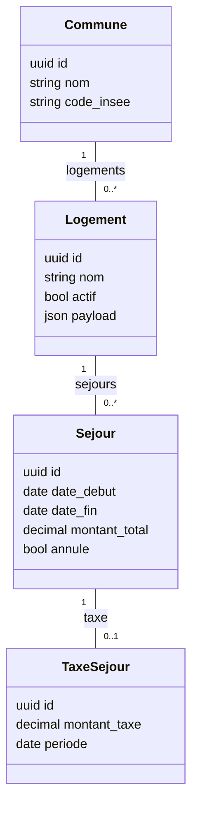

Voici le **Guide n°2 – Modèles & ORM Django (2025, projet Gardel)**.

Objectif : définir un cadre solide, cohérent et industrialisable pour tous les modèles et l’utilisation de l’ORM dans Gardel (et projets similaires), utilisable :

- par des développeurs débutants à confirmés ;
- par un chef de projet / architecte pour valider l’architecture ;
- comme “rules” pour les IDE / agents IA.

Je m’appuie sur la documentation officielle Django 5.2 (models, constraints, optimisation ORM), ainsi que sur des articles récents de bonnes pratiques et d’architecture.

---

# 1. Rappels fondamentaux & objectifs

## 1.1. Rôle des modèles dans Gardel

Dans Gardel, les modèles Django représentent :

- les **entités métier** (Séjour, Logement, TaxeSéjour, ParamètreTaxe, Commune, etc.) ;
- les **fact tables** et **dimensions** utiles pour le reporting (table de faits séjour, référentiels) ;
- les **objets pivot** des ETL (imports labo, production, taxation…).

L’objectif est d’avoir :

- des modèles **fins et explicites** (peu de logique métier lourde) ;
- une **intégrité forte** (contraintes DB, validations) ;
- une ORM utilisée de manière **performante** (sélective, indexée) ;
- une structure **prévisible** (mêmes patterns dans toutes les apps).

---

# 2. Organisation des modèles dans l’arborescence

## 2.1. Package `models/` par app

Conformément à l’architecture du Guide n°1, chaque app métier de `backend/src/apps/` a sa propre structure, notamment :

```
apps/
  taxe_sejour/
    models/
      __init__.py
      taxe.py
      parametre.py
      mixins.py
    ...

```

Django supporte nativement la mise en paquet des modèles : le “module de modèles” d’une app est `apps.taxe_sejour.models`.

**Règle :**

- **1 fichier = 1 modèle principal** (ou un petit groupe très proche) pour garder chaque fichier lisible.
- `mixins.py` regroupe les classes abstraites réutilisables dans l’app.

## 2.2. Réexport dans `models/__init__.py`

Pour que Django détecte les modèles, il suffit que le module `apps.<app>.models` expose les classes héritant de `models.Model` et que l’app soit dans `INSTALLED_APPS`.

Exemple :

```python
# apps/taxe_sejour/models/__init__.py
from .taxe import TaxeSejour
from .parametre import ParametreTaxe
from .mixins import TimeStampedModel

```

**À imposer :**

- toute nouvelle classe `Model` doit être importée dans `__init__.py` ;
- pas d’imports circulaires entre fichiers modèles (la logique métier va dans `services/`).

---

# 3. Conventions de nommage & champs

## 3.1. Classes & champs

- Nom de classe : **PascalCase** singulier (`Logement`, `Sejour`, `TaxeSejour`).
- Nom des champs : **snake_case** (`date_debut`, `montant_total`, `is_active`).
- Ajoutez systématiquement :
    - `verbose_name` / `verbose_name_plural` pour l’admin ;
    - `help_text` sur les champs non triviaux.

```python
class Logement(models.Model):
    nom = models.CharField(
        max_length=255,
        verbose_name="Nom du logement",
        help_text="Nom commercial ou interne du logement."
    )

```

## 3.2. Types de champs

Bonnes pratiques générales, cohérentes avec les recommandations Django & retours d’expérience :

- `CharField(max_length=...)` avec `max_length` toujours explicite.
- `PositiveIntegerField` / `PositiveSmallIntegerField` pour des quantités ≥ 0.
- `DecimalField` (avec `max_digits` / `decimal_places`) pour les montants financiers (taxe, montant séjour).
- `DateField` vs `DateTimeField` :
    - Gardel : favoriser `DateField` si l’heure n’est pas fonctionnellement importante (ex. clôture par jour).
- `BooleanField` pour des flags métier (ex: `is_active`).

---

# 4. Relations, intégrité & contraintes

## 4.1. ForeignKey & `on_delete`

Django impose un `on_delete` sur les ForeignKey. La doc recommande d’être explicite .

**Règles Gardel :**

- Référentiels (Commune, Catégorie, etc.) :
    - `on_delete=models.PROTECT` pour éviter la suppression accidentelle ;
- Données secondaires (ex : fichiers de log, imports bruts) :
    - `on_delete=models.SET_NULL` ou `CASCADE` selon le besoin ;
- Jamais de `CASCADE` sur des données sensibles sans justification claire (risque d’effet domino).

Toujours définir `related_name` :

```python
class Sejour(models.Model):
    logement = models.ForeignKey(
        "logement.Logement",
        on_delete=models.PROTECT,
        related_name="sejours",
    )

```

## 4.2. ManyToMany & modèle intermédiaire

La doc Django encourage l’utilisation de modèles intermédiaires (`through`) lorsqu’il y a des métadonnées sur la relation.

En contexte industriel (audit, traçabilité), **on préfère presque toujours un modèle intermédiaire explicite**.

## 4.3. Contraintes DB (Unique, Check, Exclusion)

Django fournit `UniqueConstraint`, `CheckConstraint`, etc., à déclarer dans `Meta.constraints`.

Exemple :

```python
from django.db import models
from django.db.models import Q

class Sejour(models.Model):
    date_debut = models.DateField()
    date_fin = models.DateField()
    montant = models.DecimalField(max_digits=10, decimal_places=2)

    class Meta:
        constraints = [
            models.CheckConstraint(
                check=Q(date_fin__gte=models.F("date_debut")),
                name="sejour_date_fin_gte_debut",
            ),
            models.CheckConstraint(
                check=Q(montant__gte=0),
                name="sejour_montant_positive",
            )
        ]

```

Pour PostgreSQL, Django expose également des contraintes spécifiques (ex: `ExclusionConstraint` pour éviter des overlaps de périodes).

## 4.4. Indexes (simples, composites, partiels)

- Un `UNIQUE` crée automatiquement un index B-Tree.
- Pour les champs fréquemment filtrés/triés, ajouter `db_index=True` ou déclarer un `models.Index` dans `Meta.indexes`.

```python
class Meta:
    indexes = [
        models.Index(fields=["date_debut", "date_fin"]),
    ]

```

Pour des **indexes partiels** (conditionnels) sur PostgreSQL (ex: indexer uniquement les enregistrements actifs), on peut utiliser `condition=Q(active=True)` avec les versions récentes de Django.

---

# 5. Héritage, mixins & comportements transverses

## 5.1. Types d’héritage Django

Django supporte trois formes d’héritage de modèles : Abstract Base Classes, Multi-table Inheritance, Proxy Models.

**Recommandation Gardel :**

- **Abstract Base Classes** pour factoriser des champs/logiciels communs (timestamps, soft-delete).
- **Multi-table** uniquement pour des cas très spécifiques (rare).
- **Proxy Models** pour variantes de comportement sans nouvelle table.

## 5.2. Mixins abstraits (équivalent “traits”)

Pattern recommandé dans la doc Django et les articles d’architecture : mettre les champs/behaviors communs dans des classes `abstract = True`.

```python
# shared/models/base.py
from django.db import models
from django.utils import timezone

class TimeStampedModel(models.Model):
    created_at = models.DateTimeField(default=timezone.now, editable=False)
    updated_at = models.DateTimeField(default=timezone.now)

    def save(self, *args, **kwargs):
        self.updated_at = timezone.now()
        return super().save(*args, **kwargs)

    class Meta:
        abstract = True

```

Utilisation :

```python
class Sejour(TimeStampedModel):
    ...

```

On peut combiner plusieurs mixins (héritage multiple) tant qu’ils sont abstraits.

---

# 6. Managers & QuerySets custom

## 6.1. Pourquoi des managers custom ?

Les bonnes pratiques modernes recommandent d’encapsuler la logique de lecture fréquente dans des **QuerySets custom** et des **managers** : filtres métiers, préchargement (`select_related`, `prefetch_related`), etc., pour réduire les duplications et optimiser les requêtes.

```python
# apps/sejour/models/sejour.py
from django.db import models

class SejourQuerySet(models.QuerySet):
    def actifs(self):
        return self.filter(annule=False)

    def avec_logement(self):
        return self.select_related("logement")

class SejourManager(models.Manager):
    def get_queryset(self):
        return SejourQuerySet(self.model, using=self._db)

    def actifs(self):
        return self.get_queryset().actifs()

```

Puis :

```python
class Sejour(TimeStampedModel):
    ...
    objects = SejourManager()

```

## 6.2. `QuerySet.as_manager()`

Depuis Django 1.7 (et toujours recommandé en 2024+), on peut utiliser `QuerySet.as_manager()` pour éviter de dupliquer les méthodes entre QuerySet et Manager.

```python
class SejourQuerySet(models.QuerySet):
    def actifs(self): ...
    def avec_logement(self): ...

class Sejour(TimeStampedModel):
    ...
    objects = SejourQuerySet.as_manager()

```

**Règle Gardel :**

- Pour les entités importantes (Séjour, Logement, Taxe), créer systématiquement un QuerySet custom pour encapsuler les filtres et optimisations.

---

# 7. Performance ORM & volumétrie

Django fournit une section de documentation dédiée à l’optimisation des accès BDD : utiliser `select_related`, `prefetch_related`, éviter de charger des données inutiles, etc.

## 7.1. N+1 queries & préchargement

- `select_related` pour les relations **ForeignKey / OneToOne** (jointure SQL).
- `prefetch_related` pour les relations **ManyToMany / reverse FK** (deux requêtes + agrégation en mémoire).

Exemple :

```python
# Mauvais : N+1 requêtes
for sejour in Sejour.objects.all():
    print(sejour.logement.nom)

# Meilleur :
for sejour in Sejour.objects.select_related("logement"):
    print(sejour.logement.nom)

```

**Règle Gardel :**

- utiliser `select_related` / `prefetch_related` dans les **QuerySets custom** pour les patterns de lecture fréquents (listes, dashboard, rapports).

## 7.2. Bulk operations

- `bulk_create`, `bulk_update` pour les ETL et traitements massifs ;
- attention : ces méthodes **ne déclenchent pas** `save()` ni les signaux, comme documenté.

## 7.3. Profilage

- pour des tableaux volumineux, utiliser `EXPLAIN` / `EXPLAIN ANALYZE` côté PostgreSQL pour vérifier l’usage des index (en lien avec la doc PostgreSQL sur les contraintes/index).

---

# 8. JSONField, PostgreSQL & données semi-structurées

Django propose un `JSONField` (stocké en JSONB sur PostgreSQL).

**Use cases Gardel :**

- logs ETL bruts ;
- payloads d’intégration (ex : messages entrants non normalisés) ;
- stockage temporaire de données.

**Bonnes pratiques :**

- Indexer via `GinIndex` sur les champs JSON interrogés fréquemment.
- Ne pas en faire le cœur du modèle métier (préférer des colonnes normalisées pour les KPIs structurés).

---

# 9. Soft delete, historisation & audit

Il n’existe pas de soft delete natif dans Django, mais c’est un besoin courant.

## 9.1. Soft delete

Deux approches principales :

1. **Mixin maison** avec champ `deleted_at` + Manager filtrant.
2. Packages dédiés (ex : **django-safedelete**) qui encapsulent la logique (flags, managers, parfois cascades).

Recommandation Gardel :

- pour les données sensibles (séjours, paiements, taxes) :
    
    **pas de suppression physique** par défaut → soft delete via mixin ou package validé.
    

## 9.2. Historisation

Pour garder un historique complet des changements, `django-simple-history` est une solution mature : chaque changement est stocké dans une table _history dédiée.

Recommandation :

- activer l’historisation sur les entités critiques (Séjour, Logement, Taxe, Paramètres) ;
- documenter clairement les impacts en volumétrie (tables _history volumineuses).

---

# 10. Validation & logique métier

## 10.1. Où placer la validation ?

Django recommande :

- validation simple / structurelle :
    - dans le modèle (`clean`) ou dans les formulaires ;
- validation métier complexe et orchestrations :
    - dans des **services** (cf. Guide Services & Couche d’application).

**Règle Gardel :**

- Le modèle ne doit **pas** contenir de logique métier lourde :
    - pas d’appels réseau ;
    - pas de traitements ETL ;
    - pas de recalcul massif.

---

# 11. Migrations : discipline & patterns

Basé sur les bonnes pratiques Django et retours d’expérience sur des gros projets.

- Ne jamais modifier une migration déjà commitée ; toujours créer une nouvelle migration.
- Séparer **migrations de schéma** et **migrations de données** (via `RunPython` pour les petites corrections).
- Pour les grosses opérations data (ETL), utiliser :
    - des commandes Django / scripts ETL, **pas** des migrations, afin de garder ces processus rejouables et contrôlables.
- Squash périodique des migrations si une app accumule énormément de fichiers de migration.

---

# 12. Modélisation spécifique Gardel (volumétrie & reporting)

Pour Gardel (taxe de séjour, séjours, productions, labo), on est proche d’un modèle orienté **data warehouse**.

Recommandations générales (cohérentes avec les guides Django + PostgreSQL pour scalabilité) :

- Séparer clairement :
    - **tables opérationnelles** (gestion quotidienne) ;
    - **tables d’agrégats / reporting** (dénormalisées, pré-calculées si besoin).
- Utiliser `DateField` pour les clés de partition temporelle (par jour) si volume important.
- Prévoir des index sur (`date`, `commune`, `categorie`, `logement`) pour les requêtes fréquentes.
- Éviter les M2M massifs non contrôlés (préférer des tables d’association explicites).

---

# 13. Diagramme Mermaid – exemple simplifié pour Gardel



Ici :

- `Commune`, `Logement`, `Sejour`, `TaxeSejour` sont des **modèles Django** ;
- on applique les règles vues :
    - mixin `TimeStampedModel` sur tous ;
    - contraintes de cohérence (dates, montants) ;
    - managers custom pour les filtres (ex : `Sejour.objects.actifs().avec_logement()`).

---

# 14. Checklist “Review Modèles & ORM Gardel”

À utiliser en code review / PR, ou injecter dans les rules d’IDE :

- [ ] L’app utilise un **package `models/`** + `__init__.py` qui réexporte les classes.
- [ ] Les noms de modèles et champs suivent la convention (PascalCase / snake_case).
- [ ] Champs : `max_length` explicites, types adaptés (DecimalField pour montants, DateField/DateTimeField cohérents).
- [ ] `ForeignKey`/`OneToOne`/`ManyToMany` :
    - `on_delete` explicite (PROTECT/SET_NULL/CASCADE) ;
    - `related_name` défini.
- [ ] Contraintes :
    - `UniqueConstraint` / `CheckConstraint` pour les invariants métier ;
    - Postgres : contraintes avancées si besoin (ExclusionConstraint…).
- [ ] Index :
    - `db_index=True` ou `Meta.indexes` pour les colonnes fréquemment filtrées ;
    - attention à la volumétrie.
- [ ] Mixins abstraits utilisés pour timestamps, soft-delete, audit.
- [ ] Managers & QuerySets custom pour les entités importantes :
    - filtres métier (`actifs`, `en_cours`, etc.) ;
    - `select_related` / `prefetch_related` intégrés.
- [ ] Logique métier lourde absente des modèles (`save`, `clean`, signaux) :
    - déportée dans `services/`.
- [ ] JSONField utilisé uniquement pour des données semi-structurées/logs, avec index GIN si interrogé.
- [ ] Migrations :
    - pas de modification d’anciennes migrations ;
    - pas d’ETL massif dans les migrations.
- [ ] Pour les entités critiques (Séjour, Taxe, Paramètres), soft delete et/ou historisation envisagés (django-safedelete, django-simple-history, ou mixin maison).

---

Si tu veux, prochaine étape logique :

- soit on **décline ce guide avec un exemple concret Gardel** (implémentation type de `Sejour`, `Logement`, `TaxeSejour`, `ParamTaxe`),
- soit on enchaîne sur le **Guide n°3 – Services métier & couche d’application**, en explicitant comment les modèles sont utilisés par les services (ETL, calculs, règles métier).