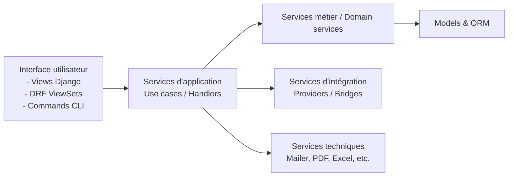

## Voici le **Guide n°3 – Services métier & Couche d’application (Django, projet Gardel, 2025)**.

Objectif : définir **comment** on structure et on code les services dans Gardel (ETL, règles métier, intégrations, API, batch), en s’appuyant :

- sur ta taxonomie Symfony (Handlers, Managers, Providers, Commands, DTO, etc., issue de ton JSON),
- sur les bonnes pratiques actuelles Django autour de la _service layer_ et des gros projets.

Ce guide sert :

- de **référence équipe** (dev débutant → confirmé, chef de projet technique),
- de **base de rules** pour tes IDE / agents IA.

---

# 1. Rôle de la couche “Services & Application” dans Gardel

## 1.1. Position dans l’architecture

On adopte une **architecture en couches** :



- **Views / ViewSets / Commands** : transforment une requête (HTTP, CLI, tâche) en appel de service, puis en réponse.
- **Services d’application** : orchestrent un _use case_ (ex. “Créer un séjour + calculer taxe + notifier la compta”).
- **Domain services** : encapsulent la logique métier autour d’un domaine (taxe, séjour, labo, production).
- **Services d’intégration** : interfaces vers des systèmes externes (ERP, GeoAPI, fichiers, etc.).
- **Services techniques** : mail, PDF, Excel, logging, etc.

Ce schéma suit l’idée de _service layer_ décrite dans plusieurs ressources Django modernes (services entre vues et modèles, orchestration métier, séparation des responsabilités).

## 1.2. Pourquoi une couche service dédiée en Django ?

Les discussions récentes sur les architectures de gros projets Django convergent à peu près sur ce point : sur un projet complexe, sortir la logique métier des vues et des modèles est **bénéfique** pour la testabilité et la maintenabilité, même si ce n’est pas “obligatoire” dans Django.

Pour Gardel (multi-domaines, ETL, reporting, règles de taxe, volumétrie), on acte que :

- Vue / ViewSet = **mince**,
- Modèle = **structure + logique locale simple**,
- Service = **lieu privilégié de la logique métier & des orchestrations**.

---

# 2. Organisation des services dans l’arborescence

## 2.1. Par app métier

Pour chaque app de `apps/` :

```
apps/
  taxe_sejour/
    models/
    services/
      __init__.py
      usecases/
        calculer_taxe_sejour.py
        generer_rapport_taxe.py
      domain/
        regles_taxe.py
      integrations/
        erp_bridge.py
        fisc_provider.py
      dto.py
      transformers.py
    api/
    views/
    permissions.py
    signals.py
    ...

```

Ce pattern est cohérent avec les recommandations d’articles et threads récents pour les gros projets Django :

apps modulaires + `services/` dédié par app pour le code métier applicatif.

## 2.2. Services partagés

Pour les services réellement transverses :

```
shared/
  services/
    mailer.py
    pdf.py
    excel.py
    logging.py
  utils/
    dates.py
    numbers.py

```

---

# 3. Typologies de services (mapping Symfony → Django)

On reprend l’esprit de ta taxonomie Symfony (Handlers, Managers, Providers, Bridges, Commands, DTO, Normalizers, Listeners, Voters, etc.), en la traduisant dans une grammaire Django idiomatique.

## 3.1. Services d’application (Use cases / Handlers)

**Rôle :**

- Exécuter **un scénario métier complet** (use case) :
    - recevoir les données d’entrée,
    - coordonner domain services, intégrations, models,
    - gérer transaction, exceptions métiers,
    - renvoyer un résultat (DTO, modèle, rien).

Ce sont tes ex-`Handlers` / `Facades` côté Symfony → **`services/usecases/`** en Django.

Ex. fichier : `apps/taxe_sejour/services/usecases/calculer_taxe_sejour.py`

Pattern recommandé :

- **fonction** ou **classe** immuable (stateless) avec méthode `execute()` ;
- dépendances injectées en paramètre (models, autres services, providers).

## 3.2. Domain services (Managers métier)

**Rôle :**

- Encapsuler des **règles métier pures** autour d’un domaine (sans I/O HTTP) :
    - calcul de taxe,
    - règles de validation transverses,
    - logique de tarifs, seuils, etc.

Ce sont tes `Manager` métier côté Symfony.

On les range typiquement dans `services/domain/`.

Domain services sont proches de la définition classique : services au niveau du domaine, centrés sur la cohérence métier, comme décrit dans les discussions DDD/application vs domain services.

## 3.3. Services d’intégration (Providers / Bridges)

**Rôle :**

- encapsuler toute interaction avec un **système externe** :
    - API HTTP (ERP, GeoAPI, services fiscaux),
    - lecture/écriture fichiers,
    - file d’attente/message broker, etc.

Correspondances :

- `Provider`, `Bridge` Symfony → **modules dans `services/integrations/`**.

Ils exposent une API claire (ex : `fetch_taux_taxe(commune, periode)`), les détails (requests, lib HTTP, authentification) restent internes.

## 3.4. Services techniques (infrastructure)

- mail → `shared/services/mailer.py`,
- PDF → `shared/services/pdf.py`,
- Excel/CSV → `shared/services/excel.py`,
- logging métier → `shared/services/logging.py`.

Ces services peuvent être utilisés par des use cases ou par d’autres services.

## 3.5. DTO, transformers, mappers

Côté Symfony tu utilises `DTO`, `Normalizer`, `Transformer`.

En Django on a :

- pour l’**API** : DRF `Serializer` = DTO + validation + (dé)serialization, recommandé pour les interactions REST.
- pour les **flux internes** :
    - dataclasses Python (`@dataclass`) pour des DTO internes,
    - éventuellement Pydantic si besoin de validation forte.

On peut regrouper cela dans :

- `apps/<app>/services/dto.py`,
- `apps/<app>/services/transformers.py`.

---

# 4. Interaction des services avec le reste du système

## 4.1. Vues Django / ViewSets DRF

**Vue = colle I/O → Service**

Exemple View Django :

```python
# apps/taxe_sejour/views/backoffice.py
from django.shortcuts import render, redirect
from .services.usecases.calculer_taxe_sejour import calculer_taxe_sejour

def calculer_taxe_view(request, sejour_id):
    if request.method == "POST":
        resultat = calculer_taxe_sejour(sejour_id=sejour_id, user=request.user)
        # resultat peut être un DTO ou le modèle mis à jour
        return redirect("taxe_sejour:detail", pk=resultat.taxe_id)
    ...

```

Exemple ViewSet DRF :

```python
# apps/taxe_sejour/api/viewsets/taxe.py
from rest_framework import viewsets
from .serializers import TaxeSejourSerializer
from apps.taxe_sejour.services.usecases.calculer_taxe_sejour import calculer_taxe_sejour

class TaxeSejourViewSet(viewsets.GenericViewSet):
    serializer_class = TaxeSejourSerializer

    def create(self, request, *args, **kwargs):
        dto = calculer_taxe_sejour(
            sejour_id=request.data["sejour_id"],
            user=request.user,
        )
        serializer = self.get_serializer(dto)
        return Response(serializer.data, status=status.HTTP_201_CREATED)

```

Les bonnes pratiques DRF récentes insistent beaucoup sur le fait de ne pas surcharger les serializers/ViewSets avec de la logique métier complexe, mais de les garder fins et de déléguer à des services.

## 4.2. Commands CLI (management commands)

Pattern :

- **`management/commands/xxx.py`** = parse les arguments, appelle un ou plusieurs use cases.

```python
# apps/taxe_sejour/management/commands/recalc_taxe.py
from django.core.management.base import BaseCommand
from apps.taxe_sejour.services.usecases.recalculer_taxe import recalculer_taxe

class Command(BaseCommand):
    help = "Recalcule la taxe de séjour sur une période"

    def add_arguments(self, parser):
        parser.add_argument("--periode", required=True)

    def handle(self, *args, **options):
        periode = options["periode"]
        nb = recalculer_taxe(periode)
        self.stdout.write(self.style.SUCCESS(f"{nb} taxes recalculées"))

```

Cela suit les bonnes pratiques Django : logique métier hors commandes, commandes = simple interface CLI.

## 4.3. Signals

Django fournit un système de **signals** pour réagir à des événements (post_save, post_delete, login/logout, etc.).

**Bonnes pratiques** issues de guides récents :

- utiliser les signals pour :
    - notifications,
    - logging,
    - métriques,
    - side-effects légers (audit, indexation, etc.),
- éviter d’y mettre la logique métier principale ou des traitements lourds.

Dans Gardel :

- un signal `post_save(Sejour)` pourrait déclencher un **use case** “programmer recalcul taxe asynchrone”,
    
    mais **le calcul lui-même** reste dans un service.
    

---

# 5. Règles de conception des services

## 5.1. Fonctions vs classes

Les articles d’architecture Django modernes proposent généralement :

- soit des **fonctions** (simples, stateless) pour les use cases,
- soit des **classes** avec une méthode principale (`execute`, `run`) si beaucoup d’étapes / dépendances.

Recommandation Gardel :

- **Use case simple** : fonction `def create_xxx(...):`.
- **Use case complexe** : classe `class CreateSejour:` avec `__init__(deps)` + `def execute(...)`.

## 5.2. Injection de dépendances

Pas de conteneur DI natif, mais on peut :

- passer les dépendances en **arguments** de fonction/méthode,
- ou donner des `defaults` sensés (ex: `taxe_repo=TaxeSejour.objects`).

Ex. :

```python
def calculer_taxe_sejour(sejour_id: str, user, taxe_repo=None) -> TaxeSejour:
    taxe_repo = taxe_repo or TaxeSejour.objects
    ...

```

Pour des services plus gros, on peut factoriser dans un classe avec des attributs d’instance.

## 5.3. Transactions

Meilleure pratique : **transactions au niveau use case**, pas dans la vue.

Utiliser `transaction.atomic()` comme recommandé par la doc Django.

```python
from django.db import transaction

def creer_sejour_et_taxe(payload, user):
    with transaction.atomic():
        sejour = Sejour.objects.create(...)
        taxe = calculer_taxe_domain(sejour)
        taxe.save()
    return taxe

```

## 5.4. Exceptions métier

On crée un module `exceptions.py` au niveau de l’app :

```python
class TaxeInvalideError(Exception):
    pass

```

- Les services lèvent des **exceptions métier** claires ;
- Les vues/commands traduisent ces exceptions en réponse HTTP appropriée ou message CLI.

## 5.5. Idempotence & re-jeu

Pour les ETL, commandes, intégrations, l’idempotence est cruciale :

- use cases de type “importer données jour J” doivent pouvoir être rejoués sans effets indésirables ;
- documenter clairement dans le service s’il est idempotent ou non.

---

# 6. Sécurité, permissions & policies

Les mécanismes Django / DRF :

- permissions modèles & object-level permissions,
- classes `BasePermission` DRF, packages comme `django-rules` pour les object-level perms.

Recommandation Gardel :

- définir des **policies** dans `permissions.py` ou `policies.py` dans chaque app.
- les services d’application acceptent un `user` et s’appuient sur ces policies, par ex :

```python
# apps/taxe_sejour/permissions.py
def can_calculer_taxe(user, sejour) -> bool:
    ...

# apps/taxe_sejour/services/usecases/calculer_taxe_sejour.py
from ..permissions import can_calculer_taxe

def calculer_taxe_sejour(sejour_id, user):
    sejour = Sejour.objects.get(pk=sejour_id)
    if not can_calculer_taxe(user, sejour):
        raise PermissionError("L'utilisateur n'a pas le droit de calculer la taxe.")
    ...

```

- côté DRF, les classes de permissions restent la première ligne de défense (model-level, object-level), puis les services peuvent faire des contrôles plus fins.

---

# 7. ETL & pipelines de données

Pour Gardel, la partie ETL est stratégique.

### 7.1. Pattern recommandé

Découpage classique **Extract → Transform → Load**, aligné sur les ressources de clean architecture en Django.

```
apps/
  labo/
    services/
      etl/
        extract_fichier_xlsx.py
        transform_donnees_labo.py
        load_donnees_labo.py
      usecases/
        importer_donnees_labo.py

```

- `extract_*` : lit les fichiers/flux bruts (Excel, CSV, API).
- `transform_*` : nettoie, valide, mappe vers des DTO internes.
- `load_*` : crée/met à jour les modèles Django en masse (`bulk_create`, `bulk_update`).

La **commande** `import_labo` appelle le use case `importer_donnees_labo` qui orchestre les 3 étapes.

---

# 8. Tests & qualité sur la couche service

Les bonnes pratiques Django modernes mettent l’accent sur les tests de la logique métier indépendamment des vues.

Recommandation Gardel :

- un dossier `tests/` par app avec au minimum :
    - `test_services_usecases.py`,
    - `test_services_domain.py`,
    - `test_api.py`,
    - `test_models.py`.
- tester les services avec de **vrais modèles** (tests d’intégration légère) mais en isolant les intégrations externes (mock HTTP, etc.).

---

# 9. Anti-patterns & erreurs fréquentes à éviter

Inspiré des retours d’expérience récents sur les services Django, DRF et signaux.

- Service layer partout sur des CRUD ultra simples → **over-engineering**.
- Logique métier lourde dans :
    - vues / viewsets,
    - serializers DRF,
    - signaux.
- Services qui retournent des réponses HTTP → mélange des responsabilités.
- Services qui touchent directement au `request` Django (hors `user`/inputs nécessaires).
- Services dépendants de l’état global (variables globales, settings modifiés dynamiquement).
- Reproduire Doctrine Repository 1:1 → redondant avec Managers/QuerySets Django.
- Signaux utilisés comme mécanisme principal pour orchestrer un workflow complexe.

---

# 10. Checklist “Services & couche application – Gardel”

À utiliser en revue de code / comme règles pour l’IA :

1. **Structure**
    - [ ] L’app possède un dossier `services/` avec sous-dossiers `usecases/`, `domain/`, `integrations/` si besoin.
    - [ ] Les services transverses (mailer, pdf, excel, logging) sont dans `shared/services/`.
2. **Use cases**
    - [ ] Chaque use case métier non trivial est implémenté comme _service d’application_ (`services/usecases/`).
    - [ ] Les vues/commands n’embarquent pas de logique métier lourde.
3. **Domain services**
    - [ ] Les règles métier complexes sont regroupées dans des domain services (`services/domain/`).
    - [ ] Les modèles restent fins (pas de “god model” avec 2000 lignes de logique métier).
4. **Intégrations**
    - [ ] Toutes les interactions externes (API, fichiers, ERP) passent par des services d’intégration (`services/integrations/`).
    - [ ] Les use cases ne font pas de `requests` HTTP ou de I/O directs.
5. **Transactions & erreurs**
    - [ ] Les use cases critiques sont encapsulés dans des `transaction.atomic()`.
    - [ ] Les exceptions métier sont définies dans un module dédié (`exceptions.py`) et gérées proprement.
6. **Sécurité**
    - [ ] Les use cases prennent un `user` en paramètre quand la sécurité est en jeu.
    - [ ] La logique d’autorisation est centralisée dans `permissions.py`/`policies.py` et/ou des classes DRF permissions.
7. **Signals**
    - [ ] Les signaux sont utilisés seulement pour des side-effects légers (logging, notifications), pas pour la logique principale.
8. **ETL**
    - [ ] Les pipelines ETL sont structurés en `extract_/transform_/load_` dans un sous-dossier `etl/`.
    - [ ] Les gros imports utilisent `bulk_create`/`bulk_update` et respectent l’idempotence lorsque nécessaire.
9. **Tests**
    - [ ] Chaque service critique (use case + domain service) a des tests dédiés dans `tests/`.
    - [ ] Les intégrations externes sont mockées dans les tests de service.

---

Si tu veux, je peux maintenant :

- soit te proposer un **exemple complet de service d’application Gardel** (`creer_sejour_et_calculer_taxe`) avec modèles, permissions, transactions, tests,
- soit enchaîner sur le **Guide n°4 – Vues & URLs** en montrant comment ces services s’utilisent dans des vues Django classiques et des ViewSets DRF.