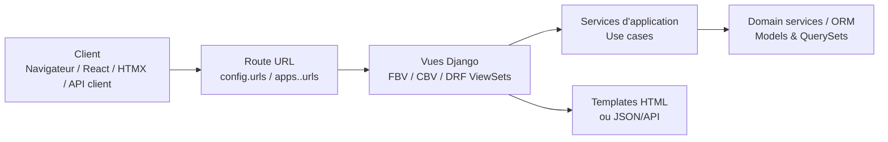

Voici le **Guide n°4 – Vues & URLs (Django, projet Gardel 2025)**, aligné avec :

- l’architecture globale du projet (Guide n°1 – projet vs apps)
- les conventions sur les modèles & l’ORM (Guide n°2)
- la couche Services & Application (Guide n°3)

Il s’appuie sur la documentation officielle Django (vues, URL dispatcher, class-based views, generic views). ([Django Project](https://docs.djangoproject.com/en/5.2/topics/http/urls/?utm_source=chatgpt.com))

---

# 1. Rôle des vues & URLs dans l’architecture Gardel

## 1.1. Position dans les couches

On rappelle la vision en couches déjà posée dans le Guide Services :



- **URLconf** (`config/urls.py` + `apps.<app>.urls`):
    - fait le mapping “chemin → vue”, comme décrit dans le URL dispatcher Django. ([Django Project](https://docs.djangoproject.com/en/5.2/topics/http/urls/?utm_source=chatgpt.com))
- **Vues** :
    - reçoivent un `HttpRequest`,
    - délèguent au maximum aux **services d’application**,
    - renvoient une `HttpResponse` (HTML, JSON, redirect…).

Objectif Gardel : **vues fines, services riches**. Les vues sont principalement de la “colle I/O”.

---

# 2. Organisation des URLconf dans Gardel

## 2.1. URLs racines : `config/urls.py`

Fichier recommandé (dans `backend/src/config/urls.py`) :

```python
# backend/src/config/urls.py
from django.contrib import admin
from django.urls import include, path

urlpatterns = [
    # Admin Django
    path("admin/", admin.site.urls),

    # Back-office applicatif (HTML)
    path("taxe/", include("apps.taxe_sejour.urls", namespace="taxe_sejour")),
    path("labo/", include("apps.labo.urls", namespace="labo")),
    path("production/", include("apps.production.urls", namespace="production")),

    # API DRF (sera détaillé dans le guide API)
    path("api/taxe/", include("apps.taxe_sejour.api.routers")),
    path("api/labo/", include("apps.labo.api.routers")),
    # ...

    # Auth / comptes (login, logout, profil…)
    path("comptes/", include("apps.comptes.urls", namespace="comptes")),
]

```

Points clés alignés avec la doc Django :

- un **URLconf racine** qui agrège les URLconf d’app via `include()` ; ([Django Project](https://docs.djangoproject.com/en/5.2/topics/http/urls/?utm_source=chatgpt.com))
- aucun “gros bloc” de logique ici, uniquement des inclusions.

## 2.2. Debug, static, healthcheck

En dev uniquement, on ajoute éventuellement :

```python
from django.conf import settings
from django.conf.urls.static import static

if settings.DEBUG:
    urlpatterns += static(settings.MEDIA_URL, document_root=settings.MEDIA_ROOT)
    urlpatterns += [
        path("__debug__/", include("debug_toolbar.urls")),
    ]

```

Pour les **healthchecks** (k8s, monitoring), on privilégie une app dédiée (`apps.monitoring`) avec une vue simple :

```python
urlpatterns += [
    path("healthz/", include("apps.monitoring.urls", namespace="monitoring")),
]

```

---

# 3. URLs par app métier

## 3.1. `apps/<app>/urls.py` : pattern standard

Chaque app métier suit le pattern :

```python
# apps/taxe_sejour/urls.py
from django.urls import path
from .views import backoffice

app_name = "taxe_sejour"

urlpatterns = [
    path("", backoffice.TaxeListeView.as_view(), name="liste"),
    path("<uuid:pk>/", backoffice.TaxeDetailView.as_view(), name="detail"),
    path("<uuid:pk>/modifier/", backoffice.TaxeUpdateView.as_view(), name="modifier"),
    path("nouvelle/", backoffice.TaxeCreateView.as_view(), name="creer"),
]

```

Règles importantes, cohérentes avec le Guide n°1 (structure d’app) :

- **`app_name` obligatoire** pour permettre le _namespacing_ (`taxe_sejour:liste`) ;
- `urlpatterns` contient uniquement des `path()` / `re_path()` ; ([Django Project](https://docs.djangoproject.com/en/5.2/topics/http/urls/?utm_source=chatgpt.com))
- on importe les vues depuis `apps.taxe_sejour.views.backoffice`.

## 3.2. Namespaces

Inclusion côté `config/urls.py` :

```python
path("taxe/", include("apps.taxe_sejour.urls", namespace="taxe_sejour")),

```

- `app_name = "taxe_sejour"` dans le module d’app ;
- `namespace="taxe_sejour"` dans `include`.

Dans les templates :

```
<a href="">Voir</a>

```

Ce mécanisme repose sur `include()` + namespaces documentés dans `django.urls`. ([Django Project](https://docs.djangoproject.com/en/5.2/ref/urls/?utm_source=chatgpt.com))

---

# 4. Conventions de design des routes

## 4.1. Style des chemins

On adopte :

- chemins **kebab-case** pour les segments lisibles (`"taxe-sejour/"`, `"import-labo/"`) ;
- segmentation par **ressource** (liste, détail…) :

```
/taxe/                     → liste des taxes
/taxe/nouvelle/            → création
/taxe/<uuid:pk>/           → détail
/taxe/<uuid:pk>/modifier/  → édition
/taxe/<uuid:pk>/supprimer/ → suppression (confirmation)

```

Pour l’API, on garde un style plus REST / JSON (détaillé dans le guide API).

## 4.2. Convertisseurs de chemin

On utilise les convertisseurs fournis par Django dans `path()` : `str`, `int`, `slug`, `uuid`, etc. ([Django Project](https://docs.djangoproject.com/en/5.2/topics/http/urls/?utm_source=chatgpt.com))

Exemples :

```python
path("<int:pk>/", backoffice.SejourDetailView.as_view(), name="detail"),
path("commune/<slug:slug>/", backoffice.CommuneDetailView.as_view(), name="commune_detail"),
path("<uuid:pk>/", backoffice.LogementDetailView.as_view(), name="logement_detail"),

```

Pour Gardel, on privilégie :

- **`uuid`** pour les IDs sensibles/cachés (paiement, taxe) ;
- **`int`** pour des référentiels non sensibles (ID auto-incrément dans certains cas) ;
- éventuellement `slug` pour des pages publiques (mais moins critique pour un SI interne).

---

# 5. Typologie des vues HTML (FBV / CBV)

## 5.1. Rappel : qu’est-ce qu’une vue Django ?

La doc Django définit une vue comme un **callable** prenant un `HttpRequest` et renvoyant une `HttpResponse`. ([Django Project](https://docs.djangoproject.com/en/5.2/topics/class-based-views/?utm_source=chatgpt.com))

Deux familles :

- **Function-Based Views (FBV)** : fonctions Python simples ;
- **Class-Based Views (CBV)** : classes avec `.as_view()`.

Gardel utilise :

- FBV pour :
    - petits endpoints techniques,
    - healthcheck, redirect simples ;
- CBV + **generic views** pour :
    - CRUD back-office,
    - listes filtrées, détails, formulaires.

## 5.2. Organisation des modules de vues

Aligné avec la structure d’app (Guide n°1) :

```
apps/taxe_sejour/views/
  __init__.py
  backoffice.py   # écrans internes / gestionnaires
  public.py       # écrans éventuellement publics
  exports.py      # vues d’export (CSV, Excel, PDF)

```

Dans `urls.py`, on importe depuis le module adapté (`backoffice`, `public`).

---

# 6. Vues génériques de liste & détail

Django fournit des **class-based generic views** (ListView, DetailView…) pour éviter de réécrire le même code (pagination, récupération d’objets, etc.). ([Django Project](https://docs.djangoproject.com/en/5.2/topics/class-based-views/generic-display/?utm_source=chatgpt.com))

## 6.1. Liste : `ListView`

Exemple pour la liste des séjours (vue HTML back-office) :

```python
# apps/sejour/views/backoffice.py
from django.contrib.auth.mixins import LoginRequiredMixin
from django.views.generic import ListView

from apps.sejour.models import Sejour

class SejourListView(LoginRequiredMixin, ListView):
    model = Sejour
    template_name = "sejour/liste.html"
    context_object_name = "sejours"
    paginate_by = 50

    def get_queryset(self):
        # Utilise un QuerySet custom défini dans le Guide Modèles :contentReference[oaicite:13]{index=13}
        qs = Sejour.objects.select_related("logement", "commune")
        # exemple de filtre simple
        commune_id = self.request.GET.get("commune")
        if commune_id:
            qs = qs.filter(commune_id=commune_id)
        return qs

```

Points clés :

- `LoginRequiredMixin` pour restreindre l’accès (CBV mixins) ; ([Django Project](https://docs.djangoproject.com/fr/4.2/topics/class-based-views/mixins/?utm_source=chatgpt.com))
- surchargé `get_queryset()` pour intégrer les optimisations ORM (cf. Guide n°2)
- `paginate_by` pour éviter les listes énormes.

## 6.2. Détail : `DetailView`

```python
# apps/sejour/views/backoffice.py
from django.views.generic import DetailView

class SejourDetailView(LoginRequiredMixin, DetailView):
    model = Sejour
    template_name = "sejour/detail.html"
    context_object_name = "sejour"

```

- `DetailView` gère la récupération de l’objet à partir de `<pk>` (ou `<slug>`) présent dans l’URL ;
- extensible via `get_queryset()` ou `get_context_data()`.

---

# 7. Vues d’édition (Create / Update / Delete)

Django fournit aussi des **generic editing views** (CreateView, UpdateView, DeleteView) pour gérer les formulaires d’édition basés sur un modèle. ([Django Project](https://docs.djangoproject.com/en/5.2/ref/class-based-views/generic-editing/?utm_source=chatgpt.com))

## 7.1. Création : `CreateView`

```python
# apps/sejour/views/backoffice.py
from django.urls import reverse_lazy
from django.views.generic import CreateView
from .forms import SejourForm

class SejourCreateView(LoginRequiredMixin, CreateView):
    form_class = SejourForm
    template_name = "sejour/form.html"
    success_url = reverse_lazy("sejour:liste")

    def form_valid(self, form):
        form.instance.created_by = self.request.user
        return super().form_valid(form)

```

## 7.2. Mise à jour : `UpdateView`

```python
from django.views.generic import UpdateView

class SejourUpdateView(LoginRequiredMixin, UpdateView):
    form_class = SejourForm
    template_name = "sejour/form.html"
    queryset = Sejour.objects.all()

    def get_success_url(self):
        return reverse_lazy("sejour:detail", kwargs={"pk": self.object.pk})

```

## 7.3. Suppression : `DeleteView`

```python
from django.views.generic import DeleteView

class SejourDeleteView(LoginRequiredMixin, DeleteView):
    model = Sejour
    template_name = "sejour/confirm_delete.html"
    success_url = reverse_lazy("sejour:liste")

```

Remarque : pour **soft delete**, on surchargera `delete()` ou on passera par un **service** (cf. Guide Modèles & Services).

---

# 8. Vues & services d’application

## 8.1. Principe : vue mince, service orchestrateur

On applique le principe défini dans le Guide Services :

- la vue :
    - lit la requête (GET, POST, params, user),
    - délègue à un **use case**,
    - gère la réponse (template, redirect, JSON) ;
- le service d’application réalise le workflow métier (transaction, validation…).

## 8.2. Exemple : calculer une taxe de séjour

Service (`apps/taxe_sejour/services/usecases/calculer_taxe_sejour.py`) simplifié :

```python
# apps/taxe_sejour/services/usecases/calculer_taxe_sejour.py
from dataclasses import dataclass
from django.db import transaction
from apps.sejour.models import Sejour
from apps.taxe_sejour.models import TaxeSejour
from ..domain.regles_taxe import calculer_montant_taxe

@dataclass
class CalculTaxeResult:
    taxe: TaxeSejour

def calculer_taxe_sejour(sejour_id: str, user) -> CalculTaxeResult:
    sejour = Sejour.objects.select_related("logement", "commune").get(pk=sejour_id)
    # Permissions / policies
    # (voir Guide Services & permissions) :contentReference[oaicite:19]{index=19}

    with transaction.atomic():
        montant = calculer_montant_taxe(sejour)
        taxe = TaxeSejour.objects.create(
            sejour=sejour,
            montant_taxe=montant,
            calcule_par=user,
        )
    return CalculTaxeResult(taxe=taxe)

```

Vue HTML :

```python
# apps/taxe_sejour/views/backoffice.py
from django.contrib.auth.mixins import LoginRequiredMixin
from django.shortcuts import redirect, get_object_or_404
from django.views import View

from apps.sejour.models import Sejour
from apps.taxe_sejour.services.usecases.calculer_taxe_sejour import calculer_taxe_sejour

class CalculerTaxeView(LoginRequiredMixin, View):
    def post(self, request, sejour_id):
        sejour = get_object_or_404(Sejour, pk=sejour_id)
        result = calculer_taxe_sejour(sejour_id=sejour.id, user=request.user)
        return redirect("taxe_sejour:detail", pk=result.taxe.id)

```

En API (DRF), la logique est la même, mais renvoie une réponse JSON (vu dans le Guide API).

---

# 9. Nommage, `reverse()` et navigation

## 9.1. Utilisation de `name` et `namespace`

Chaque route doit avoir un **nom** (`name="liste"`, `name="detail"`).

Combiné à `app_name` / `namespace`, cela permet d’utiliser :

- `reverse("taxe_sejour:detail", kwargs={"pk": taxe.id})` côté Python ;
- `` dans les templates. ([Django Project](https://docs.djangoproject.com/en/5.2/ref/urls/?utm_source=chatgpt.com))

## 9.2. Bonnes pratiques

- ne jamais “hardcoder” les URLs (`"/taxe/%s/" % taxe.id`) ;
- toujours passer par `reverse()` ou le tag `` ;
- garder une convention stable :
    - `liste`, `detail`, `creer`, `modifier`, `supprimer` pour les CRUD ;
    - verbes explicites pour les actions métier : `generer_pdf`, `clore_periode`, `exporter_csv`.

---

# 10. Particularités API & DRF (aperçu)

Les détails iront dans le Guide n°6 “API & DRF”, mais la structuration des URLs est déjà définie dans l’architecture des apps.

## 10.1. Routers DRF

`apps/taxe_sejour/api/routers.py` :

```python
# apps/taxe_sejour/api/routers.py
from rest_framework.routers import DefaultRouter
from .viewsets.taxe import TaxeSejourViewSet

router = DefaultRouter()
router.register("taxes", TaxeSejourViewSet, basename="taxe_sejour")

urlpatterns = router.urls

```

Inclus dans `config/urls.py` :

```python
path("api/taxe/", include("apps.taxe_sejour.api.routers")),

```

On obtient typiquement :

```
/api/taxe/taxes/         → liste, création
/api/taxe/taxes/<pk>/    → détail, mise à jour, suppression

```

---

# 11. Gestion des erreurs & pages spéciales

Django permet de définir des **handlers** globaux pour les erreurs 400/403/404/500. ([Django Project](https://docs.djangoproject.com/en/5.2/ref/urls/?utm_source=chatgpt.com))

Dans `config/urls.py` :

```python
from apps.core import views as core_views

handler400 = core_views.bad_request
handler403 = core_views.permission_denied
handler404 = core_views.page_not_found
handler500 = core_views.server_error

```

Exemple de vue 404 custom :

```python
# apps/core/views.py
from django.shortcuts import render

def page_not_found(request, exception):
    return render(request, "core/404.html", status=404)

```

---

# 12. Sécurité & permissions dans les vues

La sécurité sera détaillée dans le Guide “Sécurité & conformité”, mais les hooks principaux côté vues/URLs :

- `LoginRequiredMixin` / décorateur `login_required` pour restreindre l’accès ; ([Django Project](https://docs.djangoproject.com/fr/4.2/topics/class-based-views/mixins/?utm_source=chatgpt.com))
- mixins de permission (`PermissionRequiredMixin`, mixins DRF) ;
- usage systématique de `request.user` passé aux services d’application pour les contrôles métier.

Exemple simple :

```python
from django.contrib.auth.mixins import LoginRequiredMixin, PermissionRequiredMixin

class TaxeListView(LoginRequiredMixin, PermissionRequiredMixin, ListView):
    permission_required = "taxe_sejour.view_taxesejour"
    # ...

```

---

# 13. Performance & bonnes pratiques côté vues

Points de vigilance, en cohérence avec le Guide Modèles & ORM :

- **N+1 queries** :
    - toujours utiliser `select_related` / `prefetch_related` dans `get_queryset()` pour les listes et les détails chargés ; ([Django Project](https://docs.djangoproject.com/en/5.2/ref/class-based-views/?utm_source=chatgpt.com))
- **Pagination** :
    - systématiquement pour les listes de volumétrie non triviale (`paginate_by`), ou pagination côté API (DRF) ;
- **Cache** :
    - pour des vues très lues mais peu modifiées, envisager les décorateurs de cache (`cache_page`) ou cache par fragment dans les templates ;
- **Pas de logique lourde en vue** :
    - pas d’ETL, pas de calcul massif ; tout passe par les services d’application (cf. Guide n°3).

---

# 14. Checklist “Vues & URLs – Gardel”

À utiliser en code review / PR et comme règles pour agents IA/IDE.

## 14.1. Structure des URLconf

- [ ] `config/urls.py` se contente d’**inclure** les URLconf d’app (aucune logique métier). ([Django Project](https://docs.djangoproject.com/en/5.2/topics/http/urls/?utm_source=chatgpt.com))
- [ ] Chaque app possède un `urls.py` avec `app_name` défini.
- [ ] Les URLs sont **namespacées** (`namespace="taxe_sejour"`) et nommées (`name="detail"`).
- [ ] Les routes respectent une convention claire (`liste`, `detail`, `creer`, `modifier`, `supprimer`).
- [ ] Les convertisseurs `int`, `uuid`, `slug` sont utilisés de manière cohérente par domaine.

## 14.2. Vues HTML

- [ ] Les modules de vues sont structurés (`views/backoffice.py`, `views/public.py`, `views/exports.py`).
- [ ] Les CRUD back-office utilisent les **generic class-based views** (ListView, DetailView, CreateView, UpdateView, DeleteView). ([Django Project](https://docs.djangoproject.com/en/5.2/topics/class-based-views/generic-display/?utm_source=chatgpt.com))
- [ ] `LoginRequiredMixin` est présent sur toutes les vues sensibles.
- [ ] Les vues n’embarquent pas de logique métier lourde (uniquement I/O + délégation aux services).

## 14.3. Intégration avec les services

- [ ] Les use cases critiques (calculs, imports, clôtures) sont implémentés dans `services/usecases/` et **appelés depuis les vues**.
- [ ] Les vues passent `request.user` aux services lorsqu’il y a un enjeu de sécurité/traçabilité.
- [ ] Les transactions sont gérées au niveau service (`transaction.atomic()`), pas dans la vue.

## 14.4. Navigation & erreurs

- [ ] Aucun chemin n’est hardcodé en string dans le Python ou les templates : on utilise toujours `reverse()` ou ``. ([Django Project](https://docs.djangoproject.com/en/5.2/ref/urlresolvers/?utm_source=chatgpt.com))
- [ ] Des handlers 400/403/404/500 personnalisés sont définis en cohérence avec la charte UI Gardel.
- [ ] Les listes utilisent la pagination (HTML) ou des mécanismes similaires en API.

---

Si tu le souhaites, on peut enchaîner ensuite avec le **Guide n°5 – Templates & intégration front (HTMX / React)** en capitalisant sur ce qui a été posé ici pour la partie “vues & routes”.