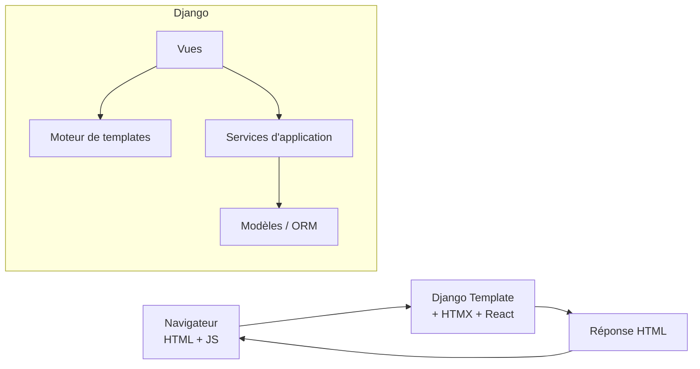

Voici le **Guide n°5 – Templates & intégration front (HTMX / React) – Gardel 2025**.

---

# 1. Rôle des templates & du front dans l’architecture Gardel

Dans Gardel, la pile est pensée **server-side first** :

- Django gère :
    
    - le **rendu HTML** via le moteur de templates,
        
    - la **sécurité** (auth, permissions),
        
    - la **logique métier** (services d’application, ORM).
        
- Le front est **progressivement enrichi** :
    
    - **HTMX** pour les interactions AJAX simples, pilotées par les vues Django, sans SPA. ([Htmx](https://htmx.org/docs/?utm_source=chatgpt.com "</> htmx ~ Documentation"))
        
    - **React** pour des composants riches, localisés (“îlots React”) : tableaux complexes, dashboards, formulaires dynamiques, etc. ([React](https://react.dev/?utm_source=chatgpt.com "React"))
        

Vue macro :



Objectifs :

- garder les **templates simples** (présentation, pas de logique métier), conformément à la philosophie Django. ([Django Project](https://docs.djangoproject.com/en/5.2/ref/templates/?utm_source=chatgpt.com "Templates | Django documentation"))
    
- séparer clairement :
    
    - **templates “page complètes”**, avec layout, header, etc.
        
    - **partials/partials HTMX**, pour les fragments mis à jour.
        
    - **containers React**, pour monter des composants Vite.
        

---

# 2. Organisation des templates dans le projet

## 2.1. Configuration `TEMPLATES` (settings Django)

Dans `settings.py` :

```python
TEMPLATES = [
    {
        "BACKEND": "django.template.backends.django.DjangoTemplates",
        "DIRS": [
            BASE_DIR / "templates",  # templates “globaux” (layouts, composants partagés)
        ],
        "APP_DIRS": True,           # active la recherche dans apps/<app>/templates
        "OPTIONS": {
            "context_processors": [
                "django.template.context_processors.debug",
                "django.template.context_processors.request",
                "django.contrib.auth.context_processors.auth",
                "django.contrib.messages.context_processors.messages",
                # + éventuels context processors custom
            ],
        },
    },
]
```

`APP_DIRS = True` permet à Django de chercher automatiquement les templates dans chaque app, dans `apps/<app>/templates/`. ([Django Project](https://docs.djangoproject.com/en/5.2/topics/templates/?utm_source=chatgpt.com "Templates | Django documentation"))

## 2.2. Arborescence recommandée

Au niveau projet :

```text
backend/
  templates/
    base.html
    base_backoffice.html
    base_public.html
    partials/
      _navbar.html
      _messages.html
      _pagination.html
    react/
      vite_entry.html       # helper pour charger les bundles Vite
      _react_mount.html     # fragment générique pour les roots React
```

Par app :

```text
apps/
  taxe_sejour/
    templates/
      taxe_sejour/
        liste.html          # extends base_backoffice
        detail.html
        form.html
        partials/
          _table_taxes.html      # fragment pour HTMX
          _ligne_taxe.html       # fragment pour HTMX
```

Conventions :

- les **templates globaux** (layout, composants transverses) vivent dans `backend/templates/`.
    
- chaque app possède son **namespace de templates** (`taxe_sejour/…`) pour éviter les collisions. ([Django Project](https://docs.djangoproject.com/en/5.2/topics/templates/?utm_source=chatgpt.com "Templates | Django documentation"))
    
- les **partials** sont préfixés par `_` ou regroupés dans un dossier `partials/`.
    

---

# 3. Langage de templates Django – rappels & règles Gardel

## 3.1. Syntaxe de base

Django utilise des **variables**, **tags** et **filtres** : ([Django Project](https://docs.djangoproject.com/en/5.2/topics/templates/?utm_source=chatgpt.com "Templates | Django documentation"))

- variable : `{{ sejour.client_nom }}`
    
- tag de contrôle : `…`
    
- filtres : `{{ sejour.date_arrivee|date:"d/m/Y" }}`
    

Exemple minimal :

```django



  <h1>Liste des séjours</h1>

  <table>
    <thead>
      <tr>
        <th>Client</th>
        <th>Logement</th>
        <th>Arrivée</th>
        <th>Départ</th>
      </tr>
    </thead>
    <tbody>
      
        <tr>
          <td>{{ sejour.client_nom }}</td>
          <td>{{ sejour.logement.nom }}</td>
          <td>{{ sejour.date_arrivee|date:"d/m/Y" }}</td>
          <td>{{ sejour.date_depart|date:"d/m/Y" }}</td>
        </tr>
      
        <tr>
          <td colspan="4">Aucun séjour trouvé.</td>
        </tr>
      
    </tbody>
  </table>

```

Règles Gardel :

- **zéro logique métier** dans les templates :
    
    - pas d’appels ORM,
        
    - pas de calculs complexes (fait en services/vues).
        
- contrôles simples uniquement : `if`, `for`, `with`, `url`, `include`, etc. ([Django Project](https://docs.djangoproject.com/en/5.2/ref/templates/builtins/?utm_source=chatgpt.com "Built-in template tags and filters"))
    

## 3.2. Héritage & layouts

On utilise systématiquement l’héritage de template : ([Django Project](https://docs.djangoproject.com/en/5.2/topics/templates/?utm_source=chatgpt.com "Templates | Django documentation"))

`base_backoffice.html` :

```django

<!DOCTYPE html>
<html lang="fr">
<head>
  <meta charset="utf-8">
  <title>Gardel – Backoffice</title>

  <link rel="stylesheet" href="">
  
</head>
<body hx-boost="true"> {# voir HTMX plus bas #}
  
  <main id="main-content">
    
    
  </main>

  <script src="" defer></script>
  
</body>
</html>
```

Une page concrète :

```django


Liste des séjours – Gardel


  ...

```

Avantage : factoriser le HTML commun (head, nav, footer) et ne varier que les blocs spécifiques à chaque page.

## 3.3. Partials & composants de template

Pour éviter la duplication :

```django
{# partials/_messages.html #}

  <ul class="messages">
    
      <li class="message {{ message.tags }}">{{ message }}</li>
    
  </ul>

```

Utilisation :

```django

```

On applique le même principe pour :

- les **cards** réutilisables (par ex. card d’un séjour),
    
- les **lignes de tableau** pour HTMX (`_ligne_taxe.html`),
    
- les **containers React**.
    

---

# 4. Statics, Vite & assets React

## 4.1. Statics Django

Utilisation standard du tag `` : ([Django Project](https://docs.djangoproject.com/en/5.2/ref/templates/?utm_source=chatgpt.com "Templates | Django documentation"))

```django


<link rel="stylesheet" href="">
<script src="" defer></script>
```

Les fichiers générés par Vite (JS/CSS) sont également servis comme statics, idéalement via un manifest (voir doc d’intégration React/Vite déjà rédigée).

## 4.2. Helper pour les bundles Vite

Exemple de fragment générique :

```django
{# templates/react/vite_entry.html #}



  <script type="module" src="http://localhost:5173/@vite/client"></script>
  <script type="module" src="http://localhost:5173/{{ entry }}"></script>

  {# En prod, on lit le manifest.json via un template tag custom #}
  
  

```

Utilisation dans une page :

```django



  

```

---

# 5. HTMX dans Gardel : principes & patterns

## 5.1. Pourquoi HTMX ?

HTMX permet d’ajouter de l’interactivité avec **très peu de JS custom** : on envoie des requêtes HTTP (GET/POST/DELETE…) depuis des attributs HTML (`hx-get`, `hx-post`…), et on remplace un fragment du DOM par le HTML renvoyé par Django. ([Htmx](https://htmx.org/docs/?utm_source=chatgpt.com "</> htmx ~ Documentation"))

HTMX est idéal pour :

- du **CRUD simple** en back-office,
    
- des **rechargements partiels** (table, pagination, filtres, formulaires),
    
- des **modales ou panneaux latéraux** pour des détails.
    

## 5.2. Intégration minimale (script + `hx-boost`)

Dans les layouts (`base_backoffice.html`) :

```django

<!DOCTYPE html>
<html lang="fr">
<head>
  ...
  <script src="" defer></script>
</head>
<body hx-boost="true">
  ...
</body>
</html>
```

- `hx-boost="true"` sur un container indique à HTMX de convertir les liens et formulaires en requêtes AJAX, en mettant à jour la page (par défaut le `<body>`). ([Htmx](https://htmx.org/docs/?utm_source=chatgpt.com "</> htmx ~ Documentation"))
    

## 5.3. Attributs clés

Les attributs principaux : ([Htmx](https://htmx.org/reference/?utm_source=chatgpt.com "Reference"))

- `hx-get="/url/"` : GET AJAX et swap du HTML de réponse.
    
- `hx-post="/url/"` : POST AJAX (formulaire, action).
    
- `hx-target="#id"` : cible du remplacement (si différent de l’élément déclencheur).
    
- `hx-swap="innerHTML|outerHTML|beforeend|afterend|..."` : mode de remplacement.
    
- `hx-trigger="click|change|revealed|..."` : événement déclencheur.
    

Exemple : filtrer une table de taxes sans rechargement de page :

```django
<form
  id="filtre-taxes"
  hx-get=""
  hx-target="#table-taxes"
  hx-push-url="true"
>
  <select name="commune">
    ...
  </select>
  <button type="submit">Filtrer</button>
</form>

<div id="table-taxes">
  
</div>
```

La vue `TaxeListView` :

- si requête standard → rend `liste.html` complet,
    
- si requête HTMX → rend uniquement le partial `_table_taxes.html`.
    

## 5.4. Détection côté vue (HTMX vs full)

Avec **django-htmx**, on dispose de helpers pour tester la requête HTMX et renvoyer des réponses spécifiques. ([Django HTMX](https://django-htmx.readthedocs.io/en/latest/http.html?utm_source=chatgpt.com "HTTP tools - django-htmx 1.27.0 documentation"))

Exemple :

```python
from django.shortcuts import render
from django_htmx.http import HttpResponseClientRedirect

def liste_taxes(request):
    context = {...}
    if request.htmx:
        # Rechargement partiel de la table
        return render(request, "taxe_sejour/partials/_table_taxes.html", context)
    return render(request, "taxe_sejour/liste.html", context)
```

Pour rediriger côté client après une action HTMX :

```python
return HttpResponseClientRedirect(reverse("taxe_sejour:liste"))
```

---

# 6. Intégration de React dans les templates

## 6.1. Philosophie “îlots React”

Conformément au guide React que tu as déjà, on applique un modèle **“React dans les templates Django”** :

- pas de SPA globale,
    
- React est monté sur des **div racines ciblées**,
    
- chaque composant React est autonome et reçoit ses props via :
    
    - des `data-*`,
        
    - ou un `<script type="application/json">`.
        

Ce modèle reste cohérent avec les bonnes pratiques React 18 (composants, hooks, etc.). ([React](https://react.dev/?utm_source=chatgpt.com "React"))

## 6.2. Exemple de container React dans un template Django

Template Django :

```django



  <h1>Dashboard Taxe de séjour</h1>

  <div
    id="taxe-dashboard-root"
    data-sejour-id="{{ sejour.id }}"
    data-commune="{{ sejour.commune.code_insee }}"
    data-user="{{ request.user.username }}"
  ></div>



  

```

Côté React (simplifié) :

```tsx
// apps/taxe-dashboard/main.tsx
import React from "react";
import ReactDOM from "react-dom/client";
import { TaxeDashboard } from "./TaxeDashboard";

const rootElement = document.getElementById("taxe-dashboard-root");
if (rootElement) {
  const dataset = rootElement.dataset;
  const props = {
    sejourId: dataset.sejourId,
    commune: dataset.commune,
    user: dataset.user,
  };

  ReactDOM.createRoot(rootElement).render(
    <React.StrictMode>
      <TaxeDashboard {...props} />
    </React.StrictMode>,
  );
}
```

Règles Gardel :

- 1 **root React** par zone fonctionnelle (pas de duplication sauvage dans le DOM),
    
- pas de dépendance forte entre React et HTMX dans la même zone (voir section suivante),
    
- toutes les interactions réseau côté React passent par l’API (DRF), pas par des endpoints HTML.
    

---

# 7. Combiner HTMX & React proprement

## 7.1. Zone HTMX vs zone React

Principes :

- une **zone de page** est gérée soit par **HTMX**, soit par **React**, mais rarement par les deux.
    
- HTMX remplace du **HTML statique**, issu de templates Django.
    
- React gère un DOM “virtuel” propre à sa racine.
    

On évite absolument :

- de laisser HTMX remplacer l’élément racine d’un composant React,
    
- ou d’insérer des fragments HTMX **à l’intérieur** d’une arborescence contrôlée par React.
    

Utiliser `hx-target` pour contrôler où le HTML est inséré (en dehors des roots React). ([Htmx](https://htmx.org/attributes/hx-target/?utm_source=chatgpt.com "hx-target Attribute"))

Exemple :

```django
<div class="layout">
  <section id="zone-filtres" hx-target="#table-taxes">
    ... formulaires HTMX ...
    <div id="table-taxes">
      
    </div>
  </section>

  <section id="zone-dashboard">
    <div id="taxe-dashboard-root" ...></div>
  </section>
</div>
```

- la **colonne gauche** est gérée par HTMX (filtres + table),
    
- la **colonne droite** par React (dashboard).
    

## 7.2. Cas où React consomme des données générées via HTMX

Si besoin :

- HTMX met à jour un **bloc de configuration** (ex : `<script type="application/json">`),
    
- React relit ces données au prochain render.
    

Mais dans la mesure du possible, on garde le contrat simple :

- React consomme l’API JSON,
    
- HTMX consomme les vues HTML et templates.
    

---

# 8. Accessibilité, i18n & UX

## 8.1. Internationalisation

Dans les templates :

```django

<h1></h1>
```

Pour du texte React, on privilégie une lib d’i18n côté front (p.ex. `react-i18next`) si nécessaire. ([React i18next](https://react.i18next.com/?utm_source=chatgpt.com "react-i18next documentation: Introduction"))

## 8.2. Accessibilité & feedback

- pour les mises à jour HTMX, prévoir des zones `aria-live="polite"` pour les messages de succès/erreur ;
    
- pour React, gérer focus, messages d’erreur, attributs ARIA sur les composants interactifs ;
    
- éviter les effets “magiques” : toujours fournir un feedback utilisateur (loader, message de confirmation).
    

---

# 9. Checklist “Templates & Front – Gardel”

À utiliser en code review & comme règles pour agents IA/IDE.

## 9.1. Structure & conventions templates

-  La **configuration `TEMPLATES`** utilise `DIRS` + `APP_DIRS=True`. ([Django Project](https://docs.djangoproject.com/en/5.2/topics/templates/?utm_source=chatgpt.com "Templates | Django documentation"))
    
-  Les templates globaux (layouts, partials transverses) sont dans `backend/templates/`.
    
-  Chaque app dispose d’un dossier `apps/<app>/templates/<app>/`.
    
-  Les partials sont clairement identifiés (`partials/` ou préfixe `_`).
    
-  Les pages étendent un des layouts (`base.html`, `base_backoffice.html`, etc.).
    

## 9.2. Qualité du code template

-  Aucun accès direct à l’ORM / à des fonctions métier dans les templates.
    
-  La logique est limitée aux tags de contrôle (`if`, `for`, `with`, `url`, `include`).
    
-  Les filtres sont utilisés pour la présentation (format de dates, nombre, etc.). ([Django Project](https://docs.djangoproject.com/en/5.2/ref/templates/builtins/?utm_source=chatgpt.com "Built-in template tags and filters"))
    

## 9.3. HTMX

-  Le script HTMX est chargé dans les layouts via ``.
    
-  `hx-boost="true"` est utilisé là où pertinent (navigation AJAX). ([Htmx](https://htmx.org/docs/?utm_source=chatgpt.com "</> htmx ~ Documentation"))
    
-  Les templates HTMX renvoient des **partials** cohérents (pas des pages complètes).
    
-  Les vues distinguent bien `request.htmx` (partials) des requêtes classiques (pages complètes).
    
-  `hx-target` et `hx-swap` sont utilisés pour éviter les conflits avec les roots React. ([Htmx](https://htmx.org/reference/?utm_source=chatgpt.com "Reference"))
    

## 9.4. React

-  Les racines React sont définies dans les templates via des `<div id="...">` dédiés.
    
-  Les bundles JS/CSS sont inclus via un helper Vite ou le manifest.
    
-  Les composants React consomment l’API (DRF), pas des HTML partiels.
    
-  Les zones React ne sont pas manipulées par HTMX.
    

---

Si tu veux, on pourra enchaîner avec le **Guide n°6 – API & DRF** en reprenant les patterns définis ici (îlots React qui consomment l’API, endpoints JSON, pagination, filtres, etc.).