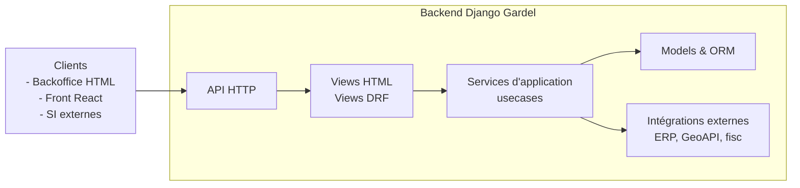

Voici le **Guide n°6 – API & Django REST Framework (DRF) – Gardel 2025**.

---

# 1. Rôle de l’API dans l’architecture Gardel

## 1.1. Position dans les couches

Rappel des couches (HTML + API) :



- Les **vues HTML Django** servent les interfaces backoffice (guides 4 et 5).
- L’**API DRF** expose :
    - les données pour les **îlots React** (front interne ou futur front externe) ;
    - les flux avec des **systèmes tiers** (ERP, outils BI, collecteurs de taxe, etc.) .

## 1.2. Finalités de l’API Gardel

- **Backoffice enrichi** : React consomme `/api/...` pour dashboards, tableaux avancés, filtres complexes.
- **Intégration SI** : endpoints pour synchroniser Gardel avec :
    - systèmes financiers / comptables,
    - outils de reporting / DataMart,
    - éventuelles API des collectivités.
- **Usage futur** : exposer certaines routes vers l’extérieur (portail communes, extranet, etc.).

**Règle Gardel** :

- L’API DRF est **stable, versionnée**, découplée de la présentation HTML.
- La logique métier reste dans les **services d’application** (guide n°3), pas dans les ViewSets.

---

# 2. Organisation des modules API dans l’arborescence

## 2.1. Vue d’ensemble (rappel projet)

Dans `backend/src/` :

```
src/
  config/
    settings/
    urls.py
    asgi.py / wsgi.py
  apps/
    taxe_sejour/
    labo/
    production/
    referentiels/
    ...
  shared/
    services/
    models/
    utils/

```

## 2.2. Structure API par app

Pour chaque app métier (ex. `taxe_sejour`) :

```
apps/
  taxe_sejour/
    models/
    services/
    api/
      __init__.py
      serializers.py
      viewsets.py
      routers.py         # enregistre les ViewSets dans un router DRF
      filters.py         # django-filter / filtres custom
      permissions.py     # permissions DRF spécifiques à l’API
      schemas.py         # (optionnel) schémas / tags OpenAPI
    views/
    permissions.py       # policies métier (non DRF, réutilisables côté services)
    ...

```

- `serializers.py` = DTO + validation + mapping modèle ↔ JSON.
- `viewsets.py` = colle HTTP (API) → services d’application.
- `routers.py` = définition du `DefaultRouter` de l’app.
- `filters.py` = filtres DRF / django-filter.

## 2.3. Raccordement dans `config/urls.py`

```python
# src/config/urls.py
from django.urls import path, include

urlpatterns = [
    path("admin/", admin.site.urls),
    path("taxe/", include("apps.taxe_sejour.urls")),          # HTML
    path("labo/", include("apps.labo.urls")),                 # HTML
    path("api/taxe/", include("apps.taxe_sejour.api.routers")),
    path("api/labo/", include("apps.labo.api.routers")),
    # ...
]

```

- Racine de l’API : `/api/...`.
- Découpage par **domaine métier**, aligné sur les apps Django (taxe, labo, production…)

---

# 3. Serializers DRF – DTO & validation API

Les `Serializer` DRF servent à :

- valider les données entrantes (body, query params) ;
- sérialiser les modèles en JSON ;
- jouer le rôle de **DTO d’API** (boundary entre HTTP et domaine).

## 3.1. Types de serializers

D’après la doc DRF : ([Django REST Framework](https://www.django-rest-framework.org/tutorial/quickstart/?utm_source=chatgpt.com))

- `Serializer` : DTO “pur” (champs déclarés à la main).
- `ModelSerializer` : mapping automatique à partir d’un `Model`.
- Serializers imbriqués (nested) : pour embarquer des relations.

**Règles Gardel :**

- préférer `ModelSerializer` pour les **CRUD simples** basés sur un modèle (TaxeSejour, Sejour, Logement) ;
- utiliser `Serializer` pour :
    - les **use cases** qui ne mappent pas 1:1 avec un modèle (calcul de taxe, agrégats, rapports),
    - les payloads d’actions personnalisées (par ex. `POST /taxes/recalculer/`).

## 3.2. Exemple : serializer simple `TaxeSejour`

```python
# apps/taxe_sejour/api/serializers.py
from rest_framework import serializers
from apps.taxe_sejour.models import TaxeSejour

class TaxeSejourSerializer(serializers.ModelSerializer):
    class Meta:
        model = TaxeSejour
        fields = [
            "id",
            "sejour",
            "commune",
            "montant",
            "periode",
            "statut",
            "created_at",
        ]
        read_only_fields = ["id", "created_at"]

```

## 3.3. Serializer pour un use case (DTO API)

```python
class CalculTaxeInputSerializer(serializers.Serializer):
    sejour_id = serializers.UUIDField()
    force_recalcul = serializers.BooleanField(required=False, default=False)

class CalculTaxeOutputSerializer(serializers.Serializer):
    taxe_id = serializers.UUIDField()
    montant = serializers.DecimalField(max_digits=10, decimal_places=2)
    devise = serializers.CharField()
    statut = serializers.CharField()

```

Patron :

- serializer **Input** → valide les données HTTP.
- service `calculer_taxe_sejour` exécute la logique métier et renvoie un DTO interne ou un modèle.
- serializer **Output** → expose proprement le résultat (montant, statut…).

## 3.4. Bonnes pratiques Gardel

- pas de logique métier lourde (`save()` surchargé avec calculs complexes) dans les serializers ;
- validation simple (types, formats, cohérence locale) dans `validate_*` ou `validate` ;
- validation métier globale (règles de taxe, droits, volumétrie) dans les **services d’application**.

---

# 4. Vues DRF : ViewSet, generics, APIView

DRF fournit plusieurs familles de vues : `APIView`, **generic views**, `ViewSet`, `ModelViewSet`. ([Django REST Framework](https://www.django-rest-framework.org/api-guide/views/?utm_source=chatgpt.com))

Les articles récents convergent sur :

- `ModelViewSet` / `ReadOnlyModelViewSet` pour CRUD standard,
- generic views pour les cas un peu spécifiques mais proches du modèle,
- `APIView` pour les cas très custom,
- `ViewSet`/`GenericViewSet` comme base pour actions combinées. ([Medium](https://medium.com/our-internship-journey/understanding-apiview-generic-views-and-viewsets-in-django-rest-framework-0d89ac6b9614?utm_source=chatgpt.com))

## 4.1. Règles Gardel de choix

1. **CRUD standard sur un modèle** (liste, détail, création, update, suppression) :
    - utiliser **`ModelViewSet`** ou `ReadOnlyModelViewSet` (si pas de création/édition via API).
2. **Endpoint métier “action”** (recalcul, agrégats, export, etc.) :
    - soit action custom sur un `ViewSet` (ex. `@action(detail=True, methods=["post"])`),
    - soit `APIView` si la logique HTTP ne colle pas à un modèle unique.
3. **Endpoint très spécialisé** (webhook, callback externe, endpoint bas niveau) :
    - `APIView` ou `APIView` + service spécifique.

## 4.2. Exemple : `TaxeSejourViewSet` CRUD

```python
# apps/taxe_sejour/api/viewsets.py
from rest_framework import viewsets, permissions
from .serializers import TaxeSejourSerializer
from apps.taxe_sejour.models import TaxeSejour

class TaxeSejourViewSet(viewsets.ModelViewSet):
    queryset = TaxeSejour.objects.all()
    serializer_class = TaxeSejourSerializer
    permission_classes = [permissions.IsAuthenticated]

```

- Fine pour un CRUD interne simple (backoffice, React).
- On peut y ajouter filtres, pagination… (section 7).

## 4.3. Exemple : ViewSet fin qui délègue à un use case

```python
from rest_framework import status, viewsets
from rest_framework.decorators import action
from rest_framework.response import Response

from .serializers import CalculTaxeInputSerializer, CalculTaxeOutputSerializer
from apps.taxe_sejour.services.usecases.calculer_taxe_sejour import calculer_taxe_sejour

class TaxeSejourOpsViewSet(viewsets.ViewSet):
    permission_classes = [permissions.IsAuthenticated]

    @action(detail=False, methods=["post"], url_path="calculer")
    def calculer(self, request):
        input_serializer = CalculTaxeInputSerializer(data=request.data)
        input_serializer.is_valid(raise_exception=True)

        dto = calculer_taxe_sejour(
            sejour_id=input_serializer.validated_data["sejour_id"],
            force_recalcul=input_serializer.validated_data["force_recalcul"],
            user=request.user,
        )  # DTO ou modèle, selon ton design

        output_serializer = CalculTaxeOutputSerializer(dto)
        return Response(output_serializer.data, status=status.HTTP_201_CREATED)

```

- Le **ViewSet reste mince** : parse/valide la requête, appelle un service, sérialise la réponse.

---

# 5. Routers & URLs DRF

Les **routers** génèrent automatiquement les URLs des ViewSets, ce qui évite le boilerplate. ([Django REST Framework](https://www.django-rest-framework.org/api-guide/routers/?utm_source=chatgpt.com))

## 5.1. Router par app

```python
# apps/taxe_sejour/api/routers.py
from rest_framework.routers import DefaultRouter
from .viewsets import TaxeSejourViewSet, TaxeSejourOpsViewSet

router = DefaultRouter()
router.register("taxes", TaxeSejourViewSet, basename="taxe-sejour")
router.register("operations-taxes", TaxeSejourOpsViewSet, basename="taxe-sejour-ops")

urlpatterns = router.urls

```

- `/api/taxe/taxes/` → liste/création
- `/api/taxe/taxes/{id}/` → détail
- `/api/taxe/operations-taxes/calculer/` → action métier (POST).

## 5.2. Versioning

Deux stratégies possibles :

- **Prefixe d’URL** : `/api/v1/taxe/…` puis `/api/v2/...` plus tard ;
- **DRF versioning** (URL/namespace/query header) si besoin avancé. ([Django REST Framework](https://www.django-rest-framework.org/tutorial/quickstart/?utm_source=chatgpt.com))

**Recommandation Gardel (2025)** :

- démarrer en **`/api/v1/...`** dès maintenant, même si seule la v1 existe, pour se réserver l’évolution.

---

# 6. Authentification, permissions, throttling

Ces mécanismes sont décrits dans la doc DRF : ([Django REST Framework](https://www.django-rest-framework.org/api-guide/authentication/?utm_source=chatgpt.com))

## 6.1. Configuration globale DRF

Dans `config/settings/base.py` :

```python
REST_FRAMEWORK = {
    "DEFAULT_AUTHENTICATION_CLASSES": [
        "rest_framework.authentication.SessionAuthentication",
        # "rest_framework_simplejwt.authentication.JWTAuthentication",  # si besoin
    ],
    "DEFAULT_PERMISSION_CLASSES": [
        "rest_framework.permissions.IsAuthenticated",
    ],
    "DEFAULT_THROTTLE_CLASSES": [
        "rest_framework.throttling.AnonRateThrottle",
        "rest_framework.throttling.UserRateThrottle",
    ],
    "DEFAULT_THROTTLE_RATES": {
        "anon": "10/minute",
        "user": "1000/day",
    },
}

```

- **SessionAuthentication** suffira pour un backoffice interne authentifié Django.
- Ajouter une auth type **JWT** si exposition externe prévue (portail communes, API partenaires).

## 6.2. Permissions

On combine :

- `IsAuthenticated` / `IsAdminUser` DRF,
- des **permissions custom** qui s’appuient sur les policies métier de l’app.

Exemple :

```python
# apps/taxe_sejour/api/permissions.py
from rest_framework.permissions import BasePermission
from apps.taxe_sejour.permissions import can_voir_taxe

class CanVoirTaxePermission(BasePermission):
    def has_object_permission(self, request, view, obj):
        return can_voir_taxe(request.user, obj)

```

Puis dans le ViewSet :

```python
class TaxeSejourViewSet(viewsets.ModelViewSet):
    permission_classes = [permissions.IsAuthenticated, CanVoirTaxePermission]

```

La doc DRF rappelle que les permissions déterminent si une requête doit être acceptée ou non. ([Django REST Framework](https://www.django-rest-framework.org/api-guide/permissions/?utm_source=chatgpt.com))

## 6.3. Throttling (limitation de débit)

DRF fournit des classes de throttling utilisant le cache Django. ([Django REST Framework](https://www.django-rest-framework.org/api-guide/throttling/?utm_source=chatgpt.com))

Usage Gardel :

- limiter les appels anonymes si certains endpoints sont publics ;
- définir des politiques spécifiques pour des endpoints sensibles (export massifs, recalculs, etc.).

---

# 7. Filtrage, recherche, ordering & pagination

## 7.1. Pagination

DRF propose plusieurs classes de pagination : `PageNumberPagination`, `LimitOffsetPagination`, `CursorPagination`. ([Django REST Framework](https://www.django-rest-framework.org/api-guide/pagination/?utm_source=chatgpt.com))

Config globale :

```python
REST_FRAMEWORK = {
    ...
    "DEFAULT_PAGINATION_CLASS": "rest_framework.pagination.PageNumberPagination",
    "PAGE_SIZE": 50,
}

```

Pour les endpoints volumineux (logs ETL, historique de séjours), tu pourras passer à `CursorPagination` pour plus de robustesse. ([Django REST Framework](https://www.django-rest-framework.org/api-guide/pagination/?utm_source=chatgpt.com))

## 7.2. Filtrage & recherche

On s’appuie sur :

- **django-filter** + `DjangoFilterBackend`,
- `SearchFilter`,
- `OrderingFilter`. ([Django REST Framework](https://www.django-rest-framework.org/api-guide/filtering/?utm_source=chatgpt.com))

```python
# apps/taxe_sejour/api/filters.py
import django_filters
from apps.taxe_sejour.models import TaxeSejour

class TaxeSejourFilter(django_filters.FilterSet):
    date_min = django_filters.DateFilter(field_name="periode", lookup_expr="gte")
    date_max = django_filters.DateFilter(field_name="periode", lookup_expr="lte")
    commune = django_filters.CharFilter(field_name="commune__code_insee")

    class Meta:
        model = TaxeSejour
        fields = ["commune", "statut"]

```

Dans le ViewSet :

```python
from rest_framework import filters
from django_filters.rest_framework import DjangoFilterBackend
from .filters import TaxeSejourFilter

class TaxeSejourViewSet(viewsets.ModelViewSet):
    ...
    filter_backends = [
        DjangoFilterBackend,
        filters.SearchFilter,
        filters.OrderingFilter,
    ]
    filterset_class = TaxeSejourFilter
    search_fields = ["sejour__client_nom", "commune__nom"]
    ordering_fields = ["periode", "montant"]
    ordering = ["-periode"]

```

Les articles récents insistent sur le fait de **restreindre explicitement** les champs d’ordering pour éviter les abus de requêtes lourdes. ([Django REST Framework](https://www.django-rest-framework.org/api-guide/filtering/?utm_source=chatgpt.com))

---

# 8. Intégration API ↔ services & ETL

## 8.1. Pattern général ViewSet → service d’application

Rappel du guide Services : **Vue/ViewSet = colle I/O**, Service = logique métier.

Pattern générique :

```python
class SomeUseCaseView(APIView):
    def post(self, request, *args, **kwargs):
        input_serializer = InputSerializer(data=request.data)
        input_serializer.is_valid(raise_exception=True)

        resultat = some_usecase(
            user=request.user,
            **input_serializer.validated_data,
        )

        output_serializer = OutputSerializer(resultat)
        return Response(output_serializer.data, status=status.HTTP_200_OK)

```

- L’API ne fait aucun accès direct complexe au modèle (au-delà de `get_object()` simple).
- Toutes les transactions / règles métier / intégrations (ERP, fichiers, etc.) sont dans `services/`.

## 8.2. ETL & endpoints

Pour les **ETL lourds**, éviter de :

- lancer directement un traitement massif via un endpoint synchrone.
- bloquer le worker WSGI/ASGI.

Approche :

- endpoint “démarrage” qui :
    - valide la requête,
    - enregistre un “job” en base,
    - planifie le traitement asynchrone (Celery, RQ, tâche cron… – cf. guide ETL & async).
- service ETL (`services/etl/…`) qui réalise le vrai travail.

---

# 9. Gestion des erreurs & des réponses

## 9.1. Codes HTTP

- 2xx : succès (`200 OK`, `201 Created`, `204 No Content`).
- 4xx : erreurs côté client (validation, droits, ressource manquante).
- 5xx : erreurs serveur (exceptions non gérées).

DRF gère automatiquement :

- `ValidationError` → `400 Bad Request`,
- `PermissionDenied` / `NotAuthenticated` → `403 / 401`,
- `NotFound` → `404`.

## 9.2. Mapping exceptions métier → HTTP

Les services peuvent lever des **exceptions métier** (`TaxeInvalideError`, `SejourInexistantError`…)

Dans l’API :

- soit les convertir explicitement en `APIException` custom,
- soit utiliser un handler global (`REST_FRAMEWORK["EXCEPTION_HANDLER"]`) pour mapper ces exceptions en messages d’erreur structurés.

Exemple simple dans une vue :

```python
from rest_framework.exceptions import APIException
from apps.taxe_sejour.services.exceptions import TaxeInvalideError

class TaxeInvalideAPIException(APIException):
    status_code = 400
    default_detail = "Les paramètres de calcul de la taxe sont invalides."

class TaxeSejourOpsViewSet(viewsets.ViewSet):
    ...
    def calculer(self, request):
        try:
            dto = calculer_taxe_sejour(...)
        except TaxeInvalideError as exc:
            raise TaxeInvalideAPIException(str(exc))

```

---

# 10. Checklist “API & DRF – Gardel”

À utiliser en revue de code / règles d’agents IA.

## 10.1. Architecture & structure

- [ ] Chaque app métier possède un module `api/` (`serializers.py`, `viewsets.py`, `routers.py`, `filters.py`).
- [ ] `config/urls.py` expose les routes API sous `/api/v1/<domaine>/`.
- [ ] La séparation HTML (`views/`) / API (`api/`) est nette.

## 10.2. Serializers

- [ ] Les serializers ne contiennent pas de logique métier lourde.
- [ ] `ModelSerializer` utilisé pour les CRUD simples.
- [ ] `Serializer` utilisé pour les DTO de use cases.
- [ ] Les validations complexes sont déportées dans les services.

## 10.3. Vues & ViewSets

- [ ] `ModelViewSet` / `ReadOnlyModelViewSet` pour les CRUD standard. ([Django REST Framework](https://www.django-rest-framework.org/api-guide/viewsets/?utm_source=chatgpt.com))
- [ ] Les actions métier avancées sont des actions custom (`@action`) ou des `APIView` dédiées.
- [ ] Les ViewSets restent **minces** : I/O → services.

## 10.4. Permissions & sécurité

- [ ] `DEFAULT_AUTHENTICATION_CLASSES` et `DEFAULT_PERMISSION_CLASSES` sont configurés. ([Django REST Framework](https://www.django-rest-framework.org/api-guide/authentication/?utm_source=chatgpt.com))
- [ ] Les permissions DRF s’appuient sur les policies métier (`apps.<app>.permissions`).
- [ ] Les endpoints potentiellement publics sont explicitement protégés / limités.

## 10.5. Filtrage, pagination, performance

- [ ] Pagination activée et contrôlée (`PAGE_SIZE` raisonnable). ([Django REST Framework](https://www.django-rest-framework.org/api-guide/pagination/?utm_source=chatgpt.com))
- [ ] Filtrage via `DjangoFilterBackend`, `SearchFilter`, `OrderingFilter` avec champs explicitement listés. ([Django REST Framework](https://www.django-rest-framework.org/api-guide/filtering/?utm_source=chatgpt.com))
- [ ] Les endpoints sur des tables volumineuses ont des index adaptés (cf. guide Modèles & ORM).

## 10.6. Intégration services & ETL

- [ ] Pas de logique métier ni d’accès direct complexe à l’ORM dans les ViewSets : tout passe par `services/`.
- [ ] Les ETL massifs ne sont pas exécutés dans le thread HTTP ; ils sont orchestrés via des jobs asynchrones (cf. guide ETL).

---

Si tu veux, on peut enchaîner ensuite sur le **Guide n°7 – Formulaires & validation**, en gardant la même logique : séparation validation HTML / API / services, cohérence avec Modèles & Services, et patterns pour les formulaires backoffice Django.