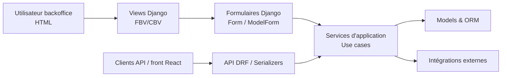

Voici le **Guide n°7 – Formulaires & validation – Gardel 2025**.

---

# 1. Rôle des formulaires & de la validation dans Gardel

## 1.1. Position dans l’architecture

On se replace dans l’architecture en couches déjà actée (Guides 1, 2, 3) :



Rôles :

- **Formulaires Django** = couche de **saisie / validation HTML** pour le backoffice.
- **Serializers DRF** = couche de validation pour l’API (guide n°6).
- **Modèles** = structure + contraintes DB + validation locale simple (guide n°2).
- **Services** = orchestration métier (règles complexes, ETL, intégrations)

L’objectif est de répartir clairement la validation entre ces couches (cf. §5).

## 1.2. Ce que les formulaires doivent faire (et ne pas faire)

Les formulaires Django fournissent : ([Django Project](https://docs.djangoproject.com/en/5.2/ref/forms/api/?utm_source=chatgpt.com))

- la **définition des champs** (types, widgets, labels),
- la **validation des données saisies** (formats, cohérence locale),
- la **normalisation** via `cleaned_data`.

Ils ne doivent pas :

- contenir de **logique métier lourde** (calcul de taxe complexe, appels ERP, ETL),
- gérer des **transactions complètes** ou des workflows multi-entités.

Ces aspects restent dans les **services d’application/domain**.

---

# 2. Organisation des formulaires dans le projet

## 2.1. Arborescence par app

Aligné avec l’architecture standard d’une app Gardel (Guides 1 et 3) :

```
apps/
  taxe_sejour/
    models/
    services/
    api/
    views/
    forms/
      __init__.py
      sejour_forms.py
      taxe_forms.py
      parametre_forms.py
    templates/
    tests/
      test_forms.py

```

Règles :

- **1 fichier = 1 contexte fonctionnel** (ex. `sejour_forms.py`, `taxe_forms.py`).
- `__init__.py` ré-exporte les formulaires publics de l’app.
- Formulaires transverses (si besoin) → `shared/forms/` (rare).

## 2.2. Types de formulaires utilisés

Django propose deux grandes familles : ([Django Project](https://docs.djangoproject.com/en/5.2/ref/forms/api/?utm_source=chatgpt.com))

- `forms.Form` :
    - DTO de saisie indépendant des modèles,
    - idéal pour des **use cases métier** ou des écrans qui ne mappent pas 1:1 à un modèle.
- `forms.ModelForm` :
    - formulaire directement lié à un `Model`,
    - idéal pour les CRUD simples (création/édition d’un `Sejour`, `Logement`, `TaxeSejour`, etc.). ([Django Project](https://docs.djangoproject.com/en/5.2/topics/forms/modelforms/?utm_source=chatgpt.com))

**Règle Gardel :**

- CRUD backoffice simple → **`ModelForm`**.
- Use case métier spécifique (import, recalcul, recherche avancée) → **`Form`** + appel de service.

---

# 3. Cycle de vie d’un formulaire Django

## 3.1. Instanciation, binding, validation

Selon la doc Django, un formulaire suit ce cycle : instanciation → binding des données → `is_valid()` → accès à `cleaned_data` ([Django Project](https://docs.djangoproject.com/en/5.2/ref/forms/api/?utm_source=chatgpt.com))

Exemple :

```python
from django import forms

class SejourForm(forms.ModelForm):
    class Meta:
        model = Sejour
        fields = ["logement", "date_debut", "date_fin", "montant_total"]

def creer_sejour_view(request):
    if request.method == "POST":
        form = SejourForm(request.POST)
        if form.is_valid():
            # On délègue au service (cf. §8)
            ...
    else:
        form = SejourForm()

    return render(request, "sejour/form.html", {"form": form})

```

Concepts :

- **Form non lié (unbound)** : `form = SejourForm()` → pas de data, typiquement en `GET`.
- **Form lié (bound)** : `form = SejourForm(request.POST)` → données à valider.
- `form.is_valid()` :
    - exécute la validation des champs,
    - exécute `clean_<field>()` puis `clean()` si présents,
    - remplit `form.cleaned_data` ou `form.errors`. ([Django Project](https://docs.djangoproject.com/en/5.2/ref/forms/api/?utm_source=chatgpt.com))

## 3.2. `ModelForm.save()` et interaction avec le modèle

Pour les `ModelForm`, `is_valid()` exécute aussi les validations du modèle pour les champs concernés (via `clean()` des champs + validations du `Model`) ([Django Project](https://docs.djangoproject.com/en/5.2/topics/forms/modelforms/?utm_source=chatgpt.com))

```python
if form.is_valid():
    instance = form.save(commit=False)
    # Ici : enrichir via un service ou compléter des champs
    instance.save()

```

Points importants :

- `commit=False` permet d’intégrer la création dans un use case (transaction globale, calcul de taxe, etc.).
- `ModelForm` n’appelle pas automatiquement `full_clean()` hors du pipeline normal de validation ; c’est `is_valid()` qui s’en charge pour les champs présents. ([Django Project](https://docs.djangoproject.com/en/5.2/topics/forms/modelforms/?utm_source=chatgpt.com))

---

# 4. Niveaux de validation & répartition (modèles, formulaires, services)

## 4.1. Niveaux possibles de validation

En combinant doc Django + guide Modèles ([Django Project](https://docs.djangoproject.com/en/5.2/ref/models/instances/?utm_source=chatgpt.com)) :

1. **Base de données** :
    - contraintes `NOT NULL`, `UNIQUE`, `CHECK`, `ForeignKey`, etc.
2. **Modèle** :
    - `clean_fields()` pour chaque champ,
    - `Model.clean()` pour la validation globale,
    - `Model.full_clean()` pour déclencher le tout.
3. **Formulaire** :
    - validation par champ (type, longueur, etc.),
    - `clean_<field>()` pour des règles spécifiques au champ,
    - `Form.clean()` pour les validations inter-champs.
4. **Service métier** :
    - règles complexes (règles de taxe, cohérence avec d’autres entités, appels externes),
    - décisions métier (droits, volumétrie, scénarios multi-entités).

## 4.2. Règle Gardel de répartition

On applique :

- **Modèle / DB** :
    - invariants de **cohérence structurelle** (format, null, unique, constraints simples),
    - ce qui doit être vrai pour **toutes** les entrées (HTML, API, ETL).
- **Formulaire** :
    - validation centrée sur la **saisie** (ex : champ obligatoire seulement dans ce formulaire, inter-dépendance de 2 champs dans cet écran).
- **Service** :
    - validation métier **globale** (ex : vérifier qu’un séjour ne chevauche pas une autre réservation dans ce logement, appliquer une règle fiscale par commune, vérifier les droits avancés).

Conséquence :

- Pas de grosse logique métier dans `clean()` du formulaire.
- Pas de workflows complets dans `Model.clean()`.
- Les services orchestrent les validations globales en s’appuyant sur les formulaires/modèles.

---

# 5. Validation dans les formulaires : patterns recommandés

## 5.1. Validation par champ : `clean_<fieldname>()`

D’après la doc, `clean_<fieldname>()` est appelée après la validation de base du champ, pour ajouter de la logique spécifique à ce champ. ([Django Project](https://docs.djangoproject.com/en/5.2/ref/forms/validation/?utm_source=chatgpt.com))

```python
from django import forms
from django.core.exceptions import ValidationError

class SejourForm(forms.ModelForm):
    class Meta:
        model = Sejour
        fields = ["date_debut", "date_fin", "montant_total"]

    def clean_montant_total(self):
        montant = self.cleaned_data["montant_total"]
        if montant <= 0:
            raise ValidationError("Le montant doit être strictement positif.")
        return montant

```

Usage :

- Règles simples, localisées.
- Erreurs liées explicitement au champ (affichage UX plus clair).

## 5.2. Validation globale : `Form.clean()`

`Form.clean()` est utilisée pour les règles impliquant **plusieurs champs** (ex : `date_fin >= date_debut`). ([Django Project](https://docs.djangoproject.com/en/5.2/ref/forms/api/?utm_source=chatgpt.com))

```python
def clean(self):
    cleaned_data = super().clean()
    debut = cleaned_data.get("date_debut")
    fin = cleaned_data.get("date_fin")

    if debut and fin and fin < debut:
        raise ValidationError("La date de fin doit être postérieure ou égale à la date de début.")

    return cleaned_data  # facultatif mais explicite

```

Remarque : depuis Django 1.7, `clean()` n’a plus besoin de retourner `cleaned_data`, mais le faire reste lisible. ([Stack Overflow](https://stackoverflow.com/questions/46606284/returning-cleaned-data-when-overwriting-clean-method-in-django-model-forms?utm_source=chatgpt.com))

## 5.3. `non_field_errors()` et messages globaux

Les erreurs levées dans `clean()` sont attachées à **`NON_FIELD_ERRORS`**, affichables dans le template via `form.non_field_errors`.

Exemple dans le template :

```

  <div class="alert alert-danger">
    {{ form.non_field_errors }}
  </div>


```

---

# 6. Exemples Gardel – Formulaire de création de séjour + service

## 6.1. Formulaire

```python
# apps/sejour/forms/sejour_forms.py
from django import forms
from django.core.exceptions import ValidationError
from apps.sejour.models import Sejour

class SejourCreateForm(forms.ModelForm):
    class Meta:
        model = Sejour
        fields = ["logement", "date_debut", "date_fin", "montant_total"]

    def clean(self):
        cleaned_data = super().clean()
        debut = cleaned_data.get("date_debut")
        fin = cleaned_data.get("date_fin")

        if debut and fin and fin < debut:
            raise ValidationError("La date de fin doit être postérieure ou égale à la date de début.")
        return cleaned_data

```

Ici :

- on laisse les contraintes plus globales (overlaps, droits utilisateur, taxation) aux **services**.

## 6.2. Vue + service

```python
# apps/sejour/views/backoffice.py
from django.shortcuts import render, redirect
from apps.sejour.forms import SejourCreateForm
from apps.sejour.services.usecases.creer_sejour_et_taxe import creer_sejour_et_taxe

def sejour_create_view(request):
    if request.method == "POST":
        form = SejourCreateForm(request.POST)
        if form.is_valid():
            sejour = creer_sejour_et_taxe(
                payload=form.cleaned_data,
                user=request.user,
            )
            return redirect("sejour:detail", pk=sejour.pk)
    else:
        form = SejourCreateForm()

    return render(request, "sejour/sejour_form.html", {"form": form})

```

```python
# apps/sejour/services/usecases/creer_sejour_et_taxe.py
from django.db import transaction
from apps.sejour.models import Sejour
from apps.taxe_sejour.services.usecases.calculer_taxe_sejour import calculer_taxe_sejour

@transaction.atomic
def creer_sejour_et_taxe(payload, user):
    sejour = Sejour.objects.create(**payload)
    calculer_taxe_sejour(sejour_id=sejour.id, user=user)
    return sejour

```

Ce schéma respecte la séparation vue/formulaire/service décrite dans le guide Services.

---

# 7. Formsets & inline formsets (saisies multiples)

## 7.1. Formsets : plusieurs formulaires identiques sur une même page

Les formsets permettent de gérer un ensemble de formulaires homogènes (ex : plusieurs lignes de paramètres, plusieurs tarifs). ([Django Project](https://docs.djangoproject.com/en/5.2/topics/forms/formsets/?utm_source=chatgpt.com))

Principe :

```python
from django.forms import formset_factory

class LigneParamForm(forms.Form):
    code = forms.CharField(max_length=50)
    valeur = forms.DecimalField(max_digits=10, decimal_places=2)

LigneParamFormSet = formset_factory(LigneParamForm, extra=3, can_delete=True)

```

Dans la vue :

```python
def param_batch_view(request):
    if request.method == "POST":
        formset = LigneParamFormSet(request.POST)
        if formset.is_valid():
            for form in formset:
                if form.cleaned_data and not form.cleaned_data.get("DELETE"):
                    ...
    else:
        formset = LigneParamFormSet()

    return render(request, "param/formset.html", {"formset": formset})

```

La doc Django détaille `formset_factory`, `can_order`, `can_delete` et les règles de validation par formulaire + globale. ([Django Project](https://docs.djangoproject.com/en/5.2/topics/forms/formsets/?utm_source=chatgpt.com))

## 7.2. Inline formsets pour relations parent/enfants

Pour des cas modèle → enfants (ex : `Sejour` + plusieurs lignes de taxe ou d’occupants), on utilise `inlineformset_factory` sur la base de `ModelFormSet`. ([Django Project](https://docs.djangoproject.com/en/5.2/ref/forms/models/?utm_source=chatgpt.com))

```python
from django.forms import inlineformset_factory
from apps.sejour.models import Sejour, Occupant

OccupantFormSet = inlineformset_factory(
    parent_model=Sejour,
    model=Occupant,
    fields=["nom", "age"],
    extra=1,
    can_delete=True,
)

```

Recommandation Gardel :

- utiliser les inline formsets **uniquement** pour les écrans où l’UX le justifie (création/modif de lots d’enfants liés à un parent),
- garder en tête la complexité de validation et de performance (nombre de formulaires, volume de données).

---

# 8. Sécurité des formulaires (CSRF, XSS, etc.)

## 8.1. Protection CSRF

Django active la protection CSRF via middleware et le tag `csrf_token` dans les formulaires POST. ([Django Project](https://docs.djangoproject.com/en/5.2/ref/csrf/?utm_source=chatgpt.com))

Template :

```
<form method="post">
  
  {{ form.as_p }}
  <button type="submit">Enregistrer</button>
</form>

```

Points clés :

- Ne **jamais** omettre `` dans les formulaires POST (HTML).
- Ne pas désactiver `CsrfViewMiddleware` sauf cas exceptionnels, et jamais pour des écrans backoffice critiques.

## 8.2. XSS & sortie des données

Par défaut, Django échappe le HTML dans les templates ; il ne faut pas désactiver cet échappement (`|safe`) sur des données non contrôlées. ([Django Project](https://docs.djangoproject.com/fr/4.2/topics/security/?utm_source=chatgpt.com))

Règles :

- pas de `|safe` sur les champs provenant de l’utilisateur sans sanitisation explicite,
- préférer du texte simple dans les formulaires backoffice,
- éviter d’accepter du HTML libre (ou alors passer par un pipeline de nettoyage spécifique).

---

# 9. Formulaires avancés : fichiers, widgets, UX

## 9.1. Upload de fichiers

Pattern :

```python
class ImportLaboForm(forms.Form):
    fichier = forms.FileField()

def import_labo_view(request):
    if request.method == "POST":
        form = ImportLaboForm(request.POST, request.FILES)
        if form.is_valid():
            fichier = form.cleaned_data["fichier"]
            # Déléguer à un service ETL
    else:
        form = ImportLaboForm()

    return render(request, "labo/import_form.html", {"form": form})

```

Rappels :

- Formulaire HTML : `enctype="multipart/form-data"`.
- `request.FILES` doit être passé au form.
- Traitement du fichier via service ETL (pas dans le formulaire)

## 9.2. Widgets & ergonomie

- Utiliser les **widgets Django** standards (Select, CheckboxSelectMultiple, etc.) selon besoin. ([Django Project](https://docs.djangoproject.com/en/5.2/ref/forms/api/?utm_source=chatgpt.com))
- Pour les champs complexes (autocomplétion, datepicker), la logique JS reste côté front (HTMX/React) mais le formulaire Django reste la **source de vérité** pour validation serveur.

---

# 10. Interaction formulaires ↔ DRF / React

Même si ce guide cible les formulaires HTML :

- les mêmes règles de validation se déclinent côté DRF via `Serializer` (déjà détaillés dans le guide 6) ([Django Forum](https://forum.djangoproject.com/t/fields-excluded-from-model-constraint-validation/37597?utm_source=chatgpt.com)) ;
- React consomme plutôt l’API JSON, mais il est possible de réutiliser des parts de validation dans des services ou des helpers communs (dates, montants, règles générales).

Stratégie Gardel :

- ne pas chercher à partager **directement** les formulaires Django avec React,
- mais garder les règles métier dans des services/domain réutilisables, et des contraintes de base dans les modèles.

---

# 11. Checklist “Formulaires & validation – Gardel”

À utiliser comme grille de review et règles pour agents IA/IDE.

## 11.1. Organisation & structure

- [ ] Chaque app possède un dossier `forms/` structuré par contexte (ex. `sejour_forms.py`, `taxe_forms.py`).
- [ ] `forms/` ne contient que la logique de formulaire (pas de services ni d’ETL).
- [ ] Les formulaires transverses sont éventuellement centralisés dans `shared/forms/` (au minimum).

## 11.2. Types de formulaires

- [ ] CRUD simple → `ModelForm`.
- [ ] Use case métier spécifique → `Form` + service d’application.
- [ ] Les `ModelForm` n’embarquent pas de logique métier lourde dans `save()`.

## 11.3. Validation

- [ ] Validation simple locale dans `clean_<field>()` et `clean()` (multi-champs). ([Django Project](https://docs.djangoproject.com/en/5.2/ref/forms/validation/?utm_source=chatgpt.com))
- [ ] Invariants structurels dans les modèles + contraintes DB (Guide n°2).
- [ ] Règles métier globales (taxe, droits, overlaps) dans les services, pas dans les formulaires.
- [ ] `form.is_valid()` toujours appelé avant utilisation de `cleaned_data`.

## 11.4. Sécurité & UX

- [ ] Tous les formulaires POST incluent ``. ([Django Project](https://docs.djangoproject.com/en/5.2/ref/csrf/?utm_source=chatgpt.com))
- [ ] Aucune donnée utilisateur n’est marquée `|safe` sans sanitisation.
- [ ] Messages d’erreur clairs et contextualisés (champ spécifique vs non-field errors).

## 11.5. Saisies multiples & fichiers

- [ ] Les formsets/inline formsets sont utilisés lorsqu’il faut gérer plusieurs objets sur une page, pas pour tous les CRUD. ([Django Project](https://docs.djangoproject.com/en/5.2/topics/forms/formsets/?utm_source=chatgpt.com))
- [ ] Les uploads de fichiers passent par des `FileField` dans les formulaires, et le traitement lourd est déporté dans des services ETL.

---

Si tu le souhaites, on peut poursuivre avec le **Guide n°8 – Settings & environnements**, ou bien te préparer directement une mini-checklist spécifique “review formulaire Gardel” à intégrer dans tes rules Cursor / agents.