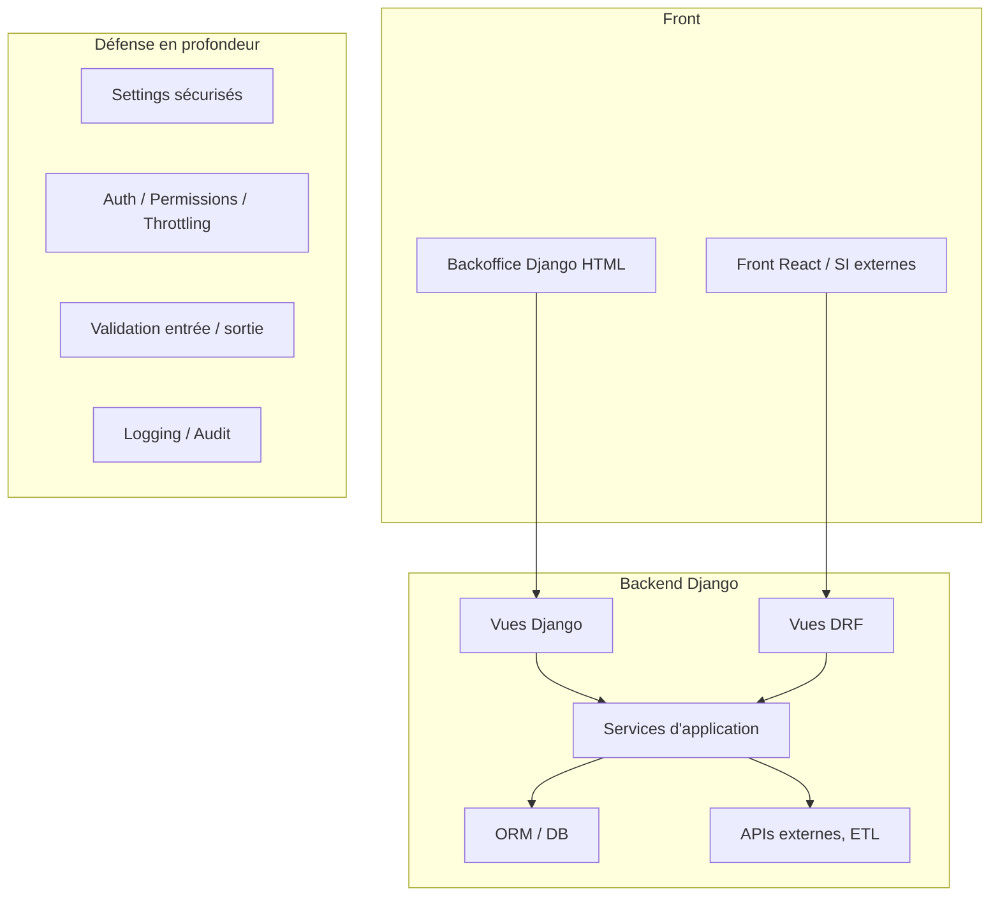

Voici le **Guide n°9 – Sécurité & conformité – Gardel 2025**.

Objectif : définir un cadre clair pour sécuriser l’application Django/DRF Gardel, conforme aux bonnes pratiques Django, à l’OWASP Top 10 et aux contraintes d’un SI industriel (laboratoire, production, taxe de séjour, etc.).

Le guide couvre à la fois :

- la **configuration** (settings, déploiement),
    
- la **protection applicative** (auth, permissions, CSRF, XSS, injections),
    
- la **gouvernance des droits**,
    
- la **conformité** (journalisation minimale, RGPD de base).
    

---

# 1. Référentiels & objectifs

## 1.1. Référentiels de sécurité

Références principales :

- Documentation Django – sécurité & checklist de déploiement ([Django Project](https://docs.djangoproject.com/en/5.2/howto/deployment/checklist/?utm_source=chatgpt.com "Deployment checklist"))
    
- Django REST Framework – authentication, permissions, throttling, CORS/CSRF ([django-rest-framework.org](https://www.django-rest-framework.org/api-guide/authentication/?utm_source=chatgpt.com "Authentication"))
    
- OWASP Top 10 (2021 et RC 2025) comme référentiel de risques web majeurs ([owasp.org](https://owasp.org/www-project-top-ten/?utm_source=chatgpt.com "OWASP Top Ten"))
    
- OWASP Django Security Cheat Sheet (bonnes pratiques spécifiques Django) ([cheatsheetseries.owasp.org](https://cheatsheetseries.owasp.org/cheatsheets/Django_Security_Cheat_Sheet.html?utm_source=chatgpt.com "Django Security - OWASP Cheat Sheet Series"))
    

## 1.2. Objectifs Gardel

Pour le projet Gardel :

- limiter les risques **A01: Broken Access Control, A02: Cryptographic Failures, A03: Injection, A05: Security Misconfiguration** de l’OWASP Top 10 ([cloudflare.com](https://www.cloudflare.com/learning/security/threats/owasp-top-10/?utm_source=chatgpt.com "What is OWASP? What is the OWASP Top 10?"))
    
- garantir :
    
    - la confidentialité des données labo / taxe / utilisateurs,
        
    - l’intégrité des calculs (taxe de séjour, bilans labo, etc.),
        
    - la traçabilité minimale des actions sensibles.
        

---

# 2. Niveaux de sécurité dans l’architecture Gardel

Vue simplifiée :



On applique une **défense en profondeur** :

1. **Settings & déploiement sûrs** (Guide 8 + checklist Django) ([Django Project](https://docs.djangoproject.com/en/5.2/howto/deployment/checklist/?utm_source=chatgpt.com "Deployment checklist"))
    
2. **Contrôle d’accès robuste** (auth + permissions DRF + policies métier).
    
3. **Protection des entrées** (CSRF, validation, prévention injection).
    
4. **Journalisation & détection** (logs, alertes).
    
5. **Processus** (revue de code, `check --deploy`, CI).
    

---

# 3. Configuration de sécurité (settings & déploiement)

## 3.1. Checklist Django `check --deploy`

Django fournit une commande intégrée :

```bash
python manage.py check --deploy
```

Elle vérifie un ensemble de réglages sensibles (DEBUG, ALLOWED_HOSTS, cookies secure, HSTS, etc.) ([Django Project](https://docs.djangoproject.com/en/5.2/howto/deployment/checklist/?utm_source=chatgpt.com "Deployment checklist"))

**Règle Gardel** :  
Cette commande doit être exécutée à chaque déploiement prod (pipeline CI/CD) avec les settings `config.settings.prod`.

## 3.2. Réglages critiques en prod

Paramètres à imposer dans `prod.py` (cf. Guide 8) ([Django Project](https://docs.djangoproject.com/en/5.2/howto/deployment/?utm_source=chatgpt.com "How to deploy Django")) :

- `DEBUG = False`
    
- `ALLOWED_HOSTS = [...]`
    
- `SECRET_KEY` chargé depuis une variable d’environnement robuste
    
- `SECURE_SSL_REDIRECT = True` (si HTTPS partout)
    
- `SESSION_COOKIE_SECURE = True`
    
- `CSRF_COOKIE_SECURE = True`
    
- `SECURE_HSTS_SECONDS > 0`, `SECURE_HSTS_INCLUDE_SUBDOMAINS`, `SECURE_HSTS_PRELOAD` si politique HSTS
    
- `SECURE_PROXY_SSL_HEADER` si proxy TLS (Nginx, Traefik, etc.)
    

Ces paramètres sont explicitement cités dans la documentation Django et les checklists de déploiement ([Django Project](https://docs.djangoproject.com/en/5.2/howto/deployment/checklist/?utm_source=chatgpt.com "Deployment checklist"))

---

# 4. Authentification & gestion des sessions

## 4.1. Auth Django (backoffice HTML)

Pour le backoffice :

- on utilise l’auth Django standard : `django.contrib.auth` ([Django Project](https://docs.djangoproject.com/en/5.2/topics/auth/?utm_source=chatgpt.com "User authentication in Django"))
    
- login/logout via les vues classiques ou des CBV dédiées,
    
- règles :
    
    - verrouillage progressif des tentatives de login (throttling, voir §6) ([Django Project](https://docs.djangoproject.com/en/5.2/topics/auth/?utm_source=chatgpt.com "User authentication in Django"))
        
    - mots de passe stockés avec les hashers par défaut de Django (PBKDF2, etc., évolutifs).
        

**Recommandations :**

- imposer une politique de mots de passe (longueur minimale, complexité raisonnable),
    
- éventuellement utiliser un outil externe (SSO, LDAP) si cela correspond au SI Gardel.
    

## 4.2. Auth pour l’API DRF

DRF fournit plusieurs schémas d’authentification ([django-rest-framework.org](https://www.django-rest-framework.org/api-guide/authentication/?utm_source=chatgpt.com "Authentication")) :

- **SessionAuthentication** : idéal pour API consommée par le backoffice / React derrière login Django,
    
- **Token / JWT** : pour accès par des systèmes tiers, apps externes.
    

Configuration typique (rappel guide 6) :

```python
REST_FRAMEWORK = {
    "DEFAULT_AUTHENTICATION_CLASSES": [
        "rest_framework.authentication.SessionAuthentication",
        # "rest_framework_simplejwt.authentication.JWTAuthentication",  # si besoin externe
    ],
    "DEFAULT_PERMISSION_CLASSES": [
        "rest_framework.permissions.IsAuthenticated",
    ],
}
```

**Règle Gardel :**

- par défaut, toute l’API est **authentifiée** (`IsAuthenticated`),
    
- les endpoints publics (s’il y en a) sont **exceptionnels**, explicitement documentés et fortement limités.
    

---

# 5. Autorisation & contrôle d’accès

## 5.1. Permissions DRF + policies métier

DRF distingue clairement **authentification**, **permissions** et **throttling** ([django-rest-framework.org](https://www.django-rest-framework.org/api-guide/permissions/?utm_source=chatgpt.com "Permissions"))

- Auth → qui est l’utilisateur ? (`request.user`)
    
- Permissions → a-t-il le droit de faire cette action ?
    
- Throttling → peut-il la faire **aussi souvent** ?
    

Stratégie Gardel :

1. Permissions **génériques** via DRF (`IsAuthenticated`, `IsAdminUser`, `IsAuthenticatedOrReadOnly`).
    
2. Permissions **métier** via des classes custom qui s’appuient sur les policies décrites au niveau domain (`apps.<app>.permissions`).
    

Exemple (rappel guide 6) :

```python
from rest_framework.permissions import BasePermission
from apps.taxe_sejour.permissions import can_voir_taxe

class CanVoirTaxePermission(BasePermission):
    def has_object_permission(self, request, view, obj):
        return can_voir_taxe(request.user, obj)
```

Puis :

```python
class TaxeSejourViewSet(ModelViewSet):
    permission_classes = [IsAuthenticated, CanVoirTaxePermission]
```

Cela permet de réduire le risque **A01: Broken Access Control** en centralisant les règles d’accès et en les appliquant partout de manière cohérente ([cloudflare.com](https://www.cloudflare.com/learning/security/threats/owasp-top-10/?utm_source=chatgpt.com "What is OWASP? What is the OWASP Top 10?"))

## 5.2. Rôles, groupes et périmètres métier

Pour Gardel, on recommande :

- usage des **Groupes Django** pour les grandes familles d’utilisateurs :
    
    - `ADMIN_SYSTEME`, `GESTIONNAIRE_LABO`, `GESTIONNAIRE_TAXE`, `LECTEUR_RAPPORTS`, etc.
        
- policies métier de type :
    

```python
def can_voir_sejour(user, sejour) -> bool:
    # Exemple : tous les gestionnaires de la commune + admins
    if user.is_superuser:
        return True
    return user.commune == sejour.commune and user.has_perm("sejour.view_sejour")
```

Ces fonctions sont réutilisées :

- côté vues Django,
    
- côté permissions DRF,
    
- dans les services métier (vérification defensive).
    

---

# 6. Throttling & limitation de débit

DRF fournit des mécanismes de throttling pour limiter le nombre de requêtes par utilisateur / par IP ([django-rest-framework.org](https://www.django-rest-framework.org/api-guide/throttling/?utm_source=chatgpt.com "Throttling"))

Exemple de configuration :

```python
REST_FRAMEWORK = {
    ...
    "DEFAULT_THROTTLE_CLASSES": [
        "rest_framework.throttling.AnonRateThrottle",
        "rest_framework.throttling.UserRateThrottle",
    ],
    "DEFAULT_THROTTLE_RATES": {
        "anon": "20/minute",
        "user": "1000/day",
    },
}
```

Cas d’usage Gardel :

- limiter les appels répétés aux endpoints sensibles (login, recalcul de taxe, exports volumineux),
    
- prévenir certains abus ou erreurs de scripts.
    

---

# 7. CSRF, CORS & protection des formulaires

## 7.1. CSRF (HTML, HTMX, front interne)

Django active par défaut la protection CSRF via `CsrfViewMiddleware` et le tag `` ([Django Project](https://docs.djangoproject.com/en/5.2/ref/csrf/?utm_source=chatgpt.com "Cross Site Request Forgery protection"))

Rappels :

- chaque formulaire POST HTML doit inclure ``,
    
- HTMX / AJAX doivent transmettre le token (par header ou champ caché) ; DRF documente comment inclure ce token dans les requêtes AJAX ([django-rest-framework.org](https://www.django-rest-framework.org/topics/ajax-csrf-cors/?utm_source=chatgpt.com "AJAX, CSRF & CORS"))
    

**Règle Gardel :**

- ne _jamais_ désactiver `CsrfViewMiddleware` globalement,
    
- utiliser les décorateurs `@csrf_exempt` uniquement en dernier recours, sur des endpoints très contrôlés (ex : webhooks externes), et encore, préférer une stratégie tokenisée propre.
    

## 7.2. CORS

Si certains endpoints API sont appelés depuis un **domaine différent** (front React dédié, SI tiers), CORS doit être configuré :

- via `django-cors-headers` par exemple (non détaillé ici),
    
- en restreignant strictement les origines autorisées (pas de `*` en prod).
    

---

# 8. Injections & validation des entrées

## 8.1. Injections SQL

Django ORM protège contre la plupart des injections SQL à condition :

- d’utiliser les APIs ORM normales (`filter()`, `get()`, `annotate()`),
    
- de ne pas concaténer soi-même des fragments SQL à partir d’entrées utilisateur ([Django Project](https://docs.djangoproject.com/fr/5.2/topics/security/?utm_source=chatgpt.com "La sécurité dans Django"))
    

Règles Gardel :

- bannir les `.raw()` / SQL bruts sauf cas extrêmement justifiés et revus,
    
- jamais de `extra()` obsolète + concat string,
    
- pour les filtres dynamiques : utiliser `Q()` et `**kwargs` plutôt que des concat de strings.
    

## 8.2. Injections dans templates & XSS

Django échappe par défaut les variables dans les templates ; le risque vient du mauvais usage de `|safe` ([Django Project](https://docs.djangoproject.com/fr/5.2/topics/security/?utm_source=chatgpt.com "La sécurité dans Django"))

- ne jamais marquer comme `|safe` une entrée utilisateur brute,
    
- si HTML libre nécessaire : passer par un processus de sanitisation (lib de nettoyage) et/ou stockage spécifique.
    

Pour React :

- éviter `dangerouslySetInnerHTML`,
    
- si vraiment nécessaire, appliquer une sanitisation côté JS.
    

---

# 9. Données sensibles, cryptographie & RGPD (niveau projet)

## 9.1. Données sensibles & chiffrement

OWASP Top 10 souligne les **cryptographic failures** comme risque majeur (exposition de données sensibles) ([cloudflare.com](https://www.cloudflare.com/learning/security/threats/owasp-top-10/?utm_source=chatgpt.com "What is OWASP? What is the OWASP Top 10?"))

Principes Gardel :

- ne stocker que les données strictement nécessaires (minimisation),
    
- éviter de stocker en clair :
    
    - identifiants externes sensibles,
        
    - clés API, tokens,
        
    - documents confidentiels,
        
- si besoin de chiffrement applicatif :
    
    - utiliser des libs éprouvées (Fernet, libs cryptographiques maintenues),
        
    - stocker la clé hors base, via l’infra (KMS/secret manager).
        

## 9.2. RGPD – minimum projet (non juridique)

Sans aller jusqu’à un audit juridique complet, on applique quelques principes :

- journaliser les **accès aux données sensibles** (lecture/édition de séjours, taxes),
    
- permettre, si nécessaire, l’**anonymisation** des données personnelles historiques (pseudonymisation des noms, e-mails),
    
- documenter :
    
    - quelles données sont collectées,
        
    - à quelles fins,
        
    - leur durée de conservation.
        

---

# 10. Logging, audit & détection

## 10.1. Logging applicatif

Django permet de configurer un logging structuré (handlers, formatters) ([Django Project](https://docs.djangoproject.com/en/5.2/howto/deployment/?utm_source=chatgpt.com "How to deploy Django"))

Recommandation Gardel :

- un logger `apps.security` pour les événements sensibles :
    
    - log de connexion (succès/échec),
        
    - modification de droits,
        
    - recalculs de taxe massifs,
        
    - exécutions ETL critiques.
        
- format JSON si possible, pour exploitation par une stack de logs (ELK, Loki, etc.).
    

## 10.2. Journalisation des actions

- conserver une trace minimale des actions clés (qui, quoi, quand, sur quel objet),
    
- pour les tables critiques (taxe, séjours, paramètres), utiliser éventuellement :
    
    - un système d’**audit trail** (historisation de changements),
        
    - ou un modèle d’“historique” dédié.
        

---

# 11. Gouvernance & bonnes pratiques de développement

## 11.1. Revue de code & pipeline

Avant mise en prod :

- revues de code ciblant :
    
    - permissions,
        
    - usages de `|safe`,
        
    - SQL brut,
        
    - endpoints publics,
        
- pipeline CI :
    
    - `pytest` (tests),
        
    - `python manage.py check --deploy`,
        
    - éventuellement scans SAST / dépendances vulnérables.
        

Les ressources Django / OWASP insistent sur l’importance de combiner protections techniques et bonnes pratiques de développement ([cheatsheetseries.owasp.org](https://cheatsheetseries.owasp.org/cheatsheets/Django_Security_Cheat_Sheet.html?utm_source=chatgpt.com "Django Security - OWASP Cheat Sheet Series"))

## 11.2. Gestion des dépendances

- maintenir Django, DRF et les libs à jour (éviter **Vulnerable and Outdated Components**, OWASP) ([cloudflare.com](https://www.cloudflare.com/learning/security/threats/owasp-top-10/?utm_source=chatgpt.com "What is OWASP? What is the OWASP Top 10?"))
    
- utiliser un `requirements.txt` ou `poetry.lock` versionné, avec dates de mise à jour.
    

---

# 12. Checklist “Sécurité & conformité – Gardel”

À utiliser en revue de code ou lors des jalons projet.

### 12.1. Configuration / déploiement

-  `DEBUG = False` en prod, `ALLOWED_HOSTS` correctement renseigné. ([Django Project](https://docs.djangoproject.com/en/5.2/howto/deployment/checklist/?utm_source=chatgpt.com "Deployment checklist"))
    
-  `SECRET_KEY` chargé depuis l’environnement, non versionné.
    
-  Cookies sécurisés (`SESSION_COOKIE_SECURE`, `CSRF_COOKIE_SECURE`).
    
-  HSTS et redirection HTTPS configurés.
    
-  `python manage.py check --deploy` intégré au pipeline.
    

### 12.2. Auth / permissions / throttling

-  Auth Django standard pour le backoffice, auth DRF configurée (`SessionAuthentication` et/ou JWT). ([django-rest-framework.org](https://www.django-rest-framework.org/api-guide/authentication/?utm_source=chatgpt.com "Authentication"))
    
-  `DEFAULT_PERMISSION_CLASSES = [IsAuthenticated]` par défaut.
    
-  Permissions métier centralisées dans `apps.<app>.permissions` et réutilisées côté DRF.
    
-  Throttling paramétré pour limiter les abus (`AnonRateThrottle`, `UserRateThrottle`). ([django-rest-framework.org](https://www.django-rest-framework.org/api-guide/throttling/?utm_source=chatgpt.com "Throttling"))
    

### 12.3. Entrées / CSRF / XSS / injection

-  Tous les formulaires HTML POST incluent ``. ([Django Project](https://docs.djangoproject.com/en/5.2/ref/csrf/?utm_source=chatgpt.com "Cross Site Request Forgery protection"))
    
-  Aucun `|safe` sur des données utilisateur non nettoyées.
    
-  Pas de SQL brut non justifié ; usage normal de l’ORM.
    

### 12.4. Données sensibles & conformité

-  Audit des données sensibles (quelles tables/champs ?).
    
-  Politique de conservation et anonymisation documentée.
    
-  Clés / secrets (API externes, etc.) stockés hors code (env / secrets manager).
    

### 12.5. Logging & audit

-  Logging structuré configuré (au moins pour erreurs & actions sensibles).
    
-  Journalisation minimale des actions critiques (modification droits, traitements de taxe, ETL majeurs).
    

---

Si tu veux, on peut enchaîner avec le **Guide n°10 – ETL, tâches planifiées & async**, en réutilisant ces règles de sécurité (droits, audit, robustesse) pour les jobs d’import/export et les flux de données.