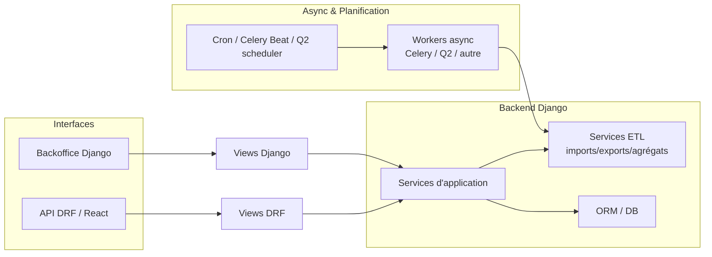

Voici le **Guide n°10 – ETL, tâches planifiées & async – Gardel 2025**.

Objectif : cadrer clairement la façon dont on gère :

- les **ETL** (imports, exports, agrégations),
- les **tâches planifiées** (jobs nocturnes, quotidiens, hebdomadaires),
- les **tâches asynchrones** (traitements lourds déclenchés depuis l’API / le backoffice),

dans le socle Django Gardel, de manière **robuste, industrialisable et sécurisée**.

---

# 1. Rôle de l’ETL & des tâches async dans Gardel

## 1.1. Typologie des tâches

Dans Gardel, on anticipe au moins les catégories suivantes :

1. **ETL batch**
    - Imports périodiques des données labo / production (fichiers, autres BDD, API).
    - Agrégations journalières (indicateurs, KPI, préparation DataMart).
    - Exports vers d’autres systèmes (fisc, collectivités, BI).
2. **Tâches planifiées métiers**
    - Envois récurrents de rapports par mail.
    - Recalculs planifiés (taxe, indicateurs qualité).
    - Nettoyage de données / archivage.
3. **Tâches asynchrones “à la demande”**
    - Traitement lourd déclenché depuis l’interface (upload fichier labo, recalcul massif).
    - Jobs déclenchés par l’API (DRF) et exécutés en tâche de fond.
4. **Utilitaires techniques**
    - Rebuild d’index, purge de logs, opérations d’administration.

## 1.2. Position dans l’architecture

Schéma logique :



Principes :

- les **ETL** restent des **services applicatifs** (mêmes règles que la couche services) ;
- les **tâches async** (queues) et **planifiées** (scheduler) ne font que **déclencher** ces services ;
- l’interface (HTML / API) ne bloque pas sur les traitements lourds.

---

# 2. Stratégies techniques possibles (vision 2025)

Les solutions les plus courantes aujourd’hui pour les tâches de fond avec Django :

- **Celery** (+ broker Redis/Rabbit) : file de tâches distribuée, robuste, scheduling avancé ([Next-Gen Django](https://nextgendjango.com/using-celery-with-django-for-background-tasks-a-practical-guide.html?utm_source=chatgpt.com))
- **django-q2** : file de tâches basée sur l’ORM, plus simple à déployer, scheduling intégré ([Django Q2](https://django-q2.readthedocs.io/en/master/tasks.html?utm_source=chatgpt.com))
- **Huey / RQ / autres** : queues légères, souvent suffisantes pour des charges moyennes ([Medium](https://medium.com/%40g.suryawanshi/lightweight-django-task-queues-in-2025-beyond-celery-74a95e0548ec?utm_source=chatgpt.com))
- **Cron + management commands** : pour quelques jobs simples, pilotés par le système ou Docker ([Django Project](https://docs.djangoproject.com/en/5.2/howto/custom-management-commands/?utm_source=chatgpt.com))
- **Packages de scheduling** type `django-cron`, `django-crontab`, `django-apscheduler` pour orchestrer des appels périodiques ([PyPI](https://pypi.org/project/django-crontab/?utm_source=chatgpt.com))

Les comparatifs récents insistent sur :

- Celery pour **grosses charges** / besoins avancés,
- Django-Q2 / RQ / Huey pour projets moyens,
- Cron / APScheduler pour **quelques** jobs planifiés, sans architecture lourde. ([Reddit](https://www.reddit.com/r/django/comments/1ivu6ep/django_background_task_library_comparison/?utm_source=chatgpt.com))

---

# 3. Recommandation Gardel 2025

Compte tenu :

- du **contexte industriel** (labo, production, taxe, BI),
- de la **volumétrie** possible et des évolutions futures,
- de l’environnement Docker / CI déjà envisagé,

la recommandation structurante est la suivante :

1. **Standard principal** :
    - **Celery** comme moteur de tâches async,
    - **Redis** comme broker (pas la base de données Django), suivant les best practices ([Next-Gen Django](https://nextgendjango.com/using-celery-with-django-for-background-tasks-a-practical-guide.html?utm_source=chatgpt.com))
    - **django-celery-beat** pour les tâches périodiques configurables via la base et l’admin ([Celery Documentation](https://docs.celeryq.dev/en/main/userguide/periodic-tasks.html?utm_source=chatgpt.com))
2. **Fallback / cas simples** :
    - Pour **un ou deux jobs très simples**, possibilité d’utiliser des **management commands + cron** (système ou Docker) ([Django Project](https://docs.djangoproject.com/en/5.2/howto/custom-management-commands/?utm_source=chatgpt.com))
3. **Pas de mélange anarchique** :
    - éviter d’avoir 3 solutions de scheduling différentes,
    - tout ce qui est **ETL structurant** passe par Celery (async) + services ETL.

---

# 4. Organisation du code ETL dans le projet

## 4.1. Dossier et modules

Pour rester cohérent avec les guides précédents, on propose :

```
apps/
  labo/
    services/
      etl/
        __init__.py
        import_fichier.py
        consolider_resultats.py
        export_vers_bi.py
    tasks/
      __init__.py
      labo_etl_tasks.py
    management/
      commands/
        labo_import_daily.py
        labo_repair_job.py

  taxe_sejour/
    services/
      etl/
        calcul_daily.py
        export_collectivites.py
    tasks/
      taxe_etl_tasks.py
    management/
      commands/
        taxe_rebuild_aggregats.py

shared/
  services/
    etl/
      utils.py       # fonctions transverses, logs ETL, idempotence

```

Rôles :

- `services/etl/` : logique **métier** ETL (lecture source, mapping, upsert, contrôle).
- `tasks/` : **wrappers async** (Celery tasks) qui appellent les services.
- `management/commands/` : commandes pour exécution manuelle / cron (maintenance, ré-exécution, support).

## 4.2. Pattern d’un service ETL

Exemple simplifié :

```python
# apps/labo/services/etl/import_fichier.py
from pathlib import Path
from dataclasses import dataclass
from django.db import transaction

@dataclass
class ImportLaboResult:
  nb_lignes_lues: int
  nb_lignes_importees: int
  nb_erreurs: int

def importer_fichier_labo(path: Path, user=None) -> ImportLaboResult:
  # 1. Lire le fichier (CSV, XLSX, etc.)
  # 2. Valider / parser
  # 3. Upsert en base (transaction, idempotence)
  # 4. Loguer les erreurs / retours
  ...

```

Ce service **ne sait rien** de Celery ni de Cron : il est réutilisable depuis :

- une view (upload de fichier),
- une tâche Celery,
- une commande de management.

---

# 5. Tâches planifiées : Celery Beat & alternatives

## 5.1. Celery + django-celery-beat

`django-celery-beat` permet de stocker les tâches périodiques dans la base et de les gérer via l’admin Django ([Celery Documentation](https://docs.celeryq.dev/en/main/userguide/periodic-tasks.html?utm_source=chatgpt.com))

Workflow type :

1. Intégration Celery dans Django (ex. fichier `config/celery.py`) suivant la doc officielle ([Celery Documentation](https://docs.celeryq.dev/en/v5.3.4/django/first-steps-with-django.html?utm_source=chatgpt.com))
2. Ajout de `django_celery_beat` dans `INSTALLED_APPS`. ([Celery Documentation](https://docs.celeryq.dev/en/main/userguide/periodic-tasks.html?utm_source=chatgpt.com))
3. Lancement :
    - worker : `celery -A config worker -l info`,
    - beat : `celery -A config beat -l info`.

Exemple de tâche :

```python
# apps/labo/tasks/labo_etl_tasks.py
from celery import shared_task
from pathlib import Path
from .services.etl.import_fichier import importer_fichier_labo

@shared_task
def importer_labo_fichier_task(path_str: str, user_id: int | None = None):
    path = Path(path_str)
    # récupérer user si besoin
    result = importer_fichier_labo(path=path)
    return {
        "nb_lignes_lues": result.nb_lignes_lues,
        "nb_lignes_importees": result.nb_lignes_importees,
        "nb_erreurs": result.nb_erreurs,
    }

```

Configuration d’une tâche périodique :

- soit en code (via `app.conf.beat_schedule`),
- soit via l’admin `django-celery-beat` (PeriodicTask, IntervalSchedule, CrontabSchedule). ([Celery Documentation](https://docs.celeryq.dev/en/main/userguide/periodic-tasks.html?utm_source=chatgpt.com))

## 5.2. Cron + management commands (fallback)

Pour **quelques jobs simples** (ex. 1 export par nuit), on peut se contenter de :

1. Créer une commande Django (cf. doc officielle) ([Django Project](https://docs.djangoproject.com/en/5.2/howto/custom-management-commands/?utm_source=chatgpt.com))
2. L’appeler via **crontab** sur le serveur / dans le conteneur Docker ([Stack Overflow](https://stackoverflow.com/questions/19989549/how-can-i-run-a-django-management-command-by-cron-job?utm_source=chatgpt.com))

Commandes custom :

```python
# apps/labo/management/commands/labo_import_daily.py
from django.core.management.base import BaseCommand
from apps.labo.services.etl.import_fichier import importer_fichier_labo

class Command(BaseCommand):
    help = "Import labo quotidien"

    def handle(self, *args, **options):
        # déterminer la source du fichier du jour
        ...
        importer_fichier_labo(path)

```

Crontab (exemple) :

```bash
0 2 * * * cd /srv/gardel && /srv/gardel/venv/bin/python manage.py labo_import_daily --settings=config.settings.prod

```

---

# 6. Tâches asynchrones déclenchées depuis l’API / backoffice

## 6.1. Pattern général DRF / HTML → Celery

Pour un traitement lourd déclenché par l’API :

```python
# apps/taxe_sejour/api/viewsets.py
from rest_framework.response import Response
from rest_framework import status, viewsets
from .serializers import ImportTaxeInputSerializer
from apps.taxe_sejour.tasks.taxe_etl_tasks import import_taxe_async

class TaxeImportViewSet(viewsets.ViewSet):
    def create(self, request):
        serializer = ImportTaxeInputSerializer(data=request.data)
        serializer.is_valid(raise_exception=True)

        task = import_taxe_async.delay(
            source_url=serializer.validated_data["source_url"],
            user_id=request.user.id,
        )

        return Response({"task_id": task.id}, status=status.HTTP_202_ACCEPTED)

```

```python
# apps/taxe_sejour/tasks/taxe_etl_tasks.py
from celery import shared_task
from apps.taxe_sejour.services.etl.import_taxe import import_taxe

@shared_task
def import_taxe_async(source_url: str, user_id: int):
    return import_taxe(source_url=source_url, user_id=user_id)

```

Ce schéma suit les bonnes pratiques récentes Celery/Django (tâches minces, logique dans des services testables) ([Next-Gen Django](https://nextgendjango.com/using-celery-with-django-for-background-tasks-a-practical-guide.html?utm_source=chatgpt.com))

## 6.2. Gestion des résultats & monitoring

Selon le besoin :

- retourner simplement un `task_id` et laisser un endpoint `/api/tasks/{id}/` donner le statut,
- ou stocker les résultats dans une table dédiée (journal ETL, logs applicatifs).

Pour le monitoring, Celery propose Flower, mais on peut aussi brancher les logs dans une stack centralisée ([Next-Gen Django](https://nextgendjango.com/using-celery-with-django-for-background-tasks-a-practical-guide.html?utm_source=chatgpt.com))

---

# 7. Robustesse, fiabilité & idempotence

## 7.1. Fiabilité Celery

Bonnes pratiques Celery pour éviter les pertes de tâches :

- ne pas utiliser la base Django comme broker (Rabbit/Redis recommandé) ([denibertovic.com](https://denibertovic.com/posts/celery-best-practices/?utm_source=chatgpt.com))
- configurer `task_acks_late = True` (+ `worker_prefetch_multiplier = 1`) pour ne pas perdre une tâche en cas de crash en cours d’exécution ([vintasoftware.com](https://www.vintasoftware.com/blog/guide-django-celery-tasks?utm_source=chatgpt.com))
- utiliser les **retry** Celery pour les erreurs transitoires (réseau, API externe).

## 7.2. Idempotence des jobs ETL

Principe :

- un job ETL doit pouvoir être **rejoué** sans casser les données :
    - soit en ignorant les enregistrements déjà traités (clé naturelle, checksum),
    - soit en travaillant dans une table de staging puis en effectuant un “merge” maîtrisé.

Recommandations :

- utiliser des clés fonctionnelles + contraintes DB (`UNIQUE`) pour empêcher les doublons,
- loguer les exécutions (job_id, horodatage, statut, nb lignes) dans une table `JournalETL`.

---

# 8. Sécurité, permissions & audit pour l’ETL

Lien avec le **Guide n°9 – Sécurité & conformité** :

- les tâches ETL peuvent manipuler des données **sensibles** (labo, taxe, personnel),
- il faut contrôler **qui** peut déclencher quoi, et **tracer** les opérations.

Règles :

1. Endpoint d’API pour lancer un ETL :
    - protégé par `IsAuthenticated` + permission métier (ex. `CanLancerImportLabo`). ([Medium](https://medium.com/%40g.suryawanshi/lightweight-django-task-queues-in-2025-beyond-celery-74a95e0548ec?utm_source=chatgpt.com))
2. Commandes de management :
    - non exposées publiquement ; exécutées seulement par des comptes système,
    - possibilité d’exiger un **flag de confirmation** (`-force`) pour les opérations destructrices.
3. Logging :
    - logger dans `apps.etl` toute exécution de job (qui, quoi, paramètres principaux, résultat),
    - associer, si possible, l’utilisateur déclencheur (backoffice/API) à l’exécution.

Ces approches sont cohérentes avec les recommandations OWASP (Journalisation & surveillance, contrôle d’accès) ([Next-Gen Django](https://nextgendjango.com/using-celery-with-django-for-background-tasks-a-practical-guide.html?utm_source=chatgpt.com))

---

# 9. Intégration Docker & orchestration

## 9.1. Services nécessaires

Stack typique (simplifiée) :

- `web` (Django),
- `worker` (Celery worker),
- `beat` (Celery beat),
- `redis` (broker),
- `db` (PostgreSQL).

Les articles récents montrent des exemples de combinaison Django + Celery + Redis + Docker cohérents avec ce modèle ([testdriven.io](https://testdriven.io/blog/django-celery-periodic-tasks/?utm_source=chatgpt.com))

## 9.2. Variables d’environnement

Paramètres à prévoir :

- `CELERY_BROKER_URL` (ex. `redis://redis:6379/0`),
- `CELERY_RESULT_BACKEND` (Redis ou DB selon le besoin de stocker les résultats),
- options de sécurité/perf Celery (prefetch, timeouts).

---

# 10. Checklist “ETL, tâches planifiées & async – Gardel”

À utiliser en revue de code et en cadrage.

### 10.1. Architecture & organisation

- [ ] Chaque domaine métier ayant des ETL possède un module `services/etl/`.
- [ ] Les tâches async (Celery) sont définies dans `tasks/` et appellent des services ETL “purs”.
- [ ] Les commandes de management ETL se trouvent dans `management/commands/` et utilisent aussi ces services. ([Django Project](https://docs.djangoproject.com/en/5.2/howto/custom-management-commands/?utm_source=chatgpt.com))

### 10.2. Choix technos

- [ ] Celery + Redis retenus comme standard pour les tâches async structurantes. ([Next-Gen Django](https://nextgendjango.com/using-celery-with-django-for-background-tasks-a-practical-guide.html?utm_source=chatgpt.com))
- [ ] `django-celery-beat` utilisé pour la planification récurrente si besoin d’admin graphique. ([Celery Documentation](https://docs.celeryq.dev/en/main/userguide/periodic-tasks.html?utm_source=chatgpt.com))
- [ ] Cron + management commands uniquement pour quelques jobs simples, documentés. ([Stack Overflow](https://stackoverflow.com/questions/19989549/how-can-i-run-a-django-management-command-by-cron-job?utm_source=chatgpt.com))

### 10.3. Robustesse & idempotence

- [ ] Les ETL sont idempotents (rejouables sans corruption).
- [ ] Les tâches Celery utilisent des options adaptées (retries, `acks_late` si nécessaire, timeouts). ([vintasoftware.com](https://www.vintasoftware.com/blog/guide-django-celery-tasks?utm_source=chatgpt.com))
- [ ] Les erreurs sont loguées (job, contexte, stack minimal).

### 10.4. Sécurité & gouvernance

- [ ] Les endpoints de lancement ETL sont protégés par des permissions spécifiques. ([Medium](https://medium.com/%40g.suryawanshi/lightweight-django-task-queues-in-2025-beyond-celery-74a95e0548ec?utm_source=chatgpt.com))
- [ ] Les commandes ETL sensibles exigent un flag explicite (`-force`) ou un double contrôle.
- [ ] Les exécutions ETL critiques sont journalisées (qui / quoi / quand / résultat). ([Reddit](https://www.reddit.com/r/django/comments/1db79jk/best_practice_for_background_jobs_using/?utm_source=chatgpt.com))

### 10.5. Intégration infra / CI

- [ ] Les services `worker` et `beat` sont définis dans la stack Docker / orchestrateur. ([testdriven.io](https://testdriven.io/blog/django-celery-periodic-tasks/?utm_source=chatgpt.com))
- [ ] La CI teste les services ETL (tests unitaires + tests d’intégration sur un jeu de données).
- [ ] La supervision (logs / métriques) permet de suivre les jobs ETL (succès / échecs / durées).

---

Si tu veux, on peut maintenant enchaîner sur le **Guide n°11 – Tests & qualité**, en intégrant explicitement :

- les tests sur les **services ETL**,
- les tests d’intégration sur les **tâches Celery** et les **commandes de management**,
- la stratégie globale de qualité (coverage, stratégie de non-régression, intégration CI).