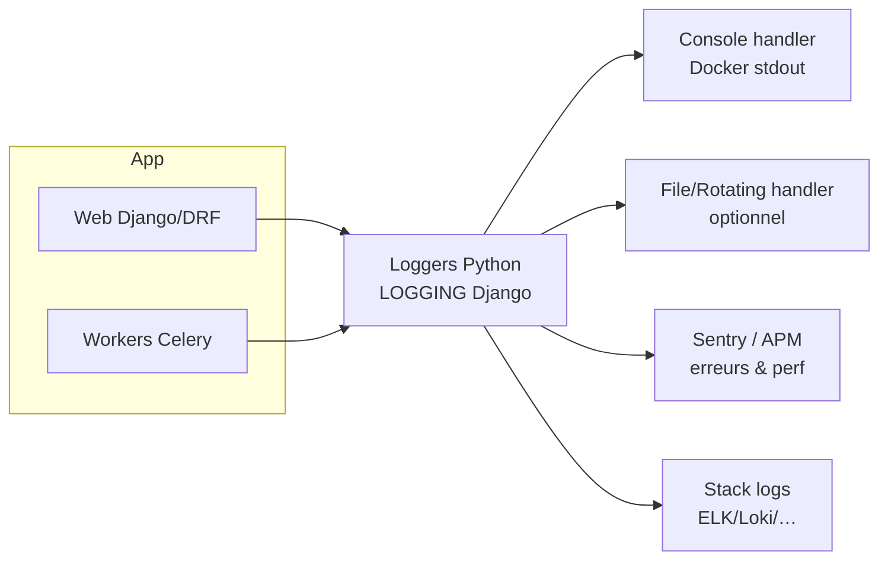

Voici le **Guide n°13 – Logging & observabilité – Gardel 2025**.

Objectif : définir comment **journaliser, tracer et superviser** l’application Django/DRF + Celery du projet Gardel, pour :

- comprendre ce qui se passe en prod (flux métier, ETL, erreurs),
- diagnostiquer rapidement les incidents,
- suivre la performance (cf. guide n°12),
- disposer d’une base solide pour la conformité (sécurité, RGPD, audit).

---

# 1. Principes & objectifs

## 1.1. Ce que recouvre “observabilité” dans Gardel

Dans le contexte Gardel, on vise au minimum :

1. **Logs structurés**
    - erreurs applicatives,
    - événements métier importants (imports, calculs de taxe, changements de paramètres),
    - actions sensibles (droits, accès à certaines données).
2. **Métriques techniques & métier**
    - temps de réponse par endpoint,
    - temps d’exécution des jobs ETL/Celery,
    - volumes traités (nombre de séjours, lignes labo, etc.).
3. **Traces corrélées** (facultatif au début, utile à terme)
    - capacité à suivre une requête / job de bout en bout.

La doc Django fournit une configuration logging basée sur le logger Python standard, avec support des handlers/formatters/filters configurables via `LOGGING` dans les settings.

## 1.2. Règles de base Gardel

- **Tout ce qui compte doit laisser une trace** lisible par un humain et exploitable par des outils (ELK/Loki/…).
- **Pas de logs bavards inutiles** en prod (DEBUG massif, dumps d’objets complets, etc.).
- **Jamais de données sensibles en clair** dans les logs (mot de passe, secrets, contenu de champs hautement sensibles).

---

# 2. Architecture de logging target

## 2.1. Niveaux de logs

On s’appuie sur les niveaux standard du logging Python (utilisés aussi par Django) :

- `DEBUG` : uniquement en dev, pour le diagnostic très fin.
- `INFO` : événements métier / techniques normaux (start ETL, fin ETL, appels externes clés).
- `WARNING` : anomalies non bloquantes (retry sur un service externe, valeur inattendue mais gérée).
- `ERROR` : erreurs bloquantes pour la requête/job courant.
- `CRITICAL` : situations critiques (corruption potentielle, indisponibilité majeure).

Django s’appuie nativement sur ce système via le module `logging` et la configuration `LOGGING` dans les settings.

## 2.2. Schéma global

Cible côté infra (à adapter à l’outillage choisi) :



---

# 3. Configuration `LOGGING` dans Django

## 3.1. Base minimale dans `base.py`

Django propose un schéma par défaut basé sur `dictConfig`; l’idée est de le spécialiser proprement dans `config/settings/components/logging.py` puis de l’importer dans `base.py`.

Exemple de base :

```python
# config/settings/components/logging.py
import os
from pathlib import Path

BASE_DIR = Path(__file__).resolve().parent.parent.parent

LOG_LEVEL = os.getenv("DJANGO_LOG_LEVEL", "INFO")

LOGGING = {
    "version": 1,
    "disable_existing_loggers": False,
    "formatters": {
        "verbose": {
            "format": "[{levelname}] {asctime} {name} ({lineno}) "
                      "request_id={request_id} "
                      "- {message}",
            "style": "{",
        },
        "simple": {
            "format": "[{levelname}] {message}",
            "style": "{",
        },
    },
    "filters": {
        "request_id": {
            "()": "config.logging.RequestIdFilter",
        },
    },
    "handlers": {
        "console": {
            "class": "logging.StreamHandler",
            "formatter": "verbose",
            "filters": ["request_id"],
        },
    },
    "root": {
        "handlers": ["console"],
        "level": LOG_LEVEL,
    },
    "loggers": {
        "django": {
            "handlers": ["console"],
            "level": LOG_LEVEL,
            "propagate": False,
        },
        "apps": {
            "handlers": ["console"],
            "level": LOG_LEVEL,
            "propagate": False,
        },
        "celery": {
            "handlers": ["console"],
            "level": LOG_LEVEL,
            "propagate": False,
        },
    },
}

```

Dans `base.py` :

```python
from .components.logging import LOGGING

```

Points clés :

- un handler console pour Docker (stdout),
- un format “verbose” incluant niveau, timestamp, logger, ligne et un `request_id`,
- des loggers dédiés : `django`, `apps` (réservé au code métier), `celery`.

## 3.2. Request ID & corrélation

L’idée d’un `request_id` est classique pour suivre une requête HTTP dans les logs. On peut :

- utiliser un middleware custom qui génère / récupère un identifiant pour chaque requête,
- l’injecter dans le `logging` via un filter.

Pseudo-exemple de filter :

```python
# config/logging.py
import logging

class RequestIdFilter(logging.Filter):
    def filter(self, record):
        # Récupération du request_id depuis un contexte thread-local / middleware
        from .request_context import get_request_id

        record.request_id = get_request_id() or "-"
        return True

```

Ce schéma est cohérent avec les patterns recommandés pour améliorer la traçabilité dans Django (corrélation des logs avec un identifiant de requête).

---

# 4. Loggers applicatifs par domaine

## 4.1. Convention de nommage

Recommandation Gardel :

- un logger par **contexte métier ou technique** :

```python
import logging

logger_etl_labo = logging.getLogger("apps.labo.etl")
logger_taxe = logging.getLogger("apps.taxe_sejour")
logger_security = logging.getLogger("apps.security")

```

Dans la config `LOGGING`, on peut raffiner :

```python
"loggers": {
    "apps.labo.etl": {
        "handlers": ["console"],
        "level": "INFO",
        "propagate": False,
    },
    "apps.taxe_sejour": {
        "handlers": ["console"],
        "level": "INFO",
        "propagate": False,
    },
    "apps.security": {
        "handlers": ["console"],
        "level": "WARNING",
        "propagate": False,
    },
    ...
}

```

## 4.2. Exemple ETL

```python
# apps/labo/services/etl/import_fichier.py
import logging
from dataclasses import dataclass

logger = logging.getLogger("apps.labo.etl")

@dataclass
class ImportLaboResult:
    nb_lignes_lues: int
    nb_lignes_importees: int
    nb_erreurs: int

def importer_fichier_labo(path, user=None) -> ImportLaboResult:
    logger.info("Import labo démarré", extra={"path": str(path), "user_id": getattr(user, "id", None)})

    # ... traitement ...
    result = ImportLaboResult(...)

    logger.info(
        "Import labo terminé",
        extra={
            "path": str(path),
            "nb_lignes_lues": result.nb_lignes_lues,
            "nb_lignes_importees": result.nb_lignes_importees,
            "nb_erreurs": result.nb_erreurs,
        },
    )

    return result

```

Même sans structlog, l’usage d’`extra` permet de structurer un minimum les infos.

---

# 5. Logs d’erreur & gestion des exceptions

## 5.1. Erreurs Django/DRF

Django utilise déjà le logging pour certains événements (erreurs 500, etc.). Pour DRF :

- les exceptions non prises en charge remontent vers la réponse HTTP,
- on peut personnaliser le handler d’exception pour loguer avec un logger spécifique.

Pattern :

```python
# config/drf_exception_handler.py
import logging
from rest_framework.views import exception_handler

logger = logging.getLogger("apps.api")

def custom_exception_handler(exc, context):
    response = exception_handler(exc, context)

    if response is None or response.status_code >= 500:
        logger.error(
            "Erreur API",
            extra={
                "view": context.get("view").__class__.__name__,
                "request_method": context.get("request").method,
                "path": context.get("request").path,
                "status_code": getattr(response, "status_code", None),
                "exception": exc.__class__.__name__,
            },
            exc_info=True,  # trace complète
        )

    return response

```

À déclarer dans les settings DRF :

```python
REST_FRAMEWORK = {
    "EXCEPTION_HANDLER": "config.drf_exception_handler.custom_exception_handler",
    ...
}

```

Ce type de handler est une bonne pratique pour uniformiser le logging des erreurs API dans DRF.

## 5.2. Erreurs Celery

Celery se base aussi sur le logging Python. On peut :

- configurer un logger `celery` dédié,
- s’assurer que les exceptions dans les tasks loguent bien `exc_info=True` pour garder le stack trace.

Exemple dans une task :

```python
# apps/taxe_sejour/tasks/taxe_etl_tasks.py
import logging
from celery import shared_task

logger = logging.getLogger("apps.taxe_sejour.etl")

@shared_task(bind=True, max_retries=3)
def import_taxe_async(self, source_url: str, user_id: int):
    try:
        ...
    except Exception as exc:
        logger.error(
            "Erreur import taxe",
            extra={"source_url": source_url, "user_id": user_id},
            exc_info=True,
        )
        raise self.retry(exc=exc, countdown=60)

```

---

# 6. Journaux métier & audit

## 6.1. Ce qu’il faut tracer

Pour Gardel, on identifie quelques événements métier clés à journaliser :

- exécutions ETL (début/fin, volume, résultat),
- calculs massifs (recalcul taxe pour une commune, un exercice),
- modifications de paramètres critiques (taux de taxe, référentiels, profils d’utilisateurs),
- actions admin sensibles (création/suppression d’utilisateurs, modification de droits).

Ces journaux peuvent être :

- uniquement dans les logs (niveau `INFO` + `extra` structuré),
- complétés par des tables d’audit dédiées (modèles) pour certaines entités critiques.

## 6.2. Table d’audit (optionnelle mais recommandée pour certains domaines)

Exemple simple :

```python
class JournalETL(models.Model):
    job_name = models.CharField(max_length=100)
    started_at = models.DateTimeField(auto_now_add=True)
    finished_at = models.DateTimeField(null=True, blank=True)
    status = models.CharField(max_length=20)  # SUCCESS / FAILURE / PARTIAL
    nb_lignes = models.IntegerField(default=0)
    user = models.ForeignKey(settings.AUTH_USER_MODEL, null=True, on_delete=models.SET_NULL)
    message = models.TextField(blank=True)

```

Les services ETL :

- créent une entrée au démarrage,
- la mettent à jour en fin de job avec les infos pertinentes.

---

# 7. Systèmes externes : Sentry & APM

## 7.1. Sentry (ou équivalent) pour le suivi des erreurs

En 2025, Sentry reste une solution très répandue pour capter les erreurs Django/DRF/Celery, avec intégration directe via SDK Python.

Intérêt :

- centralisation des stack traces,
- regroupement des erreurs (issue grouping),
- contexte automatique (user, request, tags),
- intégration Celery.

Usage recommandé :

- coupler les logs applicatifs classiques (console, ELK) avec une solution type Sentry pour les erreurs,
- ne pas remplacer entièrement le logging par Sentry (ce sont des outils complémentaires).

## 7.2. APM / traces distribuées

Optionnel au lancement, mais intéressant à moyen terme :

- utiliser un APM (Application Performance Monitoring) qui supporte Django / Celery (New Relic, Datadog, Sentry Performance, OpenTelemetry, etc.),
- tracer :
    - les requêtes HTTP,
    - les jobs Celery,
    - les requêtes DB lourdes.

OpenTelemetry est devenu un standard pour instrumenter les apps (dont Django) et envoyer les traces/métriques/logs à différents backends.

---

# 8. Métriques & dashboards

## 8.1. Métriques techniques

Cibles minimales :

- **Web** :
    - temps de réponse moyen / p95 / p99 par endpoint,
    - taux d’erreurs (4xx/5xx),
    - nombre de requêtes par minute.
- **DB** :
    - latence moyenne,
    - top requêtes lentes,
    - taux d’utilisation CPU/IO.
- **Celery** :
    - temps d’exécution moyen par type de tâche,
    - taux d’erreurs par type de tâche,
    - longueur des queues.

## 8.2. Métriques métier

Selon les besoins Gardel :

- nombre de séjours créés / jour,
- volumes labo traités par jour / semaine,
- montants de taxe calculés / déclarés.

Ces métriques peuvent être :

- calculées côté ETL (et stockées en tables d’agrégats),
- exportées vers un outil BI (Power BI, etc.),
- ou exposées via un endpoint interne supervisé.

---

# 9. Intégration Docker / infra

## 9.1. Logs dans Docker

Recommandation :

- écrire les logs applicatifs en **stdout/stderr** (handler console),
- laisser Docker / l’orchestrateur (Compose, Swarm, Kubernetes) rediriger vers :
    - fichiers sur le host,
    - système de logs centralisé (ELK, Loki, etc.).

Cela évite de gérer des fichiers de logs dans les containers.

## 9.2. Centralisation des logs

Stack type :

- Filebeat / Fluentd / Vector → envoient les logs vers :
    - Elasticsearch / OpenSearch + Kibana,
    - Loki + Grafana,
    - autre équivalent.

Les formats “verbose” ou JSON facilitent la recherche (filter par `request_id`, `logger`, `level`, etc.).

---

# 10. Checklist “Logging & observabilité – Gardel”

### 10.1. Configuration LOGGING

- [ ] Le dict `LOGGING` est défini dans un module dédié (`components/logging.py`) et importé dans `base.py`.
- [ ] Au moins un handler console est configuré avec un formatter riche (niveau, date, logger, request_id).
- [ ] Des loggers dédiés existent pour les domaines principaux (`apps.labo.etl`, `apps.taxe_sejour`, `apps.security`, `celery`, etc.).

### 10.2. Logs applicatifs

- [ ] Les services ETL loguent les débuts / fins de job, avec volumes traités et statut.
- [ ] Les erreurs API sont loguées via un handler DRF custom (vue, méthode, path, status).
- [ ] Les tâches Celery loguent les erreurs avec `exc_info=True`.

### 10.3. Audit & sécurité

- [ ] Les actions sensibles (modification de droits, paramètres de taxe, opérations massives) sont journalisées (logs +, si besoin, tables d’audit).
- [ ] Les logs ne contiennent pas de données sensibles (mots de passe, secrets, contenu intégral de documents).

### 10.4. Observabilité avancée

- [ ] Une solution d’error tracking (ex : Sentry) est branchée sur Django/DRF/Celery.
- [ ] Des métriques de base (latence, erreurs, jobs Celery) sont disponibles dans un dashboard.
- [ ] Un mécanisme de corrélation (request_id / trace_id) est en place dans le logging.

### 10.5. Docker / infra

- [ ] Les services écrivent leurs logs sur stdout/stderr ; l’infra les collecte.
- [ ] Un système de centralisation des logs (ELK, Loki, autre) est prévu ou en place.
- [ ] Les logs sont conservés suffisamment longtemps pour les besoins de debug et d’audit, selon la politique SI.

---

Si tu veux, on peut attaquer le **Guide n°14 – CI/CD & déploiement**, en capitalisant sur tout ce qui a été défini (tests, sécurité, ETL, logging) pour décrire un pipeline complet de build/test/deploy Docker pour Gardel.