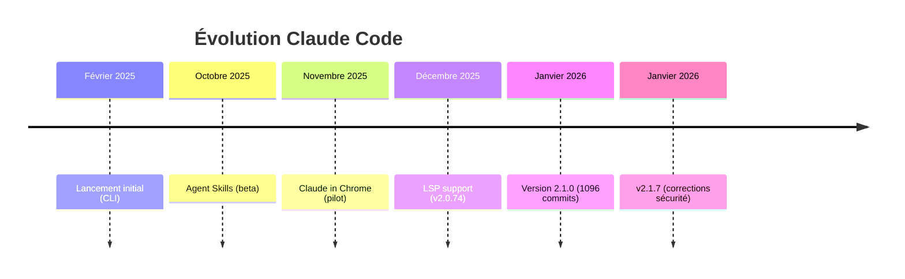
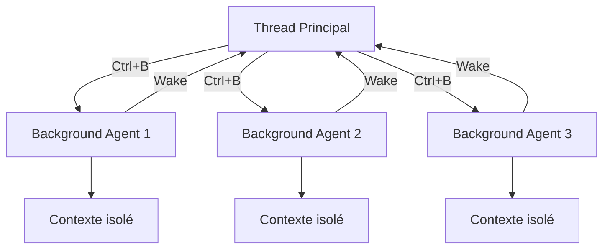

# 🔬 Étude : Claude Code 2.1 — Les Nouvelles Fonctionnalités

> **Niveau** : 4 (Approfondi) | **Date** : 2025-01-14 | **Sources** : 1 fournie + 15 web
> **Confiance globale** : ⭐⭐⭐⭐⭐ (5/5)

---

## 🎯 Synthèse Exécutive

Claude Code 2.1.0, sorti le 7 janvier 2026, représente la mise à jour la plus significative depuis le lancement de l'outil. Avec plus de **1 096 commits**, cette version transforme Claude Code d'un assistant de code "tour par tour" en un véritable **environnement de développement parallèle**.

**Points clés** :
- **Sous-agents asynchrones** : Exécution parallèle de tâches en arrière-plan avec `Ctrl+B`
- **Intégration Chrome** : Contrôle direct du navigateur pour tests et debugging
- **Support LSP** : Intelligence de code niveau IDE (go-to-definition, find references)
- **Fusion Skills/Slash Commands** : Hot-reload automatique et hooks intégrés
- **Téléportation de session** : Transfert de contexte entre terminal et web

**Verdict** : Cette mise à jour positionne Claude Code non plus comme un simple assistant, mais comme une **infrastructure de développement programmable**. Indispensable pour tout développeur utilisant l'outil.

---

## 📌 Contexte et Périmètre

### Pourquoi cette étude ?

Claude Code, lancé en février 2025 comme outil en ligne de commande, a connu une adoption croissante parmi les développeurs. La version 2.1 marque un tournant majeur en introduisant des capacités d'orchestration multi-agents et d'intégration système avancées.

### Questions auxquelles elle répond

- Quelles sont les nouvelles fonctionnalités majeures de la version 2.1 ?
- Comment ces changements impactent-ils les workflows de développement ?
- Quels sont les prérequis et configurations nécessaires ?
- Quelles sont les implications pour les équipes et projets existants ?

### Délimitation

- **Inclus** : Fonctionnalités de la version 2.1.0 à 2.1.7, configurations, cas d'usage
- **Exclu** : Comparatifs avec Cursor/Copilot, pricing détaillé, tutoriels pas-à-pas

---

## 🔍 Méthodologie

### Sources fournies

| # | Type | Source | Fiabilité |
|---|------|--------|-----------|
| [1] | Transcription YouTube | "Cloud Code 2.1 : La Mise à Jour MASSIVE" — Para | ⭐⭐⭐⭐ |

### Recherches web effectuées

| Axe | Requêtes | Sources retenues |
|-----|----------|------------------|
| Release notes | "Claude Code 2.1 changelog" | GitHub, VentureBeat, Releasebot |
| Sous-agents async | "background tasks Ctrl+B" | docs.claude.ai, claudefa.st |
| Intégration Chrome | "browser control automation" | code.claude.com, DataCamp |
| Support LSP | "Language Server Protocol" | Medium, aifreeapi.com, GitHub |
| Skills & Hooks | "hot reload fusion" | paddo.dev, producttalk.org |

### Limites méthodologiques

- Documentation officielle encore incomplète sur certaines fonctionnalités LSP
- Retours utilisateurs limités (fonctionnalités récentes)

---

## 📚 Corps de l'étude

### 1. Sous-agents Asynchrones — Le Parallélisme Natif

#### 1.1 État des lieux

Avant la version 2.1, Claude Code fonctionnait en mode "tour par tour" : une requête, une réponse, une attente. Les opérations longues (npm install, docker build, tests) bloquaient complètement le workflow [1][🌐1].

#### 1.2 Fonctionnement des Background Agents

Les sous-agents asynchrones permettent désormais d'exécuter des tâches en parallèle pendant que l'utilisateur continue à travailler [🌐2][🌐3].

**Activation** :
- **Raccourci clavier** : `Ctrl+B` pour backgrounder une tâche en cours
- **Frontmatter** : Ajouter `async: true` dans la configuration du skill
- **Prompt direct** : Demander à Claude de lancer une tâche en arrière-plan

**Architecture** :
```
Contexte principal (votre conversation)
    ├── Sous-agent 1 (background) → Recherche API
    ├── Sous-agent 2 (background) → Tests unitaires  
    └── Sous-agent 3 (background) → Build Docker
```

**Caractéristiques clés** [🌐2] :
- Chaque sous-agent dispose de son propre contexte isolé
- Les agents peuvent "réveiller" le thread principal quand ils ont besoin d'attention
- Les permissions du parent sont héritées (auto-deny si non pré-approuvées)
- Les outils MCP ne sont pas disponibles dans les sous-agents background

**Gestion** :
- `/tasks` : Voir tous les agents en cours avec leur ID et statut
- `/bashes` : Interface interactive pour gérer les shells background
- `CLAUDE_CODE_DISABLE_BACKGROUND_TASKS=1` : Désactiver la fonctionnalité [1]

#### 1.3 Cas d'usage pratiques

| Scénario | Configuration |
|----------|---------------|
| Serveur de dev | `npm run dev` → background automatique |
| Tests parallèles | Lancer 3 agents de test simultanément |
| Review + Code | Un agent code, un autre surveille les erreurs |
| Build + Documentation | Docker build pendant génération de docs |

#### 1.4 Points clés à retenir

- Le paradigme passe de "assistant" à "orchestrateur de travail délégué" [🌐4]
- Les sous-agents permettent une couverture plutôt qu'une exécution séquentielle
- La version 2.1 corrige les problèmes de débordement de contexte des versions précédentes

---

### 2. Intégration Chrome — Le Navigateur Contrôlé

#### 2.1 Architecture technique

L'intégration Chrome utilise l'extension "Claude in Chrome" qui communique avec Claude Code via l'API Native Messaging de Chrome [🌐5][🌐6].

**Prérequis** :
- Extension Chrome version 1.0.36 ou supérieure
- Claude Code version 2.0.73 ou supérieure
- Navigateur Chrome visible (pas de mode headless)

**Installation** :
```bash
# Vérifier la version
claude --version

# Activer l'intégration
claude --chrome
# ou dans une session : /chrome
```

#### 2.2 Capacités disponibles

| Fonctionnalité | Description |
|----------------|-------------|
| **Navigation** | Ouvrir des URLs, aller back/forward |
| **Interaction DOM** | Cliquer, remplir formulaires, sélectionner |
| **Console** | Lire les erreurs, logs, network requests |
| **Screenshots** | Capturer l'état de la page |
| **GIF Recording** | Enregistrer les interactions en GIF |

**Exemple de workflow** [🌐5] :
```
Utilisateur: "Vérifie si le formulaire de login affiche les erreurs correctement"

Claude:
1. Ouvre localhost:3000/login
2. Soumet le formulaire avec données invalides
3. Lit les erreurs console
4. Vérifie les messages d'erreur DOM
5. Rapporte les résultats
```

#### 2.3 Combinaison avec les sous-agents

La vraie puissance émerge de la combinaison avec les sous-agents asynchrones [1][🌐1] :

```
Agent principal → Code la fonctionnalité
    └── Sous-agent Chrome (background) → Surveille le comportement de l'app
        └── Notification au principal si erreur détectée
```

#### 2.4 Limitations et sécurité

- **Dialogs modaux** : Les alerts/confirms JavaScript bloquent les événements
- **CAPTCHA/Login** : Claude fait une pause et demande intervention manuelle
- **Risque d'injection de prompt** : Anthropic a implémenté des protections (23.6% de taux de succès d'attaque avant mitigations) [🌐7]

---

### 3. Support LSP — L'Intelligence de Code

#### 3.1 Qu'est-ce que LSP ?

Le Language Server Protocol, créé par Microsoft en 2016, standardise la communication entre outils de développement et serveurs de langage [🌐8]. C'est ce qui permet :
- Le hover avec signature de fonction
- Go to Definition
- Find All References
- Diagnostics en temps réel

#### 3.2 Intégration dans Claude Code

Introduit en version 2.0.74, le support LSP est devenu natif en 2.1 [🌐9][🌐10].

**Opérations disponibles** :

| Opération | Fonction |
|-----------|----------|
| `goToDefinition` | Sauter à la définition d'un symbole |
| `findReferences` | Trouver toutes les utilisations |
| `hover` | Afficher type et documentation |
| `documentSymbol` | Voir la structure du fichier |
| `getDiagnostics` | Erreurs et warnings en temps réel |

**Performance** : Navigation en ~50ms vs ~45 secondes avec recherche textuelle traditionnelle — soit une amélioration de **900x** [🌐8].

#### 3.3 Installation des plugins LSP

**Via marketplace** :
```bash
# Ajouter le marketplace
/plugin marketplace add claude-code-lsps

# Installer les plugins souhaités
/plugin install pyright@claude-code-lsps     # Python
/plugin install vtsls@claude-code-lsps       # TypeScript
/plugin install gopls@claude-code-lsps       # Go
/plugin install rust-analyzer@claude-code-lsps # Rust
```

**Langages supportés** (11) :
Python, TypeScript/JavaScript, Go, Rust, Java, C/C++, C#, PHP, Kotlin, Ruby, HTML/CSS [🌐8]

#### 3.4 Impact sur le workflow

Avant LSP, Claude effectuait essentiellement du "grep sophistiqué". Maintenant, il accède à la même compréhension sémantique que votre IDE [🌐11] :

> "Claude Code voit maintenant comme un architecte logiciel" — Dave Griffith [🌐11]

---

### 4. Fusion Skills/Slash Commands et Hot Reload

#### 4.1 Unification du modèle mental

Avant 2.1, les skills (invocation automatique par Claude) et slash commands (invocation explicite par l'utilisateur) étaient deux concepts séparés. Ils sont désormais **unifiés** [1][🌐12].

**Changements** :
- Les skills apparaissent automatiquement dans le menu des slash commands
- Hot-reload automatique : créer/modifier un skill → disponible immédiatement
- Option `user-invocable: false` pour masquer du menu slash

#### 4.2 Hot Reload des Skills

Plus besoin de redémarrer la session [1][🌐12] :

```bash
# Créer un skill
mkdir -p .claude/skills/mon-skill
cat > .claude/skills/mon-skill/SKILL.md << 'EOF'
---
name: mon-skill
description: Description pour invocation automatique
---
# Instructions du skill
EOF

# → Disponible immédiatement !
```

#### 4.3 Hooks dans le Frontmatter

Les hooks peuvent maintenant être définis directement dans les skills/commands [🌐13][🌐14] :

```yaml
---
name: secure-operations
description: Opérations avec vérifications de sécurité
hooks:
  PreToolUse:
    - matcher: "Bash"
      hooks:
        - type: command
          command: "./scripts/security-check.sh"
  PostToolUse:
    - matcher: "Edit|Write"
      hooks:
        - type: command
          command: "./scripts/run-linter.sh"
---
```

**Nouveautés hooks** :
- `once: true` : Exécuter une seule fois par session
- `type: prompt` : Évaluation LLM pour décisions contextuelles
- `updatedInput` avec décision "ask" : Le hook modifie l'input, consent toujours demandé

#### 4.4 Contexte Fork

Exécuter un skill dans un contexte isolé [🌐12] :

```yaml
---
name: experimentation
context: fork
---
```

Le contexte principal n'est pas pollué par l'exécution du skill.

---

### 5. Téléportation de Session

#### 5.1 Concept

Transférer son contexte de conversation entre différents environnements Claude [1][🌐1] :

| Direction | Commande | Usage |
|-----------|----------|-------|
| Terminal → Web | Préfixe `&` | Lancer une tâche async sur claude.ai |
| Web → Terminal | `/teleport` | Récupérer une session web en local |

#### 5.2 Fonctionnement

```bash
# Dans le terminal
/teleport

# Claude va automatiquement :
# 1. Vérifier que vous êtes dans le bon repository
# 2. Pull et checkout la branche de la session distante
# 3. Charger l'historique complet de la conversation
```

**Limitation** : La téléportation est unidirectionnelle — on peut pull du web vers terminal, pas l'inverse.

#### 5.3 Configuration environnement distant

```bash
/remote-env
```

---

### 6. Améliorations UX et Terminal

#### 6.1 Support Vim avancé

Nouveaux mouvements ajoutés [1][🌐15] :

| Commande | Action |
|----------|--------|
| `;` et `,` | Répéter f/F/t/T motions |
| `y` / `yy` / `Y` | Yank (copier) |
| `p` / `P` | Paste |
| `iw`, `aw`, `i"`, `a"`, etc. | Text objects |
| `>>` / `<<` | Indentation |
| `J` | Join lines |

#### 6.2 Support terminaux

- **Shift+Enter** fonctionne out-of-the-box pour : iTerm2, WezTerm, Ghostty, Kitty [🌐15]
- **Liens cliquables** dans les terminaux supportant OSC 8
- **Alt+T** pour toggle thinking (au lieu de Tab)

#### 6.3 Configuration langue

```bash
/config
# → Menu "Language" → Choisir la langue de réponse
```

#### 6.4 Autres améliorations

- **Slash command autocomplete** : Fonctionne même si `/` n'est pas au début de la ligne
- **Toggle stable/latest** : Choisir son canal de mise à jour dans `/config`
- **Ctrl+R** : Historique des prompts searchable
- **IS_DEMO / CLAUDE_CODE_HIDE_ACCOUNT_INFO** : Masquer email/org pour streaming

---

### 7. Sécurité et Corrections

#### 7.1 Corrections critiques

- **Vulnérabilité d'injection de commande** corrigée en v2.1.2 [1]
- **Fuite mémoire** : Les parsers sont maintenant correctement libérés
- **Fuite de données sensibles** : OAuth tokens, API keys, passwords ne peuvent plus apparaître dans les debug logs [🌐15]

#### 7.2 Permissions améliorées

- **Wildcards pour Bash** : `Bash(npm *)`, `Bash(* install)`, `Bash(git * main)` [🌐15]
- **Wildcards MCP** : `mcp__server__*` pour autoriser/refuser tous les outils d'un serveur
- **Enterprise managed settings** : Support administrateur pour contrôler les configurations

---

## ⚖️ Analyse Comparative

### Avant/Après 2.1

| Aspect | Avant 2.1 | Après 2.1 |
|--------|-----------|-----------|
| **Exécution** | Séquentielle, bloquante | Parallèle, async |
| **Skills** | Redémarrage requis | Hot-reload automatique |
| **Browser** | Manuel, séparé | Intégré, contrôlé |
| **Code Intel** | Grep textuel | LSP sémantique (900x plus rapide) |
| **Hooks** | Settings uniquement | Frontmatter skills/commands |
| **Plan mode** | Permission requise | Accès direct |

### Forces et Faiblesses

**Forces** :
- ✅ Véritable orchestration multi-agents
- ✅ Intégration browser révolutionnaire pour le debugging
- ✅ LSP transforme la navigation codebase
- ✅ Hot-reload élimine les frictions d'itération
- ✅ Hooks permettent des guardrails déterministes

**Faiblesses** :
- ❌ Pas de flag `--disable-skill` pour bloquer un skill par session
- ❌ Pas de logging d'invocation des skills
- ❌ Support Chrome limité (pas Arc, Brave, WSL)
- ❌ Documentation LSP encore incomplète

---

## 🔄 Chronologie / Évolution



---

## 💡 Insights et Recommandations

### Insights clés

1. **Changement de paradigme** : Claude Code passe d'assistant à framework d'orchestration. Le thread principal devient coordinateur, pas exécuteur [🌐4].

2. **Absorption des patterns communautaires** : Les fonctionnalités 2.1 (hooks frontmatter, skills/commands fusion) valident ce que la communauté demandait depuis des mois [🌐12].

3. **LSP comme game-changer silencieux** : Moins visible que Chrome, mais potentiellement plus impactant sur la qualité des suggestions quotidiennes.

### Recommandations actionnables

| Priorité | Recommandation | Justification |
|----------|----------------|---------------|
| 🔴 Haute | Mettre à jour vers v2.1.2+ minimum | Correction vulnérabilité sécurité |
| 🔴 Haute | Installer les plugins LSP pour vos langages | Amélioration 900x de la navigation code |
| 🟡 Moyenne | Configurer hooks dans vos skills existants | Guardrails déterministes > prompts |
| 🟡 Moyenne | Expérimenter avec Ctrl+B sur tâches longues | Débloquer les workflows parallèles |
| 🟢 Basse | Tester l'intégration Chrome | Utile pour projets web |

---

## ⚠️ Risques et Points d'Attention

- **Consommation tokens** : Chaque sous-agent background consomme son propre contexte
- **Chrome visible requis** : Pas de mode headless, peut interférer avec le travail
- **Injection prompt browser** : Risques de sécurité sur sites malveillants
- **LSP binaires** : Doivent être installés séparément sur le système

---

## ❓ Questions Ouvertes

- Comment gérer efficacement 5+ sous-agents simultanés sans perdre le fil ?
- Quand le support Chrome s'étendra-t-il à Arc, Brave et WSL ?
- Les hooks `type: prompt` sont-ils fiables pour des guardrails critiques ?

---

## 🔮 Perspectives et Tendances

### Évolutions prévisibles

- Extension du support LSP à plus de langages
- Mode headless pour Chrome
- Orchestration inter-sessions (plusieurs Claude Code coordonnés)

### Signaux faibles détectés

- Boris Cherny (créateur) partage ses workflows avancés sur Twitter [1]
- Communauté développe des plugins complémentaires (code-simplifier, cloud-mem, AutoCloud, RAL)
- Discussions sur "AGI" alimentées par les capacités de Claude Code [🌐1]

### Scénarios possibles

1. **Optimiste** : Claude Code devient le standard des environnements de développement AI-first
2. **Conservateur** : Adoption massive pour l'orchestration, IDE traditionnels pour l'édition fine

---

## 🔗 Sujets Connexes à Explorer

- **CLAUDE.md** : Configuration projet pour contexte persistant
- **Plugins marketplace** : Écosystème de plugins communautaires
- **MCP (Model Context Protocol)** : Intégration outils externes
- **Git Worktrees** : Isolation pour développement parallèle avec sous-agents

---

## 📖 Bibliographie Complète

### Sources primaires (fournies)

| # | Type | Source | Sections utilisées |
|---|------|--------|-------------------|
| [1] | Transcription YouTube | "Cloud Code 2.1 : La Mise à Jour MASSIVE" — Para | Toutes |

### Sources web (recherchées)

| # | URL | Titre | Date | Fiabilité |
|---|-----|-------|------|-----------|
| [🌐1] | venturebeat.com | "Claude Code 2.1.0 arrives with smoother workflows" | Jan 2026 | ⭐⭐⭐⭐ |
| [🌐2] | code.claude.com/docs | "Create custom subagents" | - | ⭐⭐⭐⭐⭐ |
| [🌐3] | claudefa.st | "Async Workflows - Agents" | Jan 2026 | ⭐⭐⭐⭐ |
| [🌐4] | zerotopete.com | "Christmas Came Early: Async Subagents" | Dec 2025 | ⭐⭐⭐⭐ |
| [🌐5] | code.claude.com/docs | "Use Claude Code with Chrome" | - | ⭐⭐⭐⭐⭐ |
| [🌐6] | kahunam.com | "Claude Code Chrome Extension Guide" | Jan 2026 | ⭐⭐⭐⭐ |
| [🌐7] | claude.com/blog | "Piloting Claude in Chrome" | Aug 2025 | ⭐⭐⭐⭐⭐ |
| [🌐8] | aifreeapi.com | "Claude Code LSP: Complete Setup Guide" | Jan 2026 | ⭐⭐⭐⭐ |
| [🌐9] | how2shout.com | "Claude Code v2.0.74 Adds LSP Support" | Dec 2025 | ⭐⭐⭐⭐ |
| [🌐10] | github.com/Piebald-AI | "claude-code-lsps marketplace" | - | ⭐⭐⭐⭐ |
| [🌐11] | davegriffith.substack.com | "Claude Code Sees Like A Software Architect" | Dec 2025 | ⭐⭐⭐⭐ |
| [🌐12] | paddo.dev | "Claude Code 2.1: The Pain Points? Fixed" | Jan 2026 | ⭐⭐⭐⭐ |
| [🌐13] | code.claude.com/docs | "Hooks reference" | - | ⭐⭐⭐⭐⭐ |
| [🌐14] | producttalk.org | "How to Use Claude Code: Slash Commands, Agents, Skills" | Jan 2026 | ⭐⭐⭐⭐ |
| [🌐15] | github.com/anthropics/claude-code | "CHANGELOG.md commit 870624f" | Jan 2026 | ⭐⭐⭐⭐⭐ |

### Sources non retenues (et pourquoi)

- medium.com (certains articles) — Paywalled, contenu dupliqué
- x.com/twitter — Fragments sans contexte complet

---

## 📊 Annexes

### A. Glossaire complet

| Terme | Définition |
|-------|------------|
| **LSP** | Language Server Protocol — protocole standardisé pour l'intelligence de code |
| **Hot Reload** | Rechargement automatique sans redémarrage de session |
| **Sous-agent** | Instance Claude déléguée pour une tâche spécifique |
| **Hook** | Script exécuté automatiquement à un événement précis |
| **Skill** | Capacité réutilisable invocable automatiquement par Claude |
| **Slash Command** | Commande invocable explicitement par l'utilisateur via `/` |
| **Frontmatter** | Métadonnées YAML en début de fichier |
| **MCP** | Model Context Protocol — protocole d'intégration d'outils externes |
| **Native Messaging** | API Chrome pour communication avec applications locales |

### B. Commandes essentielles

```bash
# Mise à jour
npm update -g @anthropic-ai/claude-code

# Vérification version
claude --version

# Activation Chrome
claude --chrome

# Configuration
/config

# Gestion sous-agents
/tasks
/bashes

# Téléportation
/teleport
/remote-env

# Plugins LSP
/plugin marketplace add claude-code-lsps
/plugin install pyright@claude-code-lsps
```

### C. Architecture sous-agents



---

## 🏷️ Métadonnées

| Champ | Valeur |
|-------|--------|
| Sujet | Claude Code 2.1 — Nouvelles fonctionnalités |
| Date | 2025-01-14 |
| Niveau | 4 (Approfondi) |
| Sources fournies | 1 |
| Recherches web | 5 axes |
| Sources web retenues | 15 |
| Mots | ~4 200 |
| Confiance globale | ⭐⭐⭐⭐⭐ |

---

*Généré par Resumator v3.0 — 2025-01-14*
