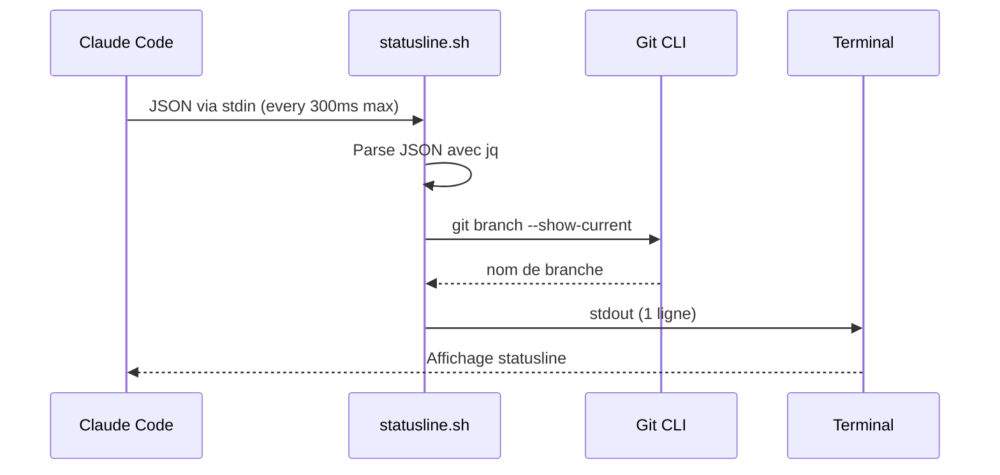

# 🔧 Documentation Technique : Claude Code Statusline

> **Version** : 1.0.85+ | **Dernière màj** : 2025-01-15
> **Statut** : Stable (feature officielle depuis décembre 2024)

---

## TL;DR

La statusline Claude Code permet d'afficher en temps réel des informations critiques en bas du terminal : modèle actif, branche Git, utilisation du contexte (avec progressbar), coût de session. Configuration via `~/.claude/settings.json` avec un script Bash/Python/Node.js qui reçoit les données en JSON via stdin.

---

## 📖 Sources

### Fournies
- [1] Transcription YouTube "Claude Code Status Line Dashboard" — Leon van Zyl
- [2] URL : https://code.claude.com/docs/en/statusline
- [3] URL : https://ccusage.com/guide/statusline

### Recherches web
- [🌐1] docs.anthropic.com — Documentation officielle statusline (context_window)
- [🌐2] github.com/sirmalloc/ccstatusline — ccstatusline TUI configurator
- [🌐3] github.com/chongdashu/cc-statusline — cc-statusline avec progress bars
- [🌐4] aihero.dev — "Creating The Perfect Claude Code Status Line"
- [🌐5] x.com/claudeai — Annonce officielle context_window (12 déc. 2024)
- [🌐6] github.com/hell0github/claude-statusline — Statusline avec ccusage intégré

---

## 🎯 Vue d'Ensemble

### Qu'est-ce que c'est ?

La statusline est une barre d'état personnalisable affichée en bas de l'interface Claude Code CLI. Elle fonctionne de manière similaire au PS1 des shells Unix (comme Oh-my-zsh) et permet d'afficher des informations contextuelles sur la session en cours [1][🌐1].

### À quoi ça sert ?

| Cas d'usage | Bénéfice |
|-------------|----------|
| **Monitoring du contexte** | Éviter le déclenchement automatique de `/compact` à 80% |
| **Gestion multi-projets** | Identifier rapidement la branche Git active |
| **Suivi des coûts** | Visualiser le coût de la session en temps réel |
| **Prévention d'erreurs** | Ne pas pusher sur la mauvaise branche [1] |

### Prérequis

| Prérequis | Obligatoire | Notes |
|-----------|-------------|-------|
| Claude Code CLI | ✅ | Version 1.0.80+ recommandée |
| `jq` | ✅ | Parsing JSON dans les scripts Bash |
| Terminal compatible ANSI | ✅ | Pour les couleurs |
| `ccusage` | ❌ | Optionnel, pour le suivi des coûts avancé |

**Installation de jq** [1] :
```bash
# macOS
brew install jq

# Ubuntu/Debian
sudo apt-get install jq

# Arch Linux
sudo pacman -S jq

# Windows (Chocolatey)
choco install jq
```

---

## 🚀 Quick Start

### Configuration minimale

Ajouter dans `~/.claude/settings.json` [2] :

```json
{
  "statusLine": {
    "type": "command",
    "command": "~/.claude/statusline.sh",
    "padding": 0
  }
}
```

### Premier script fonctionnel

Créer `~/.claude/statusline.sh` :

```bash
#!/bin/bash
# Statusline minimale avec les 4 éléments demandés
input=$(cat)

# 1. Modèle utilisé
MODEL=$(echo "$input" | jq -r '.model.display_name')

# 2. Branche Git
GIT_BRANCH=""
if git rev-parse --git-dir > /dev/null 2>&1; then
    BRANCH=$(git branch --show-current 2>/dev/null)
    [ -n "$BRANCH" ] && GIT_BRANCH="🌿 $BRANCH"
fi

# 3. Contexte (tokens utilisés / taille fenêtre)
CONTEXT_SIZE=$(echo "$input" | jq -r '.context_window.context_window_size // 200000')
USAGE=$(echo "$input" | jq '.context_window.current_usage')

if [ "$USAGE" != "null" ]; then
    CURRENT=$(echo "$USAGE" | jq '.input_tokens + .cache_creation_input_tokens + .cache_read_input_tokens')
    PERCENT=$((CURRENT * 100 / CONTEXT_SIZE))
    CONTEXT="🧠 ${PERCENT}%"
else
    CONTEXT="🧠 0%"
fi

# 4. Dossier projet
PROJECT=$(echo "$input" | jq -r '.workspace.current_dir' | xargs basename)

echo "🤖 $MODEL | $GIT_BRANCH | $CONTEXT | 📁 $PROJECT"
```

### Rendre exécutable et tester

```bash
chmod +x ~/.claude/statusline.sh

# Test manuel
echo '{"model":{"display_name":"Opus"},"workspace":{"current_dir":"/test"},"context_window":{"context_window_size":200000,"current_usage":{"input_tokens":25000,"cache_creation_input_tokens":0,"cache_read_input_tokens":0}}}' | ~/.claude/statusline.sh
```

**Résultat attendu** :
```
🤖 Opus | 🌿 main | 🧠 12% | 📁 test
```

---

## 🏗️ Architecture

### Flux de données



### Structure JSON d'entrée complète [🌐1]

```json
{
  "hook_event_name": "Status",
  "session_id": "abc123...",
  "transcript_path": "/path/to/transcript.json",
  "cwd": "/current/working/directory",
  "model": {
    "id": "claude-opus-4-1",
    "display_name": "Opus"
  },
  "workspace": {
    "current_dir": "/current/working/directory",
    "project_dir": "/original/project/directory"
  },
  "version": "1.0.80",
  "output_style": {
    "name": "default"
  },
  "cost": {
    "total_cost_usd": 0.01234,
    "total_duration_ms": 45000,
    "total_api_duration_ms": 2300,
    "total_lines_added": 156,
    "total_lines_removed": 23
  },
  "context_window": {
    "total_input_tokens": 15234,
    "total_output_tokens": 4521,
    "context_window_size": 200000,
    "current_usage": {
      "input_tokens": 8500,
      "output_tokens": 1200,
      "cache_creation_input_tokens": 5000,
      "cache_read_input_tokens": 2000
    }
  }
}
```

---

## 📊 Modèle de Données

### Propriétés disponibles

| Propriété | Type | Description | Exemple |
|-----------|------|-------------|---------|
| `model.id` | string | Identifiant technique du modèle | `claude-opus-4-1` |
| `model.display_name` | string | Nom d'affichage court | `Opus` |
| `workspace.current_dir` | string | Répertoire courant | `/home/user/project` |
| `workspace.project_dir` | string | Répertoire racine du projet | `/home/user/project` |
| `version` | string | Version Claude Code | `1.0.85` |
| `context_window.context_window_size` | int | Taille max du contexte | `200000` |
| `context_window.current_usage.input_tokens` | int | Tokens d'entrée actuels | `8500` |
| `context_window.current_usage.cache_read_input_tokens` | int | Tokens lus depuis le cache | `2000` |
| `context_window.current_usage.cache_creation_input_tokens` | int | Tokens de création de cache | `5000` |
| `cost.total_cost_usd` | float | Coût total de la session | `0.01234` |
| `cost.total_lines_added` | int | Lignes ajoutées | `156` |
| `cost.total_lines_removed` | int | Lignes supprimées | `23` |

### Calcul du pourcentage de contexte [🌐1]

```bash
# Formule correcte (inclut le cache)
CURRENT_TOKENS = input_tokens + cache_creation_input_tokens + cache_read_input_tokens
PERCENT = CURRENT_TOKENS * 100 / context_window_size
```

⚠️ **Attention** : Ne pas confondre `total_input_tokens` (cumulatif de toute la session) avec `current_usage.input_tokens` (état actuel de la fenêtre de contexte) [1][🌐1].

---

## ⚙️ Configuration Avancée

### Script complet avec progressbar

```bash
#!/bin/bash
# ~/.claude/statusline.sh — Version avancée avec progressbar
input=$(cat)

# === HELPERS ===
get_model() { echo "$input" | jq -r '.model.display_name // "Unknown"'; }
get_dir() { echo "$input" | jq -r '.workspace.current_dir' | xargs basename; }
get_cost() { echo "$input" | jq -r '.cost.total_cost_usd // 0'; }

get_git_branch() {
    if git rev-parse --git-dir > /dev/null 2>&1; then
        git branch --show-current 2>/dev/null || echo ""
    fi
}

# === PROGRESSBAR CONTEXTE ===
build_context_bar() {
    local size=$(echo "$input" | jq -r '.context_window.context_window_size // 200000')
    local usage=$(echo "$input" | jq '.context_window.current_usage')
    
    if [ "$usage" = "null" ]; then
        echo "0% [░░░░░░░░░░]"
        return
    fi
    
    local current=$(echo "$usage" | jq '.input_tokens + .cache_creation_input_tokens + .cache_read_input_tokens')
    local percent=$((current * 100 / size))
    local filled=$((percent / 10))
    local empty=$((10 - filled))
    
    # Construire la barre
    local bar=""
    for ((i=0; i<filled; i++)); do bar+="█"; done
    for ((i=0; i<empty; i++)); do bar+="░"; done
    
    # Couleur selon le niveau
    local color=""
    if [ $percent -lt 50 ]; then
        color="\033[32m"  # Vert
    elif [ $percent -lt 80 ]; then
        color="\033[33m"  # Jaune
    else
        color="\033[31m"  # Rouge
    fi
    
    echo -e "${color}${percent}% [${bar}]\033[0m"
}

# === TOKENS AFFICHAGE ===
format_tokens() {
    local usage=$(echo "$input" | jq '.context_window.current_usage')
    if [ "$usage" = "null" ]; then
        echo "0k/200k"
        return
    fi
    
    local current=$(echo "$usage" | jq '.input_tokens + .cache_creation_input_tokens + .cache_read_input_tokens')
    local size=$(echo "$input" | jq -r '.context_window.context_window_size // 200000')
    
    # Conversion en k
    local current_k=$((current / 1000))
    local size_k=$((size / 1000))
    
    echo "${current_k}k/${size_k}k"
}

# === ASSEMBLAGE ===
MODEL=$(get_model)
BRANCH=$(get_git_branch)
DIR=$(get_dir)
CONTEXT_BAR=$(build_context_bar)
TOKENS=$(format_tokens)
COST=$(get_cost)

# Formatage branche
[ -n "$BRANCH" ] && BRANCH="🌿 $BRANCH | " || BRANCH=""

# Formatage coût
COST_FMT=$(printf "💰 \$%.2f" "$COST")

echo -e "🤖 $MODEL | ${BRANCH}🧠 $CONTEXT_BAR $TOKENS | $COST_FMT | 📁 $DIR"
```

**Résultat** :
```
🤖 Opus | 🌿 main | 🧠 25% [██░░░░░░░░] 50k/200k | 💰 $0.12 | 📁 my-project
```

### Configuration avec ccusage (coûts avancés) [3]

```json
{
  "statusLine": {
    "type": "command",
    "command": "bun x ccusage statusline --visual-burn-rate emoji",
    "padding": 0
  }
}
```

**Options ccusage** :

| Option | Description |
|--------|-------------|
| `--no-offline` | Récupère les prix en temps réel (API LiteLLM) |
| `--visual-burn-rate emoji` | Ajoute 🟢/⚠️/🚨 selon le burn rate |
| `--cost-source both` | Affiche coûts CC et ccusage côte à côte |
| `--context-low-threshold 60` | Seuil vert du contexte (défaut: 50%) |
| `--context-medium-threshold 90` | Seuil jaune du contexte (défaut: 80%) |

---

## 🐛 Troubleshooting

### Erreur : La statusline n'apparaît pas

**Causes possibles** :
1. Script non exécutable
2. Erreur de parsing JSON (jq manquant)
3. Chemin incorrect dans settings.json

**Solutions** :
```bash
# 1. Vérifier les permissions
chmod +x ~/.claude/statusline.sh

# 2. Vérifier jq
jq --version

# 3. Tester le script manuellement
echo '{}' | ~/.claude/statusline.sh
```

### Erreur : Pourcentage de contexte incorrect [1]

**Cause** : Utilisation de la mauvaise propriété JSON.

**Solution** : Utiliser `current_usage` (état actuel) et non `total_input_tokens` (cumulatif).

```bash
# ❌ INCORRECT
TOKENS=$(echo "$input" | jq '.context_window.total_input_tokens')

# ✅ CORRECT
TOKENS=$(echo "$input" | jq '.context_window.current_usage.input_tokens + .context_window.current_usage.cache_creation_input_tokens + .context_window.current_usage.cache_read_input_tokens')
```

### Erreur : Windows — Mauvais dossier utilisateur [1]

**Cause** : L'agent statusline peut mal détecter le dossier utilisateur Windows.

**Solution** : Spécifier manuellement le chemin correct (ex: `C:\Users\VOTRE_NOM\.claude\`).

### Debug : Écrire le JSON dans un fichier [1]

```bash
#!/bin/bash
input=$(cat)

# Écrire le JSON brut pour analyse
echo "$input" > /tmp/statusline_debug.json

# ... reste du script
```

---

## 💡 Bonnes Pratiques

### À faire ✅

| Pratique | Raison |
|----------|--------|
| Utiliser un fichier script séparé | Évite de polluer settings.json [1] |
| Inclure jq pour le parsing | Fiable et standardisé |
| Tester manuellement avant | Évite les erreurs silencieuses |
| Préciser l'OS au `/statusline` | L'agent adapte les commandes [1] |
| Surveiller le seuil de 80% | Auto-compact se déclenche à ce niveau |

### À éviter ❌

| Anti-pattern | Conséquence |
|--------------|-------------|
| Scripts trop longs (>100ms) | Ralentit l'interface |
| Requêtes réseau dans le script | Latence et timeouts |
| Confondre total_input_tokens et current_usage | Pourcentages faux |
| Ignorer les codes couleur ANSI | Statusline illisible |

---

## 🔗 Alternatives et Outils Communautaires

| Outil | Caractéristiques | Installation |
|-------|------------------|--------------|
| **ccstatusline** [🌐2] | TUI interactif, Powerline, themes | `npx @sirmalloc/ccstatusline` |
| **cc-statusline** [🌐3] | Progress bars, cost tracking, session timer | `npm i -g @chongdashu/cc-statusline` |
| **ccusage statusline** [3] | Burn rate, block timer, coûts précis | `bun x ccusage statusline` |
| **hell0github/claude-statusline** [🌐6] | Multi-layer progress bars, weekly tracking | curl + chmod |

### Exemple : Combiner ccstatusline + script custom [🌐4]

```bash
#!/bin/bash
# ~/.claude/statusline-wrapper.sh

# Output du script custom
CUSTOM_OUTPUT=$(cat | ~/.claude/statusline-custom.sh)

# Output de ccstatusline (contexte uniquement)
CC_OUTPUT=$(ccstatusline --widgets context --raw)

echo "$CUSTOM_OUTPUT | $CC_OUTPUT"
```

---

## ⚠️ Limitations et Quotas

| Limite | Valeur | Contournement |
|--------|--------|---------------|
| Fréquence de mise à jour | 300ms max | — (hardcodé) |
| Sortie | 1 ligne stdout | Utiliser des séparateurs |
| Taille context Sonnet 4.5 | 1M tokens (800k usable) | Suffix `[1m]` dans ccstatusline |
| Taille context autres modèles | 200k tokens (160k usable) | Auto-compact à 80% |

---

## 📚 Ressources

| Ressource | Lien |
|-----------|------|
| Documentation officielle | https://code.claude.com/docs/en/statusline |
| ccusage statusline | https://ccusage.com/guide/statusline |
| ccstatusline GitHub | https://github.com/sirmalloc/ccstatusline |
| cc-statusline GitHub | https://github.com/chongdashu/cc-statusline |
| Annonce officielle (X) | https://x.com/claudeai/status/1999209597035331739 |

---

## 📝 Glossaire

| Terme | Définition |
|-------|------------|
| **context_window** | Fenêtre de contexte = mémoire de travail de Claude |
| **current_usage** | Utilisation actuelle (instantanée) vs cumulative |
| **cache_read_input_tokens** | Tokens réutilisés depuis le cache (économie) |
| **burn rate** | Taux de consommation tokens/heure ou $/heure |
| **compact** | Commande `/compact` qui résume la conversation |

---

*Documentation générée par Resumator v3.0 — 2025-01-15*
