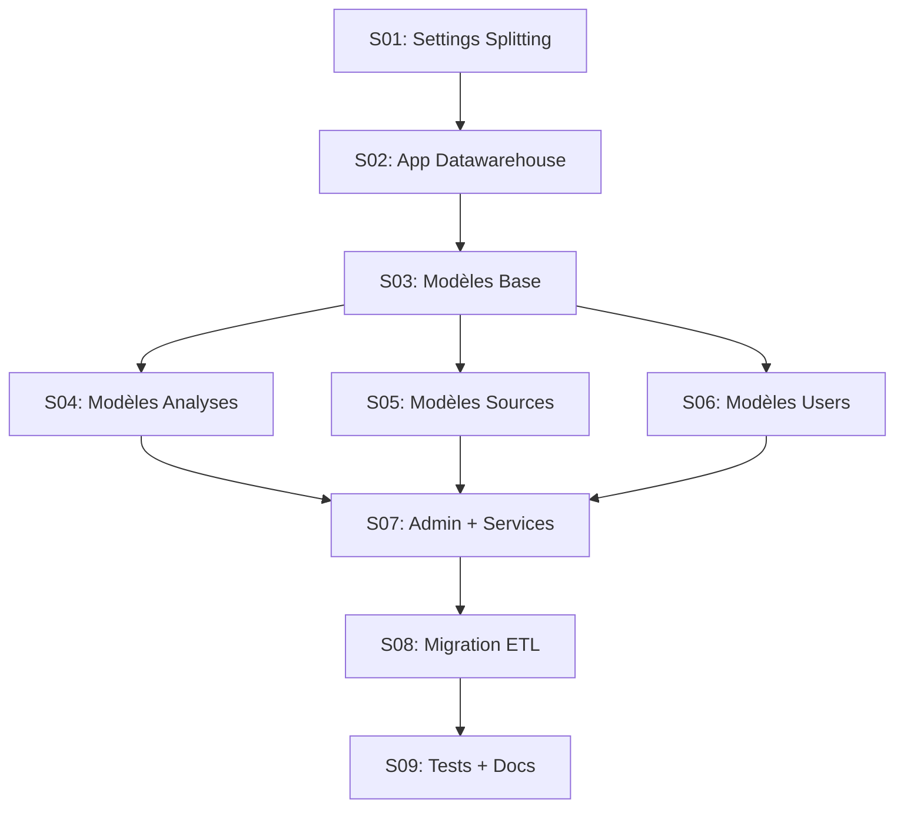
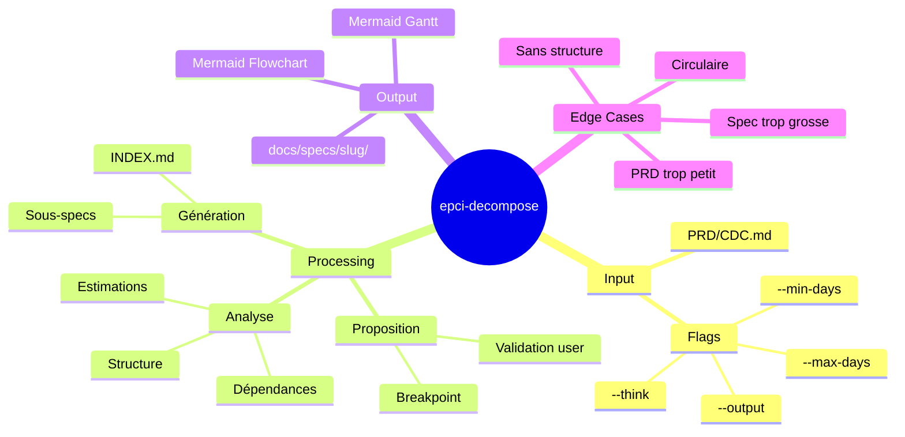

# 📋 Rapport de Synthèse — Feature `epci-decompose`

> **Projet**: EPCI Plugin - Nouvelle commande
> **Date**: 18 décembre 2025
> **EMS Final**: 88/100 🎯
> **Statut**: Prêt pour implémentation

---

## 1. Résumé Exécutif

### Problème

Les PRD/CDC complexes (ex: migration Gardel = 25 jours, 1738 lignes) sont impossibles à traiter en une seule session EPCI. L'utilisateur doit manuellement découper ces documents, identifier les dépendances et créer un plan d'exécution.

### Solution

Nouvelle commande `/epci-decompose` qui automatise :
- L'analyse structurelle d'un PRD complexe
- Le découpage en sous-cahiers des charges actionnables (1-5 jours chacun)
- La génération d'un graphe de dépendances
- La création d'un planning Gantt avec parallélisation

### Valeur Ajoutée

| Avant | Après |
|-------|-------|
| Découpage manuel, subjectif | Découpage assisté, validé |
| Dépendances implicites | Graphe explicite Mermaid |
| Planning séquentiel | Parallélisation identifiée |
| Risque d'oubli | Sous-specs exhaustives |

---

## 2. Spécification Fonctionnelle

### 2.1 Signature de Commande

```yaml
---
name: epci-decompose
description: Découpe un PRD/CDC complexe en sous-cahiers des charges actionnables
argument-hint: "<fichier.md> [--output <dossier>] [--think <level>]"
allowed-tools: [Read, Write, Bash(mkdir:*)]
---
```

### 2.2 Arguments & Flags

| Argument/Flag | Type | Requis | Défaut | Description |
|---------------|------|--------|--------|-------------|
| `<fichier.md>` | path | ✅ | — | PRD/CDC source à découper |
| `--output <dir>` | path | Non | `docs/specs/{slug}/` | Dossier de sortie |
| `--think <level>` | enum | Non | `think` | Niveau de réflexion (`quick`, `think`, `think-hard`, `ultrathink`) |
| `--min-days <n>` | int | Non | `1` | Effort minimum par sous-spec |
| `--max-days <n>` | int | Non | `5` | Effort maximum par sous-spec |

### 2.3 Exemples d'Usage

```bash
# Usage standard
/epci-decompose migration_architecture_gardel.md

# Analyse approfondie pour migration critique
/epci-decompose migration_architecture_gardel.md --think ultrathink

# Output personnalisé + granularité ajustée
/epci-decompose mon-prd.md --output specs/alpha/ --min-days 2 --max-days 4
```

---

## 3. Workflow Détaillé

### 3.1 Vue d'Ensemble

```
INPUT                    PROCESSING                         OUTPUT
─────                    ──────────                         ──────
                    ┌──────────────────┐
PRD/CDC.md    ───►  │ 1. Lecture       │
(complexe)          │ 2. Analyse       │              docs/specs/{slug}/
                    │ 3. Proposition   │    ───►      ├── INDEX.md
                    │ ⏸️ Validation     │              ├── S01-xxx.md
                    │ 4. Génération    │              ├── S02-xxx.md
                    └──────────────────┘              └── ...
```

### 3.2 Phase 1 — Lecture & Validation

**Actions :**
- Vérifier existence du fichier
- Vérifier extension `.md`
- Extraire titre/slug du document
- Compter lignes (indicateur complexité)

**Sortie immédiate si :**
- Fichier inexistant → Erreur
- Pas un `.md` → Erreur

### 3.3 Phase 2 — Analyse Structurelle

**Détection de structure :**

| Signal | Utilisation |
|--------|-------------|
| Headers `## Phase X` | Candidats découpage niveau 1 |
| Headers `### Étape X.Y` | Candidats sous-découpage |
| Tableaux "Effort" | Réutilisation estimations |
| Sections "Checklist" | Frontières de validation |
| Mentions "Gate", "Prérequis" | Dépendances explicites |

**Extraction des dépendances :**
- Mentions explicites : "dépend de", "nécessite", "après"
- FK Django : `ForeignKey('app.Model')` → le modèle doit exister
- Imports : `from X import Y` → Y doit exister

**Règles de granularité :**

| Effort bloc | Action |
|-------------|--------|
| < 1 jour | ⚠️ Fusionner avec adjacent |
| 1-5 jours | ✅ Granularité cible |
| > 5 jours | 🔴 Chercher sous-découpage |

### 3.4 Phase 3 — Proposition (avec Breakpoint)

**Affichage au breakpoint :**

```
┌─────────────────────────────────────────────────────────────────────┐
│ ⏸️  BREAKPOINT — VALIDATION DÉCOUPAGE                               │
├─────────────────────────────────────────────────────────────────────┤
│                                                                     │
│ 📊 ANALYSE DE: migration_architecture_gardel.md                     │
│ ├── Lignes: 1738                                                    │
│ ├── Effort total détecté: 25 jours                                  │
│ └── Structure: 5 phases, 12 étapes                                  │
│                                                                     │
│ 📋 DÉCOUPAGE PROPOSÉ: 9 sous-specs                                  │
│                                                                     │
│ | ID  | Nom                    | Effort | Dépendances |             │
│ |-----|------------------------|--------|-------------|             │
│ | S01 | Settings Splitting     | 1j     | —           |             │
│ | S02 | App Datawarehouse      | 1j     | S01         |             │
│ | S03 | Modèles Base           | 2j     | S02         |             │
│ | S04 | Modèles Analyses       | 2j     | S03         |             │
│ | S05 | Modèles Sources        | 2j     | S03         |             │
│ | S06 | Modèles Users          | 2j     | S03         |             │
│ | S07 | Admin + Services       | 3j     | S04,S05,S06 |             │
│ | S08 | Migration ETL          | 2j     | S07         |             │
│ | S09 | Tests + Docs           | 2j     | S08         |             │
│                                                                     │
│ ⚠️  ALERTES: Aucune                                                 │
│                                                                     │
│ Options: [Valider] [Modifier] [Annuler]                            │
└─────────────────────────────────────────────────────────────────────┘
```

**Option Modifier :**

```
Que souhaitez-vous modifier ?

[1] Fusionner des specs — Ex: "Fusionner S04 et S05"
[2] Découper une spec — Ex: "Découper S07 en 2"
[3] Renommer — Ex: "S03 → Modèles Fondamentaux"
[4] Changer dépendances — Ex: "S06 ne dépend plus de S03"
[5] Ajuster estimation — Ex: "S08 = 3 jours"

Votre choix (ou texte libre):
```

### 3.5 Phase 4 — Génération

**Structure de sortie :**

```
docs/specs/migration-gardel/
├── INDEX.md                          # Vue d'ensemble + Gantt
├── S01-settings-splitting.md
├── S02-app-datawarehouse.md
├── S03-modeles-base.md
├── S04-modeles-analyses.md
├── S05-modeles-sources.md
├── S06-modeles-users.md
├── S07-admin-services.md
├── S08-migration-etl.md
└── S09-tests-documentation.md
```

---

## 4. Formats de Sortie

### 4.1 INDEX.md

```markdown
# 📋 {Titre Projet} — Index

> **Généré le**: {date}
> **Source**: {fichier_source}
> **Sous-specs**: {count}
> **Effort total**: {total_jours} jours

---

## Vue d'Ensemble

| ID | Sous-Spec | Effort | Dépendances | Parallélisable |
|----|-----------|--------|-------------|----------------|
| S01 | Settings Splitting | 1j | — | Non |
| S02 | App Datawarehouse | 1j | S01 | Non |
| ... | ... | ... | ... | ... |

---

## Graphe de Dépendances



---

## Planning Gantt

```mermaid
gantt
    title {Titre Projet}
    dateFormat  YYYY-MM-DD
    
    section Fondations
    S01 Settings Splitting    :s01, {start_date}, 1d
    S02 App Datawarehouse     :s02, after s01, 1d
    
    section Modèles
    S03 Modèles Base          :s03, after s02, 2d
    S04 Modèles Analyses      :s04, after s03, 2d
    S05 Modèles Sources       :s05, after s03, 2d
    S06 Modèles Users         :s06, after s03, 2d
    
    section Services
    S07 Admin + Services      :s07, after s04 s05 s06, 3d
    
    section Finalisation
    S08 Migration ETL         :s08, after s07, 2d
    S09 Tests + Docs          :s09, after s08, 2d
```

---

## Progression

| Spec | Status | Commentaire |
|------|--------|-------------|
| S01 | ⬜ À faire | |
| S02 | ⬜ À faire | |
| ... | ... | |

---

## Utilisation

Pour lancer une sous-spec :
```bash
/epci-brief @docs/specs/{slug}/S01-xxx.md
```

---

*Généré par epci-decompose*
```

### 4.2 Sous-Spec (SXX-xxx.md)

```markdown
# Cahier des Charges — {ID}: {Titre}

> **Projet parent**: {slug}
> **Spec ID**: {ID}
> **Effort estimé**: {effort} jour(s)
> **Dépendances**: {deps_list}
> **Bloque**: {blocking_list}

---

## 1. Contexte

Cette sous-spec fait partie du projet **{titre_projet}**.

**Source**: `{fichier_source}` — {section_reference}

---

## 2. Périmètre

### Inclus

{liste_inclus}

### Exclus

{liste_exclus}

---

## 3. Tâches

{checklist_taches}

---

## 4. Critères d'Acceptation

| ID | Critère | Vérification |
|----|---------|--------------|
| {ID}-AC1 | {critere_1} | {verification_1} |
| {ID}-AC2 | {critere_2} | {verification_2} |
| ... | ... | ... |

---

## 5. Référence Source

> Extrait de `{fichier_source}`

{contenu_pertinent_condense}

---

*Généré par epci-decompose — Projet: {slug}*
```

---

## 5. Gestion des Edge Cases

### EC1 : PRD sans structure claire

**Détection** : Moins de 3 headers `##` ou absence de patterns "Phase/Étape".

**Comportement** :

```
⚠️  Structure insuffisante détectée

Le document n'a pas de structure claire (phases, étapes, sections).

Je propose d'abord une structuration:

## Structure Proposée

1. Phase Préparation (estimé: Xj)
   - ...

2. Phase Implémentation (estimé: Xj)
   - ...

3. Phase Validation (estimé: Xj)
   - ...

Options: [Valider cette structure] [Modifier] [Annuler]
```

### EC2 : PRD trop petit

**Détection** : Effort total estimé < 3 jours.

**Comportement** :

```
ℹ️  Ce document semble suffisamment simple pour une session EPCI unique.

Effort estimé: {X} jours
Recommandation: Utilisez directement /epci-brief

👉 /epci-brief @{fichier}
```

**Pas de découpage** — fin de commande.

### EC3 : Sous-spec trop grosse

**Détection** : Une sous-spec > `--max-days` (défaut 5j).

**Comportement** :

```
⚠️  ALERTE: Sous-spec {ID} trop volumineuse ({X} jours estimés)

Suggestion: Découper {ID} en sous-parties:
  • {ID}a: {titre_a} ({Xa}j)
  • {ID}b: {titre_b} ({Xb}j)

Options:
[1] Appliquer le sous-découpage
[2] Garder {ID} tel quel
[3] Définir manuellement
```

### EC4 : Dépendance circulaire

**Détection** : Cycle dans le graphe de dépendances.

**Comportement** :

```
🔴 ERREUR: Dépendance circulaire détectée

{SA} → {SB} → {SA}

Cela indique une erreur dans le document source.

Références dans le document:
  • Ligne {X}: "{citation_1}"
  • Ligne {Y}: "{citation_2}"

Options:
[1] Ignorer {SA}→{SB}
[2] Ignorer {SB}→{SA}
[3] Annuler — Corriger le document source
```

### EC5 : Estimations manquantes

**Détection** : Aucun pattern d'estimation trouvé.

**Comportement** :

```
ℹ️  Aucune estimation trouvée dans le document

J'utilise des estimations par défaut basées sur:
  • Nombre de lignes par section
  • Complexité détectée (modèles, services, tests)

Les estimations sont indicatives. Ajustez si nécessaire.
```

---

## 6. Critères de Succès

| ID | Critère | Vérification |
|----|---------|--------------|
| CS1 | Découpage cohérent | Chaque sous-spec = 1-5 jours |
| CS2 | Dépendances correctes | Graphe sans cycle, ordre logique |
| CS3 | Fichiers générés | INDEX.md + N sous-specs créés |
| CS4 | Compatible /epci-brief | Sous-specs utilisables directement |
| CS5 | Estimations préservées | Si présentes dans source, réutilisées |

---

## 7. Dépendances Techniques

### 7.1 Outils Requis

- `Read` : Lecture du fichier source
- `Write` : Création des fichiers de sortie
- `Bash(mkdir)` : Création du dossier de sortie

### 7.2 Intégrations EPCI

| Composant | Relation |
|-----------|----------|
| `/epci-brief` | Les sous-specs sont le input de brief |
| Feature Document | Format de sous-spec inspiré du FD |
| Project Memory | Non requis (commande autonome) |

---

## 8. Effort d'Implémentation Estimé

| Tâche | Effort |
|-------|--------|
| Parser de structure (headers, phases) | 4h |
| Détecteur de dépendances | 4h |
| Algorithme de découpage | 6h |
| Générateur INDEX.md | 3h |
| Générateur sous-specs | 4h |
| Gestion edge cases | 4h |
| Tests | 3h |
| Documentation | 2h |
| **Total** | **30h (4j)** |

---

## 9. Exemple Complet — Cas Gardel

### Input

```bash
/epci-decompose migration_architecture_gardel.md --think think-hard
```

### Output

```
docs/specs/migration-gardel/
├── INDEX.md
├── S01-settings-splitting.md      (1j)
├── S02-app-datawarehouse.md       (1j)
├── S03-modeles-base.md            (2j)
├── S04-modeles-analyses.md        (2j)
├── S05-modeles-sources.md         (2j)
├── S06-modeles-users.md           (2j)
├── S07-admin-services.md          (3j)
├── S08-migration-etl.md           (2j)
└── S09-tests-documentation.md     (2j)

Total: 17 jours (parallélisé) vs 25 jours (séquentiel)
```

### Utilisation Post-Génération

```bash
# Démarrer la première spec
/epci-brief @docs/specs/migration-gardel/S01-settings-splitting.md

# Une fois terminée, passer à la suivante
/epci-brief @docs/specs/migration-gardel/S02-app-datawarehouse.md

# etc.
```

---

## 10. Mindmap Récapitulatif



---

## 11. Décisions Clés

| Sujet | Décision | Justification |
|-------|----------|---------------|
| Granularité | 1-5 jours/spec | Aligné avec exemples F03-F08 |
| Format sortie | Markdown human-friendly | Utilisable avec `@` dans Claude |
| Dépendances | Tableau + Mermaid | Double vue : liste et graphique |
| Breakpoint | Obligatoire | L'humain valide avant génération |
| Parallélisation | Détectée automatiquement | Optimisation du planning |
| Intégration brief | Aucune | Commande autonome en amont |

---

*Rapport généré par Brainstormer v2.0.0 — EMS 88/100*
*Date: 18 décembre 2025*
