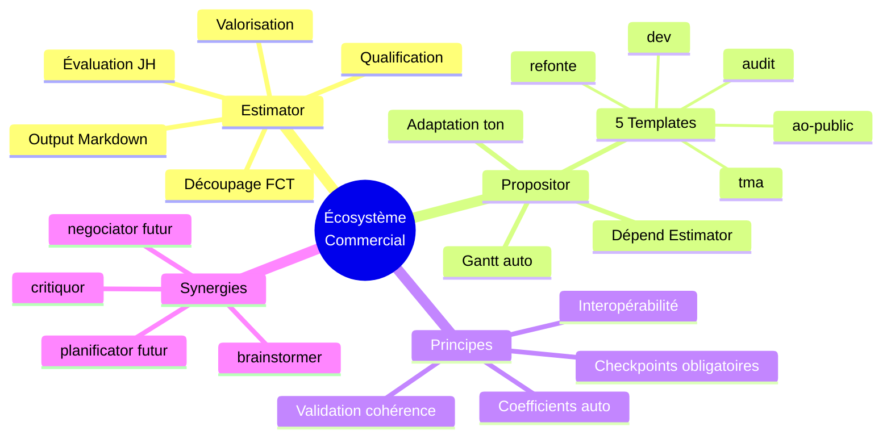

# Brainstorming — Écosystème Estimator/Propositor

> Généré le 2025-12-15 — 4 itérations — Template: project

---

## 1. Contexte et Objectif Initial

Conception de deux skills complémentaires pour le cycle commercial, scindés depuis l'ancien GPT "Brief Analyzer v8" : **Estimator** (chiffrage technique) et **Propositor** (proposition commerciale).

**Problème initial** : L'ancien GPT unifié mélangeait estimation et proposition, rendant difficile la réutilisation des chiffrages et l'adaptation fine aux différents types de clients.

**Périmètre** :
- **Inclus** : Workflow interactif, checkpoints, coefficients automatiques, 5 templates Propositor, synergies écosystème
- **Exclus** : Facturation, aspects juridiques, négociation (skill séparé)

**Critères de succès définis** :
1. ✅ Deux CDC complets, autoportants, prêts pour skill-factory
2. ✅ Frontière claire entre les deux skills (pas de chevauchement)
3. ✅ Interopérabilité native (output Estimator → input Propositor)
4. ✅ Adaptation aux cas d'usage réels (GMS, municipalités, industriels)

---

## 2. Synthèse Exécutive

La scission de Brief Analyzer v8 en deux skills distincts permet une **chaîne de valeur claire** : Brainstormer → Estimator → Propositor. Chaque skill est spécialisé et interactif, avec des checkpoints obligatoires pour garantir la qualité et l'implication de l'utilisateur.

**Insight clé** : L'interactivité avec checkpoints (vs génération one-shot) est le différenciateur majeur — elle permet des itérations et garantit que l'utilisateur valide chaque étape critique.

**Architecture retenue** :
- **Estimator** : 4 phases (Qualification → Découpage → Évaluation → Valorisation), output Markdown structuré avec balises
- **Propositor** : 4 phases (Qualification client → Structure → Rédaction → Finalisation), dépendance stricte à Estimator

---

## 3. Décisions et Orientations

| Décision | Justification | Impact | Confiance |
|----------|---------------|--------|-----------|
| Estimator avant Propositor dans le flux | Propositor consomme l'output Estimator | Dépendance unidirectionnelle claire | Élevée |
| Pas de mode standalone Propositor | Les deux skills sont intrinsèquement liés | Simplification, cohérence garantie | Élevée |
| Checkpoints obligatoires | Éviter les erreurs, impliquer l'utilisateur | Workflow plus long mais plus fiable | Élevée |
| Coefficients auto-détectés | Simplifier l'usage, override possible | UX améliorée | Élevée |
| 3 niveaux de granularité | Adapter au contexte projet | Flexibilité | Élevée |
| 5 templates Propositor | Couvrir tous les cas d'usage métier | Exhaustivité | Élevée |
| Format Markdown avec balises | Parsing fiable Estimator → Propositor | Interopérabilité | Élevée |
| Validation cohérence automatique | Détecter erreurs avant envoi client | Qualité garantie | Élevée |
| Versioning simple (écrasement) | Simplicité, pas de besoin d'historique | Maintenance simplifiée | Moyenne |
| Score complexité supprimé | Remplacé par auto-détection granularité | Simplification | Moyenne |

---

## 4. Architecture technique

### 4.1 Flux de données

```
┌─────────────────────────────────────────────────────────────────┐
│                      FLUX PRINCIPAL                              │
├─────────────────────────────────────────────────────────────────┤
│                                                                  │
│  INPUT                    ESTIMATOR                 PROPOSITOR   │
│  ─────                    ─────────                 ──────────   │
│                                                                  │
│  • brainstormer    ──►   Phase 1: Qualification                  │
│  • code-promptor   ──►   Phase 2: Découpage FCT    ──►  Phase 1  │
│  • resumator       ──►   Phase 3: Évaluation       ──►  Phase 2  │
│  • CDC client      ──►   Phase 4: Valorisation     ──►  Phase 3  │
│                               │                     ──►  Phase 4  │
│                               │                          │       │
│                               ▼                          ▼       │
│                          [Markdown]              [Proposition]   │
│                          structuré                commerciale    │
│                                                                  │
└─────────────────────────────────────────────────────────────────┘
```

### 4.2 Format d'échange

Balises standardisées pour parsing :
- `<!-- ESTIMATOR_DATA_START/END -->` : Tableaux de charge
- `<!-- ESTIMATOR_BUDGET_START/END -->` : Scénarios budgétaires

### 4.3 Stack technique préférentielle

| Domaine | Priorité 1 | Priorité 2 | Fallback |
|---------|------------|------------|----------|
| Backend | Symfony 7 | Django | Spring Boot |
| Frontend | React 18 | Vue 3 | Angular |
| BDD | PostgreSQL | MySQL | MongoDB |
| Infra | Docker | PaaS | VM |
| Mobile | React Native | Flutter | Natif |

---

## 5. Plan d'Action

| # | Action | Priorité | Effort | Timeline | Owner |
|---|--------|----------|--------|----------|-------|
| 1 | Développer Estimator via skill-factory | 🔴 Haute | 3-4 jours | S1 | Édouard |
| 2 | Développer Propositor via skill-factory | 🔴 Haute | 4-5 jours | S2 | Édouard |
| 3 | Tester chaîne complète Brainstormer → Estimator → Propositor | 🟡 Moyenne | 1 jour | S2 | Édouard |
| 4 | Créer fichier references.md template | 🟢 Basse | 0.5 jour | S3 | Édouard |
| 5 | Documenter les synergies dans l'écosystème | 🟢 Basse | 0.5 jour | S3 | Édouard |

### Quick Wins
1. **Commencer par Estimator** — Fondation pour tout le cycle commercial
2. **Réutiliser les formules de Brief Analyzer v8** — Gain de temps sur les calculs

### Investissements stratégiques
1. **Système de checkpoints** — Plus complexe mais garantit la qualité
2. **Validation cohérence automatique** — Évite les erreurs embarrassantes

---

## 6. Risques et Considérations

| Risque | Probabilité | Impact | Mitigation |
|--------|-------------|--------|------------|
| Workflow trop long avec checkpoints | Moyenne | Moyen | Flag `--quick` pour utilisateurs expérimentés |
| Parsing balises fragile | Faible | Élevé | Tests unitaires, format strict |
| Dépendance Estimator contraignante | Faible | Moyen | Assumé — c'est un choix de design |
| Templates insuffisants | Faible | Faible | Extensible, ajout futur possible |

### Hypothèses posées
- Le client ne fournit jamais de chiffrage interne (confirmé par Édouard)
- Le versioning simple suffit (pas besoin d'historique des versions)
- Les coefficients auto-détectés sont pertinents dans 80%+ des cas

---

## 7. Pistes non explorées

| Topic | Raison | Valeur potentielle | Prochaine étape |
|-------|--------|-------------------|-----------------|
| Mode collaboratif multi-utilisateurs | Hors scope actuel | Moyenne | À explorer si besoin équipe |
| Export PDF automatique | Dépend de l'infra | Moyenne | Via skill documentor |
| Intégration CRM | Complexité externe | Faible | Via MCP si besoin |
| Historique des estimations | Jugé non nécessaire | Faible | Reconsidérer si besoin |

---

## 8. Mindmap de synthèse



---

## 9. Vérification des critères de succès

| Critère | Statut | Évidence |
|---------|--------|----------|
| CDC complets et autoportants | ✅ Atteint | 2 documents ~3000 mots chacun |
| Frontière claire sans chevauchement | ✅ Atteint | Estimator = chiffrage, Propositor = rédaction |
| Interopérabilité native | ✅ Atteint | Format Markdown avec balises standardisées |
| Adaptation cas d'usage réels | ✅ Atteint | 5 templates, 6 types clients, coefficients métier |

**Évaluation globale** : Le brainstorming a atteint tous ses objectifs. Les deux CDC sont prêts pour skill-factory.

---

## 10. Prochaines étapes recommandées

1. **Immédiat** : Utiliser skill-factory pour générer Estimator
2. **Ensuite** : Utiliser skill-factory pour générer Propositor
3. **Validation** : Tester sur un cas réel (prochain brief client)
4. **Itération** : Affiner selon retours d'usage

---

*Document généré par Brainstormer v1.1 — Session de 4 itérations*
