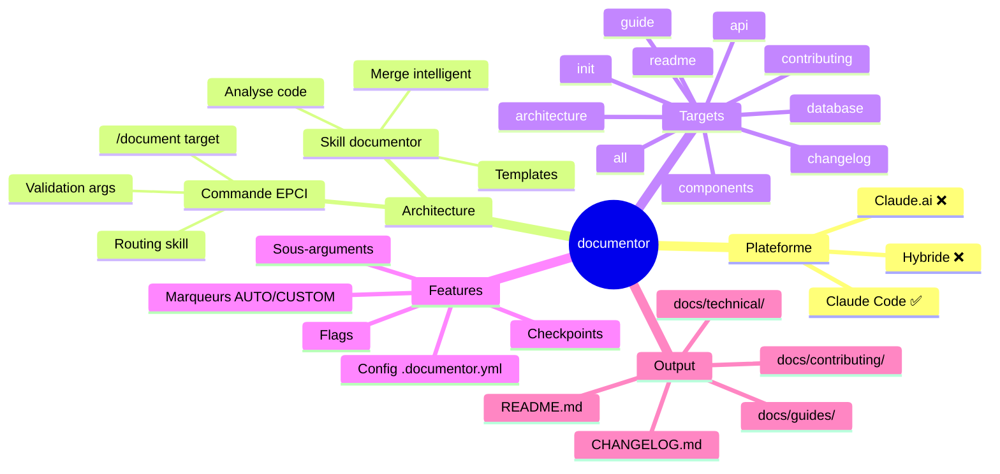

# Rapport de Brainstorming — Skill Documentor

> **Date** : 2025-12-15  
> **Sujet** : Création d'un skill de documentation technique pour Claude Code  
> **Itérations** : 6  
> **Statut** : ✅ Finalisé

---

## 1. Contexte et objectifs

### Besoin initial

Créer un skill `documentor` capable de générer et maintenir la documentation technique des projets de développement (Symfony, React, Django), avec la question centrale du choix de plateforme : Claude.ai ou Claude Code.

### Objectifs identifiés

1. Générer tous types de documentation (technique, utilisateur, projet)
2. Versionner la documentation avec le code source (fichiers Markdown)
3. Supporter plusieurs audiences (équipes techniques, clients)
4. Mettre en place un workflow de documentation inexistant

---

## 2. Synthèse exécutive

### Décision clé

**Plateforme retenue : Claude Code**

Le skill sera développé exclusivement pour Claude Code car :
- L'utilisateur travaille principalement dans son IDE
- La documentation doit être versionnée avec le code
- L'accès direct aux fichiers sources permet une analyse précise
- Les outils natifs (Read, Glob, Grep, Write, Bash) sont essentiels

### Architecture retenue

Deux composants EPCI séparés :
- **Commande** : `commands/document.md` — Interface utilisateur et routing
- **Skill** : `skills/documentor/SKILL.md` — Logique métier et génération

### Insight principal

> Un skill de documentation efficace nécessite l'accès au code source pour être précis et contextuel. Le connecteur GitHub de Claude.ai est insuffisant pour une analyse profonde (pas de navigation libre, pas d'exécution de commandes).

---

## 3. Décisions prises

| # | Décision | Justification | Confiance |
|---|----------|---------------|-----------|
| D1 | Plateforme Claude Code | IDE = workflow quotidien, accès fichiers complet | ⭐⭐⭐ |
| D2 | Pas d'hybride | Simplicité, un seul skill à maintenir | ⭐⭐⭐ |
| D3 | Commande `/document <target>` | Pattern EPCI standard, routing clair | ⭐⭐⭐ |
| D4 | Structure docs/ catégorisée | technical/, guides/, contributing/ | ⭐⭐⭐ |
| D5 | Merge intelligent avec marqueurs | Préserve le contenu custom (DOCUMENTOR:CUSTOM) | ⭐⭐⭐ |
| D6 | Config `.documentor.yml` optionnel | Valeurs par défaut si absent | ⭐⭐⭐ |
| D7 | Checkpoint avant génération | Validation du scope, pas de dry-run | ⭐⭐ |
| D8 | Langue française | Cohérence avec l'écosystème existant | ⭐⭐⭐ |
| D9 | Changelog Keep a Changelog | Standard reconnu | ⭐⭐⭐ |
| D10 | Commande `/document init` | Bootstrap structure docs/ | ⭐⭐⭐ |

---

## 4. Spécifications fonctionnelles

### 4.1 Targets de documentation

| Target | Fichier(s) | Description |
|--------|------------|-------------|
| `init` | Structure complète | Initialise docs/ et .documentor.yml |
| `readme` | `README.md` | Présentation, installation, usage |
| `architecture` | `docs/technical/architecture.md` | Structure, patterns, ADR |
| `api` | `docs/technical/api/*.md` | Documentation des endpoints |
| `database` | `docs/technical/database.md` | Schéma, modèles, relations |
| `components` | `docs/technical/components/*.md` | Composants React/Vue |
| `guide` | `docs/guides/*.md` | Guides utilisateur/admin |
| `contributing` | `docs/contributing/CONTRIBUTING.md` | Standards contribution |
| `changelog` | `CHANGELOG.md` | Historique versions (Keep a Changelog) |
| `all` | Tous | Génération complète |

### 4.2 Sous-arguments

| Target | Sous-argument | Exemple |
|--------|---------------|---------|
| `api` | `[module]` | `/document api users` |
| `components` | `[name]` | `/document components Button` |
| `guide` | `[type]` | `/document guide admin` |
| `changelog` | `[version]` | `/document changelog 1.2.0` |

### 4.3 Flags globaux

| Flag | Effet |
|------|-------|
| `--force` | Regénère même si contenu identique |
| `--verbose` | Affiche détail des fichiers analysés |
| `--no-checkpoint` | Skip validation, génère directement |

### 4.4 Système de marqueurs

```markdown
<!-- DOCUMENTOR:AUTO-START -->
Contenu généré automatiquement
<!-- DOCUMENTOR:AUTO-END -->

<!-- DOCUMENTOR:CUSTOM-START -->
Contenu manuel préservé
<!-- DOCUMENTOR:CUSTOM-END -->
```

### 4.5 Structure de sortie

```
projet/
├── README.md
├── CHANGELOG.md
└── docs/
    ├── .documentor.yml          # Config (optionnel)
    ├── technical/
    │   ├── architecture.md
    │   ├── database.md
    │   ├── api/
    │   │   ├── users.md
    │   │   └── auth.md
    │   └── components/
    │       ├── Button.md
    │       └── Modal.md
    ├── guides/
    │   ├── user-guide.md
    │   └── admin-guide.md
    └── contributing/
        └── CONTRIBUTING.md
```

---

## 5. Architecture technique

### 5.1 Composants EPCI

```
.claude/
├── commands/
│   └── document.md              # Interface & routing
│
└── skills/
    └── documentor/
        ├── SKILL.md             # Logique métier
        └── references/
            ├── targets.md       # Détail targets
            ├── templates/       # Templates markdown
            │   ├── readme.md
            │   ├── architecture.md
            │   ├── api-endpoint.md
            │   ├── component.md
            │   └── changelog-entry.md
            ├── merge-strategy.md
            └── config-schema.md
```

### 5.2 Outils Claude Code utilisés

| Outil | Usage |
|-------|-------|
| `Read` | Lire fichiers sources et docs existantes |
| `Glob` | Trouver patterns (`src/**/*.php`, `*.md`) |
| `Grep` | Chercher dans le code (classes, fonctions) |
| `LS` | Lister structure dossiers |
| `Write` | Créer/modifier fichiers documentation |
| `Bash` | Commandes auxiliaires si nécessaire |

### 5.3 Workflow de génération

```
┌─────────────────────────────────────────────────────────────────┐
│                    /document <target>                            │
└─────────────────────────────────────────────────────────────────┘
                            │
                            ▼
┌─────────────────────────────────────────────────────────────────┐
│  1. VALIDATION                                                   │
│     • Vérifier arguments                                         │
│     • Charger .documentor.yml si présent                        │
└─────────────────────────────────────────────────────────────────┘
                            │
                            ▼
┌─────────────────────────────────────────────────────────────────┐
│  2. ANALYSE                                                      │
│     • Scanner fichiers sources (Glob, Read)                     │
│     • Détecter structure projet                                  │
│     • Identifier docs existantes                                 │
└─────────────────────────────────────────────────────────────────┘
                            │
                            ▼
┌─────────────────────────────────────────────────────────────────┐
│  3. CHECKPOINT                                                   │
│     • Afficher scope détecté                                    │
│     • Lister fichiers à créer/modifier                          │
│     • Identifier sections CUSTOM préservées                     │
│     • Demander validation                                        │
└─────────────────────────────────────────────────────────────────┘
                            │
                            ▼
┌─────────────────────────────────────────────────────────────────┐
│  4. GÉNÉRATION                                                   │
│     • Appliquer templates                                        │
│     • Merger avec contenu existant                              │
│     • Écrire fichiers (Write)                                   │
└─────────────────────────────────────────────────────────────────┘
                            │
                            ▼
┌─────────────────────────────────────────────────────────────────┐
│  5. RAPPORT                                                      │
│     • Fichiers créés/modifiés                                   │
│     • Sections préservées                                        │
│     • Suggestions de complétion                                  │
└─────────────────────────────────────────────────────────────────┘
```

---

## 6. Livrables

| Livrable | Fichier | Description |
|----------|---------|-------------|
| CDC Commande | `cdc-command-document.md` | Spécification de la commande EPCI |
| CDC Skill | `cdc-skill-documentor.md` | Spécification du skill |
| Rapport | `brainstorm-documentor-report.md` | Ce document |

---

## 7. Risques identifiés

| Risque | Probabilité | Impact | Mitigation |
|--------|-------------|--------|------------|
| Génération trop générique | Moyenne | Moyen | Templates précis par type de projet |
| Perte de contenu custom | Faible | Élevé | Système de marqueurs robuste |
| Temps d'exécution long | Moyenne | Faible | Scope ciblé par target |
| Config complexe | Faible | Faible | Config optionnelle, défauts sensés |

---

## 8. Critères de succès

| Critère | Mesure | Statut |
|---------|--------|--------|
| Décision plateforme claire | Claude Code choisi | ✅ |
| Fonctionnalités définies | 10 targets, sous-args, flags | ✅ |
| Architecture EPCI respectée | Commande + Skill séparés | ✅ |
| CDC prêts pour implémentation | 2 CDC détaillés | ✅ |

---

## 9. Prochaines étapes

1. **Implémenter la commande** `commands/document.md`
2. **Implémenter le skill** `skills/documentor/SKILL.md`
3. **Créer les templates** de documentation
4. **Tester** sur un projet Symfony/React réel
5. **Itérer** selon feedback

---

## 10. Mindmap



---

*Rapport généré par Brainstormer v1.1.0*
