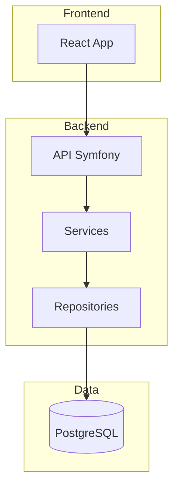
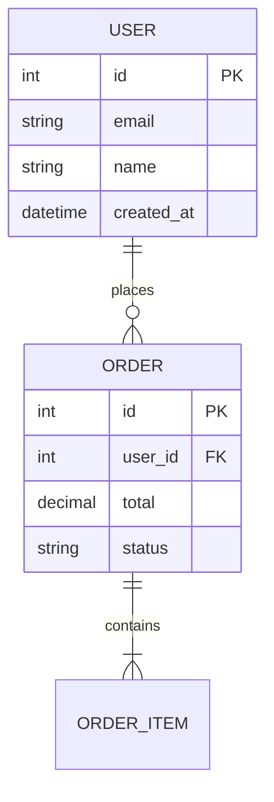

# CDC Skill — documentor

> **Version** : 1.0.0  
> **Date** : 2025-12-15  
> **Type** : Skill EPCI (Claude Code)  
> **Commande associée** : `/document`

---

## 1. Frontmatter

```yaml
---
name: documentor
description: >-
  Technical documentation generator for development projects. Analyzes source
  code structure (Symfony, React, Django) to generate accurate Markdown documentation.
  Supports README, API docs, architecture, database schema, component docs, user guides,
  and changelog. Features intelligent merge preserving custom content via markers.
  Use when user needs to document code, generate README, create API documentation,
  or maintain project docs. Not for non-technical writing or external documentation systems.
allowed-tools: [Read, Write, Glob, Grep, LS, Bash]
---
```

---

## 2. Overview

Documentor génère et maintient la documentation technique des projets de développement.
Il analyse le code source pour produire une documentation précise, contextuelle et maintenable.

**Philosophie** : Documentation as Code — versionnée, mergeable, automatisée.

---

## 3. Workflow principal

```
┌─────────────────────────────────────────────────────────────────┐
│                    WORKFLOW DOCUMENTOR                           │
├─────────────────────────────────────────────────────────────────┤
│                                                                  │
│  1. RÉCEPTION ──► 2. ANALYSE ──► 3. CHECKPOINT ──► 4. GÉNÉRATION │
│                                                                  │
│       │              │               │                │          │
│       ▼              ▼               ▼                ▼          │
│    Valider       Scanner code    Afficher scope   Appliquer      │
│    arguments     Détecter struct  Demander valid  templates      │
│    Charger config Trouver docs    Lister changes  Merger         │
│                                                   Écrire         │
│                                                                  │
└─────────────────────────────────────────────────────────────────┘
```

---

## 4. Targets détaillés

### 4.1 `init` — Initialisation

**Objectif** : Créer la structure de documentation initiale.

**Actions** :
1. Créer arborescence `docs/`
2. Générer `.documentor.yml` interactif
3. Créer fichiers `.gitkeep`
4. Proposer génération README immédiate

**Structure créée** :
```
docs/
├── .documentor.yml
├── technical/
│   ├── .gitkeep
│   ├── api/
│   │   └── .gitkeep
│   └── components/
│       └── .gitkeep
├── guides/
│   └── .gitkeep
└── contributing/
    └── .gitkeep
```

**Questions interactives** :
1. Nom du projet ?
2. Description courte ?
3. Sections à activer ? (checklist)

---

### 4.2 `readme` — README principal

**Objectif** : Générer le README.md à la racine du projet.

**Sources analysées** :
- `package.json` / `composer.json` (nom, version, description, scripts)
- `Makefile` / `docker-compose.yml` (commandes disponibles)
- Structure `src/` (technologies détectées)
- `.env.example` (variables de configuration)

**Sections générées** :

| Section | Source | Marqueur |
|---------|--------|----------|
| Titre + badges | package.json | AUTO |
| Description | config ou CLAUDE.md | AUTO |
| Prérequis | détection stack | AUTO |
| Installation | scripts détectés | AUTO |
| Configuration | .env.example | AUTO |
| Usage | scripts npm/composer | AUTO |
| Tests | scripts test | AUTO |
| Contribution | lien CONTRIBUTING.md | AUTO |
| Licence | LICENSE file | AUTO |

---

### 4.3 `architecture` — Architecture technique

**Objectif** : Documenter la structure et les patterns du projet.

**Sources analysées** :
- Structure des dossiers (`src/`, `app/`, `components/`)
- Fichiers de configuration (webpack, vite, symfony.yaml)
- Patterns détectés (MVC, DDD, Clean Architecture)

**Sections générées** :

| Section | Contenu |
|---------|---------|
| Vue d'ensemble | Diagramme structure haut niveau |
| Structure des dossiers | Arborescence commentée |
| Patterns utilisés | MVC, Repository, etc. |
| Flux de données | Request → Response |
| Décisions d'architecture | Placeholder pour ADR |

**Template Mermaid inclus** :
```markdown
## Diagramme d'architecture


```

---

### 4.4 `api` — Documentation API

**Objectif** : Documenter les endpoints API du projet.

**Sources analysées** :
- Controllers (`*Controller.php`, `*Controller.ts`)
- Annotations/Attributs (`#[Route]`, `@Route`, decorators)
- DTOs / Request objects
- Entities / Models (pour les types)

**Structure de sortie** :
```
docs/technical/api/
├── index.md          # Vue d'ensemble + liens
├── users.md          # Module users
├── auth.md           # Module auth
└── products.md       # Module products
```

**Template par endpoint** :

```markdown
### GET /api/users/{id}

Récupère un utilisateur par son identifiant.

**Paramètres**

| Nom | Type | In | Description |
|-----|------|-----|-------------|
| id | integer | path | ID de l'utilisateur |

**Réponses**

| Code | Description |
|------|-------------|
| 200 | Utilisateur trouvé |
| 404 | Utilisateur non trouvé |

**Exemple de réponse**

```json
{
  "id": 1,
  "email": "user@example.com",
  "name": "John Doe"
}
```
```

---

### 4.5 `database` — Schéma base de données

**Objectif** : Documenter le modèle de données.

**Sources analysées** :
- Entities Doctrine (`src/Entity/*.php`)
- Models Django (`models.py`)
- Migrations
- Fichiers Prisma schema

**Sections générées** :

| Section | Contenu |
|---------|---------|
| Vue d'ensemble | Diagramme ER (Mermaid) |
| Tables/Entités | Liste avec descriptions |
| Relations | One-to-Many, Many-to-Many |
| Index | Index et contraintes |
| Migrations | Historique résumé |

**Template diagramme ER** :
```markdown

```

---

### 4.6 `components` — Composants frontend

**Objectif** : Documenter les composants React/Vue.

**Sources analysées** :
- Fichiers composants (`*.tsx`, `*.vue`)
- Props/Types (`interface Props`, `PropTypes`)
- Storybook stories si présentes
- Commentaires JSDoc

**Structure de sortie** :
```
docs/technical/components/
├── index.md          # Catalogue des composants
├── Button.md
├── Modal.md
└── Form/
    ├── Input.md
    └── Select.md
```

**Template par composant** :

```markdown
# Button

Bouton d'action réutilisable.

## Props

| Prop | Type | Default | Description |
|------|------|---------|-------------|
| variant | 'primary' \| 'secondary' | 'primary' | Style du bouton |
| size | 'sm' \| 'md' \| 'lg' | 'md' | Taille |
| disabled | boolean | false | État désactivé |
| onClick | () => void | - | Callback au clic |

## Usage

```tsx
<Button variant="primary" onClick={handleClick}>
  Valider
</Button>
```

## Variants

| Variant | Apparence |
|---------|-----------|
| primary | Fond bleu, texte blanc |
| secondary | Fond gris, texte noir |
```

---

### 4.7 `guide` — Guides utilisateur

**Objectif** : Créer des guides pour les utilisateurs finaux ou admins.

**Sous-arguments** :
- `user` → `docs/guides/user-guide.md`
- `admin` → `docs/guides/admin-guide.md`

**Sources analysées** :
- Fonctionnalités détectées dans le code
- Routes frontend (navigation)
- Rôles/permissions (pour guide admin)

**Sections guide utilisateur** :
1. Introduction
2. Premiers pas
3. Fonctionnalités principales
4. FAQ

**Sections guide admin** :
1. Accès administration
2. Gestion des utilisateurs
3. Configuration
4. Maintenance

---

### 4.8 `contributing` — Guide de contribution

**Objectif** : Standardiser les contributions au projet.

**Sources analysées** :
- `.editorconfig`, `.prettierrc`, `eslint.config.js` (standards code)
- Scripts de test et lint
- Workflow Git (branches)

**Sections générées** :

| Section | Contenu |
|---------|---------|
| Code de conduite | Placeholder ou lien |
| Prérequis | Outils nécessaires |
| Installation dev | Setup environnement |
| Standards de code | Linting, formatting |
| Process de PR | Branches, commits, review |
| Tests | Comment exécuter les tests |

---

### 4.9 `changelog` — Historique des versions

**Objectif** : Maintenir un changelog au format Keep a Changelog.

**Format** : [Keep a Changelog](https://keepachangelog.com/fr/1.0.0/)

**Sous-argument** : `[version]` pour ajouter une entrée spécifique.

**Template** :

```markdown
# Changelog

Toutes les modifications notables de ce projet sont documentées dans ce fichier.

Le format est basé sur [Keep a Changelog](https://keepachangelog.com/fr/1.0.0/),
et ce projet adhère au [Semantic Versioning](https://semver.org/spec/v2.0.0.html).

## [Unreleased]

### Added
- 

### Changed
- 

### Fixed
- 

## [1.0.0] - 2025-12-15

### Added
- Première version stable
```

**Comportement** :
- Si `--version 1.2.0` : Crée une nouvelle section datée
- Sans argument : Met à jour la section `[Unreleased]`

---

### 4.10 `all` — Génération complète

**Objectif** : Générer toute la documentation du projet.

**Comportement** :
1. Checkpoint détaillé avec estimation temps
2. Génération séquentielle de tous les targets activés
3. Rapport final consolidé

**Ordre de génération** :
1. init (si docs/ n'existe pas)
2. readme
3. architecture
4. database
5. api
6. components
7. guide (si activé)
8. contributing
9. changelog

---

## 5. Système de marqueurs

### 5.1 Marqueurs disponibles

```markdown
<!-- DOCUMENTOR:AUTO-START -->
Contenu généré automatiquement par documentor.
Ne pas modifier manuellement - sera écrasé à la prochaine génération.
<!-- DOCUMENTOR:AUTO-END -->

<!-- DOCUMENTOR:CUSTOM-START -->
Contenu personnalisé préservé lors des regénérations.
Vous pouvez modifier librement cette section.
<!-- DOCUMENTOR:CUSTOM-END -->
```

### 5.2 Règles de merge

| Situation | Comportement |
|-----------|--------------|
| Bloc AUTO existant | Remplacé entièrement |
| Bloc CUSTOM existant | Préservé tel quel |
| Contenu hors marqueurs | Préservé (considéré custom) |
| Nouveau fichier | Génération complète avec marqueurs |

### 5.3 Exemple de fichier mergé

```markdown
# API Users

<!-- DOCUMENTOR:AUTO-START -->
## Endpoints

### GET /api/users
...contenu regénéré...
<!-- DOCUMENTOR:AUTO-END -->

<!-- DOCUMENTOR:CUSTOM-START -->
## Notes d'implémentation

Ces endpoints utilisent le cache Redis pour optimiser les performances.
Voir la configuration dans `config/packages/cache.yaml`.
<!-- DOCUMENTOR:CUSTOM-END -->

<!-- DOCUMENTOR:AUTO-START -->
## Modèles de données
...contenu regénéré...
<!-- DOCUMENTOR:AUTO-END -->
```

---

## 6. Format des checkpoints

```markdown
📍 Checkpoint — Documentation [Target]

**Projet** : [nom] ([stack détectée])
**Target** : [target] [sub-argument]
**Config** : [.documentor.yml chargé | défauts]

**Fichiers source analysés** :
- `[path/file1]` ([X] éléments détectés)
- `[path/file2]` ([Y] éléments détectés)
- ...

**Fichiers à générer/modifier** :

| Fichier | Action | Sections | Lignes est. |
|---------|--------|----------|-------------|
| `[path]` | 📝 Création | [X] sections | ~[N] |
| `[path]` | 🔄 Mise à jour | [X] AUTO, [Y] CUSTOM | ~[N] |

**Sections CUSTOM préservées** :
- `[fichier]` : "[nom section]" ([N] lignes)

**Estimation totale** : ~[N] lignes, [X] fichiers

**Options :**
→ `valider` — Lancer la génération
→ `modifier` — Ajuster le scope
→ `annuler` — Abandonner
```

---

## 7. Configuration `.documentor.yml`

### 7.1 Emplacement

```
docs/.documentor.yml
```

### 7.2 Schéma complet

```yaml
# docs/.documentor.yml
# Configuration du skill documentor

# Métadonnées projet
project:
  name: "Mon Application"           # Requis
  description: "Description courte" # Optionnel
  version: "1.0.0"                  # Optionnel
  repository: "github.com/org/repo" # Optionnel

# Structure des dossiers
structure:
  technical: "technical/"           # Défaut
  guides: "guides/"                 # Défaut
  contributing: "contributing/"     # Défaut
  
  # Fichiers à la racine du repo
  root_files:
    - README.md                     # Défaut
    - CHANGELOG.md                  # Défaut
    - CONTRIBUTING.md               # Optionnel

# Activation des sections
sections:
  readme: true                      # Défaut: true
  architecture: true                # Défaut: true
  api: true                         # Défaut: true
  database: true                    # Défaut: true
  components: true                  # Défaut: true
  guides:
    user: true                      # Défaut: true
    admin: false                    # Défaut: false
  contributing: true                # Défaut: true
  changelog: true                   # Défaut: true

# Options des templates
templates:
  readme:
    badges: true                    # Badges CI/coverage
    toc: true                       # Table des matières
    sections:                       # Sections à inclure
      - description
      - prerequisites
      - installation
      - configuration
      - usage
      - tests
      - contributing
      - license
      
  api:
    format: "detailed"              # detailed | minimal
    examples: true                  # Exemples de requêtes
    responses: true                 # Exemples de réponses
    group_by: "module"              # module | method | path

  components:
    include_stories: true           # Inclure exemples Storybook
    include_props_table: true       # Table des props

# Personnalisation des marqueurs (optionnel)
markers:
  auto_start: "<!-- DOCUMENTOR:AUTO-START -->"
  auto_end: "<!-- DOCUMENTOR:AUTO-END -->"
  custom_start: "<!-- DOCUMENTOR:CUSTOM-START -->"
  custom_end: "<!-- DOCUMENTOR:CUSTOM-END -->"

# Patterns d'exclusion (glob)
exclude:
  - "**/node_modules/**"
  - "**/vendor/**"
  - "**/*.test.ts"
  - "**/*.spec.php"
```

### 7.3 Valeurs par défaut

Si `.documentor.yml` absent, le skill utilise :
- `project.name` : Nom du dossier ou `package.json`.name
- `sections` : Toutes activées sauf `guides.admin`
- `templates` : Tous les défauts
- `markers` : Marqueurs standards

---

## 8. Analyse du code source

### 8.1 Détection de stack

| Fichier | Stack détectée |
|---------|----------------|
| `composer.json` + `symfony.lock` | Symfony |
| `composer.json` + `laravel` | Laravel |
| `manage.py` + `settings.py` | Django |
| `package.json` + `react` | React |
| `package.json` + `vue` | Vue |
| `package.json` + `next` | Next.js |

### 8.2 Patterns de scan

**Symfony** :
```bash
Glob: src/Controller/**/*.php
Grep: #[Route(, @Route(
```

**React** :
```bash
Glob: src/components/**/*.tsx
Grep: interface.*Props, export default function
```

**Django** :
```bash
Glob: */views.py, */models.py
Grep: class.*View, class.*Model
```

### 8.3 Extraction d'informations

| Élément | Méthode d'extraction |
|---------|---------------------|
| Routes API | Annotations `#[Route]`, `@app.route` |
| Props composants | Interface TypeScript, PropTypes |
| Entités DB | Annotations Doctrine, models Django |
| Dépendances | package.json, composer.json, requirements.txt |

---

## 9. Templates de référence

Les templates sont stockés dans :
```
skills/documentor/references/templates/
├── readme.md
├── architecture.md
├── api-module.md
├── api-endpoint.md
├── database.md
├── component.md
├── user-guide.md
├── admin-guide.md
├── contributing.md
└── changelog.md
```

Chaque template contient :
- Structure avec marqueurs
- Variables à remplacer (`{{project_name}}`, `{{endpoints}}`)
- Sections optionnelles conditionnelles

---

## 10. Messages d'erreur

### Pas de structure docs/

```
⚠️ Structure docs/ non trouvée.

Initialisez avec: /document init
```

### Target désactivé

```
⚠️ Target 'guide admin' désactivé dans la configuration.

Pour l'activer, modifiez docs/.documentor.yml:
  sections:
    guides:
      admin: true
```

### Aucun fichier source trouvé

```
⚠️ Aucun controller API trouvé.

Patterns recherchés:
- src/Controller/**/*.php
- app/Http/Controllers/**/*.php

Vérifiez la structure de votre projet.
```

---

## 11. Intégrations

### 11.1 Avec CLAUDE.md

Si `CLAUDE.md` existe à la racine, documentor l'utilise pour :
- Nom et description du projet
- Stack technique
- Conventions spécifiques

### 11.2 Avec Git

Détection automatique :
- Repository URL (pour liens)
- Branches (pour CONTRIBUTING)
- Tags (pour CHANGELOG)

---

## 12. Limitations

Ce skill ne gère PAS :
- Documentation externe (Confluence, Notion)
- Génération de PDF
- Documentation multilingue
- Versionning de la documentation
- Génération de diagrammes complexes (au-delà de Mermaid basique)

---

## 13. Références

```
skills/documentor/
├── SKILL.md                      # Ce fichier
└── references/
    ├── targets.md                # Détails par target
    ├── templates/                # Templates markdown
    │   ├── readme.md
    │   ├── architecture.md
    │   ├── api-module.md
    │   ├── api-endpoint.md
    │   ├── database.md
    │   ├── component.md
    │   ├── user-guide.md
    │   ├── admin-guide.md
    │   ├── contributing.md
    │   └── changelog.md
    ├── merge-strategy.md         # Algorithme de merge
    └── config-schema.md          # Schéma YAML complet
```

---

## 14. Version History

| Version | Date | Changes |
|---------|------|---------|
| 1.0.0 | 2025-12-15 | Initial release |

## Current: v1.0.0

## Owner

- **Author**: Édouard
- **Contact**: Via Claude Code

---

*CDC Skill — Pattern EPCI v1.0*
