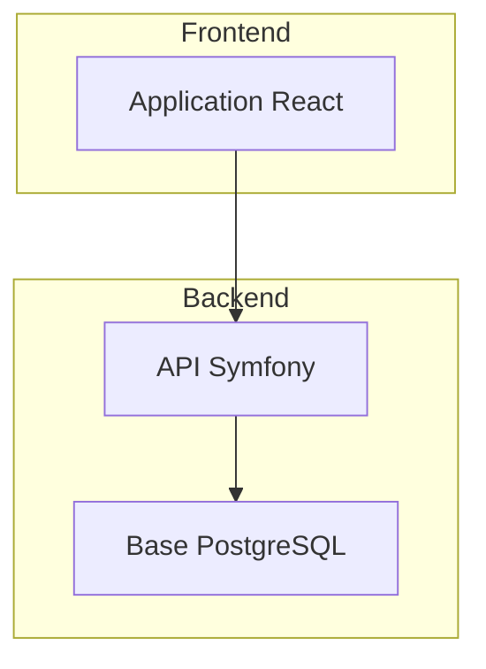

# Cahier des Charges — Skill Propositor

> **Version** : 1.0  
> **Date** : 2025-12-15  
> **Auteur** : Édouard (via Brainstormer)  
> **Statut** : Prêt pour skill-factory  

---

## 1. Vision et Objectif

### 1.1 Mission

**Propositor** génère des propositions commerciales professionnelles, structurées et adaptées au type de client, en exploitant obligatoirement l'output d'Estimator.

### 1.2 Problème résolu

Les propositions commerciales sont chronophages à rédiger, souvent incohérentes dans leur structure, et nécessitent une adaptation manuelle importante selon le client et le type de projet.

### 1.3 Valeur ajoutée

| Bénéfice | Description |
|----------|-------------|
| **Templates métier** | 5 templates adaptés (dev, refonte, TMA, audit, AO public) |
| **Adaptation client** | Ton et vocabulaire ajustés automatiquement |
| **Intégration native** | Consommation directe de l'output Estimator |
| **Planning visuel** | Génération Gantt Mermaid automatique |
| **Validation cohérence** | Alertes si incohérence données/calculs |
| **Workflow interactif** | Checkpoints aux sections clés |

### 1.4 Dépendance critique

**Propositor requiert obligatoirement un output Estimator** en entrée. Pas de mode standalone.

---

## 2. Cas d'usage cibles

| Cas d'usage | Description | Template | Fréquence |
|-------------|-------------|----------|-----------|
| Propale développement | Nouveau projet web/mobile | `dev` | Hebdomadaire |
| Propale refonte | Migration ou refonte technique | `refonte` | Mensuel |
| Propale TMA | Contrat de maintenance | `tma` | Mensuel |
| Propale audit | Mission d'audit technique | `audit` | Ponctuel |
| Réponse AO public | Appel d'offres marchés publics | `ao-public` | Ponctuel |

---

## 3. Déclenchement

### 3.1 Triggers suggérés

```yaml
triggers:
  - "proposition commerciale", "propale", "proposal"
  - "rédige une offre", "prépare une offre"
  - "formalise le devis", "document commercial"
  - "use propositor"
```

### 3.2 Input obligatoire

| Source | Type | Statut |
|--------|------|--------|
| Output `estimator` | Document Markdown structuré | **Obligatoire** |

### 3.3 Inputs complémentaires

| Source | Type | Usage |
|--------|------|-------|
| Output `brainstormer` | Rapport de synthèse | Section "Compréhension du besoin" |
| Output `planificator` (futur) | Planning détaillé | Section Planning enrichie |
| Fichier `references.md` | Références clients | Section Références (si présent) |

### 3.4 Transmission des données

| Contexte | Mécanisme |
|----------|-----------|
| Même conversation | Détection automatique de l'output Estimator |
| Nouvelle conversation | Upload du fichier Markdown Estimator |

---

## 4. Workflow détaillé

### 4.1 Vue d'ensemble

```
┌─────────────────────────────────────────────────────────────────┐
│                PROPOSITOR — WORKFLOW INTERACTIF                  │
├─────────────────────────────────────────────────────────────────┤
│                                                                  │
│  PHASE 1           PHASE 2          PHASE 3         PHASE 4     │
│  ───────           ───────          ───────         ───────     │
│                                                                  │
│  Qualification → Structure → Rédaction sections → Finalisation  │
│       │              │               │                 │        │
│       ▼              ▼               ▼                 ▼        │
│   📍 CP1          📍 CP2         📍 CP3 (opt)      📍 FINAL    │
│                                                                  │
└─────────────────────────────────────────────────────────────────┘
```

### 4.2 Phase 1 — Qualification client

**Objectif** : Identifier le client et calibrer le template/ton.

**Actions** :
1. Récupérer et valider l'output Estimator
2. Poser questions de qualification client
3. Auto-détecter : template, ton, niveau de détail
4. Vérifier cohérence des données Estimator

**Questions de cadrage** :
- Nom du client ?
- Secteur d'activité ? (startup/PME/grand compte/public/GMS/industriel)
- Contexte de la demande ? (spontané, consultation, AO)
- Délai de réponse attendu ?
- Références similaires à inclure ?

**Validation cohérence automatique** :

Le skill vérifie :
- Montants = JH × TJM (tolérance 1%)
- Cohérence entre scénarios
- Références FCT-xxx valides
- Totaux des lots = Total général

Si incohérence détectée :
```markdown
⚠️ **Alerte cohérence** :
- Le total Lot Backend (25 JH) ne correspond pas à la somme des tâches (23 JH)
- Action recommandée : `recalculer` dans Estimator ou `ignorer` pour continuer
```

**📍 Checkpoint 1** :

```markdown
📍 Checkpoint 1 — Qualification

**Client identifié** : [Nom] — [Secteur]
**Contexte** : [spontané/consultation/AO]

**Paramètres auto-détectés** :
- Template : [dev/refonte/tma/audit/ao-public]
- Ton : [formel/standard/direct]
- Niveau détail : [synthétique/équilibré/détaillé]

**Données Estimator importées** :
- Projet : [Nom]
- Budget recommandé : XX XXX € HT
- Charge : XX JH (scénario moyen)

✅ Cohérence vérifiée — Aucune alerte

**Options :**
→ `valider` — Passer à la structuration
→ `changer-template [nom]` — Forcer un autre template
→ `changer-ton [niveau]` — Ajuster le formalisme
→ `question [sujet]` — Clarifier un point
```

### 4.3 Phase 2 — Structure et plan

**Objectif** : Définir le sommaire adapté au template.

**Templates disponibles** :

#### Template A : `dev` (Développement neuf)

```
1. Page de garde
2. Synthèse exécutive
3. Compréhension du besoin
4. Solution proposée
   4.1 Architecture fonctionnelle
   4.2 Choix technologiques
   4.3 Points forts
5. Méthodologie
6. Planning prévisionnel (Gantt)
7. Équipe projet
8. Proposition financière
9. Conditions générales
10. Annexes
```

#### Template B : `refonte` (Migration/Refonte)

```
1. Page de garde
2. Synthèse exécutive
3. Analyse de l'existant
4. Stratégie de migration
   4.1 Approche technique
   4.2 Plan de migration
   4.3 Gestion des risques régression
5. Solution cible
6. Méthodologie
7. Planning (phases migration)
8. Équipe projet
9. Proposition financière
10. Conditions
11. Annexes
```

#### Template C : `tma` (Maintenance)

```
1. Page de garde
2. Synthèse de l'offre
3. Périmètre de la prestation
4. Niveaux de service (SLA)
   4.1 Catégories d'intervention
   4.2 Délais de réponse
   4.3 Indicateurs de performance
5. Organisation et gouvernance
6. Processus d'intervention
7. Proposition financière (forfait/régie)
8. Conditions contractuelles
9. Annexes
```

#### Template D : `audit` (Audit technique)

```
1. Page de garde
2. Contexte et objectifs
3. Périmètre de l'audit
4. Méthodologie d'audit
   4.1 Approche
   4.2 Grille d'évaluation
   4.3 Outils utilisés
5. Livrables attendus
6. Planning d'intervention
7. Proposition financière
8. Conditions
9. Références similaires
```

#### Template E : `ao-public` (Appel d'offres public)

```
1. Lettre de candidature (DC1)
2. Déclaration du candidat (DC2)
3. Mémoire technique
   3.1 Compréhension du besoin
   3.2 Solution technique proposée
   3.3 Méthodologie de réalisation
   3.4 Moyens humains et matériels
   3.5 Planning détaillé
   3.6 Références et certifications
4. Bordereau des Prix Unitaires (BPU)
5. Acte d'engagement
6. Annexes obligatoires
```

**📍 Checkpoint 2** :

```markdown
📍 Checkpoint 2 — Plan de la proposition

**Template sélectionné** : [nom] — [description courte]

**Sommaire proposé** :
1. [Section 1]
2. [Section 2]
...

**Sections personnalisables** :
- Références clients : [incluses/exclues]
- CV intervenants : [inclus/exclus]
- Annexe technique détaillée : [incluse/exclue]

💡 **Suggestions** :
- Ajouter une référence projet [secteur] similaire ?
- Inclure la certification [X] ?

**Options :**
→ `valider` — Passer à la rédaction
→ `ajouter-section [nom]` — Ajouter une section
→ `supprimer-section [nom]` — Retirer une section
→ `ajouter-reference [projet]` — Inclure une référence
```

### 4.4 Phase 3 — Rédaction section par section

**Objectif** : Générer le contenu adapté au ton et au client.

**Adaptation du ton** :

| Type client | Ton | Vocabulaire | Niveau détail |
|-------------|-----|-------------|---------------|
| Startup | Direct, moderne | Tech assumé | Synthétique |
| PME | Professionnel, accessible | Vulgarisé | Équilibré |
| Grand compte | Corporate, formel | Business | Détaillé |
| Public | Administratif, précis | Réglementaire | Très détaillé |
| GMS | Pragmatique, ROI | Métier retail | Focus résultats |
| Industriel | Technique, rigoureux | Métier industrie | Détaillé |

**Sections générées** :

1. **Synthèse exécutive** (10-15 lignes)
   - Contexte en 2 lignes
   - Solution proposée
   - Bénéfices clés (3 points)
   - Budget et délai

2. **Compréhension du besoin**
   - Contexte client (depuis Estimator/Brainstormer)
   - Enjeux identifiés
   - Objectifs du projet
   - Périmètre (inclus/exclus)

3. **Solution proposée**
   - Architecture fonctionnelle
   - Stack technique (depuis Estimator, argumentée commercialement)
   - Points différenciateurs

4. **Méthodologie**
   - Approche (Agile, cycle en V, hybride)
   - Phases et jalons
   - Gouvernance projet
   - Gestion des risques

5. **Planning** (Gantt Mermaid automatique)
   - Généré depuis les JH Estimator
   - Jalons clés
   - Dépendances

6. **Équipe projet**
   - Profils mobilisés
   - Rôles et responsabilités
   - Disponibilité

7. **Proposition financière**
   - Tableau synthétique (depuis Estimator)
   - Détail par lot
   - Options éventuelles
   - Conditions de facturation

8. **Conditions**
   - Validité de l'offre
   - Prérequis client
   - Propriété intellectuelle
   - Confidentialité
   - CGV

**📍 Checkpoint 3** (optionnel, sections critiques) :

```markdown
📍 Checkpoint 3 — Validation synthèse exécutive

**Synthèse générée** :
[Contenu de la synthèse]

**Ton appliqué** : [formel/standard/direct]

**Ce checkpoint est optionnel** — La synthèse exécutive est souvent la section la plus importante.

**Options :**
→ `valider` — Continuer la rédaction
→ `modifier` — Ajuster la synthèse
→ `changer-ton [niveau]` — Reformuler avec un autre ton
→ `skip-checkpoints` — Générer le reste sans checkpoint intermédiaire
```

### 4.5 Phase 4 — Finalisation

**Objectif** : Assembler, vérifier et exporter.

**Actions** :
1. Assemblage du document complet
2. Vérification cohérence finale
3. Génération des annexes si nécessaire
4. Proposition de relecture via `critiquor`

**Vérifications automatiques** :
- Montants cohérents entre sections
- Dates du planning réalistes vs JH
- Toutes les références FCT-xxx documentées
- Pas de placeholder [XXX] oublié

**📍 Checkpoint Final** :

```markdown
📍 Checkpoint Final — Proposition complète

**Document généré** : Proposition commerciale — [Projet] — [Client]
**Référence** : PROP-[AAAA]-[NNN]
**Pages estimées** : ~XX pages

**Vérifications** :
✅ Cohérence financière OK
✅ Planning réaliste (XX semaines pour XX JH)
✅ Toutes sections complétées
✅ Aucun placeholder restant

**Résumé** :
- Budget : XX XXX € HT (scénario moyen)
- Durée : XX semaines
- Équipe : X profils

**Options :**
→ `exporter` — Générer le document final
→ `modifier-section [nom]` — Revenir sur une section
→ `previsualiser` — Voir le document complet
→ `critiquor` — Lancer une critique avant export
```

---

## 5. Format de sortie

### 5.1 Structure du document

```markdown
# Proposition Commerciale

## [Nom du Projet]
### [Nom du Client]

---

**Référence** : PROP-[AAAA]-[NNN]  
**Date** : [Date]  
**Validité** : 30 jours  
**Version** : 1.0  

---

## Sommaire

1. [Synthèse exécutive](#1-synthèse-exécutive)
2. [Compréhension du besoin](#2-compréhension-du-besoin)
3. [Solution proposée](#3-solution-proposée)
4. [Méthodologie](#4-méthodologie)
5. [Planning](#5-planning)
6. [Équipe projet](#6-équipe-projet)
7. [Proposition financière](#7-proposition-financière)
8. [Conditions](#8-conditions)
9. [Annexes](#9-annexes)

---

## 1. Synthèse exécutive

[Résumé 10-15 lignes adapté au ton client]

**Points clés de notre proposition** :
- ✅ [Bénéfice 1]
- ✅ [Bénéfice 2]
- ✅ [Bénéfice 3]

---

## 2. Compréhension du besoin

### 2.1 Contexte
[Description contexte client]

### 2.2 Enjeux identifiés
[Liste des enjeux business et techniques]

### 2.3 Objectifs du projet
[Objectifs SMART si possible]

### 2.4 Périmètre

**Inclus dans cette proposition** :
- [Élément 1]
- [Élément 2]

**Hors périmètre** :
- [Élément 1]
- [Élément 2]

---

## 3. Solution proposée

### 3.1 Vue d'ensemble
[Description solution haut niveau]

### 3.2 Architecture fonctionnelle
[Description modules/composants]



### 3.3 Choix technologiques

| Composant | Technologie | Justification |
|-----------|-------------|---------------|
| Backend | Symfony 7 | [Argumentaire commercial] |
| Frontend | React 18 | [Argumentaire commercial] |
| Base de données | PostgreSQL | [Argumentaire commercial] |

### 3.4 Points forts de la solution
[Différenciateurs, valeur ajoutée]

---

## 4. Méthodologie

### 4.1 Approche projet
[Agile/cycle en V/hybride avec justification]

### 4.2 Phases du projet

| Phase | Description | Livrables |
|-------|-------------|-----------|
| Cadrage | [Description] | Spécifications validées |
| Développement | [Description] | Application fonctionnelle |
| Recette | [Description] | PV de recette |
| Déploiement | [Description] | Application en production |

### 4.3 Gouvernance

| Instance | Fréquence | Participants |
|----------|-----------|--------------|
| COPIL | Mensuel | Direction, CP |
| Point projet | Hebdomadaire | CP, équipe |
| Daily | Quotidien | Équipe dev |

### 4.4 Gestion des risques
[Approche de mitigation]

---

## 5. Planning

### 5.1 Planning macro

```mermaid
gantt
    title Planning Projet [Nom]
    dateFormat YYYY-MM-DD
    
    section Cadrage
    Lancement et specs    :a1, [date], [durée]
    
    section Développement
    Sprint 1 - Core       :b1, after a1, [durée]
    Sprint 2 - Features   :b2, after b1, [durée]
    Sprint 3 - Intégration:b3, after b2, [durée]
    
    section Finalisation
    Recette client        :c1, after b3, [durée]
    MEP et formation      :c2, after c1, [durée]
```

### 5.2 Jalons clés

| Jalon | Date prévisionnelle | Livrable |
|-------|---------------------|----------|
| Kick-off | [Date] | Réunion de lancement |
| Fin cadrage | [Date] | Spécifications validées |
| Fin développement | [Date] | Application complète |
| Mise en production | [Date] | Application live |

---

## 6. Équipe projet

### 6.1 Organisation

| Rôle | Profil | Responsabilités | Allocation |
|------|--------|-----------------|------------|
| Chef de projet | [Nom/Profil] | Coordination, reporting, qualité | X j/sem |
| Dev Senior | [Profil] | Architecture, développement complexe | X j/sem |
| Dev Fullstack | [Profil] | Développement features | X j/sem |

### 6.2 Références similaires

#### Projet [Nom]
- **Client** : [Nom] — [Secteur]
- **Contexte** : [Description courte]
- **Solution** : [Technologies]
- **Résultats** : [KPIs, bénéfices]

---

## 7. Proposition financière

### 7.1 Synthèse budgétaire

| Lot | Description | Montant HT |
|-----|-------------|------------|
| Lot 1 — Cadrage | Spécifications, architecture | XX XXX € |
| Lot 2 — Développement | Backend, Frontend, Intégrations | XX XXX € |
| Lot 3 — Recette | Tests, corrections, validation | XX XXX € |
| Lot 4 — Déploiement | MEP, formation, documentation | XX XXX € |
| **TOTAL** | | **XX XXX € HT** |

### 7.2 Détail de l'estimation

| Scénario | Charge | Montant HT | Contexte |
|----------|--------|------------|----------|
| Bas | XX JH | XX XXX € | Périmètre minimal |
| **Moyen** | **XX JH** | **XX XXX €** | **Recommandé** |
| Haut | XX JH | XX XXX € | Sécurisé |

### 7.3 Options

| Option | Description | Montant HT |
|--------|-------------|------------|
| Option A | [Description] | X XXX € |
| Option B | [Description] | X XXX € |

### 7.4 Conditions de facturation

| Jalon | % | Montant | Échéance |
|-------|---|---------|----------|
| Signature | 30% | XX XXX € | À la commande |
| Fin développement | 50% | XX XXX € | [Date] |
| Recette | 20% | XX XXX € | [Date] |

---

## 8. Conditions

### 8.1 Validité
Cette proposition est valable **30 jours** à compter de sa date d'émission.

### 8.2 Conditions de réalisation

**Prérequis client** :
- [Prérequis 1]
- [Prérequis 2]

**Engagements client** :
- Disponibilité d'un interlocuteur décisionnaire
- Accès aux environnements nécessaires
- Validation des livrables sous 5 jours ouvrés

### 8.3 Propriété intellectuelle
[Clause PI adaptée]

### 8.4 Confidentialité
[Clause confidentialité]

### 8.5 Conditions générales
Les présentes conditions particulières sont complétées par nos Conditions Générales de Vente jointes en annexe.

---

## 9. Annexes

### Annexe A : Détail de l'estimation
[Tableau complet depuis Estimator]

### Annexe B : CV des intervenants
[Si option activée]

### Annexe C : Références détaillées
[Fiches références complètes]

### Annexe D : Conditions Générales de Vente
[CGV]

---

## Acceptation

**Pour accord, merci de retourner ce document signé.**

| | Client | Prestataire |
|--|--------|-------------|
| **Nom** | | [Votre nom] |
| **Fonction** | | [Votre fonction] |
| **Date** | | |
| **Signature** | | |

---

*Proposition générée par Propositor — [Votre société]*
```

---

## 6. Gestion des références clients

### 6.1 Fichier optionnel `references.md`

Si un fichier `references.md` existe dans le contexte, Propositor l'utilise pour la section Références.

**Format attendu** :

```markdown
# Références clients

## [Nom Projet 1]
- **Client** : [Nom] — [Secteur]
- **Année** : [AAAA]
- **Contexte** : [1-2 lignes]
- **Solution** : [Technologies utilisées]
- **Résultats** : [KPIs, bénéfices mesurables]
- **Contact** : [Optionnel]

## [Nom Projet 2]
[Même structure...]
```

### 6.2 Comportement

| Situation | Action |
|-----------|--------|
| Fichier présent et rempli | Proposer les références pertinentes |
| Fichier présent mais vide | Demander si ajout manuel |
| Fichier absent | Demander si création ou skip |

---

## 7. Commandes et flags

### 7.1 Commandes en session

| Commande | Action |
|----------|--------|
| `valider` | Confirmer le checkpoint |
| `modifier-section [nom]` | Revenir sur une section |
| `ajouter-reference [projet]` | Ajouter une référence client |
| `changer-ton [formel/standard/direct]` | Ajuster le formalisme |
| `changer-template [nom]` | Changer de template |
| `regenerer [section]` | Regénérer une section spécifique |
| `previsualiser` | Voir le document en l'état |
| `exporter` | Générer le document final |
| `critiquor` | Lancer une critique avant export |
| `skip-checkpoints` | Désactiver les checkpoints optionnels |

### 7.2 Flags de lancement

| Flag | Effet | Défaut |
|------|-------|--------|
| `--template [dev/refonte/tma/audit/ao-public]` | Forcer un template | Auto-détecté |
| `--client-type [startup/pme/grand-compte/public/gms/industriel]` | Type de client | Auto-détecté |
| `--ton [formel/standard/direct]` | Niveau de formalisme | Auto selon client |
| `--with-gantt` | Inclure diagramme Gantt | ✅ si >30 JH |
| `--with-references` | Inclure section références | ✅ |
| `--with-cv` | Inclure CV intervenants | ❌ |
| `--validite [jours]` | Durée validité offre | 30 jours |
| `--no-coherence-check` | Désactiver vérification cohérence | Activée |

---

## 8. Synergies

### 8.1 Flux entrants

| Skill source | Données récupérées | Statut |
|--------------|-------------------|--------|
| `estimator` | Chiffrage complet (Markdown) | **Obligatoire** |
| `brainstormer` | Rapport de synthèse | Optionnel (enrichit "Compréhension") |
| `planificator` (futur) | Planning détaillé | Optionnel (enrichit Gantt) |

### 8.2 Flux sortants

| Vers skill | Données transmises | Usage |
|------------|-------------------|-------|
| `critiquor` | Proposition complète | Relecture qualité avant envoi |
| `negociator` (futur) | Proposition + contexte | Préparation négociation |
| `translator` (futur) | Proposition | Version internationale |
| `tracker` (futur) | Proposition signée | Initialisation suivi projet |

---

## 9. Validation automatique de cohérence

### 9.1 Vérifications effectuées

| Vérification | Règle | Action si échec |
|--------------|-------|-----------------|
| Montants | Lot total = Σ lignes (±1%) | Alerte + proposition correction |
| Budget global | Total = Σ lots | Alerte bloquante |
| Planning | Durée réaliste vs JH | Alerte informative |
| Références FCT | Toutes FCT-xxx existent | Alerte informative |
| Placeholders | Aucun [XXX] restant | Alerte bloquante |
| Dates | Cohérence jalons | Alerte informative |

### 9.2 Format des alertes

```markdown
⚠️ **Alertes de cohérence** :

🔴 **Bloquant** :
- Le total général (45 000 €) ne correspond pas à la somme des lots (43 500 €)

🟡 **Attention** :
- La durée planning (8 semaines) semble courte pour 120 JH
- FCT-007 référencée mais non documentée dans l'estimation

**Options :**
→ `corriger` — Revenir à Estimator pour correction
→ `ignorer` — Continuer malgré les alertes (non recommandé)
→ `détail` — Voir le détail des incohérences
```

---

## 10. Règles critiques

1. **Estimator obligatoire** — Pas de génération sans input Estimator valide
2. **Validation cohérence** — Alertes automatiques si incohérence détectée
3. **Interactivité** — Checkpoints aux sections clés, retour possible
4. **Adaptation ton** — Automatique selon type client, ajustable
5. **Gantt automatique** — Généré depuis les JH si projet >30 JH
6. **Langue utilisateur** — Output dans la langue de l'input
7. **Suggestion critiquor** — Toujours proposer avant export final
8. **Versioning simple** — Référence unique, on écrase (pas d'historique)

---

## 11. Critères d'acceptance

- [ ] Dépendance Estimator strictement respectée
- [ ] 5 templates fonctionnels (dev, refonte, tma, audit, ao-public)
- [ ] Adaptation ton automatique selon 6 types clients
- [ ] Workflow interactif avec checkpoints
- [ ] Validation cohérence automatique avec alertes
- [ ] Génération Gantt Mermaid automatique
- [ ] Intégration données Estimator via balises
- [ ] Support fichier references.md optionnel
- [ ] Sections personnalisables (ajout/suppression)
- [ ] Suggestion critiquor avant export
- [ ] Document Markdown exportable
- [ ] Enchaînement fluide depuis Estimator

---

## 12. Limitations

Ce skill ne gère PAS :
- L'estimation des charges (voir `estimator`)
- La négociation (voir `negociator`)
- La traduction (voir `translator`)
- La facturation ou comptabilité
- Les aspects juridiques contractuels (CGV fournies par l'utilisateur)
- Les propositions sans chiffrage préalable

---

## 13. Chaîne de valeur complète

```
┌─────────────────────────────────────────────────────────────────┐
│                    FLUX COMMERCIAL COMPLET                       │
├─────────────────────────────────────────────────────────────────┤
│                                                                  │
│  brainstormer ──→ estimator ──→ PROPOSITOR ──→ critiquor        │
│       │               │              │              │           │
│       │               │              │              ▼           │
│       │               │              │         [Relecture]      │
│       │               │              │              │           │
│       │               │              ▼              │           │
│       │               │         [Proposition]◄─────┘           │
│       │               │              │                          │
│       │               │              ▼                          │
│       │               │         negociator (futur)              │
│       │               │              │                          │
│       │               │              ▼                          │
│       └───────────────┴────────► tracker (futur)                │
│                                                                  │
└─────────────────────────────────────────────────────────────────┘
```

---

*Fin du CDC Propositor v1.0 — Prêt pour skill-factory*
