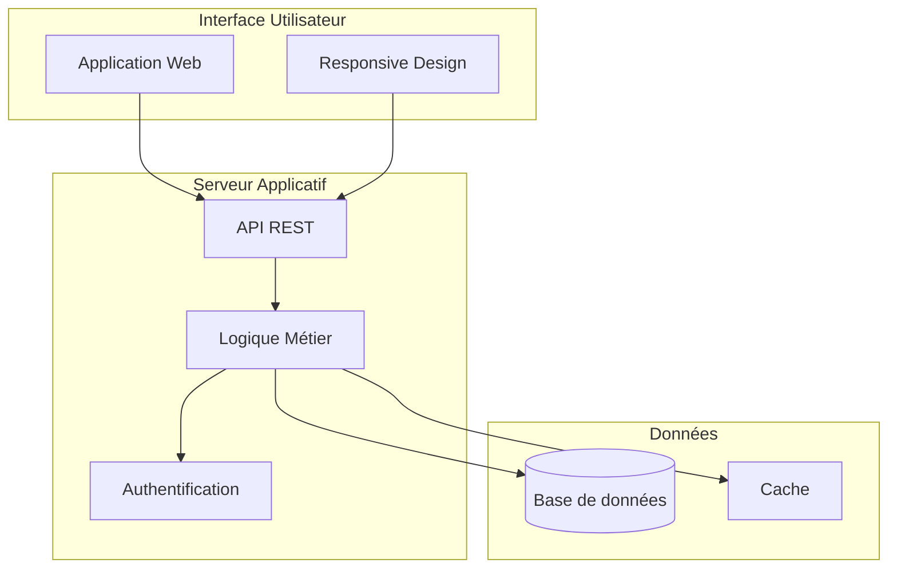

# Output Format — Propositor

> Complete template for the commercial proposal document

---

## Document Structure Overview

```
Proposition Commerciale — [Project Name]
├── Page de garde
├── Sommaire
├── 1. Synthèse exécutive
├── 2. Compréhension du besoin
├── 3. Solution proposée
├── 4. Méthodologie
├── 5. Planning
├── 6. Équipe projet
├── 7. Proposition financière
├── 8. Conditions
├── 9. Annexes
└── Acceptation
```

---

## Complete Template (Template `dev`)

```markdown
# Proposition Commerciale

## [Project Name]
### [Client Name]

---

**Référence** : PROP-[YYYY]-[NNN]  
**Date** : [Date]  
**Validité** : 30 jours  
**Version** : 1.0  

---

## Sommaire

1. [Synthèse exécutive](#1-synthèse-exécutive)
2. [Compréhension du besoin](#2-compréhension-du-besoin)
3. [Solution proposée](#3-solution-proposée)
4. [Méthodologie](#4-méthodologie)
5. [Planning](#5-planning)
6. [Équipe projet](#6-équipe-projet)
7. [Proposition financière](#7-proposition-financière)
8. [Conditions](#8-conditions)
9. [Annexes](#9-annexes)

---

## 1. Synthèse exécutive

[10-15 lines adapted to client tone]

[Context paragraph: Why this project, what challenge]

[Solution paragraph: What we propose, key approach]

**Points clés de notre proposition** :
- ✅ [Key benefit 1]
- ✅ [Key benefit 2]
- ✅ [Key benefit 3]

**Chiffres clés** :
- Budget recommandé : **XX XXX € HT**
- Durée : **XX semaines**
- Équipe : **X profils mobilisés**

---

## 2. Compréhension du besoin

### 2.1 Contexte

[Client context description - business situation, current challenges]

[If brainstormer report available, draw from it]

### 2.2 Enjeux identifiés

[Business and technical stakes]

**Enjeux business** :
- [Business stake 1]
- [Business stake 2]

**Enjeux techniques** :
- [Technical stake 1]
- [Technical stake 2]

### 2.3 Objectifs du projet

[SMART objectives if possible]

| Objectif | Indicateur de succès |
|----------|---------------------|
| [Objective 1] | [KPI/Metric] |
| [Objective 2] | [KPI/Metric] |
| [Objective 3] | [KPI/Metric] |

### 2.4 Périmètre

**Inclus dans cette proposition** :
- [Included element 1]
- [Included element 2]
- [Included element N]

**Hors périmètre** :
- [Excluded element 1]
- [Excluded element 2]

---

## 3. Solution proposée

### 3.1 Vue d'ensemble

[High-level solution description - 2-3 paragraphs]

[Value proposition summary]

### 3.2 Architecture fonctionnelle

[Functional modules description]



### 3.3 Choix technologiques

| Composant | Technologie | Justification |
|-----------|-------------|---------------|
| Backend | [Tech] | [Commercial justification] |
| Frontend | [Tech] | [Commercial justification] |
| Base de données | [Tech] | [Commercial justification] |
| Infrastructure | [Tech] | [Commercial justification] |

**Pourquoi cette stack ?**

[Commercial argument for technology choices - focus on client benefits, not technical details]

### 3.4 Points forts de la solution

[Differentiators and added value]

| Avantage | Bénéfice pour vous |
|----------|-------------------|
| [Advantage 1] | [Concrete benefit] |
| [Advantage 2] | [Concrete benefit] |
| [Advantage 3] | [Concrete benefit] |

---

## 4. Méthodologie

### 4.1 Approche projet

[Methodology description - Agile/V-cycle/Hybrid]

[Justify methodology choice based on project characteristics]

**Notre approche repose sur 3 piliers** :
1. **[Pillar 1]** : [Description]
2. **[Pillar 2]** : [Description]
3. **[Pillar 3]** : [Description]

### 4.2 Phases du projet

| Phase | Description | Durée | Livrables |
|-------|-------------|-------|-----------|
| Cadrage | Lancement, spécifications | X sem | Specs validées |
| Développement | Réalisation itérative | X sem | Application |
| Recette | Tests et validation | X sem | PV de recette |
| Déploiement | Mise en production | X sem | Application live |

### 4.3 Gouvernance

| Instance | Fréquence | Participants | Objectif |
|----------|-----------|--------------|----------|
| COPIL | Mensuel | Direction + CP | Décisions stratégiques |
| Point projet | Hebdomadaire | CP + Équipe | Suivi avancement |
| Démo | Bi-hebdomadaire | Équipe + Client | Validation itérations |

### 4.4 Gestion des risques

[Risk management approach]

| Risque identifié | Probabilité | Impact | Mitigation |
|------------------|-------------|--------|------------|
| [Risk 1] | Moyenne | Moyen | [Action] |
| [Risk 2] | Faible | Élevé | [Action] |

---

## 5. Planning

### 5.1 Planning macro

```mermaid
gantt
    title Planning Projet [Name]
    dateFormat YYYY-MM-DD
    
    section Cadrage
    Lancement et specs    :a1, [start_date], [duration]
    
    section Développement
    Sprint 1 - Core       :b1, after a1, [duration]
    Sprint 2 - Features   :b2, after b1, [duration]
    Sprint 3 - Intégration:b3, after b2, [duration]
    
    section Recette
    Tests client          :c1, after b3, [duration]
    Corrections           :c2, after c1, [duration]
    
    section Déploiement
    MEP et formation      :d1, after c2, [duration]
```

### 5.2 Jalons clés

| Jalon | Date prévisionnelle | Livrable |
|-------|---------------------|----------|
| J1 - Kick-off | [Date] | Réunion de lancement |
| J2 - Fin cadrage | [Date] | Spécifications validées |
| J3 - Fin développement | [Date] | Application complète |
| J4 - Fin recette | [Date] | PV de recette |
| J5 - Mise en production | [Date] | Application en production |

### 5.3 Hypothèses de planning

- Disponibilité client pour validations : [X] jours maximum
- Accès aux environnements : fournis au kick-off
- Données de test : disponibles en phase cadrage

---

## 6. Équipe projet

### 6.1 Organisation

| Rôle | Profil | Responsabilités | Allocation |
|------|--------|-----------------|------------|
| Chef de projet | [Profile] | Coordination, qualité, reporting | X j/sem |
| Développeur Senior | [Profile] | Architecture, développement complexe | X j/sem |
| Développeur Fullstack | [Profile] | Développement fonctionnalités | X j/sem |

### 6.2 Références similaires

#### [Project Name 1]

**Client** : [Name] — [Sector]

**Contexte** : [2-3 lines describing the challenge]

**Solution** : [Technologies and approach used]

**Résultats** :
- [Quantified result 1]
- [Quantified result 2]

---

#### [Project Name 2]

**Client** : [Name] — [Sector]

**Contexte** : [2-3 lines]

**Solution** : [Technologies]

**Résultats** :
- [Result 1]
- [Result 2]

---

## 7. Proposition financière

### 7.1 Synthèse budgétaire

| Lot | Description | Montant HT |
|-----|-------------|------------|
| Lot 1 — Cadrage | Spécifications, architecture | XX XXX € |
| Lot 2 — Développement | Backend, Frontend, Intégrations | XX XXX € |
| Lot 3 — Recette | Tests, corrections, validation | XX XXX € |
| Lot 4 — Déploiement | MEP, formation, documentation | XX XXX € |
| **TOTAL** | | **XX XXX € HT** |

### 7.2 Détail de l'estimation

| Scénario | Charge | Montant HT | Contexte |
|----------|--------|------------|----------|
| Bas | XX JH | XX XXX € | Périmètre minimal |
| **Moyen** | **XX JH** | **XX XXX €** | **Recommandé** |
| Haut | XX JH | XX XXX € | Sécurisé |

**Notre recommandation** : Scénario Moyen — **XX XXX € HT**

### 7.3 Options

| Option | Description | Montant HT |
|--------|-------------|------------|
| Option A | [Description] | X XXX € |
| Option B | [Description] | X XXX € |

### 7.4 Conditions de facturation

| Jalon | % | Montant | Échéance |
|-------|---|---------|----------|
| Signature | 30% | XX XXX € | À la commande |
| Fin développement | 50% | XX XXX € | [Date] |
| Recette | 20% | XX XXX € | [Date] |

---

## 8. Conditions

### 8.1 Validité de l'offre

Cette proposition est valable **30 jours** à compter de sa date d'émission.

### 8.2 Conditions de réalisation

**Prérequis client** :
- [Prerequisite 1]
- [Prerequisite 2]

**Engagements client** :
- Disponibilité d'un interlocuteur décisionnaire
- Accès aux environnements nécessaires
- Validation des livrables sous 5 jours ouvrés

### 8.3 Propriété intellectuelle

[IP clause - adapt based on standard terms]

Les développements spécifiques réalisés dans le cadre de ce projet seront la propriété exclusive du Client après paiement intégral.

### 8.4 Confidentialité

Les parties s'engagent à maintenir confidentielles toutes les informations échangées dans le cadre de ce projet.

### 8.5 Conditions générales

Les présentes conditions particulières sont complétées par nos Conditions Générales de Vente jointes en annexe.

---

## 9. Annexes

### Annexe A : Détail de l'estimation

[Full estimation table from Estimator]

### Annexe B : CV des intervenants

[If --with-cv flag enabled]

### Annexe C : Références détaillées

[Extended reference cards if needed]

### Annexe D : Conditions Générales de Vente

[CGV placeholder - client to provide]

---

## Acceptation

**Pour accord, merci de retourner ce document signé.**

| | Client | Prestataire |
|--|--------|-------------|
| **Nom** | | [Your name] |
| **Fonction** | | [Your role] |
| **Date** | | |
| **Signature** | | |

---

*Proposition générée par Propositor — [Your company]*
```

---

## Mermaid Gantt Generation

### Automatic Generation Rules

Generate Gantt if:
- Total JH > 30 (configurable via flag)
- Or explicitly requested with `--with-gantt`

### Gantt Structure

```mermaid
gantt
    title Planning Projet [Name]
    dateFormat YYYY-MM-DD
    excludes weekends
    
    section [Lot 1 Name]
    [Task 1]    :a1, [start], [duration]d
    [Task 2]    :a2, after a1, [duration]d
    
    section [Lot 2 Name]
    [Task 3]    :b1, after a2, [duration]d
    [Task 4]    :b2, after b1, [duration]d
    
    section Milestones
    [Milestone 1] :milestone, m1, after a2, 0d
    [Milestone 2] :milestone, m2, after b2, 0d
```

### Duration Calculation

```
task_duration_weeks = task_jh / 5  (assuming 5 JH/week)
buffer = 1 week per major phase
total_duration = sum(task_durations) + buffers
```

---

## Language Adaptation

Output language matches user's input language.

### French Headers (Default)

| Section | French |
|---------|--------|
| Executive Summary | Synthèse exécutive |
| Needs Understanding | Compréhension du besoin |
| Proposed Solution | Solution proposée |
| Methodology | Méthodologie |
| Planning | Planning |
| Team | Équipe projet |
| Financial Proposal | Proposition financière |
| Conditions | Conditions |
| Annexes | Annexes |

### English Headers

| Section | English |
|---------|---------|
| Synthèse exécutive | Executive Summary |
| Compréhension du besoin | Needs Understanding |
| Solution proposée | Proposed Solution |
| Méthodologie | Methodology |
| Planning | Timeline |
| Équipe projet | Project Team |
| Proposition financière | Financial Proposal |
| Conditions | Terms & Conditions |
| Annexes | Appendices |

---

## Reference Numbering

### Document Reference
Format: `PROP-[YYYY]-[NNN]`
- YYYY: Current year
- NNN: Sequential number (auto-increment or user-provided)

### Internal References
- Features: `FCT-XXX` (from Estimator)
- Lots: `Lot X — [Name]`
- Milestones: `JX` (J1, J2, J3...)

---

## Export Formats

Propositor outputs Markdown that can be converted to:

| Format | Tool | Notes |
|--------|------|-------|
| PDF | Pandoc, Typora | Best for final delivery |
| DOCX | Pandoc | For client editing |
| HTML | Any Markdown renderer | Web viewing |

### Pandoc Command Example

```bash
pandoc proposal.md -o proposal.pdf \
  --pdf-engine=xelatex \
  --variable geometry:margin=2cm \
  --toc
```
