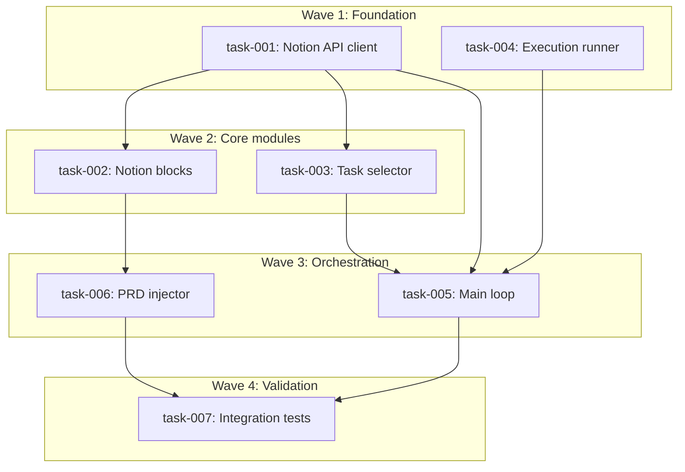

# OpenClaw — Notion Task Runner

> Technical Specification | Generated 2026-02-13 | 7 tasks | 11.25h estimated

---

## Overview

Python stdlib-only orchestrator that connects a Notion database (OpenClawTasks) to the implement-auto execution engine. Fetches eligible tasks from Notion, selects by priority and dependencies, executes via `claude --print -p "/implement-auto ..."`, and updates Notion with results. Includes PRD-to-Notion injection for the full `/brainstorm` → `/spec` → Notion → `loop.py` → `implement-auto` pipeline.

## Scope

### In Scope

- `notion_client.py` — Notion API client (urllib, query, update, read blocks, create pages)
- `task_selector.py` — Priority + dependency-based task selection
- `runner.py` — implement-auto subprocess wrapper with output parsing
- `loop.py` — Main orchestration loop with CLI, lock file, recovery, circuit breaker
- `prd_injector.py` — PRD.json → Notion page injection with dependency resolution
- `config.py` — JSON config + env var management
- Dry-run mode (`--dry-run`)
- Integration tests with mock urllib framework

### Out of Scope

- Web UI or dashboard (Notion serves as dashboard)
- Modification of implement-auto skill
- Multi-project simultaneous execution
- MCP Notion integration (standalone urllib only)
- Telegram notifications (existing bash pipeline handles this)
- Proactive quota tracking

---

## Tasks

| # | Task | Description | Effort | Dependencies |
|---|------|-------------|--------|--------------|
| 001 | [Create Notion API client: query + update](task-001-notion-api-client.md) | HTTP helper, query_database, update_page, config module | 120 min | - |
| 002 | [Implement Notion blocks + page creation](task-002-notion-blocks.md) | read_page_body, blocks_to_markdown, create_page | 90 min | 001 |
| 003 | [Implement task selector](task-003-task-selector.md) | Priority sorting, dependency resolution, circular detection | 90 min | 001 |
| 004 | [Implement execution runner](task-004-execution-runner.md) | Subprocess wrapper, output parsing, result mapping | 75 min | - |
| 005 | [Implement main orchestration loop](task-005-main-loop.md) | CLI, lock file, recovery, circuit breaker, logging | 120 min | 001, 003, 004 |
| 006 | [Implement PRD-to-Notion injector](task-006-prd-injector.md) | PRD.json parsing, page creation, dependency relations | 90 min | 002 |
| 007 | [Integration tests and validation](task-007-integration-tests.md) | Mock framework, loop + injector integration tests | 90 min | 005, 006 |

---

## Dependency Graph



---

## Execution Order

1. **task-001** — Create Notion API client: query + update
2. **task-004** — Implement execution runner (parallel with task-001)
3. **task-002** — Implement Notion blocks + page creation (after: task-001)
4. **task-003** — Implement task selector (after: task-001)
5. **task-005** — Implement main orchestration loop (after: task-001, task-003, task-004)
6. **task-006** — Implement PRD-to-Notion injector (after: task-002)
7. **task-007** — Integration tests and validation (after: task-005, task-006)

---

## Metrics

| Metric | Value |
|--------|-------|
| Total Tasks | 7 |
| Total Steps | 30 |
| Estimated Effort | 11.25h |
| Critical Path | task-001 -> task-003 -> task-005 -> task-007 |
| Optimized Duration | 7h |
| Complexity | STANDARD |

---

## Files

### Task Specifications

- [task-001-notion-api-client.md](task-001-notion-api-client.md) — Create Notion API client: query + update
- [task-002-notion-blocks.md](task-002-notion-blocks.md) — Implement Notion blocks + page creation
- [task-003-task-selector.md](task-003-task-selector.md) — Implement task selector
- [task-004-execution-runner.md](task-004-execution-runner.md) — Implement execution runner
- [task-005-main-loop.md](task-005-main-loop.md) — Implement main orchestration loop
- [task-006-prd-injector.md](task-006-prd-injector.md) — Implement PRD-to-Notion injector
- [task-007-integration-tests.md](task-007-integration-tests.md) — Integration tests and validation

### Machine-Readable

- [notion-runner.prd.json](notion-runner.prd.json) — PRD v2.0 format

---

## Routing Recommendation

| Complexity | Recommended Skill | Command |
|------------|-------------------|---------|
| STANDARD | /implement | `/implement notion-runner @docs/specs/notion-runner/` |

### Execution Options

**Option A: Manual Implementation**
```bash
/implement notion-runner @docs/specs/notion-runner/
```

**Option B: Ralph Batch Execution**
```bash
./.ralph/notion-runner/ralph.sh
```

**Option C: implement-auto (per task)**
```bash
claude --dangerously-skip-permissions -p "/implement-auto notion-runner-task-001 @docs/specs/notion-runner/task-001-notion-api-client.md"
```

---

## Source

- **Brief**: docs/briefs/openclaw-notion-runner/brief-openclaw-notion-runner-2026-02-13.md
- **Generated**: 2026-02-13
- **Generator**: /spec v1.0 — EPCI v6.3.0

---

*This specification is auto-generated. Edit task-XXX.md files to modify, then regenerate index and PRD.json.*
